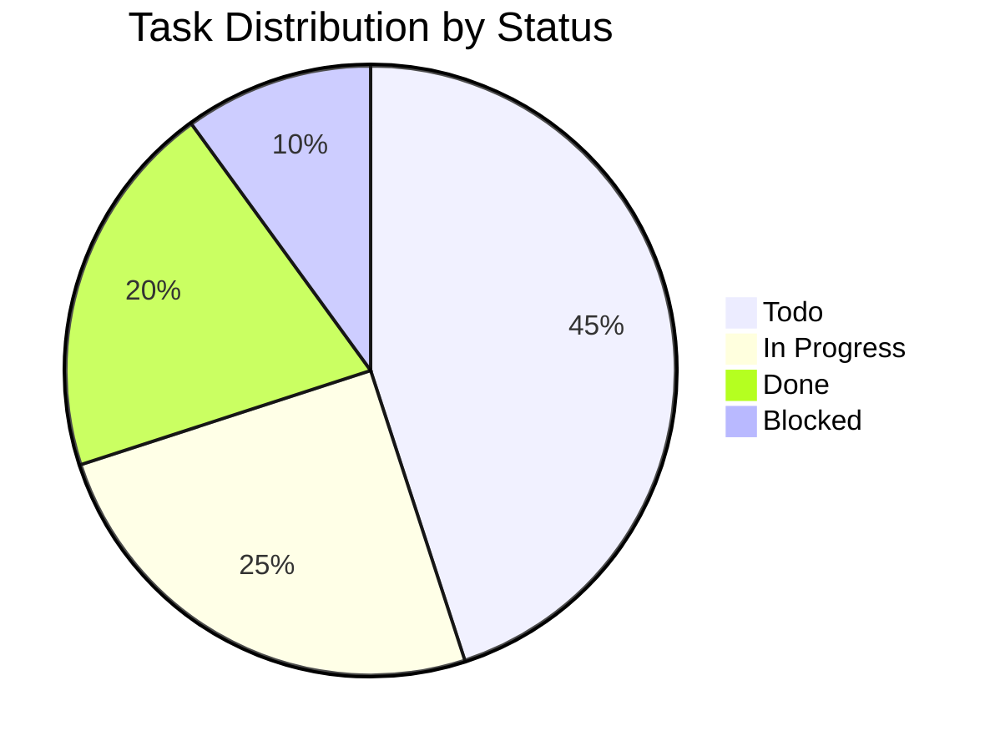
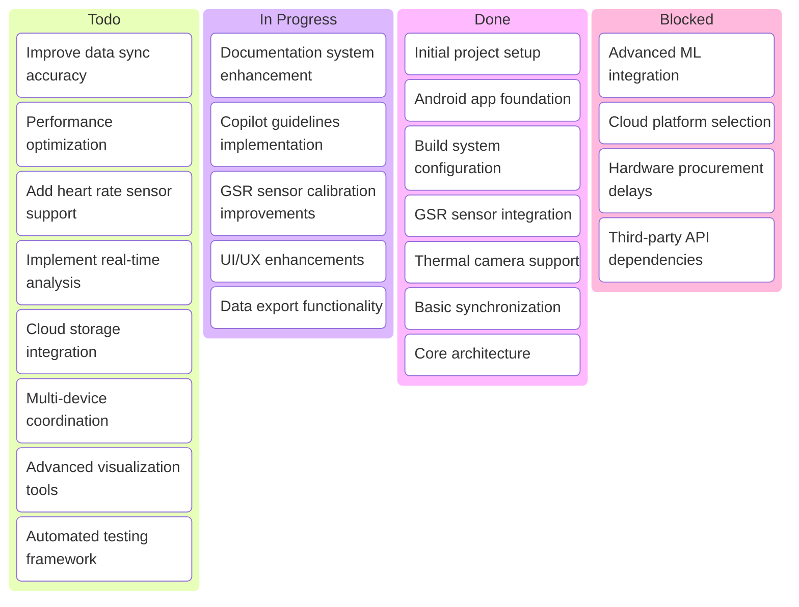
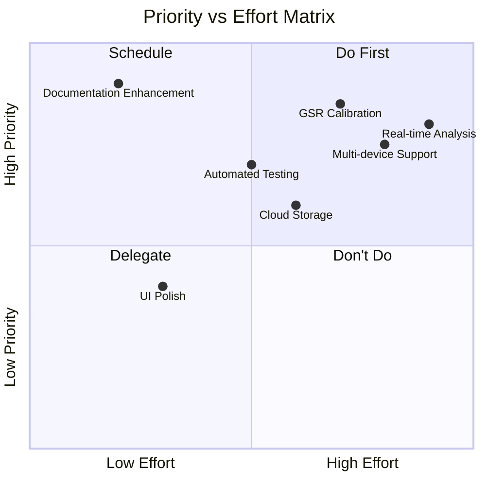
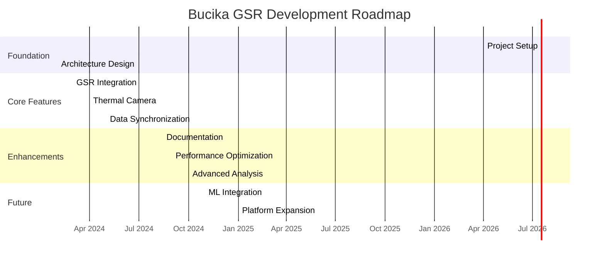
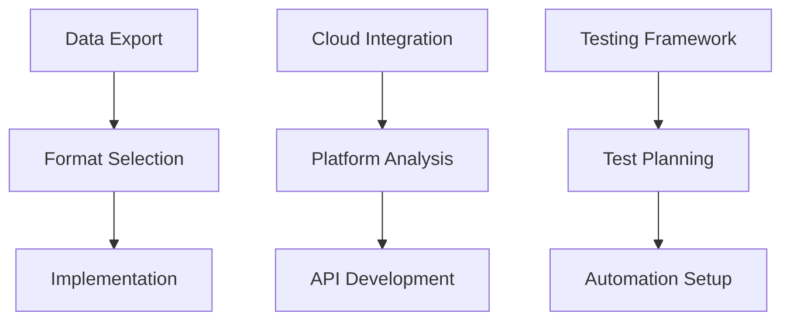
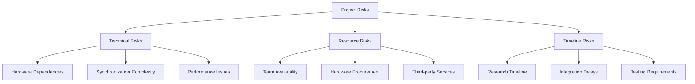

# Project Backlog - Bucika GSR

This document tracks all project tasks, features, and improvements for the Bucika GSR multi-modal data collection platform.

## Backlog Overview

## Status Visualization

## Priority Matrix

## Development Timeline

## Epics and Features

### Epic 1: Core Platform Development ✅
**Status**: Complete  
**Priority**: Critical  

- [x] Android application framework
- [x] GSR sensor integration (Shimmer3 GSR+)
- [x] Thermal camera support (TC001)
- [x] Basic data synchronization
- [x] Build system and dependencies

### Epic 2: Documentation and Guidelines 🔄
**Status**: In Progress  
**Priority**: High  

- [x] Copilot guidelines creation
- [x] ADR system implementation  
- [x] Changelog management
- [x] Backlog tracking
- [ ] API documentation
- [ ] User manual
- [ ] Developer guide

### Epic 3: Data Quality and Performance 📋
**Status**: Planned  
**Priority**: High  

- [ ] Millisecond-level synchronization accuracy
- [ ] Memory leak detection and prevention
- [ ] CPU usage optimization
- [ ] Battery life optimization
- [ ] Data validation and quality checks
- [ ] Automated performance testing

### Epic 4: Advanced Features 📋
**Status**: Planned  
**Priority**: Medium  

- [ ] Real-time data analysis
- [ ] Cloud storage integration
- [ ] Multi-device coordination
- [ ] Advanced visualization tools
- [ ] Machine learning pipeline integration
- [ ] Predictive GSR modeling

### Epic 5: Platform Expansion 🚫
**Status**: Blocked  
**Priority**: Low  

- [ ] Heart rate sensor integration
- [ ] EEG sensor support  
- [ ] Respiration monitoring
- [ ] Environmental sensor fusion
- [ ] Cross-platform compatibility

## Task Details

### High Priority Tasks

| Task | Priority | Effort | Assignee | Due Date | Dependencies |
|------|----------|--------|----------|----------|--------------|
| Sync Accuracy Improvement | Critical | High | TBD | 2024-09-15 | Core platform |
| Performance Optimization | High | Medium | TBD | 2024-09-30 | Baseline metrics |
| Documentation Completion | High | Low | In Progress | 2024-08-31 | Guidelines |
| UI/UX Enhancement | Medium | Medium | TBD | 2024-10-15 | User feedback |

### Medium Priority Tasks

### Technical Debt

- [ ] Refactor legacy camera integration code
- [ ] Update deprecated API usage
- [ ] Improve error handling consistency
- [ ] Standardize logging across modules
- [ ] Code documentation improvements

## Risk Assessment

## Success Metrics

### Technical Metrics
- **Synchronization Accuracy**: < 5ms offset between sensors
- **Data Throughput**: 128 Hz GSR + 30 FPS thermal + 60 FPS RGB
- **System Reliability**: > 99% uptime during 8-hour sessions
- **Memory Usage**: < 500MB sustained usage
- **Battery Life**: > 4 hours continuous recording

### Quality Metrics
- **Documentation Coverage**: 100% of public APIs
- **Test Coverage**: > 85% code coverage
- **ADR Compliance**: All architectural decisions documented
- **Changelog Completeness**: All changes tracked

## Review Schedule

- **Daily**: Task status updates
- **Weekly**: Epic progress review
- **Bi-weekly**: Priority re-assessment
- **Monthly**: Backlog grooming and planning
- **Quarterly**: Roadmap review and adjustment

---

*Last Updated: 2024-08-22*  
*Next Review: 2024-08-29*