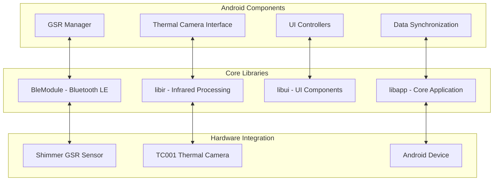
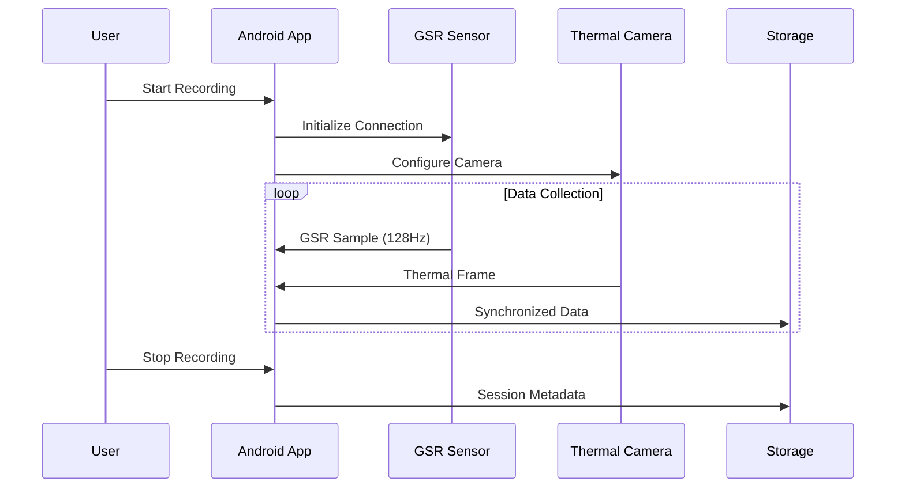
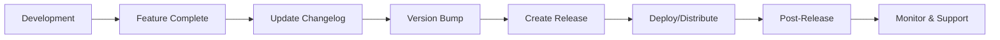

# Changelog

All notable changes to the Bucika GSR project will be documented in this file.

The format is based on [Keep a Changelog](https://keepachangelog.com/en/1.0.0/),
and this project adheres to [Semantic Versioning](https://semver.org/spec/v2.0.0.html).

## Development Workflow

```mermaid
gitgraph
    commit id: "Initial Setup"
    branch develop
    checkout develop
    commit id: "Feature Development"
    branch feature/gsr-integration
    checkout feature/gsr-integration
    commit id: "Add GSR sensor"
    commit id: "Update changelog"
    checkout develop
    merge feature/gsr-integration
    commit id: "Version bump"
    checkout main
    merge develop
    commit id: "Release v1.0.0"
    tag: "v1.0.0"
```

## [Unreleased]

### Added
- Copilot guidelines for mandatory documentation maintenance
- Architecture Decision Records (ADR) system with template
- Changelog management with Mermaid visualization
- Backlog tracking with Kanban-style visualization

### Changed
- Documentation structure enhanced with visual workflows

## [1.10.0] - 2024-08-22

### Architecture Overview



### Added
- Multi-modal physiological data collection platform
- Shimmer GSR sensor integration with 128 Hz sampling
- TC001 thermal imaging device support
- Synchronized thermal + GSR recording capabilities
- Real-time data visualization and monitoring
- Bluetooth Low Energy connectivity for wireless sensors
- Android application with GSR monitoring interface
- Modular architecture supporting future sensor expansion

### Changed
- Updated build system to Gradle 8.10.2 with Java 17 compatibility
- Standardized module configurations across all components
- Enhanced dependency management with shared configuration files
- Optimized build performance with incremental compilation

### Technical Implementation



### Infrastructure
- Comprehensive Gradle build system with product flavors
- Validation scripts for build configuration
- Performance optimizations for multi-module builds
- NDK optimization with selective ABI filters

## [1.0.0] - Initial Release

### Added
- Project foundation and basic structure
- Core Android application framework
- Initial sensor integration capabilities
- Basic build and dependency management

---

## Release Process



## Versioning Strategy

- **Major** (x.0.0): Breaking changes, major architectural updates
- **Minor** (x.y.0): New features, sensor additions, significant enhancements
- **Patch** (x.y.z): Bug fixes, minor improvements, documentation updates

## Change Categories

- **Added**: New features, capabilities, or components
- **Changed**: Changes to existing functionality
- **Deprecated**: Features marked for removal in future versions
- **Removed**: Features removed in this version
- **Fixed**: Bug fixes and error corrections
- **Security**: Security-related changes and vulnerability fixes

---

*For detailed technical changes, see individual ADRs in `docs/adr/`*