# Copilot Guidelines for Bucika GSR Project

## 🚨 MANDATORY DOCUMENTATION REQUIREMENTS

**ALL CHANGES to this repository MUST be accompanied by updates to the following documentation:**

1. **ADR (Architecture Decision Records)** - Document all architectural and technical decisions
2. **CHANGELOG.md** - Track all changes, features, fixes, and improvements
3. **BACKLOG.md** - Maintain project backlog and task tracking

**⚠️ NO PULL REQUEST will be approved without proper documentation updates!**

## Documentation Workflow

```mermaid
flowchart TD
    A[Code Change Request] --> B{Documentation Updated?}
    B -->|No| C[❌ Request Blocked]
    B -->|Yes| D[Check Required Docs]
    D --> E{ADR Updated?}
    E -->|No| C
    E -->|Yes| F{Changelog Updated?}
    F -->|No| C
    F -->|Yes| G{Backlog Updated?}
    G -->|No| C
    G -->|Yes| H[✅ Proceed with Review]
    H --> I[Merge to Main]
    C --> J[Update Documentation]
    J --> D
```



## Required Documentation Standards

### 1. Architecture Decision Records (ADR)

- **Location**: `docs/adr/`
- **Format**: `AAAA-title.md` (where AAAA is sequential number)
- **Template**: Use ADR template for consistency
- **When to create**: Any architectural, technology, or design decision
- **Visualization**: Include Mermaid diagrams for architectural changes


### 2. Changelog Management

- **Location**: `CHANGELOG.md` (root directory)
- **Format**: Keep a Changelog format (semantic versioning)
- **Update frequency**: Every change, every PR
- **Categories**: Added, Changed, Deprecated, Removed, Fixed, Security

```mermaid
gitgraph
    commit id: "Initial"
    branch feature/new-sensor
    checkout feature/new-sensor
    commit id: "Add GSR sensor"
    commit id: "Update changelog"
    checkout main
    merge feature/new-sensor
    commit id: "Release v1.1.0"
```

### 3. Backlog Tracking

- **Location**: `BACKLOG.md` (root directory)
- **Update frequency**: Every sprint/milestone
- **Status tracking**: Todo, In Progress, Done, Blocked
- **Priority levels**: Critical, High, Medium, Low


## Documentation Process

### For Every Change:

1. **Before coding**:
   - Check if ADR is needed for architectural decisions
   - Update backlog status (move items to "In Progress")

2. **During development**:
   - Document technical decisions in ADR
   - Add Mermaid diagrams for complex workflows/architectures

3. **Before PR submission**:
   - Update CHANGELOG.md with changes made
   - Update BACKLOG.md status
   - Ensure all Mermaid diagrams render correctly

4. **PR Review checklist**:
   - [ ] ADR created/updated if needed
   - [ ] CHANGELOG.md updated
   - [ ] BACKLOG.md updated
   - [ ] Mermaid diagrams present and correct
   - [ ] Documentation follows project standards

### Visualization Requirements

All documentation MUST include Mermaid code blocks for:
- System architecture changes
- Process workflows
- Decision trees
- Data flows
- Project timelines
- Status tracking

## Enforcement

**Automated checks** will verify:
- Changelog has been updated in PRs
- ADR numbering is sequential
- Mermaid syntax is valid
- All required sections are present

**Manual review** will ensure:
- Documentation quality and completeness
- Mermaid diagrams accurately represent the system/process
- ADRs properly justify technical decisions

## Tools and Resources

- [Mermaid Live Editor](https://mermaid.live/) - Test your diagrams
- [ADR Template](docs/adr/template.md) - Standard template for decisions
- [Keep a Changelog](https://keepachangelog.com/) - Changelog format guide

## Examples

See existing documentation for examples:
- ADR: `docs/adr/0001-initial-architecture.md`
- Recent changes: `CHANGELOG.md`
- Current backlog: `BACKLOG.md`

---

**Remember**: Documentation is as important as code. It ensures project maintainability, team knowledge sharing, and decision traceability.