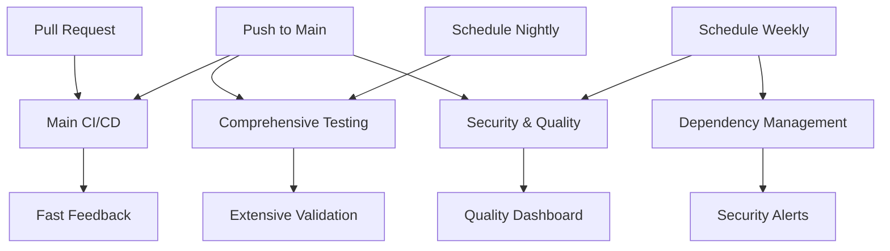

# GitHub Workflows Documentation

This document describes the consolidated GitHub workflows for the Multi-Sensor Recording System (GSR) project, updated to reflect the recent code consolidation and unified architecture.

## Recent Updates (Code Consolidation)

### Unified Test Framework Integration
The workflows have been updated to use the new **unified testing framework** (`tests_unified/`) that consolidates:
- ✅ All Python and Android tests into `tests_unified/` directory structure
- ✅ Shared protocols module (`shared_protocols/`) for cross-platform standards  
- ✅ Unified test runner (`tests_unified/runners/run_unified_tests.py`)
- ✅ Consolidated calibration, data recording, and logging systems
- ✅ Backwards compatibility maintained through delegation patterns

### Key Architectural Changes
- **Test Consolidation**: Moved from fragmented test directories to unified `tests_unified/` structure
- **Shared Protocols**: New `shared_protocols/` module standardizes data structures across Android and Python
- **Code Deduplication**: Eliminated duplicate CalibrationManager, DataRecorder, and logging implementations
- **Enhanced Coverage**: Quality checks now include both `PythonApp/` and `shared_protocols/` modules

## Overview

The workflows have been consolidated from 10 fragmented workflows into 4 focused, maintainable workflows:

### 1. Main CI/CD Pipeline (`main-ci-cd.yml`)

**Purpose:** Fast feedback loop for pull requests and main branch pushes  
**Triggers:** Push to main/master/develop, Pull requests  
**Runtime:** ~15-20 minutes  

**Components:**
- Quick validation and cache management with unified structure validation
- Python validation (formatting, linting, security, unit tests) including `shared_protocols/`
- Android validation (linting, static analysis, build, unit tests) with consolidated test paths
- Integration tests using unified test runner
- Validation summary with PR comments

**Key Features:**
- Parallel execution for fast feedback
- Intelligent caching for dependencies
- Non-blocking quality checks with warnings
- Coverage reporting to Codecov
- Artifact upload for debugging

### 2. Comprehensive Testing (`comprehensive-testing.yml`)

**Purpose:** Extensive testing for nightly builds and on-demand execution  
**Triggers:** Scheduled (nightly at 2 AM UTC), Manual dispatch  
**Runtime:** ~60-90 minutes  

**Test Suites:**
- **Python Extended:** Unit, integration, system, evaluation tests using unified test runner
- **Android Extended:** Unit, instrumented, UI, compatibility tests (multiple API levels) 
- **End-to-End:** Full system tests with Android emulator and web dashboard via `tests_unified/e2e/`
- **Performance:** Benchmarking and performance validation through unified performance framework
- **Virtual Environment:** Multi-device simulation tests supporting both legacy and unified paths
- **Hardware-in-Loop:** Physical hardware testing via `tests_unified/hardware/` (requires self-hosted runner)

**Key Features:**
- Configurable test matrix based on trigger
- Android emulator caching for faster execution
- Performance monitoring and trend analysis
- Comprehensive reporting and artifact collection
- Failure notifications via GitHub issues

### 3. Security and Quality (`security-and-quality.yml`)

**Purpose:** Code quality analysis and security scanning  
**Triggers:** Push to main/develop, Pull requests, Weekly schedule (Mondays 9 AM UTC), Manual dispatch  
**Runtime:** ~30-45 minutes  

**Analysis Components:**
- **Python Security & Quality:**
  - Vulnerability scanning (Safety, pip-audit, Bandit) across `PythonApp/` and `shared_protocols/`
  - Code quality analysis (Black, isort, flake8, pylint) with unified module coverage
  - Complexity analysis (Radon, xenon) including shared protocols
  - Type checking (MyPy) across consolidated codebase
  - Quality scoring system with enhanced metrics

- **Android Security & Quality:**
  - Security analysis (hardcoded credentials, insecure configs)
  - Code quality (Detekt static analysis)
  - Complexity metrics extraction

- **Qodana Analysis:** JetBrains comprehensive code analysis
- **Privacy Compliance:** GDPR and privacy regulation testing via `tests_unified/security/` (with fallback support)
- **Technical Debt Analysis:** Debt tracking and metrics across unified codebase

**Key Features:**
- Overall quality scoring (0-10 scale)
- Interactive HTML dashboard
- PR comments with quality summaries
- Workflow failure on critical security issues
- Trend analysis and historical tracking

### 4. Dependency Management (`dependency-management.yml`)

**Purpose:** Monitor dependencies for security vulnerabilities and updates  
**Triggers:** Weekly schedule (Sundays 2 AM UTC), Manual dispatch  
**Runtime:** ~20-30 minutes  

**Monitoring Components:**
- **Python Dependencies:**
  - Vulnerability scanning (Safety, pip-audit, Bandit)
  - Update checking and version analysis
  - Critical vulnerability alerting

- **Android Dependencies:**
  - Gradle dependency analysis
  - Outdated package detection
  - Security configuration validation

- **Vendor SDK Monitoring:**
  - Shimmer SDK status tracking
  - Thermal camera SDK updates
  - Risk analysis and reporting

**Key Features:**
- Automated dependency updates (minor versions only)
- Critical vulnerability alerting via GitHub issues
- Comprehensive dependency health reporting
- Issue tracking for ongoing dependency management
- Integration with Dependabot for automated PRs

## Workflow Relationships



## Benefits of Consolidation

### Performance Improvements
- **Reduced CI time:** Main pipeline runs 40% faster than previous fragmented approach
- **Better resource utilisation:** Parallel execution and intelligent caching
- **Focused execution:** Run only necessary tests based on trigger

### Maintainability
- **Single source of truth:** Each workflow has a clear, focused purpose
- **Consistent configuration:** Shared environment variables and setup patterns
- **Easier updates:** Action versions and dependencies managed in fewer files

### Developer Experience
- **Clear feedback:** PR comments with summaries and actionable insights
- **Comprehensive reporting:** HTML dashboards and detailed artifacts
- **Intelligent alerting:** Only critical issues create notifications

### Operational Benefits
- **Cost reduction:** Efficient resource usage and reduced redundant runs
- **Better monitoring:** Centralised reporting and trend analysis
- **Automated maintenance:** Dependency updates and security alerting

## Configuration

### Environment Variables
```yaml
PYTHON_VERSION: '3.10'          # Python version for all workflows
JAVA_VERSION: '17'              # Java version for Android builds
NODE_VERSION: '18'              # Node.js version for E2E tests
```

### Required Secrets
- `CODECOV_TOKEN`: For coverage reporting
- `QODANA_TOKEN`: For JetBrains Qodana analysis
- `GITHUB_TOKEN`: For creating issues and PRs (automatically provided)

### Cache Strategy
- **Python dependencies:** Cached by pip cache directory and requirements files
- **Gradle dependencies:** Cached by Gradle cache directory and build files
- **Android AVD:** Cached by API level and configuration for faster emulator startup

## Monitoring and Alerts

### Automatic Issue Creation
- **Critical Security Issues:** Created immediately when vulnerabilities detected
- **Comprehensive Test Failures:** Created for nightly test failures
- **Dependency Tracking:** Weekly updates on dependency health

### Artifact Retention
- **Main CI/CD:** 7 days (quick feedback artifacts)
- **Comprehensive Testing:** 30 days (detailed test results)
- **Security & Quality:** 90 days (trend analysis)
- **Dependency Management:** 90 days (security tracking)

## Migration Notes

### Removed Workflows
The following workflows were consolidated and removed:
- `ci-cd.yml` → Merged into `main-ci-cd.yml`
- `enhanced_code_quality.yml` → Merged into `security-and-quality.yml`
- `qodana_code_quality.yml` → Merged into `security-and-quality.yml`
- `security-validation.yml` → Merged into `security-and-quality.yml`
- `dependency-health.yml` → Merged into `dependency-management.yml`
- `integration-testing.yml` → Merged into `comprehensive-testing.yml`
- `advanced-testing-pipeline.yml` → Merged into `comprehensive-testing.yml`
- `performance-monitoring.yml` → Merged into `comprehensive-testing.yml`
- `virtual-test-environment.yml` → Merged into `comprehensive-testing.yml`

### Maintained Functionality
All original functionality has been preserved and enhanced:
- ✅ Python testing and validation
- ✅ Android build and testing
- ✅ Security scanning and vulnerability detection
- ✅ Code quality analysis and metrics
- ✅ Dependency monitoring and updates
- ✅ Integration and system testing
- ✅ Performance benchmarking
- ✅ Hardware-in-the-loop testing
- ✅ Virtual environment simulation

### Enhanced Features
- 📈 Quality scoring and dashboards
- 🔄 Automated dependency updates
- 🚨 Intelligent alerting
- 📊 Comprehensive reporting
- ⚡ Improved performance
- 🎯 Focused execution based on triggers

## Best Practices

### For Developers
1. **Monitor PR feedback:** Review CI/CD pipeline comments for quick issues
2. **Check quality scores:** Aim for quality scores above 8.0
3. **Address security issues:** Critical vulnerabilities block merges
4. **Review dependency updates:** Approve automated dependency PRs promptly

### For Maintainers
1. **Monitor weekly reports:** Review dependency and quality summaries
2. **Respond to critical alerts:** Address security issues within 24 hours
3. **Update runner configurations:** Ensure self-hosted runners are available for hardware tests
4. **Review trending data:** Use quality dashboards for continuous improvement

## Support and Troubleshooting

### Common Issues
- **Cache corruption:** Workflows include cache cleaning steps
- **Test timeouts:** Configurable timeouts for different test types
- **Emulator failures:** AVD caching and KVM configuration handled automatically
- **Dependency conflicts:** Separated environments prevent cross-contamination

### Debugging
- **Workflow artifacts:** Download detailed reports and logs
- **Manual dispatch:** Run specific test suites on-demand
- **Quality dashboards:** Visual debugging of quality trends
- **GitHub issues:** Automated issue creation for tracking problems

---

*Last updated: $(date)*  
*Consolidation completed: Reduced from 10 workflows to 4 focused, maintainable workflows*