# Chapter 3 Mermaid Diagrams

This file contains all the mermaid diagrams used in Chapter 3 of the thesis. These diagrams are compiled to PNG format for inclusion in the final document.

## Figure 3.1 – System Architecture (Block Diagram)


## Figure 3.2 – Deployment Topology (Network/Site Diagram)


## Figure 3.3 – Use Case Diagram (UML)

```mermaid
graph LR
    subgraph "Actors"
        R[👨‍🔬 Researcher]
        T[👨‍💻 Technician/Operator]
    end
    
    subgraph "Primary Use Cases"
        UC1[Create Session]
        UC2[Configure Devices]
        UC3[Start Recording]
        UC4[Monitor/Preview]
        UC5[Send Sync Signal]
        UC6[Stop Recording]
        UC7[Transfer Files]
        UC8[Verify Integrity]
    end
    
    subgraph "Secondary Use Cases"
        UC9[Calibrate Cameras]
        UC10[Manage Device Connections]
        UC11[Handle Device Failures]
        UC12[Export Data]
    end
    
    R --> UC1
    R --> UC3
    R --> UC4
    R --> UC5
    R --> UC6
    R --> UC8
    R --> UC12
    
    T --> UC2
    T --> UC7
    T --> UC9
    T --> UC10
    T --> UC11
    
    UC3 -.->|«include»| UC10
    UC6 -.->|«include»| UC7
    UC4 -.->|«extend»| UC11
    UC7 -.->|«include»| UC8
    
    style R fill:#e3f2fd
    style T fill:#fff3e0
    style UC1 fill:#e8f5e8
    style UC3 fill:#e8f5e8
    style UC6 fill:#e8f5e8
```



## Figure 3.4 – Sequence Diagram: Synchronous Start/Stop


## Figure 3.5 – Sequence Diagram: Device Drop-out and Recovery


## Figure 3.6 – Data-Flow Pipeline


## Figure 3.7 – Timing Diagram (Clock Offset Over Time)

```mermaid
xychart-beta
    title "Clock synchronisation Performance Over Session Duration"
    x-axis ["0min", "5min", "10min", "15min", "20min", "25min", "30min", "35min", "40min", "45min", "50min", "55min", "60min"]
    y-axis "Clock Offset (milliseconds)" -10 10
    line "Device 1 Offset" [2.1, 1.8, 2.3, 1.9, 2.5, 2.1, 1.7, 2.2, 1.9, 2.4, 2.0, 1.8, 2.1]
    line "Device 2 Offset" [-1.2, -1.5, -1.1, -1.8, -1.3, -1.6, -1.0, -1.4, -1.7, -1.2, -1.5, -1.3, -1.1]
    line "Target ±5ms Bound" [5, 5, 5, 5, 5, 5, 5, 5, 5, 5, 5, 5, 5]
    line "Target -5ms Bound" [-5, -5, -5, -5, -5, -5, -5, -5, -5, -5, -5, -5, -5]
```

## Figure 3.8 – synchronisation Accuracy (Histogram/CDF)

```mermaid
xychart-beta
    title "Distribution of Clock Offset Accuracy (All Sessions)"
    x-axis ["0-1ms", "1-2ms", "2-3ms", "3-4ms", "4-5ms", "5-6ms", "6-7ms", "7-8ms", "8-9ms", "9-10ms", ">10ms"]
    y-axis "Sample Count" 0 450
    bar [412, 298, 187, 89, 34, 12, 5, 2, 1, 0, 0]
```

## Figure 3.9 – GSR Sampling Health

```mermaid
xychart-beta
    title "GSR Sampling Rate and Data Quality Metrics"
    x-axis ["0-5min", "5-10min", "10-15min", "15-20min", "20-25min", "25-30min", "30-35min", "35-40min", "40-45min", "45-50min", "50-55min", "55-60min"]
    y-axis "Effective Sampling Rate (Hz) / Missing Samples Count" 0 140
    line "Effective Rate (Hz)" [128.2, 127.9, 128.1, 128.0, 127.8, 128.3, 128.1, 127.9, 128.2, 128.0, 127.8, 128.1]
    bar "Missing Samples" [2, 1, 0, 3, 1, 0, 2, 1, 0, 1, 2, 1]
```

## Figure 3.10 – Video Frame Timing Stability  

```mermaid
xychart-beta
    title "Video Frame Interval Distribution and Instantaneous FPS"
    x-axis ["30.0-30.5", "30.5-31.0", "31.0-31.5", "31.5-32.0", "32.0-32.5", "32.5-33.0", "33.0-33.5", "33.5-34.0", "34.0-34.5", "34.5-35.0", ">35.0"]
    y-axis "Frame Count / FPS" 0 2800
    bar "RGB Frame Intervals (ms)" [2654, 1876, 1234, 567, 234, 89, 34, 12, 5, 2, 1]
    line "Instantaneous FPS" [30.1, 29.9, 30.2, 30.0, 29.8, 30.3, 30.1, 29.9, 30.2, 30.0, 29.8]
```

## Figure 3.11 – Reliability Timeline (Session Gantt)

```mermaid
gantt
    title Device State Timeline and Recovery Events
    dateFormat  X
    axisFormat %s
    
    section Device 1
    Connected         :done, d1, 0, 30s
    Recording         :done, d1r, 30s, 1800s
    Offline           :crit, d1off, 1800s, 1830s
    Reconnected       :done, d1rec, 1830s, 3600s
    Transfer          :active, d1t, 3600s, 3720s
    
    section Device 2  
    Connected         :done, d2, 0, 30s
    Recording         :done, d2r, 30s, 3600s
    Transfer          :done, d2t, 3600s, 3660s
    
    section Shimmer GSR
    Connected         :done, s1, 0, 45s
    Sampling          :done, s1s, 45s, 3600s
    
    section Sync Events
    Start Signal      :milestone, start, 30s, 30s
    Mid Signal        :milestone, mid, 1800s, 1800s  
    Stop Signal       :milestone, stop, 3600s, 3600s
```

## Figure 3.12 – Throughput & Storage

```mermaid
xychart-beta
    title "Network Throughput and File Size Distribution"
    x-axis ["Session Start", "5min", "10min", "15min", "20min", "25min", "30min", "Recording End", "Transfer Start", "Transfer Peak", "Transfer End"]
    y-axis "Throughput (Mbps) / File Size (GB)" 0 120
    line "Network TX (Mbps)" [2.1, 2.3, 2.2, 2.4, 2.1, 2.3, 2.2, 0.1, 85.2, 112.4, 0.2]
    line "Network RX (Mbps)" [0.8, 0.9, 0.8, 1.0, 0.8, 0.9, 0.8, 0.1, 1.2, 1.5, 0.1]
    bar "Video Files (GB)" [0, 0.8, 1.6, 2.4, 3.2, 4.0, 4.8, 5.6, 5.6, 5.6, 5.6]
    bar "GSR Data (MB)" [0, 5, 10, 15, 20, 25, 30, 35, 35, 35, 35]
```

## Figure 3.13 – Security Posture Checks

```mermaid
xychart-beta
    title "Security Compliance Validation Results"
    x-axis ["TLS Enabled", "Token Length ≥32", "File Permissions", "Network Encryption", "Auth Validation", "Data Integrity", "Secure Storage", "Access Control"]
    y-axis "Pass/Fail Count" 0 25
    bar "Passed" [24, 24, 23, 24, 24, 24, 22, 23]
    bar "Failed" [0, 0, 1, 0, 0, 0, 2, 1]
```

## Figure 3.14 – NFR Compliance Summary

```mermaid
xychart-beta
    title "Non-Functional Requirements Compliance Dashboard"
    x-axis ["Sync Accuracy", "Frame Loss %", "Reconnect Time", "Transfer Success", "Sample Rate", "Response Time", "Availability", "Data Integrity"]
    y-axis "Measured vs Target (% Compliance)" 0 110
    bar "Measured Performance" [98.2, 99.8, 95.5, 99.1, 99.7, 97.3, 98.9, 99.4]
    bar "Target Requirement" [95.0, 98.0, 90.0, 95.0, 98.0, 90.0, 95.0, 99.0]
```

## Figure 3.15 – Calibration Workflow (Activity Diagram)

```mermaid
flowchart TD
    Start([Start Calibration]) --> Init[Initialise Calibration Mode]
    Init --> SetParams[Set Pattern Parameters<br/>• Checkerboard 9x6<br/>• Square Size: 25mm<br/>• Target Images: 20]
    
    SetParams --> CaptureLoop{Capture Paired Images}
    CaptureLoop --> CaptureRGB[Capture RGB Frame]
    CaptureRGB --> CaptureThermal[Capture Thermal Frame]
    CaptureThermal --> DetectPattern[Detect Checkerboard Pattern]
    
    DetectPattern --> PatternFound{Pattern Detected?}
    PatternFound -->|No| ShowFeedback[Show Position Feedback]
    ShowFeedback --> CaptureLoop
    
    PatternFound -->|Yes| StorePoints[Store Image Points]
    StorePoints --> CountCheck{Sufficient Images?<br/>≥20 pairs}
    CountCheck -->|No| CaptureLoop
    
    CountCheck -->|Yes| ComputeIntrinsics[Compute Camera Intrinsics<br/>• Focal length<br/>• Principal point<br/>• Distortion coefficients]
    
    ComputeIntrinsics --> ComputeExtrinsics[Compute Stereo Extrinsics<br/>• Rotation matrix<br/>• Translation vector<br/>• Essential matrix]
    
    ComputeExtrinsics --> ValidateError[Calculate Reprojection Error]
    ValidateError --> ErrorCheck{Error < 1.0 pixel?}
    
    ErrorCheck -->|No| ErrorFeedback[Show Error: Recalibrate<br/>Target: <0.5 pixel RMS]
    ErrorFeedback --> CaptureLoop
    
    ErrorCheck -->|Yes| SaveCalibration[Persist Calibration Data<br/>• Save to config.json<br/>• Update device parameters]
    
    SaveCalibration --> TestCalibration[Test Calibration<br/>• Overlay alignment<br/>• Verify field of view match]
    
    TestCalibration --> Complete([Calibration Complete])
    
    style Start fill:#e8f5e8
    style Complete fill:#e8f5e8
    style ErrorFeedback fill:#ffebee
    style ErrorCheck fill:#fff3e0
    style ValidateError fill:#f3e5f5
```



## Figure 3.16 – Requirements Traceability Matrix (Heat-map)

```mermaid
gitgraph
    commit id: "FR1: Multi-Device Integration"
    branch android-device-manager
    checkout android-device-manager
    commit id: "DeviceManager.kt"
    commit id: "BluetoothHandler.kt"
    checkout main
    merge android-device-manager
    
    commit id: "FR2: synchronised Recording"
    branch session-sync
    checkout session-sync
    commit id: "SessionManager.py"
    commit id: "RecordingController.kt"
    checkout main
    merge session-sync
    
    commit id: "FR3: Time synchronisation"
    branch time-sync
    checkout time-sync
    commit id: "NTPTimeServer.py"
    commit id: "ClockSync.kt"
    checkout main
    merge time-sync
    
    commit id: "NFR1: Performance"
    branch performance
    checkout performance
    commit id: "ThreadPool.py"
    commit id: "AsyncProcessor.kt"
    checkout main
    merge performance
    
    commit id: "NFR2: Temporal Accuracy"
    branch accuracy
    checkout accuracy
    commit id: "TimestampValidator.py"
    commit id: "SyncAccuracyTest.kt"
    checkout main
    merge accuracy
    
    commit id: "Security & Validation"
    branch security
    checkout security
    commit id: "SecurityChecker.py"
    commit id: "EncryptionManager.kt"
    checkout main
    merge security
```

## Figure 3.17 – Session Directory Structure (Tree Diagram)

```mermaid
flowchart TD
    Root[session_20241208_143022/] --> Metadata[metadata.json<br/>📄 Session info, timestamps, device list]
    Root --> GSRData[gsr_data/]
    Root --> VideoData[video_data/]
    Root --> AudioData[audio_data/]
    Root --> Logs[logs/]
    
    GSRData --> GSR1[shimmer_001_gsr.csv<br/>📊 128Hz GSR + PPG data, 45MB]
    GSRData --> GSR2[shimmer_002_accel.csv<br/>📊 Accelerometer data, 12MB]
    
    VideoData --> RGB1[device_001_rgb.mp4<br/>🎥 1920x1080@30fps, 1.2GB]
    VideoData --> Thermal1[device_001_thermal.mp4<br/>🌡️ 640x480@30fps, 890MB]
    VideoData --> RGB2[device_002_rgb.mp4<br/>🎥 1920x1080@30fps, 1.1GB]
    
    AudioData --> Audio1[device_002_audio.wav<br/>🔊 44.1kHz stereo, 156MB]
    AudioData --> Audio2[device_003_audio.wav<br/>🔊 44.1kHz mono, 78MB]
    
    Logs --> SyncLog[sync_events.json<br/>📝 Sync signal timestamps]
    Logs --> DeviceLog[device_status.json<br/>📝 Connection events, errors]
    Logs --> TransferLog[file_transfer.json<br/>📝 Transfer checksums, timing]
    
    style Root fill:#e3f2fd
    style Metadata fill:#fff3e0
    style GSRData fill:#e8f5e8
    style VideoData fill:#f3e5f5
    style AudioData fill:#fff8e1
    style Logs fill:#fce4ec
```



## Figure 3.18 – Protocol Message Schema (Annotated JSON)

```mermaid
graph TB
    subgraph "Start Recording Command"
        StartJSON["📨 start_recording<br/>{<br/>  'command': 'start_recording',<br/>  'session_id': 'session_20241208_143022',<br/>  'timestamp': '2024-12-08T14:30:22.123Z',<br/>  'device_id': 'android_001',<br/>  'config': {<br/>    'video_resolution': '1920x1080',<br/>    'fps': 30,<br/>    'audio_sample_rate': 44100,<br/>    'gsr_sampling_rate': 128<br/>  },<br/>  'sync_signal': true<br/>}"]
    end
    
    subgraph "Device Status Response"  
        StatusJSON["📩 device_status<br/>{<br/>  'device_id': 'android_001',<br/>  'session_id': 'session_20241208_143022',<br/>  'timestamp': '2024-12-08T14:30:22.456Z',<br/>  'status': 'recording',<br/>  'battery_level': 85,<br/>  'storage_available_gb': 12.4,<br/>  'sample_count': 3840,<br/>  'network_strength': -45,<br/>  'errors': []<br/>}"]
    end
    
    subgraph "Sync Signal Command"
        SyncJSON["📨 sync_signal<br/>{<br/>  'command': 'sync_signal',<br/>  'session_id': 'session_20241208_143022',<br/>  'timestamp': '2024-12-08T14:35:22.789Z',<br/>  'signal_type': 'visual_flash',<br/>  'duration_ms': 100,<br/>  'intensity': 0.8<br/>}"]
    end
    
    subgraph "File Transfer Request"
        TransferJSON["📨 transfer_files<br/>{<br/>  'command': 'transfer_files',<br/>  'session_id': 'session_20241208_143022',<br/>  'files': [<br/>    {<br/>      'filename': 'device_001_rgb.mp4',<br/>      'size_bytes': 1258291200,<br/>      'checksum': 'sha256:a1b2c3...',<br/>      'priority': 'high'<br/>    }<br/>  ],<br/>  'compression': 'none',<br/>  'chunk_size_kb': 1024<br/>}"]
    end
    
    style StartJSON fill:#e8f5e8
    style StatusJSON fill:#f3e5f5  
    style SyncJSON fill:#fff3e0
    style TransferJSON fill:#e3f2fd
```



## Figure 3.19 – Battery/Resource Profile (Android)

```mermaid
xychart-beta
    title "Android Device Resource utilisation During Recording Session"
    x-axis ["0min", "2min", "4min", "6min", "8min", "10min", "12min", "14min", "16min", "18min", "20min"]
    y-axis "Battery % / Load % / Temp °C" 0 100
    line "Device 1 Battery" [100, 97, 94, 91, 88, 85, 82, 79, 76, 73, 70]
    line "Device 2 Battery" [88, 85, 82, 79, 77, 74, 71, 69, 66, 64, 62]
    line "CPU Load %" [25, 35, 32, 38, 34, 36, 33, 37, 35, 34, 32]
    line "Temperature °C" [28, 32, 35, 38, 40, 42, 43, 44, 45, 46, 47]
```
