# Chapter 1 Mermaid Diagrams

This file contains all mermaid diagrams used in Chapter 1 of the thesis.

## Figure 1.1: Evolution of Physiological Measurement Technologies

## Figure 1.2: Traditional vs. Contactless Measurement Setup Comparison

```mermaid
graph LR
    subgraph TRADITIONAL ["Traditional Contact-Based Measurement"]
        direction TB
        TRAD_SUBJECT["Research Subject<br/>Physical Contact Required"]
        TRAD_ELECTRODES["Physical Electrodes<br/>• Skin Contact<br/>• Gel Application<br/>• Wire Attachments"]
        TRAD_EQUIPMENT["Traditional Equipment<br/>• Amplifiers<br/>• Data Loggers<br/>• Workstation"]
        
        TRAD_SUBJECT --> TRAD_ELECTRODES
        TRAD_ELECTRODES --> TRAD_EQUIPMENT
        
        TRAD_LIMITATIONS["Limitations:<br/>• Movement Restriction<br/>• Skin Preparation<br/>• Calibration Drift<br/>• Subject Discomfort"]
    end
    
    subgraph CONTACTLESS ["Contactless Multi-Sensor Measurement"]
        direction TB
        CONT_SUBJECT["Research Subject<br/>Natural Behaviour"]
        CONT_CAMERAS["Camera Systems<br/>• Thermal Imaging<br/>• RGB Video<br/>• Remote Sensing"]
        CONT_WIRELESS["Wireless Sensors<br/>• Minimal Contact GSR<br/>• Bluetooth LE<br/>• Real-time Data"]
        CONT_MOBILE["Mobile Platform<br/>• Android Controllers<br/>• Edge Processing<br/>• Synchronised Recording"]
        
        CONT_SUBJECT -.->|Non-Invasive| CONT_CAMERAS
        CONT_SUBJECT -.->|Minimal Contact| CONT_WIRELESS
        CONT_CAMERAS --> CONT_MOBILE
        CONT_WIRELESS --> CONT_MOBILE
        
        CONT_ADVANTAGES["Advantages:<br/>• Natural Behaviour<br/>• Multi-Modal Data<br/>• Scalable Setup<br/>• Reduced Artifacts"]
    end
    
    TRADITIONAL --> |Evolution| CONTACTLESS
    
    classDef traditional fill:#ffcccc,stroke:#ff6666,stroke-width:2px
    classDef contactless fill:#ccffcc,stroke:#66cc66,stroke-width:2px
    classDef advantages fill:#e6ffe6,stroke:#66cc66,stroke-width:1px
    classDef limitations fill:#ffe6e6,stroke:#ff6666,stroke-width:1px
    
    class TRAD_SUBJECT,TRAD_ELECTRODES,TRAD_EQUIPMENT traditional
    class CONT_SUBJECT,CONT_CAMERAS,CONT_WIRELESS,CONT_MOBILE contactless
    class CONT_ADVANTAGES advantages
    class TRAD_LIMITATIONS limitations
```

## Figure 1.3: Research Impact Potential vs. Technical Complexity Matrix

```mermaid
graph LR
    subgraph MATRIX ["Research Impact vs. Technical Complexity Matrix"]
        direction TB
        
        subgraph HIGH_IMPACT ["High Research Impact"]
            direction LR
            
            subgraph LOW_COMPLEXITY_HIGH ["Low Complexity<br/>High Impact"]
                LC_HI["• Basic GSR Recording<br/>• Single-Camera Setup<br/>• Manual Synchronisation"]
            end
            
            subgraph HIGH_COMPLEXITY_HIGH ["High Complexity<br/>High Impact"]
                HC_HI["• Multi-Modal Integration<br/>• Automated Synchronisation<br/>• Real-time Processing<br/>• Contactless Measurement"]
                TARGET["🎯 TARGET SOLUTION<br/>Multi-Sensor Recording System"]
            end
        end
        
        subgraph LOW_IMPACT ["Low Research Impact"]
            direction LR
            
            subgraph LOW_COMPLEXITY_LOW ["Low Complexity<br/>Low Impact"]
                LC_LI["• Single Sensor Types<br/>• Manual Data Collection<br/>• Offline Processing"]
            end
            
            subgraph HIGH_COMPLEXITY_LOW ["High Complexity<br/>Low Impact"]
                HC_LI["• Over-Engineered Solutions<br/>• Unnecessary Features<br/>• Complex UI"]
            end
        end
        
        LOW_COMPLEXITY_HIGH --> HIGH_COMPLEXITY_HIGH
        LOW_COMPLEXITY_LOW --> HIGH_COMPLEXITY_LOW
        LOW_COMPLEXITY_LOW --> LOW_COMPLEXITY_HIGH
        HIGH_COMPLEXITY_LOW --> HIGH_COMPLEXITY_HIGH
    end
    
    subgraph AXES ["Complexity/Impact Axes"]
        direction TB
        Y_AXIS["Research Impact<br/>↑<br/>High<br/>|<br/>|<br/>|<br/>Low<br/>↓"]
        X_AXIS["← Low  Technical Complexity  High →"]
    end
    
    classDef target fill:#ffeb3b,stroke:#f57f17,stroke-width:3px
    classDef highImpact fill:#c8e6c9,stroke:#4caf50,stroke-width:2px
    classDef lowImpact fill:#ffcdd2,stroke:#f44336,stroke-width:2px
    classDef lowComplexity fill:#e1f5fe,stroke:#03a9f4,stroke-width:1px
    classDef highComplexity fill:#fce4ec,stroke:#e91e63,stroke-width:1px
    
    class TARGET target
    class LC_HI,HC_HI highImpact
    class LC_LI,HC_LI lowImpact
```

