# Chapter 2 Mermaid Diagrams

This file contains all mermaid diagrams used in Chapter 2 of the thesis.

## Figure 2.1: Documentation organisation Structure

```mermaid
flowchart TD
    START([Multi-Sensor Recording System<br/>Documentation Overview]) --> ARCH[System Architecture]
    START --> TECH[Technical Implementation]
    START --> DEPLOY[Deployment and Operations]
    
    ARCH --> A1[Hardware Setup Architecture]
    ARCH --> A2[Android App Architecture]
    ARCH --> A3[PC App Architecture]
    ARCH --> A4[Complete Data Flow Architecture]
    
    TECH --> T1[Networking Architecture]
    TECH --> T2[Data Collection Flow]
    TECH --> T3[Session Management Flow]
    TECH --> T4[Data File System Architecture]
    TECH --> T5[Data Export Workflow]
    
    DEPLOY --> D1[Layer Architecture]
    DEPLOY --> D2[Software Architecture - Android]
    DEPLOY --> D3[Software Architecture - PC App]
    DEPLOY --> D4[Software Installation Flow]
    
    class START startClass
    class ARCH, A1, A2, A3, A4 archClass
    class TECH, T1, T2, T3, T4, T5 techClass
    class DEPLOY, D1, D2, D3, D4 deployClass
```

## Figure 2.2: Literature Review Research Categories

```mermaid
graph TB
    subgraph RESEARCH_LANDSCAPE ["Research Landscape Overview"]
        direction TB
        
        subgraph PHYSIOLOGICAL_COMPUTING ["Physiological Computing Research"]
            TRADITIONAL_GSR["Traditional GSR Measurement<br/>• Contact-based electrodes<br/>• Laboratory environments<br/>• High precision instruments<br/>• Established protocols"]
            
            CONTACTLESS_SENSING["Contactless Sensing<br/>• Thermal imaging<br/>• Computer vision<br/>• Remote photoplethysmography<br/>• Machine learning approaches"]
            
            MULTI_MODAL["Multi-Modal Integration<br/>• Sensor fusion techniques<br/>• Data synchronisation<br/>• Feature correlation<br/>• Temporal alignment"]
        end
        
        subgraph TECHNICAL_SYSTEMS ["Technical Systems Research"]
            MOBILE_PLATFORMS["Mobile Computing Platforms<br/>• Android sensor integration<br/>• Edge computing<br/>• Real-time processing<br/>• Battery optimisation"]
            
            DISTRIBUTED_SYSTEMS["Distributed Systems<br/>• Network protocols<br/>• Time synchronisation<br/>• Fault tolerance<br/>• Data consistency"]
            
            SENSOR_NETWORKS["Sensor Network Architectures<br/>• Wireless communication<br/>• Data aggregation<br/>• Quality assurance<br/>• Scalability"]
        end
        
        subgraph RESEARCH_METHODS ["Research Methodology"]
            EXPERIMENTAL_DESIGN["Experimental Design<br/>• Controlled studies<br/>• Variable isolation<br/>• Statistical validation<br/>• Reproducibility"]
            
            DATA_ANALYSIS["Data Analysis Methods<br/>• Signal processing<br/>• Machine learning<br/>• Statistical correlation<br/>• Validation techniques"]
            
            QUALITY_METRICS["Quality Assessment<br/>• Measurement precision<br/>• Temporal accuracy<br/>• System reliability<br/>• Data integrity"]
        end
    end
    
    %% Research connections
    TRADITIONAL_GSR --> CONTACTLESS_SENSING
    CONTACTLESS_SENSING --> MULTI_MODAL
    MOBILE_PLATFORMS --> DISTRIBUTED_SYSTEMS
    DISTRIBUTED_SYSTEMS --> SENSOR_NETWORKS
    EXPERIMENTAL_DESIGN --> DATA_ANALYSIS
    DATA_ANALYSIS --> QUALITY_METRICS
    
    %% Cross-domain connections
    MULTI_MODAL -.-> DISTRIBUTED_SYSTEMS
    SENSOR_NETWORKS -.-> EXPERIMENTAL_DESIGN
    QUALITY_METRICS -.-> TRADITIONAL_GSR
    
    classDef physiological fill:#e8f5e8,stroke:#4caf50,stroke-width:2px
    classDef technical fill:#e3f2fd,stroke:#2196f3,stroke-width:2px
    classDef methodology fill:#fff3e0,stroke:#ff9800,stroke-width:2px
    
    class TRADITIONAL_GSR,CONTACTLESS_SENSING,MULTI_MODAL physiological
    class MOBILE_PLATFORMS,DISTRIBUTED_SYSTEMS,SENSOR_NETWORKS technical
    class EXPERIMENTAL_DESIGN,DATA_ANALYSIS,QUALITY_METRICS methodology
```



## Figure 2.3: Technology Stack Comparison

```mermaid
graph TB
    subgraph COMPARISON ["Technology Stack Comparison Analysis"]
        direction TB
        
        subgraph EXISTING_SOLUTIONS ["Existing Research Solutions"]
            direction LR
            
            LAB_SYSTEMS["Laboratory Systems<br/>🔬 High-end equipment<br/>🔬 Stationary setup<br/>🔬 Expert operation<br/>🔬 Limited scalability"]
            
            COMMERCIAL_TOOLS["Commercial Tools<br/>💼 Proprietary software<br/>💼 Expensive licences<br/>💼 Vendor lock-in<br/>💼 Limited customisation"]
            
            RESEARCH_PROTOTYPES["Research Prototypes<br/>🧪 Academic projects<br/>🧪 Limited scope<br/>🧪 Proof of concept<br/>🧪 Not production-ready"]
        end
        
        subgraph PROPOSED_SOLUTION ["Proposed Multi-Sensor Solution"]
            direction LR
            
            HARDWARE_APPROACH["Hardware Integration<br/>📱 Consumer-grade devices<br/>📱 Research-grade precision<br/>📱 Cost-effective approach<br/>📱 Scalable deployment"]
            
            SOFTWARE_ARCHITECTURE["Software Architecture<br/>💻 Open-source platform<br/>💻 Modular design<br/>💻 Cross-platform support<br/>💻 Extensible framework"]
            
            RESEARCH_FOCUS["Research Innovation<br/>🚀 Contactless measurement<br/>🚀 Multi-modal integration<br/>🚀 Real-time processing<br/>🚀 Temporal precision"]
        end
        
        subgraph ADVANTAGES ["Key Advantages of Proposed Approach"]
            direction TB
            
            COST_EFFICIENCY["Cost Efficiency<br/>💰 Consumer hardware<br/>💰 Open-source software<br/>💰 Reduced setup costs<br/>💰 Accessible to researchers"]
            
            FLEXIBILITY["Research Flexibility<br/>🔄 Configurable parameters<br/>🔄 Multiple sensor types<br/>🔄 Extensible platform<br/>🔄 Custom workflows"]
            
            INNOVATION["Technical Innovation<br/>⚡ Novel synchronisation<br/>⚡ Mobile-desktop hybrid<br/>⚡ Real-time validation<br/>⚡ Quality assurance"]
        end
    end
    
    %% Comparison relationships
    LAB_SYSTEMS --> HARDWARE_APPROACH
    COMMERCIAL_TOOLS --> SOFTWARE_ARCHITECTURE
    RESEARCH_PROTOTYPES --> RESEARCH_FOCUS
    
    %% Advantage connections
    HARDWARE_APPROACH --> COST_EFFICIENCY
    SOFTWARE_ARCHITECTURE --> FLEXIBILITY
    RESEARCH_FOCUS --> INNOVATION
    
    classDef existing fill:#ffcdd2,stroke:#f44336,stroke-width:2px
    classDef proposed fill:#c8e6c9,stroke:#4caf50,stroke-width:2px
    classDef advantages fill:#e1f5fe,stroke:#03a9f4,stroke-width:2px
    
    class LAB_SYSTEMS,COMMERCIAL_TOOLS,RESEARCH_PROTOTYPES existing
    class HARDWARE_APPROACH,SOFTWARE_ARCHITECTURE,RESEARCH_FOCUS proposed
    class COST_EFFICIENCY,FLEXIBILITY,INNOVATION advantages
```


