# Chapter 3 Mermaid Diagrams

This file contains all mermaid diagrams used in Chapter 3 of the thesis (Requirements).

## Figure 3.1: System Architecture Block Diagram


## Figure 3.2: Deployment Topology (Network/Site Diagram)


## Figure 3.3: Use Case Diagram

```mermaid
graph LR
    subgraph "Actors"
        R[👨‍🔬 Researcher]
        T[👨‍💻 Technician/Operator]
    end
    
    subgraph "Primary Use Cases"
        UC1[Create Session]
        UC2[Configure Devices]
        UC3[Start Recording]
        UC4[Monitor/Preview]
        UC5[Send Sync Signal]
        UC6[Stop Recording]
        UC7[Transfer Files]
        UC8[Verify Integrity]
    end
    
    subgraph "Secondary Use Cases"
        UC9[Calibrate Cameras]
        UC10[Manage Device Connections]
        UC11[Handle Device Failures]
        UC12[Export Data]
    end
    
    R --> UC1
    R --> UC3
    R --> UC4
    R --> UC5
    R --> UC6
    R --> UC8
    R --> UC12
    
    T --> UC2
    T --> UC7
    T --> UC9
    T --> UC10
    T --> UC11
    
    UC3 -.->|«include»| UC10
    UC6 -.->|«include»| UC7
    UC4 -.->|«extend»| UC11
    UC7 -.->|«include»| UC8
    
    style R fill:#e3f2fd
    style T fill:#fff3e0
    style UC1 fill:#e8f5e8
    style UC3 fill:#e8f5e8
    style UC6 fill:#e8f5e8
```



## Figure 3.4: Requirements Dependency Network


## Figure 3.5: Hardware Integration Architecture

```mermaid
graph TB
    subgraph MOBILE_NODES ["Mobile Sensor Nodes"]
        direction LR
        
        subgraph NODE1 ["Primary Android Node"]
            S22_PRIMARY["Samsung Galaxy S22<br/>• Primary Controller<br/>• 4K Video Recording<br/>• Real-time Processing"]
            THERMAL_PRIMARY["TopDon TC001<br/>• Thermal Camera<br/>• USB-C OTG<br/>• 256x192 Resolution"]
            GSR_PRIMARY["Shimmer3 GSR+<br/>• Galvanic Skin Response<br/>• Bluetooth LE<br/>• 128Hz Sampling"]
        end
        
        subgraph NODE2 ["Secondary Android Node"]
            S22_SECONDARY["Samsung Galaxy S22<br/>• Secondary Controller<br/>• Synchronised Recording<br/>• Backup Data"]
            THERMAL_SECONDARY["TopDon TC001<br/>• Secondary Thermal<br/>• USB-C OTG<br/>• Coordinated Capture"]
        end
    end
    
    subgraph DESKTOP_CONTROL ["Desktop Control Station"]
        PC_CONTROLLER["Python Desktop Controller<br/>• Session Management<br/>• Real-time Monitoring<br/>• Data Coordination"]
        STORAGE["Local Storage<br/>• Session Data<br/>• Export Functionality<br/>• Backup Systems"]
    end
    
    subgraph NETWORK_LAYER ["Network Communication Layer"]
        WIFI_NET["WiFi Network<br/>• TCP/IP Protocol<br/>• JSON Messaging<br/>• Real-time Commands"]
        BT_NET["Bluetooth LE<br/>• Sensor Data<br/>• Low Power<br/>• Direct Connection"]
    end
    
    subgraph DATA_FLOW ["Data Integration Flow"]
        SYNC_ENGINE["Synchronisation Engine<br/>• Temporal Alignment<br/>• Clock Coordination<br/>• Drift Compensation"]
        DATA_PROCESSOR["Data Processing Pipeline<br/>• Real-time Analysis<br/>• Quality Validation<br/>• Format Conversion"]
    end
    
    %% Hardware connections
    S22_PRIMARY -.->|USB-C OTG| THERMAL_PRIMARY
    S22_PRIMARY -.->|Bluetooth LE| GSR_PRIMARY
    S22_SECONDARY -.->|USB-C OTG| THERMAL_SECONDARY
    
    %% Network connections
    NODE1 --> WIFI_NET
    NODE2 --> WIFI_NET
    GSR_PRIMARY --> BT_NET
    
    %% Control connections
    WIFI_NET --> PC_CONTROLLER
    BT_NET --> PC_CONTROLLER
    PC_CONTROLLER --> STORAGE
    
    %% Data processing
    PC_CONTROLLER --> SYNC_ENGINE
    SYNC_ENGINE --> DATA_PROCESSOR
    DATA_PROCESSOR --> STORAGE
    
    classDef mobile fill:#e1f5fe,stroke:#0277bd,stroke-width:2px
    classDef desktop fill:#e8f5e8,stroke:#2e7d32,stroke-width:2px
    classDef network fill:#fff3e0,stroke:#f57c00,stroke-width:2px
    classDef data fill:#f3e5f5,stroke:#7b1fa2,stroke-width:2px
    classDef hardware fill:#ffebee,stroke:#c62828,stroke-width:2px
    
    class S22_PRIMARY,S22_SECONDARY,NODE1,NODE2 mobile
    class PC_CONTROLLER,STORAGE,DESKTOP_CONTROL desktop
    class WIFI_NET,BT_NET,NETWORK_LAYER network
    class SYNC_ENGINE,DATA_PROCESSOR,DATA_FLOW data
    class THERMAL_PRIMARY,THERMAL_SECONDARY,GSR_PRIMARY hardware
```



## Figure 3.6: Requirements Traceability Matrix (Git Integration)

```mermaid
gitgraph
    commit id: "FR1: Multi-Device Integration"
    branch android-device-manager
    checkout android-device-manager
    commit id: "DeviceManager.kt"
    commit id: "BluetoothHandler.kt"
    checkout main
    merge android-device-manager
    
    commit id: "FR2: synchronised Recording"
    branch session-sync
    checkout session-sync
    commit id: "SessionManager.py"
    commit id: "RecordingController.kt"
    checkout main
    merge session-sync
    
    commit id: "FR3: Time synchronisation"
    branch time-sync
    checkout time-sync
    commit id: "NTPTimeServer.py"
    commit id: "ClockSync.kt"
    checkout main
    merge time-sync
    
    commit id: "NFR1: Performance"
    branch performance
    checkout performance
    commit id: "ThreadPool.py"
    commit id: "AsyncProcessor.kt"
    checkout main
    merge performance
    
    commit id: "NFR2: Temporal Accuracy"
    branch accuracy
    checkout accuracy
    commit id: "TimestampValidator.py"
    commit id: "SyncAccuracyTest.kt"
    checkout main
    merge accuracy
    
    commit id: "Security & Validation"
    branch security
    checkout security
    commit id: "SecurityChecker.py"
    commit id: "EncryptionManager.kt"
    checkout main
    merge security
```
