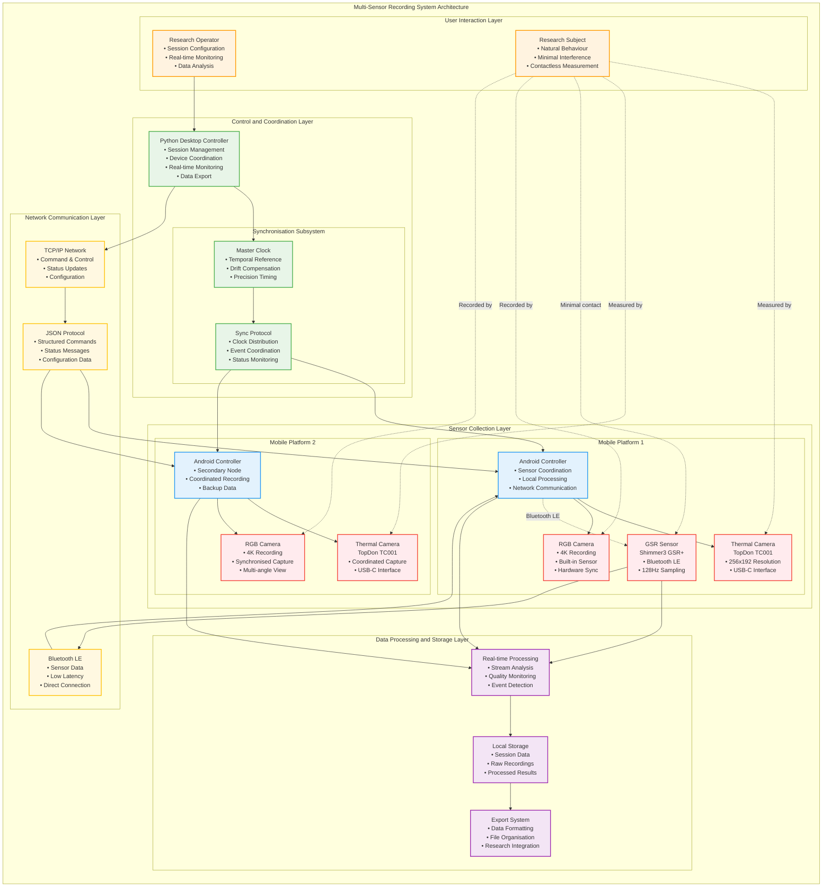
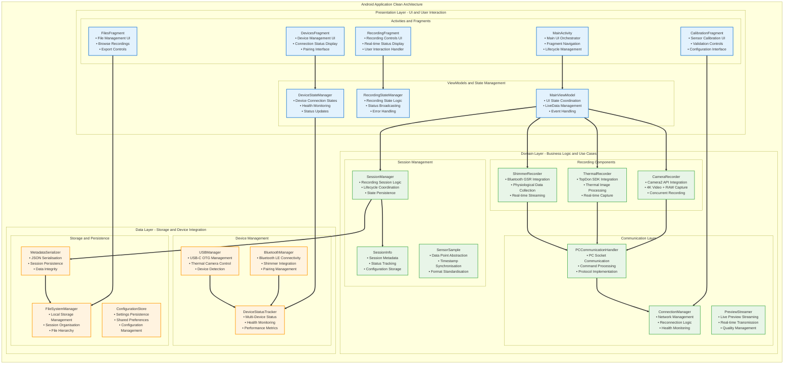
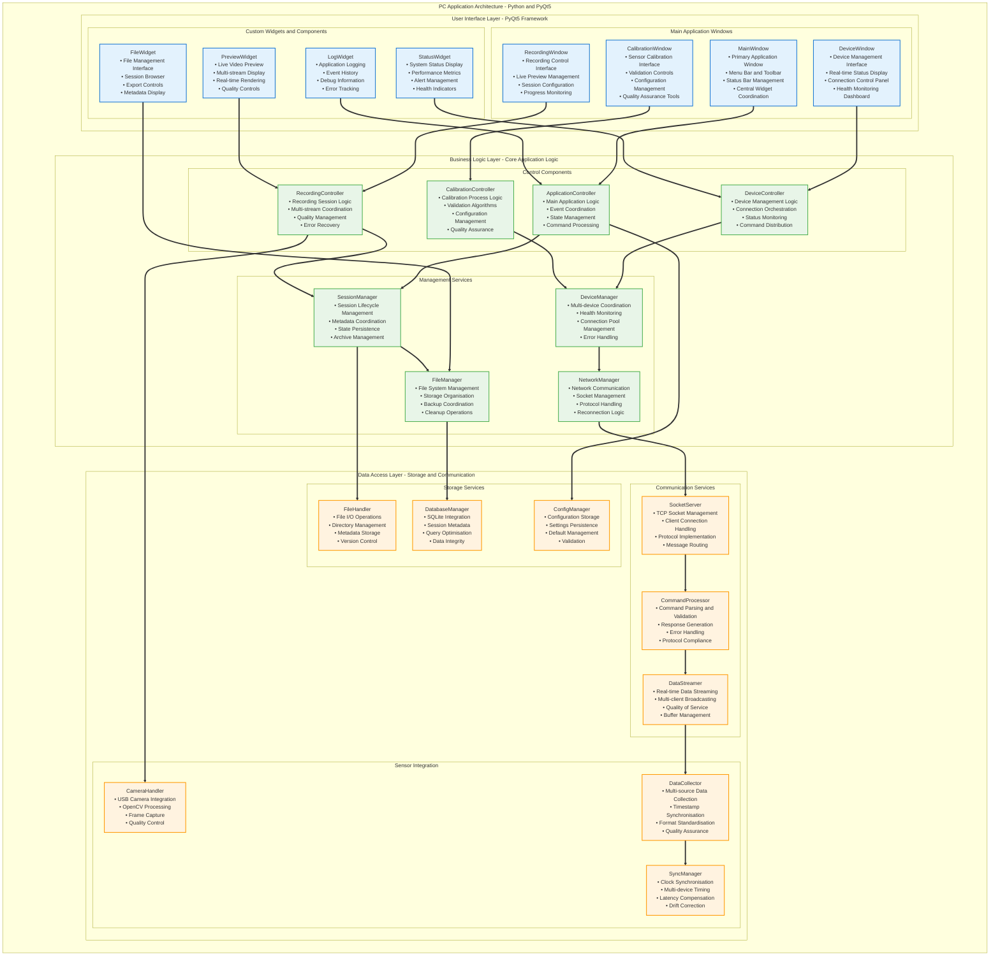

# Chapter 4 Mermaid Diagrams

This file contains all mermaid diagrams used in Chapter 4 of the thesis (System Design and Architecture).

## Figure 4.1: Multi-Sensor Recording System Architecture Overview

## Figure 4.2: Android App Clean Architecture

## Figure 4.3: PC App Architecture (Python PyQt5)

## Figure 4.4: Multi-Layer System Architecture

```mermaid
graph TB
    subgraph "Multi-Layer System Architecture"
        subgraph "Application Layer"
            subgraph "User Interface Applications"
                ANDROID_UI[Android Mobile App<br/>Recording Interface<br/>Preview Display<br/>Configuration Controls]
                PC_UI[PC Desktop Controller<br/>PyQt5 Interface<br/>Multi-device Monitoring<br/>Central Control Panel]
                WEB_UI[Web Interface<br/>Browser-based Control<br/>Real-time Dashboard<br/>Analytics Visualisation]
            end
            
            subgraph "Application Services"
                SESSION_APP[Session Management App<br/>Recording Orchestration<br/>Timing Coordination<br/>State Management]
                CALIB_APP[Calibration Application<br/>Geometric Calibration<br/>Thermal Calibration<br/>Quality Assessment]
                EXPORT_APP[Export Application<br/>Data Packaging<br/>Compression Service<br/>Documentation Generator]
            end
        end
        
        subgraph "Business Logic Layer"
            subgraph "Core Business Services"
                RECORD_SERV[Recording Service<br/>Multi-stream Coordination<br/>Synchronisation Logic<br/>Quality Monitoring]
                DEVICE_SERV[Device Management Service<br/>Connection Management<br/>Status Monitoring<br/>Configuration Service]
                DATA_SERV[Data Processing Service<br/>Stream Processing<br/>Real-time Analysis<br/>Storage Coordination]
            end
            
            subgraph "Integration Services"
                SENSOR_INT[Sensor Integration<br/>GSR Processing<br/>Thermal Processing<br/>Camera Processing]
                NETWORK_INT[Network Integration<br/>Socket Communication<br/>Protocol Management<br/>Quality Management]
                STORAGE_INT[Storage Integration<br/>File Management<br/>Backup Coordination<br/>Metadata Management]
            end
        end
        
        subgraph "Service Layer"
            subgraph "Communication Services"
                SOCKET_SERV[Socket Service<br/>TCP/UDP Communication<br/>Connection Management<br/>Protocol Handling]
                STREAM_SERV[Streaming Service<br/>Video Streaming<br/>Data Streaming<br/>Real-time Delivery]
                SYNC_SERV[Synchronisation Service<br/>Clock Management<br/>Offset Calculation<br/>Precision Control]
            end
            
            subgraph "Data Services"
                FILE_SERV[File Service<br/>Storage Management<br/>Naming Convention<br/>Organisation Logic]
                META_SERV[Metadata Service<br/>JSON Processing<br/>Configuration Management<br/>Schema Validation]
                BACKUP_SERV[Backup Service<br/>Replication Logic<br/>Integrity Verification<br/>Archive Management]
            end
        end
        
        subgraph "Infrastructure Layer"
            subgraph "Hardware Abstraction"
                CAM_HAL[Camera HAL<br/>Camera2 API<br/>Video Capture<br/>Device Control]
                USB_HAL[USB HAL<br/>Webcam Interface<br/>Thermal Camera<br/>Power Management]
                BT_HAL[Bluetooth HAL<br/>BLE Communication<br/>Shimmer Protocol<br/>Pairing Management]
            end
            
            subgraph "Operating System Interface"
                ANDROID_OS[Android OS Interface<br/>Permission Management<br/>Resource Management<br/>System Services]
                WINDOWS_OS[Windows OS Interface<br/>Driver Management<br/>Performance Monitoring<br/>Security Services]
                LINUX_OS[Linux OS Interface<br/>Real-time Support<br/>Process Management<br/>System Optimisation]
            end
        end
    end
    
    %% Layer Connections
    ANDROID_UI --> SESSION_APP
    PC_UI --> CALIB_APP
    WEB_UI --> EXPORT_APP
    
    SESSION_APP --> RECORD_SERV
    CALIB_APP --> DEVICE_SERV
    EXPORT_APP --> DATA_SERV
    
    RECORD_SERV --> SENSOR_INT
    DEVICE_SERV --> NETWORK_INT
    DATA_SERV --> STORAGE_INT
    
    SENSOR_INT --> SOCKET_SERV
    NETWORK_INT --> STREAM_SERV
    STORAGE_INT --> SYNC_SERV
    
    SOCKET_SERV --> FILE_SERV
    STREAM_SERV --> META_SERV
    SYNC_SERV --> BACKUP_SERV
    
    FILE_SERV --> CAM_HAL
    META_SERV --> USB_HAL
    BACKUP_SERV --> BT_HAL
    
    CAM_HAL --> ANDROID_OS
    USB_HAL --> WINDOWS_OS
    BT_HAL --> LINUX_OS
    
    classDef user fill:#fff3e0,stroke:#ff9800,stroke-width:2px
    classDef business fill:#e8f5e8,stroke:#4caf50,stroke-width:2px
    classDef service fill:#e3f2fd,stroke:#2196f3,stroke-width:2px
    classDef infrastructure fill:#f3e5f5,stroke:#9c27b0,stroke-width:2px
    
    class ANDROID_UI,PC_UI,WEB_UI,SESSION_APP,CALIB_APP,EXPORT_APP user
    class RECORD_SERV,DEVICE_SERV,DATA_SERV,SENSOR_INT,NETWORK_INT,STORAGE_INT business
    class SOCKET_SERV,STREAM_SERV,SYNC_SERV,FILE_SERV,META_SERV,BACKUP_SERV service
    class CAM_HAL,USB_HAL,BT_HAL,ANDROID_OS,WINDOWS_OS,LINUX_OS infrastructure
```

