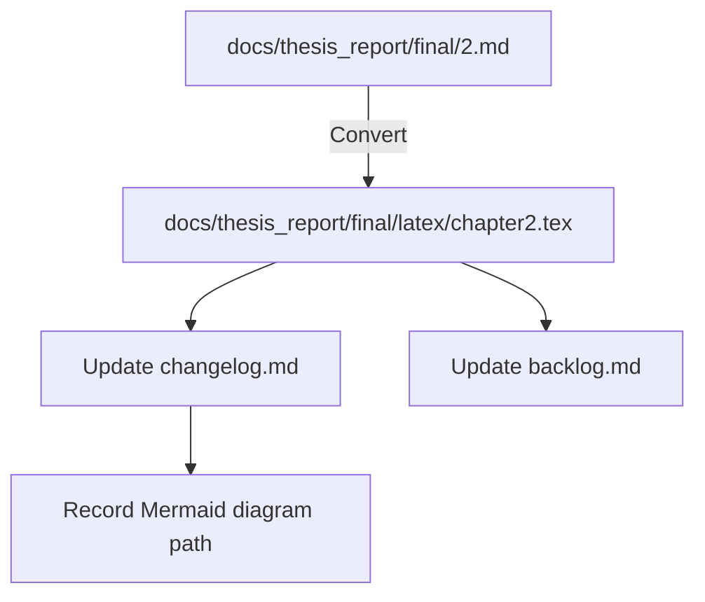

# Chapter 2 Conversion Flow

Notes:
- Citation mapping partially completed using existing keys in references.bib (e.g., Boucsein2012, Jangra2021GSRStress, ShimmerGSRSpecs, RTIThermalMentalEffort, MDPI2020AffectiveComputing, OpenCV, TopdonTC001Specs).
- TODO: Add missing BibTeX entries (Chen2019, Patel2024, Zhang2021 CMES, RFC793, pandas, h5py) and replace remaining bracketed references accordingly.
- Build integration (main.tex include) to be addressed if/when main file is present.
