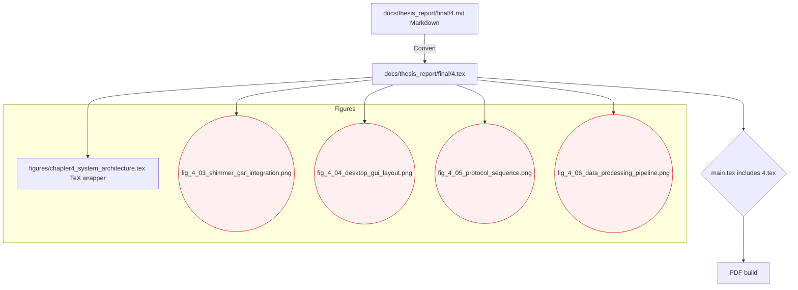

# Chapter 4 Conversion Overview

Notes:
- Image includes use conditional placeholders to avoid build breaks if assets are missing.
- TODO: Map numeric citations [13], [14], [16], etc. to proper \cite{...} keys in references.bib.
