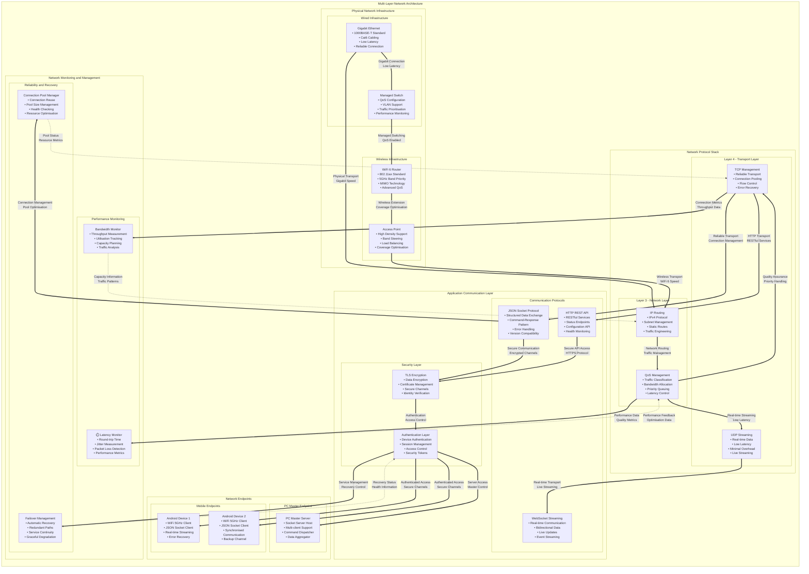

# Multi-Sensor Recording System - Improved Architecture Diagrams

This document contains enhanced Mermaid diagrams following best practices for documentation clarity and visual design.

## Table of Contents Diagram

```mermaid
flowchart TD
%% Main documentation structure
    START([Multi-Sensor Recording System<br/>Documentation Overview]) --> ARCH[System Architecture]
    START --> TECH[Technical Implementation]
    START --> DEPLOY[Deployment and Operations]
%% Architecture Documentation
    ARCH --> A1[Hardware Setup Architecture]
    ARCH --> A2[Android App Architecture]
    ARCH --> A3[PC App Architecture]
    ARCH --> A4[Complete Data Flow Architecture]
%% Technical Implementation
    TECH --> T1[Networking Architecture]
    TECH --> T2[Data Collection Flow]
    TECH --> T3[Session Management Flow]
    TECH --> T4[Data File System Architecture]
    TECH --> T5[Data Export Workflow]
%% System Architecture Details
    DEPLOY --> D1[Layer Architecture]
    DEPLOY --> D2[Software Architecture - Android]
    DEPLOY --> D3[Software Architecture - PC App]
    DEPLOY --> D4[Software Installation Flow]
    class START startClass
    class ARCH, A1, A2, A3, A4 archClass
    class TECH, T1, T2, T3, T4, T5 techClass
    class DEPLOY, D1, D2, D3, D4 deployClass
```

## Hardware Setup Architecture

```mermaid
graph TB
    subgraph LAB ["Research Laboratory Environment"]
        direction TB

        subgraph MOBILE ["Mobile Sensor Nodes"]
            direction LR

            subgraph NODE1 ["Primary Node"]
                S22_1["Samsung Galaxy S22<br/>• Primary Android Controller<br/>• 4K Video Recording<br/>• Real-time Processing"]
                TC001_1["TopDon TC001<br/>• Thermal Imaging Camera<br/>• USB-C OTG Interface<br/>• 256x192 Resolution"]
                GSR_1["Shimmer3 GSR+<br/>• Galvanic Skin Response<br/>• Bluetooth LE Protocol<br/>• Real-time Physiological Data"]
                S22_1 -.->|USB - C OTG<br/>High - Speed Data| TC001_1
                S22_1 -.->|Bluetooth LE<br/>Low Latency| GSR_1
            end

            subgraph NODE2 ["Secondary Node"]
                S22_2["Samsung Galaxy S22<br/>• Secondary Android Controller<br/>• 4K Video Recording<br/>• Synchronised Capture"]
                TC001_2["TopDon TC001<br/>• Thermal Imaging Camera<br/>• USB-C OTG Interface<br/>• 256x192 Resolution"]
                GSR_2["Shimmer3 GSR+<br/>• Galvanic Skin Response<br/>• Bluetooth LE Protocol<br/>• Real-time Physiological Data"]
                S22_2 -.->|USB - C OTG<br/>High - Speed Data| TC001_2
                S22_2 -.->|Bluetooth LE<br/>Low Latency| GSR_2
            end
        end

        subgraph STATIONARY ["Stationary Infrastructure"]
            direction TB

            subgraph COMPUTE ["Computing Hub"]
                PC["Windows PC Master Controller<br/>• Intel i7/i9 Processor<br/>• 16GB+ RAM<br/>• Real-time Coordination<br/>• Data Aggregation"]
            end

            subgraph CAMERAS ["USB Camera Array"]
                BRIO_1["Logitech Brio 4K<br/>• Primary USB Webcam<br/>• 4K @ 30fps<br/>• Auto-focus and HDR"]
                BRIO_2["Logitech Brio 4K<br/>• Secondary USB Webcam<br/>• 4K @ 30fps<br/>• Wide Field of View"]
            end

            subgraph STORAGE_SYS ["Storage System"]
                STORAGE["High-Performance Storage<br/>• NVMe SSD 1TB+<br/>• Multi-stream Recording<br/>• Backup and Redundancy"]
            end

            PC ---|USB 3 . 0<br/>High Bandwidth| BRIO_1
            PC ---|USB 3 . 0<br/>High Bandwidth| BRIO_2
            PC ---|SATA/NVMe<br/>Direct Access| STORAGE
        end

        subgraph NETWORK ["Network Infrastructure"]
            direction LR
            ROUTER["WiFi Router<br/>• 802.11ac/ax Standard<br/>• 5GHz Band Priority<br/>• QoS Management"]
            SWITCH["Gigabit Switch<br/>• Low Latency Switching<br/>• Managed Configuration<br/>• Traffic Optimisation"]
            ROUTER ===|Ethernet<br/>Gigabit| SWITCH
        end

        subgraph POWER ["Power Management"]
            direction TB
            UPS["Uninterruptible Power Supply<br/>• Battery Backup System<br/>• Surge Protection<br/>• Clean Power Delivery"]
            CHARGER_1["USB-C Fast Charger<br/>• 65W Power Delivery<br/>• Always-On Charging"]
            CHARGER_2["USB-C Fast Charger<br/>• 65W Power Delivery<br/>• Always-On Charging"]
        end

        subgraph ENV ["Environmental Controls"]
            direction LR
            LIGHTING["Controlled Lighting<br/>• Consistent Illumination<br/>• Adjustable Intensity<br/>• Colour Temperature Control"]
            TEMP["Temperature Control<br/>• 20-25°C Optimal Range<br/>• Humidity Management<br/>• Thermal Stability"]
            ACOUSTIC["Acoustic Isolation<br/>• Minimal Interference<br/>• Sound Dampening<br/>• Quiet Operation"]
        end
    end

%% Network Connections
    S22_1 ==>|WiFi 5GHz<br/>JSON Socket Protocol<br/>Real - time Commands| ROUTER
    S22_2 ==>|WiFi 5GHz<br/>JSON Socket Protocol<br/>Real - time Commands| ROUTER
    PC ==>|Ethernet Gigabit<br/>Master Controller<br/>Data Aggregation| SWITCH
%% Power Connections
    UPS -.->|Clean Power<br/>Backup Protection| PC
    UPS -.->|Clean Power<br/>Network Stability| ROUTER
    UPS -.->|Clean Power<br/>Network Stability| SWITCH
    CHARGER_1 -.->|Continuous Power<br/>65W Fast Charge| S22_1
    CHARGER_2 -.->|Continuous Power<br/>65W Fast Charge| S22_2
%% Environmental Impact
    LIGHTING -.->|Optimal Illumination| NODE1
    LIGHTING -.->|Optimal Illumination| NODE2
    LIGHTING -.->|Optimal Illumination| CAMERAS
    TEMP -.->|Thermal Stability| COMPUTE
    ACOUSTIC -.->|Noise Reduction| LAB
    class S22_1, S22_2, TC001_1, TC001_2, GSR_1, GSR_2 mobileClass
    class PC, BRIO_1, BRIO_2, STORAGE stationaryClass
    class ROUTER, SWITCH networkClass
    class UPS, CHARGER_1, CHARGER_2, LIGHTING, TEMP, ACOUSTIC infraClass
```

## Android App Architecture

```mermaid
graph TB
    subgraph ANDROID ["Android Application Clean Architecture"]
        direction TB

        subgraph PRESENTATION ["Presentation Layer - UI and User Interaction"]
            direction TB

            subgraph ACTIVITIES ["Activities and Fragments"]
                MA["MainActivity<br/>• Main UI Orchestrator<br/>• Fragment Navigation<br/>• Lifecycle Management"]
                RF["RecordingFragment<br/>• Recording Controls UI<br/>• Real-time Status Display<br/>• User Interaction Handler"]
                DF["DevicesFragment<br/>• Device Management UI<br/>• Connection Status Display<br/>• Pairing Interface"]
                CF["CalibrationFragment<br/>• Sensor Calibration UI<br/>• Validation Controls<br/>• Configuration Interface"]
                FF["FilesFragment<br/>• File Management UI<br/>• Browse Recordings<br/>• Export Controls"]
            end

            subgraph VIEWMODELS [" ViewModels and State Management"]
                MVM[" MainViewModel<br/>• UI State Coordination<br/>• LiveData Management<br/>• Event Handling"]
                RSM["RecordingStateManager<br/>• Recording State Logic<br/>• Status Broadcasting<br/>• Error Handling"]
                DSM["DeviceStateManager<br/>• Device Connection States<br/>• Health Monitoring<br/>• Status Updates"]
            end

            subgraph UI_UTILS [" UI Utilities and Navigation"]
                UC["UIController<br/>• Component Validation<br/>• Dynamic UI Updates<br/>• Theme Management"]
                NU[" NavigationUtils<br/>• Fragment Navigation<br/>• Deep Linking<br/>• Back Stack Management"]
                UU[" UIUtils<br/>• Helper Functions<br/>• UI Animations<br/>• Resource Management"]
                MAC["MainActivityCoordinator<br/>• Activity Coordination<br/>• Event Distribution<br/>• State Synchronisation"]
            end
        end

        subgraph DOMAIN ["Domain Layer - Business Logic and Use Cases"]
            direction TB

            subgraph RECORDING ["Recording Components"]
                CR[" CameraRecorder<br/>• Camera2 API Integration<br/>• 4K Video + RAW Capture<br/>• Concurrent Recording"]
                TR["ThermalRecorder<br/>• TopDon SDK Integration<br/>• Thermal Image Processing<br/>• Real-time Capture"]
                SR["ShimmerRecorder<br/>• Bluetooth GSR Integration<br/>• Physiological Data Collection<br/>• Real-time Streaming"]
            end

            subgraph SESSION ["Session Management"]
                SM["SessionManager<br/>• Recording Session Logic<br/>• Lifecycle Coordination<br/>• State Persistence"]
                SI[" SessionInfo<br/>• Session Metadata<br/>• Status Tracking<br/>• Configuration Storage"]
                SS[" SensorSample<br/>• Data Point Abstraction<br/>• Timestamp Synchronisation<br/>• Format Standardisation"]
            end

            subgraph COMMUNICATION ["Communication Layer"]
                PCH["PCCommunicationHandler<br/>• PC Socket Communication<br/>• Command Processing<br/>• Protocol Implementation"]
                CM["ConnectionManager<br/>• Network Management<br/>• Reconnection Logic<br/>• Health Monitoring"]
                PS["PreviewStreamer<br/>• Live Preview Streaming<br/>• Real-time Transmission<br/>• Quality Management"]
            end
        end

        subgraph DATA ["Data Layer - Storage and Device Integration"]
            direction TB

            subgraph DEVICE_MGT ["Device Management"]
                DST["DeviceStatusTracker<br/>• Multi-Device Status<br/>• Health Monitoring<br/>• Performance Metrics"]
                BM["📶 BluetoothManager<br/>• Bluetooth LE Connectivity<br/>• Shimmer Integration<br/>• Pairing Management"]
                UM["USBManager<br/>• USB-C OTG Management<br/>• Thermal Camera Control<br/>• Device Detection"]
            end

            subgraph STORAGE ["Storage and Persistence"]
                FS["FileSystemManager<br/>• Local Storage Management<br/>• Session Organisation<br/>• File Hierarchy"]
                MS["MetadataSerializer<br/>• JSON Serialisation<br/>• Session Persistence<br/>• Data Integrity"]
                CS["ConfigurationStore<br/>• Settings Persistence<br/>• Shared Preferences<br/>• Configuration Management"]
            end
        end

        subgraph INFRASTRUCTURE ["Infrastructure Layer - Platform Integration"]
            direction TB

            subgraph ANDROID_FW ["🤖 Android Framework Integration"]
                CAM2["📸 Camera2 API<br/>• Low-level Camera Control<br/>• Concurrent Capture<br/>• Hardware Acceleration"]
                BLE["Bluetooth LE API<br/>• Low Energy Communication<br/>• Shimmer Protocol<br/>• Connection Management"]
                NET["Network API<br/>• Socket Communication<br/>• OkHttp Integration<br/>• Connection Pooling"]
            end

            subgraph HARDWARE ["Hardware Abstraction"]
                HAL["Hardware Abstraction Layer<br/>• Device-specific Adaptations<br/>• Platform Compatibility<br/>• Driver Integration"]
                PERM["Permission Manager<br/>• Runtime Permissions<br/>• Security Enforcement<br/>• Access Control"]
                LIFE["♻️ Lifecycle Manager<br/>• Component Lifecycle<br/>• Resource Management<br/>• Memory Optimisation"]
            end
        end
    end

%% Layer Interactions - Presentation to Domain
    MA ==>|User Actions<br/>Navigation Events| MVM
    MVM ==>|Business Logic<br/>State Updates| SM
    RF ==>|Recording Commands<br/>UI Events| RSM
    DF ==>|Device Commands<br/>Status Requests| DSM
    CF ==>|Calibration Requests<br/>Configuration| CM
    FF ==>|File Operations<br/>Data Access| FS
%% Domain Layer Internal Connections
    MVM ==>|Recording Control<br/>Session Management| CR
    MVM ==>|Thermal Control<br/>Image Processing| TR
    MVM ==>|GSR Control<br/>Data Streaming| SR
    SM ==>|Session Coordination<br/>State Management| SI
    CR ==>|Data Communication<br/>Status Updates| PCH
    TR ==>|Data Communication<br/>Status Updates| PCH
    SR ==>|Data Communication<br/>Status Updates| PCH
    PCH ==>|Network Management<br/>Connection Control| CM
    CR ==>|Preview Streaming<br/>Real - time Data| PS
    PS ==>|Network Transmission<br/>Stream Management| CM
%% Data Layer Connections
    DSM ==>|Device Status<br/>Health Monitoring| DST
    BM ==>|Bluetooth Status<br/>Connection State| DST
    UM ==>|USB Status<br/>Device Detection| DST
    SM ==>|Session Data<br/>Metadata Storage| MS
    MS ==>|File Operations<br/>Data Persistence| FS
    CS ==>|Configuration Data<br/>Settings Storage| FS
%% Infrastructure Layer Support
    CR ==>|Camera Control<br/>Hardware Access| CAM2
    SR ==>|Bluetooth Communication<br/>Data Transfer| BLE
    PCH ==>|Network Communication<br/>Socket Operations| NET
    HAL ==>|Platform Adaptation<br/>Hardware Abstraction| CAM2
    HAL ==>|Platform Adaptation<br/>Hardware Abstraction| BLE
    PERM ==>|Security Enforcement<br/>Access Control| HAL
    LIFE ==>|Resource Management<br/>Lifecycle Control| HAL
%% UI Coordination
    MA ==>|UI Control<br/>Component Management| UC
    UC ==>|Activity Coordination<br/>Event Distribution| MAC
    MAC ==>|Navigation Control<br/>Fragment Management| NU
    NU ==>|UI Utilities<br/>Helper Functions| UU
    class MA, RF, DF, CF, FF, MVM, RSM, DSM, UC, NU, UU, MAC presentationClass
    class CR, TR, SR, SM, SI, SS, PCH, CM, PS domainClass
    class DST, BM, UM, FS, MS, CS dataClass
    class CAM2, BLE, NET, HAL, PERM, LIFE infraClass
```

## PC App Architecture

```mermaid
graph TB
    subgraph PC_APP ["PC Application Architecture - Python and PyQt5"]
        direction TB

        subgraph UI_LAYER ["User Interface Layer - PyQt5 Framework"]
            direction TB

            subgraph MAIN_UI ["Main Application Windows"]
                MW["MainWindow<br/>• Primary Application Window<br/>• Menu Bar and Toolbar<br/>• Status Bar Management<br/>• Central Widget Coordination"]
                DW["DeviceWindow<br/>• Device Management Interface<br/>• Real-time Status Display<br/>• Connection Control Panel<br/>• Health Monitoring Dashboard"]
                RW["RecordingWindow<br/>• Recording Control Interface<br/>• Live Preview Management<br/>• Session Configuration<br/>• Progress Monitoring"]
                CW["CalibrationWindow<br/>• Sensor Calibration Interface<br/>• Validation Controls<br/>• Configuration Management<br/>• Quality Assurance Tools"]
            end

            subgraph WIDGETS ["🧩 Custom Widgets and Components"]
                PW["PreviewWidget<br/>• Live Video Preview<br/>• Multi-stream Display<br/>• Real-time Rendering<br/>• Quality Controls"]
                SW["StatusWidget<br/>• System Status Display<br/>• Performance Metrics<br/>• Alert Management<br/>• Health Indicators"]
                LW["LogWidget<br/>• Application Logging<br/>• Event History<br/>• Debug Information<br/>• Error Tracking"]
                FW["FileWidget<br/>• File Management Interface<br/>• Session Browser<br/>• Export Controls<br/>• Metadata Display"]
            end
        end

        subgraph BUSINESS ["Business Logic Layer - Core Application Logic"]
            direction TB

            subgraph CONTROLLERS ["Control Components"]
                AC["ApplicationController<br/>• Main Application Logic<br/>• Event Coordination<br/>• State Management<br/>• Command Processing"]
                DC["DeviceController<br/>• Device Management Logic<br/>• Connection Orchestration<br/>• Status Monitoring<br/>• Command Distribution"]
                RC["RecordingController<br/>• Recording Session Logic<br/>• Multi-stream Coordination<br/>• Quality Management<br/>• Error Recovery"]
                CC["CalibrationController<br/>• Calibration Process Logic<br/>• Validation Algorithms<br/>• Configuration Management<br/>• Quality Assurance"]
            end

            subgraph MANAGERS ["Management Services"]
                SM["SessionManager<br/>• Session Lifecycle Management<br/>• Metadata Coordination<br/>• State Persistence<br/>• Archive Management"]
                DM["DeviceManager<br/>• Multi-device Coordination<br/>• Health Monitoring<br/>• Connection Pool Management<br/>• Error Handling"]
                FM["FileManager<br/>• File System Management<br/>• Storage Organisation<br/>• Backup Coordination<br/>• Cleanup Operations"]
                NM["NetworkManager<br/>• Network Communication<br/>• Socket Management<br/>• Protocol Handling<br/>• Reconnection Logic"]
            end
        end

        subgraph DATA_LAYER ["Data Access Layer - Storage and Communication"]
            direction TB

            subgraph COMMUNICATION ["Communication Services"]
                SocketServer["SocketServer<br/>• TCP Socket Management<br/>• Client Connection Handling<br/>• Protocol Implementation<br/>• Message Routing"]
                CommandProcessor["CommandProcessor<br/>• Command Parsing and Validation<br/>• Response Generation<br/>• Error Handling<br/>• Protocol Compliance"]
                DataStreamer["DataStreamer<br/>• Real-time Data Streaming<br/>• Multi-client Broadcasting<br/>• Quality of Service<br/>• Buffer Management"]
            end

            subgraph STORAGE ["Storage Services"]
                FileHandler["FileHandler<br/>• File I/O Operations<br/>• Directory Management<br/>• Metadata Storage<br/>• Version Control"]
                DatabaseManager["🗃️ DatabaseManager<br/>• SQLite Integration<br/>• Session Metadata<br/>• Query Optimisation<br/>• Data Integrity"]
                ConfigManager["ConfigManager<br/>• Configuration Storage<br/>• Settings Persistence<br/>• Default Management<br/>• Validation"]
            end

            subgraph SENSORS ["Sensor Integration"]
                CameraHandler["CameraHandler<br/>• USB Camera Integration<br/>• OpenCV Processing<br/>• Frame Capture<br/>• Quality Control"]
                DataCollector["DataCollector<br/>• Multi-source Data Collection<br/>• Timestamp Synchronisation<br/>• Format Standardisation<br/>• Quality Assurance"]
                SyncManager["SyncManager<br/>• Clock Synchronisation<br/>• Multi-device Timing<br/>• Latency Compensation<br/>• Drift Correction"]
            end
        end

        subgraph EXTERNAL ["External Dependencies and Platform Integration"]
            direction TB

            subgraph FRAMEWORKS ["Framework Dependencies"]
                PyQt5["🖼️ PyQt5 Framework<br/>• GUI Framework<br/>• Event System<br/>• Widget Library<br/>• Platform Abstraction"]
                OpenCV["👁️ OpenCV Library<br/>• Computer Vision<br/>• Image Processing<br/>• Video Capture<br/>• Real-time Processing"]
                NumPy["🔢 NumPy Library<br/>• Numerical Computing<br/>• Array Operations<br/>• Mathematical Functions<br/>• Performance Optimisation"]
            end

            subgraph SYSTEM ["System Integration"]
                OS_Interface["Operating System Interface<br/>• Windows API Integration<br/>• Process Management<br/>• Hardware Access<br/>• Resource Control"]
                HW_Interface["Hardware Interface<br/>• USB Device Management<br/>• Camera Control<br/>• Network Adaptation<br/>• Driver Integration"]
                FS_Interface["File System Interface<br/>• Storage Management<br/>• Directory Operations<br/>• Permissions Handling<br/>• Backup Integration"]
            end
        end
    end

%% UI Layer Connections
    MW ==>|Window Management<br/>Event Coordination| AC
    DW ==>|Device Commands<br/>Status Requests| DC
    RW ==>|Recording Commands<br/>Session Control| RC
    CW ==>|Calibration Commands<br/>Configuration| CC
%% Widget to Controller Connections
    PW ==>|Preview Control<br/>Display Management| RC
    SW ==>|Status Updates<br/>Health Monitoring| DC
    LW ==>|Logging Events<br/>Debug Information| AC
    FW ==>|File Operations<br/>Management Commands| FM
%% Business Logic Internal Connections
    AC ==>|Application Control<br/>Global Coordination| SM
    DC ==>|Device Management<br/>Connection Control| DM
    RC ==>|Recording Management<br/>Session Control| SM
    CC ==>|Calibration Management<br/>Quality Control| DM
    SM ==>|File Operations<br/>Storage Management| FM
    DM ==>|Network Operations<br/>Communication| NM
%% Data Layer Connections
    NM ==>|Socket Operations<br/>Network Management| SocketServer
    SocketServer ==>|Command Processing<br/>Message Handling| CommandProcessor
    CommandProcessor ==>|Data Distribution<br/>Client Broadcasting| DataStreamer
    SM ==>|File Operations<br/>Storage Management| FileHandler
    FM ==>|Database Operations<br/>Metadata Management| DatabaseManager
    AC ==>|Configuration Operations<br/>Settings Management| ConfigManager
%% Sensor Integration
    RC ==>|Camera Control<br/>Video Capture| CameraHandler
    DataStreamer ==>|Data Collection<br/>Multi - source Integration| DataCollector
    DataCollector ==>|Synchronisation<br/>Timing Control| SyncManager
%% External Dependencies
    MW ==>|GUI Framework<br/>Widget Management| PyQt5
    PW ==>|GUI Framework<br/>Custom Widgets| PyQt5
    SW ==>|GUI Framework<br/>Display Components| PyQt5
    CameraHandler ==>|Computer Vision<br/>Image Processing| OpenCV
    DataCollector ==>|Numerical Operations<br/>Array Processing| NumPy
    SyncManager ==>|Mathematical Operations<br/>Time Calculations| NumPy
%% System Integration
    FileHandler ==>|File System Operations<br/>Storage Access| FS_Interface
    SocketServer ==>|Network Operations<br/>Socket Management| OS_Interface
    CameraHandler ==>|Hardware Control<br/>Device Access| HW_Interface
    OS_Interface ==>|Platform Services<br/>System Resources| PyQt5
    HW_Interface ==>|Device Management<br/>Hardware Abstraction| OpenCV
    FS_Interface ==>|Storage Services<br/>File Operations| NumPy
    class MW, DW, RW, CW, PW, SW, LW, FW uiClass
    class AC, DC, RC, CC, SM, DM, FM, NM businessClass
    class SocketServer, CommandProcessor, DataStreamer, FileHandler, DatabaseManager, ConfigManager, CameraHandler, DataCollector, SyncManager dataClass
    class PyQt5, OpenCV, NumPy, OS_Interface, HW_Interface, FS_Interface externalClass
```

## Complete Data Flow Architecture

```mermaid
graph TD
    subgraph COLLECTION ["Multi-Modal Data Collection Architecture"]
        direction TB

        subgraph MOBILE_SOURCES ["Mobile Data Sources"]
            direction LR

            subgraph DEVICE1 ["Primary Mobile Node"]
                CAM1[" Camera2 API<br/>• 4K Video @ 30fps<br/>• RAW Image Capture<br/>• Concurrent Streams<br/>• Hardware Acceleration"]
                THERMAL1["TopDon Thermal<br/>• 256x192 Resolution<br/>• 30fps Thermal Imaging<br/>• Temperature Mapping<br/>• Real-time Processing"]
                GSR1["Shimmer3 GSR+<br/>• Galvanic Skin Response<br/>• 1KHz Sampling Rate<br/>• Bluetooth LE Streaming<br/>• Real-time Physiological"]
            end

            subgraph DEVICE2 ["Secondary Mobile Node"]
                CAM2[" Camera2 API<br/>• 4K Video @ 30fps<br/>• RAW Image Capture<br/>• Synchronised Recording<br/>• Multi-angle Coverage"]
                THERMAL2["TopDon Thermal<br/>• 256x192 Resolution<br/>• 30fps Thermal Imaging<br/>• Temperature Analysis<br/>• Coordinated Capture"]
                GSR2["Shimmer3 GSR+<br/>• Galvanic Skin Response<br/>• 1KHz Sampling Rate<br/>• Synchronised Streaming<br/>• Physiological Monitoring"]
            end
        end

        subgraph STATIONARY_SOURCES ["Stationary Data Sources"]
            direction LR
            BRIO1["Logitech Brio 4K<br/>• Primary USB Camera<br/>• 4K @ 30fps Recording<br/>• Auto-focus and HDR<br/>• Wide Field of View"]
            BRIO2["Logitech Brio 4K<br/>• Secondary USB Camera<br/>• 4K @ 30fps Recording<br/>• Fixed Position<br/>• Detail Capture"]
        end

        subgraph AGGREGATION ["Real-time Data Aggregation Hub"]
            direction TB

            subgraph MOBILE_PROC ["Mobile Processing"]
                ANDROID1["Android App Node 1<br/>• Real-time Data Processing<br/>• Local Storage Management<br/>• Network Communication<br/>• Quality Control"]
                ANDROID2["Android App Node 2<br/>• Real-time Data Processing<br/>• Synchronised Operations<br/>• Backup Recording<br/>• Status Monitoring"]
            end

            subgraph MASTER_CTRL ["Master Controller Hub"]
                PC_CTRL["PC Master Controller<br/>• Multi-stream Coordination<br/>• Real-time Synchronisation<br/>• Quality Assurance<br/>• Command Distribution<br/>• Data Aggregation"]
            end
        end

        subgraph PROCESSING ["Real-time Processing Pipeline"]
            direction TB

            subgraph SYNC_LAYER ["Synchronisation Layer"]
                MASTER_CLOCK["Master Clock Synchronizer<br/>• Global Time Reference<br/>• Drift Compensation<br/>• Latency Calculation<br/>• Precision Timing"]
                SYNC_ENGINE["Synchronisation Engine<br/>• Multi-stream Alignment<br/>• Timestamp Correction<br/>• Buffer Management<br/>• Quality Monitoring"]
            end

            subgraph QUALITY_CTRL ["Quality Control Layer"]
                QC_ENGINE["Quality Control Engine<br/>• Data Validation<br/>• Error Detection<br/>• Integrity Checking<br/>• Performance Monitoring"]
                REDUNDANCY["Redundancy Manager<br/>• Backup Data Streams<br/>• Failover Handling<br/>• Recovery Mechanisms<br/>• Continuity Assurance"]
            end
        end

        subgraph STORAGE ["Multi-tier Storage Architecture"]
            direction TB

            subgraph LOCAL_STORAGE ["Local Storage Tier"]
                MOBILE_STORAGE["Mobile Local Storage<br/>• Device-specific Storage<br/>• Session Organisation<br/>• Temporary Buffering<br/>• Quick Access"]
                PC_STORAGE["PC Primary Storage<br/>• High-speed NVMe SSD<br/>• Master Data Repository<br/>• Real-time Writing<br/>• Performance Optimisation"]
            end

            subgraph BACKUP_TIER ["Backup and Archive Tier"]
                BACKUP_STORAGE["Backup Storage<br/>• Redundant Data Copies<br/>• Automated Backup<br/>• Version Control<br/>• Disaster Recovery"]
                ARCHIVE_STORAGE["Archive Storage<br/>• Long-term Retention<br/>• Compressed Storage<br/>• Metadata Indexing<br/>• Research Database"]
            end
        end

        subgraph EXPORT ["Data Export and Analysis Pipeline"]
            direction LR
            EXPORT_ENGINE["Export Engine<br/>• Multi-format Export<br/>• Quality Assurance<br/>• Compression Optimisation<br/>• Delivery Management"]
            ANALYSIS_PREP["Analysis Preparation<br/>• Data Preprocessing<br/>• Format Conversion<br/>• Annotation Integration<br/>• Research Ready Output"]
        end
    end

%% Data Flow from Sources to Mobile Processing
    CAM1 ==>|Video Stream<br/>4K @ 30fps<br/>Real - time| ANDROID1
    THERMAL1 ==>|Thermal Data<br/>256x192 @ 30fps<br/>USB - C| ANDROID1
    GSR1 ==>|Physiological Data<br/>1KHz Sampling<br/>Bluetooth LE| ANDROID1
    CAM2 ==>|Video Stream<br/>4K @ 30fps<br/>Synchronised| ANDROID2
    THERMAL2 ==>|Thermal Data<br/>256x192 @ 30fps<br/>USB - C| ANDROID2
    GSR2 ==>|Physiological Data<br/>1KHz Sampling<br/>Bluetooth LE| ANDROID2
%% Stationary Sources to Master Controller
    BRIO1 ==>|Video Stream<br/>4K @ 30fps<br/>USB 3 . 0| PC_CTRL
    BRIO2 ==>|Video Stream<br/>4K @ 30fps<br/>USB 3 . 0| PC_CTRL
%% Mobile to Master Controller Communication
    ANDROID1 ==>|Processed Data<br/>JSON Protocol<br/>WiFi 5GHz| PC_CTRL
    ANDROID2 ==>|Processed Data<br/>JSON Protocol<br/>WiFi 5GHz| PC_CTRL
%% Master Controller to Synchronisation
    PC_CTRL ==>|Multi - stream Data<br/>Real - time Coordination<br/>Command Distribution| MASTER_CLOCK
    MASTER_CLOCK ==>|Synchronised Timing<br/>Global Time Reference<br/>Precision Control| SYNC_ENGINE
%% Synchronisation to Quality Control
    SYNC_ENGINE ==>|Aligned Data Streams<br/>Timestamp Corrected<br/>Buffer Managed| QC_ENGINE
    QC_ENGINE ==>|Validated Data<br/>Quality Assured<br/>Error Corrected| REDUNDANCY
%% Processing to Storage
    ANDROID1 ==>|Local Data<br/>Device Storage<br/>Session Files| MOBILE_STORAGE
    ANDROID2 ==>|Local Data<br/>Device Storage<br/>Session Files| MOBILE_STORAGE
    REDUNDANCY ==>|Master Data<br/>High - speed Write<br/>Real - time Storage| PC_STORAGE
%% Storage Tier Management
    PC_STORAGE ==>|Automated Backup<br/>Redundant Copies<br/>Version Control| BACKUP_STORAGE
    BACKUP_STORAGE ==>|Long - term Archive<br/>Compressed Storage<br/>Research Database| ARCHIVE_STORAGE
%% Export Pipeline
    PC_STORAGE ==>|Source Data<br/>Session Files<br/>Metadata| EXPORT_ENGINE
    ARCHIVE_STORAGE ==>|Historical Data<br/>Research Archive<br/>Long - term Storage| EXPORT_ENGINE
    EXPORT_ENGINE ==>|Processed Output<br/>Multi - format<br/>Quality Assured| ANALYSIS_PREP
%% Feedback and Control Loops
    QC_ENGINE -.->|Quality Metrics<br/>Performance Data<br/>Error Reports| PC_CTRL
    SYNC_ENGINE -.->|Timing Information<br/>Latency Data<br/>Sync Status| PC_CTRL
    PC_CTRL -.->|Control Commands<br/>Configuration Updates<br/>Status Requests| ANDROID1
    PC_CTRL -.->|Control Commands<br/>Configuration Updates<br/>Status Requests| ANDROID2
    class CAM1, CAM2, THERMAL1, THERMAL2, GSR1, GSR2, BRIO1, BRIO2 sourceClass
    class ANDROID1, ANDROID2, MASTER_CLOCK, SYNC_ENGINE, QC_ENGINE, REDUNDANCY processingClass
    class MOBILE_STORAGE, PC_STORAGE, BACKUP_STORAGE, ARCHIVE_STORAGE storageClass
    class PC_CTRL, EXPORT_ENGINE, ANALYSIS_PREP controlClass
```

## Networking Architecture



## Data Collection Flow

```mermaid
flowchart TD
    %% Start of the data collection process
    START([Data Collection Process Start]) --> INIT_CHECK{🔍 System Initialisation Check}
    
    %% Initialisation and Setup Phase
    INIT_CHECK -->|System Ready| DEVICE_DISCOVERY[Device Discovery and Connection]
    INIT_CHECK -->|❌ System Not Ready| ERROR_INIT[❌ Initialisation Error]
    ERROR_INIT --> RETRY_INIT{Retry Initialisation?}
    RETRY_INIT -->|Yes| INIT_CHECK
    RETRY_INIT -->|No| ABORT[🛑 Process Aborted]
    
    %% Device Discovery and Connection
    DEVICE_DISCOVERY --> CONNECT_ANDROID[Connect Android Devices]
    CONNECT_ANDROID --> CONNECT_THERMAL[Connect Thermal Cameras]
    CONNECT_THERMAL --> CONNECT_GSR[Connect GSR Sensors]
    CONNECT_GSR --> CONNECT_USB[Connect USB Cameras]
    CONNECT_USB --> DEVICE_CHECK{All Devices Connected?}
    
    DEVICE_CHECK -->|❌ Missing Devices| DEVICE_ERROR[❌ Device Connection Error]
    DEVICE_ERROR --> RETRY_DEVICE{Retry Device Connection?}
    RETRY_DEVICE -->|Yes| DEVICE_DISCOVERY
    RETRY_DEVICE -->|No| PARTIAL_MODE{⚠️ Continue with Available Devices?}
    PARTIAL_MODE -->|Yes| CALIBRATION
    PARTIAL_MODE -->|No| ABORT
    
    %% Calibration and Configuration Phase
    DEVICE_CHECK -->|All Connected| CALIBRATION[Sensor Calibration and Configuration]
    CALIBRATION --> SYNC_SETUP[Clock Synchronisation Setup]
    SYNC_SETUP --> QUALITY_CHECK[Quality Assurance Check]
    QUALITY_CHECK --> CALIB_VALID{Calibration Valid?}
    
    CALIB_VALID -->|❌ Calibration Failed| RECALIBRATE{Recalibrate Sensors?}
    RECALIBRATE -->|Yes| CALIBRATION
    RECALIBRATE -->|No| ABORT
    
    %% Pre-Recording Setup
    CALIB_VALID -->|Calibration Success| SESSION_SETUP[Session Configuration]
    SESSION_SETUP --> METADATA_SETUP[Metadata Configuration]
    METADATA_SETUP --> STORAGE_PREP[Storage Preparation]
    STORAGE_PREP --> RECORDING_READY{Ready to Record?}
    
    %% Recording Phase
    RECORDING_READY -->|Ready| START_RECORDING[Start Multi-stream Recording]
    START_RECORDING --> PARALLEL_RECORDING[Parallel Data Collection]
    
    %% Parallel Recording Streams
    PARALLEL_RECORDING --> ANDROID_REC[Android Video and Thermal Recording]
    PARALLEL_RECORDING --> GSR_REC[GSR Data Streaming]
    PARALLEL_RECORDING --> USB_REC[USB Camera Recording]
    PARALLEL_RECORDING --> MONITORING[Real-time Monitoring]
    
    %% Real-time Monitoring and Quality Control
    MONITORING --> QUALITY_MONITOR[Quality Monitoring]
    QUALITY_MONITOR --> SYNC_MONITOR[Synchronisation Monitoring]
    SYNC_MONITOR --> ERROR_DETECT{❌ Errors Detected?}
    
    ERROR_DETECT -->|No Errors| CONTINUE_REC{⏳ Continue Recording?}
    ERROR_DETECT -->|❌ Errors Found| ERROR_HANDLE[Error Handling]
    
    %% Error Handling During Recording
    ERROR_HANDLE --> ERROR_TYPE{🔍 Error Type Analysis}
    ERROR_TYPE -->|Minor| MINOR_FIX[Minor Fix Applied]
    ERROR_TYPE -->|Major| MAJOR_FIX[🚨 Major Error Recovery]
    ERROR_TYPE -->|Critical| EMERGENCY_STOP[🛑 Emergency Stop]
    
    MINOR_FIX --> CONTINUE_REC
    MAJOR_FIX --> RESTART_CHECK{Restart Recording?}
    RESTART_CHECK -->|Yes| START_RECORDING
    RESTART_CHECK -->|No| STOP_RECORDING
    EMERGENCY_STOP --> EMERGENCY_SAVE[Emergency Data Save]
    EMERGENCY_SAVE --> DATA_RECOVERY[Data Recovery Process]
    
    %% Recording Control
    CONTINUE_REC -->|Yes| MONITORING
    CONTINUE_REC -->|No| STOP_RECORDING[🛑 Stop Recording Command]
    
    %% Post-Recording Phase
    STOP_RECORDING --> FINALIZE_DATA[Finalise Data Collection]
    FINALIZE_DATA --> DATA_VALIDATION[Data Validation]
    DATA_VALIDATION --> METADATA_COMPLETE[Complete Metadata]
    METADATA_COMPLETE --> FILE_ORGANIZATION[File Organisation]
    
    %% Data Processing and Storage
    FILE_ORGANIZATION --> COMPRESSION[Data Compression]
    COMPRESSION --> BACKUP_CREATE[Create Backup Copies]
    BACKUP_CREATE --> VERIFICATION[Data Verification]
    VERIFICATION --> VERIFY_CHECK{Verification Successful?}
    
    VERIFY_CHECK -->|❌ Verification Failed| DATA_CORRUPTION[❌ Data Corruption Detected]
    DATA_CORRUPTION --> RECOVERY_ATTEMPT[Recovery Attempt]
    RECOVERY_ATTEMPT --> RECOVERY_SUCCESS{Recovery Successful?}
    RECOVERY_SUCCESS -->|Yes| ARCHIVE_READY
    RECOVERY_SUCCESS -->|No| PARTIAL_SAVE[⚠️ Partial Data Save]
    PARTIAL_SAVE --> ARCHIVE_READY
    
    %% Archival and Completion
    VERIFY_CHECK -->|Verification Success| ARCHIVE_READY[Ready for Archival]
    ARCHIVE_READY --> ARCHIVE_DATA[Archive Data]
    ARCHIVE_DATA --> CLEANUP[🧹 Cleanup Temporary Files]
    CLEANUP --> SESSION_REPORT[Generate Session Report]
    SESSION_REPORT --> COMPLETE([Data Collection Complete])
    
    %% Data Recovery Flow
    DATA_RECOVERY --> RECOVERY_ASSESS[🔍 Assess Recoverable Data]
    RECOVERY_ASSESS --> RECOVERY_POSSIBLE{Recovery Possible?}
    RECOVERY_POSSIBLE -->|Yes| PARTIAL_RECOVERY[⚠️ Partial Recovery]
    RECOVERY_POSSIBLE -->|No| LOSS_REPORT[Data Loss Report]
    PARTIAL_RECOVERY --> ARCHIVE_READY
    LOSS_REPORT --> COMPLETE
    
    class START,COMPLETE startEndClass
    class DEVICE_DISCOVERY,CONNECT_ANDROID,CONNECT_THERMAL,CONNECT_GSR,CONNECT_USB,CALIBRATION,SYNC_SETUP,QUALITY_CHECK,SESSION_SETUP,METADATA_SETUP,STORAGE_PREP,START_RECORDING,PARALLEL_RECORDING,ANDROID_REC,GSR_REC,USB_REC,MONITORING,QUALITY_MONITOR,SYNC_MONITOR,STOP_RECORDING,FINALIZE_DATA,DATA_VALIDATION,METADATA_COMPLETE,FILE_ORGANIZATION,COMPRESSION,BACKUP_CREATE,VERIFICATION,ARCHIVE_DATA,CLEANUP,SESSION_REPORT processClass
    class INIT_CHECK,DEVICE_CHECK,CALIB_VALID,RECORDING_READY,CONTINUE_REC,ERROR_DETECT,ERROR_TYPE,RESTART_CHECK,VERIFY_CHECK,RECOVERY_SUCCESS,RECOVERY_POSSIBLE decisionClass
    class ERROR_INIT,DEVICE_ERROR,EMERGENCY_STOP,DATA_CORRUPTION,LOSS_REPORT,ABORT errorClass
    class PARTIAL_MODE,MINOR_FIX,MAJOR_FIX,EMERGENCY_SAVE,DATA_RECOVERY,RECOVERY_ATTEMPT,PARTIAL_SAVE,PARTIAL_RECOVERY warningClass
```



## Session Management Flow

```mermaid
flowchart TD
    %% Session Lifecycle Start
    START([Session Management Lifecycle]) --> SESSION_REQ[Session Creation Request]
    
    %% Session Initialisation
    SESSION_REQ --> VALIDATE_REQ{Validate Request Parameters?}
    VALIDATE_REQ -->|❌ Invalid| REQ_ERROR[❌ Request Validation Error]
    REQ_ERROR --> ERROR_RESPONSE[📨 Error Response and Logging]
    ERROR_RESPONSE --> END_ERROR([❌ Session Creation Failed])
    
    VALIDATE_REQ -->|Valid| GEN_SESSION_ID[🆔 Generate Unique Session ID]
    GEN_SESSION_ID --> CREATE_METADATA[Create Session Metadata]
    CREATE_METADATA --> INIT_STORAGE[Initialise Storage Structure]
    
    %% Pre-Recording Setup
    INIT_STORAGE --> DEVICE_PREP[Prepare Connected Devices]
    DEVICE_PREP --> CONFIG_SENSORS[Configure Sensor Parameters]
    CONFIG_SENSORS --> SYNC_PREP[Prepare Synchronisation]
    SYNC_PREP --> QUALITY_PREP[Quality Assurance Setup]
    
    %% Session State Management
    QUALITY_PREP --> SESSION_READY[Session Ready State]
    SESSION_READY --> AWAIT_START{⏳ Awaiting Start Command}
    
    AWAIT_START -->|Start Command| RECORDING_STATE[Recording State Active]
    AWAIT_START -->|Cancel Command| CANCEL_SESSION[❌ Cancel Session]
    AWAIT_START -->|Timeout| TIMEOUT_HANDLE[Handle Session Timeout]
    
    %% Recording State Management
    RECORDING_STATE --> MONITOR_RECORDING[Monitor Recording Progress]
    MONITOR_RECORDING --> CHECK_STATUS{🔍 Check Recording Status}
    
    CHECK_STATUS -->|Continue| MONITOR_RECORDING
    CHECK_STATUS -->|Pause Request| PAUSE_STATE[⏸️ Pause Recording State]
    CHECK_STATUS -->|Stop Request| STOP_RECORDING[⏹️ Stop Recording Command]
    CHECK_STATUS -->|Error Detected| ERROR_HANDLE[🚨 Handle Recording Error]
    
    %% Pause State Management
    PAUSE_STATE --> PAUSE_AWAIT{⏳ Paused - Awaiting Command}
    PAUSE_AWAIT -->|Resume Command| RECORDING_STATE
    PAUSE_AWAIT -->|Stop Command| STOP_RECORDING
    PAUSE_AWAIT -->|Timeout| TIMEOUT_HANDLE
    
    %% Error Handling During Recording
    ERROR_HANDLE --> ERROR_ASSESS[🔍 Assess Error Severity]
    ERROR_ASSESS --> ERROR_DECISION{⚖️ Error Recovery Decision}
    
    ERROR_DECISION -->|Recoverable| RECOVER_SESSION[Attempt Session Recovery]
    ERROR_DECISION -->|Non-recoverable| EMERGENCY_STOP[🛑 Emergency Session Stop]
    
    RECOVER_SESSION --> RECOVERY_CHECK{Recovery Successful?}
    RECOVERY_CHECK -->|Yes| RECORDING_STATE
    RECOVERY_CHECK -->|No| EMERGENCY_STOP
    
    %% Session Termination
    STOP_RECORDING --> FINALIZE_SESSION[Finalise Session Data]
    EMERGENCY_STOP --> EMERGENCY_SAVE[Emergency Data Preservation]
    CANCEL_SESSION --> CLEANUP_CANCELLED[🧹 Cleanup Cancelled Session]
    TIMEOUT_HANDLE --> TIMEOUT_SAVE[Save Timeout Session Data]
    
    %% Data Finalisation
    FINALIZE_SESSION --> PROCESS_DATA[Process Collected Data]
    EMERGENCY_SAVE --> PROCESS_DATA
    TIMEOUT_SAVE --> PROCESS_DATA
    
    PROCESS_DATA --> VALIDATE_DATA[Validate Session Data]
    VALIDATE_DATA --> DATA_QUALITY{Data Quality Check}
    
    DATA_QUALITY -->|Quality OK| ARCHIVE_SESSION[Archive Session]
    DATA_QUALITY -->|⚠️ Quality Issues| QUALITY_REPORT[Generate Quality Report]
    DATA_QUALITY -->|❌ Data Corrupted| CORRUPTION_HANDLE[🚨 Handle Data Corruption]
    
    %% Quality Issue Handling
    QUALITY_REPORT --> PARTIAL_ARCHIVE[Partial Session Archive]
    CORRUPTION_HANDLE --> RECOVERY_ATTEMPT[Attempt Data Recovery]
    RECOVERY_ATTEMPT --> RECOVERY_RESULT{Recovery Result}
    
    RECOVERY_RESULT -->|Success| PARTIAL_ARCHIVE
    RECOVERY_RESULT -->|Failure| FAILED_SESSION[❌ Mark Session as Failed]
    
    %% Archival Process
    ARCHIVE_SESSION --> UPDATE_INDEX[📇 Update Session Index]
    PARTIAL_ARCHIVE --> UPDATE_INDEX
    FAILED_SESSION --> UPDATE_INDEX
    
    UPDATE_INDEX --> GEN_REPORT[Generate Session Report]
    GEN_REPORT --> NOTIFY_COMPLETION[📨 Notify Session Completion]
    
    %% Cleanup and Completion
    NOTIFY_COMPLETION --> CLEANUP_TEMP[🧹 Cleanup Temporary Files]
    CLEANUP_CANCELLED --> CLEANUP_TEMP
    
    CLEANUP_TEMP --> RELEASE_RESOURCES[♻️ Release System Resources]
    RELEASE_RESOURCES --> SESSION_COMPLETE[Session Lifecycle Complete]
    SESSION_COMPLETE --> END_SUCCESS([Session Management Complete])
    
    %% Session State Tracking
    subgraph STATE_TRACKING ["Session State Tracking"]
        direction LR
        CREATED[Created] --> INITIALISED[Initialised]
        INITIALISED --> READY[Ready]
        READY --> ACTIVE[Active]
        ACTIVE --> PAUSED[⏸️ Paused]
        PAUSED --> ACTIVE
        ACTIVE --> STOPPING[⏹️ Stopping]
        STOPPING --> COMPLETED[Completed]
        ACTIVE --> ERROR_STATE[❌ Error]
        ERROR_STATE --> RECOVERY[Recovery]
        RECOVERY --> ACTIVE
        RECOVERY --> FAILED[❌ Failed]
    end
    
    %% Metadata Management
    subgraph METADATA_MGMT ["Metadata Management"]
        direction TB
        SESSION_META[Session Metadata<br/>• Session ID<br/>• Timestamps<br/>• Configuration<br/>• Participants]
        DEVICE_META[Device Metadata<br/>• Device Information<br/>• Sensor Configuration<br/>• Calibration Data<br/>• Status History]
        DATA_META[Data Metadata<br/>• File Information<br/>• Quality Metrics<br/>• Processing History<br/>• Validation Results]
        
        SESSION_META --> DEVICE_META
        DEVICE_META --> DATA_META
    end
    
    %% Performance Monitoring
    subgraph PERFORMANCE [" Performance Monitoring"]
        direction LR
        TIMING[⏱️ Timing Metrics] --> QUALITY[Quality Metrics]
        QUALITY --> RESOURCES[Resource Usage]
        RESOURCES --> ALERTS[🚨 Alert Management]
    end

    class START,END_SUCCESS,END_ERROR startEndClass
    class SESSION_REQ,GEN_SESSION_ID,CREATE_METADATA,INIT_STORAGE,DEVICE_PREP,CONFIG_SENSORS,SYNC_PREP,QUALITY_PREP,MONITOR_RECORDING,FINALIZE_SESSION,PROCESS_DATA,VALIDATE_DATA,ARCHIVE_SESSION,UPDATE_INDEX,GEN_REPORT,NOTIFY_COMPLETION,CLEANUP_TEMP,RELEASE_RESOURCES,SESSION_COMPLETE processClass
    class SESSION_READY,RECORDING_STATE,PAUSE_STATE,CREATED,INITIALISED,READY,ACTIVE,PAUSED,STOPPING,COMPLETED stateClass
    class VALIDATE_REQ,AWAIT_START,CHECK_STATUS,PAUSE_AWAIT,ERROR_DECISION,RECOVERY_CHECK,DATA_QUALITY,RECOVERY_RESULT decisionClass
    class REQ_ERROR,ERROR_RESPONSE,ERROR_HANDLE,EMERGENCY_STOP,CORRUPTION_HANDLE,FAILED_SESSION,ERROR_STATE errorClass
    class CANCEL_SESSION,TIMEOUT_HANDLE,EMERGENCY_SAVE,QUALITY_REPORT,PARTIAL_ARCHIVE,RECOVERY_ATTEMPT,CLEANUP_CANCELLED,TIMEOUT_SAVE warningClass
```



## Data File System Architecture

```mermaid
graph TB
    subgraph FILESYSTEM ["Hierarchical Data File System Architecture"]
        direction TB
        
        subgraph ROOT_STRUCTURE ["Root Directory Structure"]
            direction TB
            
            ROOT["/bucika_gsr_data<br/>• Root Data Directory<br/>• Master Index<br/>• Configuration Files<br/>• System Metadata"]
            
            ROOT --> SESSIONS["/sessions<br/>• Session-based Organisation<br/>• Temporal Grouping<br/>• Unique Session IDs<br/>• Metadata Integration"]
            ROOT --> CALIBRATION["/calibration<br/>• Sensor Calibration Data<br/>• Reference Standards<br/>• Validation Results<br/>• Historical Calibrations"]
            ROOT --> EXPORTS["/exports<br/>• Export Packages<br/>• Formatted Data<br/>• Analysis Ready<br/>• Distribution Copies"]
            ROOT --> BACKUP["/backup<br/>• Automated Backups<br/>• Redundant Copies<br/>• Recovery Data<br/>• Archive Storage"]
        end
        
        subgraph SESSION_STRUCTURE ["Session Directory Structure"]
            direction TB
            
            SESSIONS --> SESSION_DIR["/sessions/YYYY-MM-DD_HHmmss_SessionID<br/>• Date-Time Prefix<br/>• Unique Session Identifier<br/>• Human Readable Format<br/>• Chronological Sorting"]
            
            SESSION_DIR --> METADATA_DIR["/metadata<br/>• Session Configuration<br/>• Device Information<br/>• Participant Data<br/>• Processing History"]
            SESSION_DIR --> RAW_DATA["/raw_data<br/>• Original Sensor Data<br/>• Unprocessed Files<br/>• Device-specific Formats<br/>• Maximum Quality"]
            SESSION_DIR --> PROCESSED["/processed<br/>• Processed Data Files<br/>• Synchronised Streams<br/>• Quality Enhanced<br/>• Analysis Ready"]
            SESSION_DIR --> PREVIEWS["/previews<br/>• Preview Media<br/>• Thumbnails<br/>• Quick Reference<br/>• Web Optimised"]
        end
        
        subgraph DEVICE_ORGANIZATION ["Device-Specific Data Organisation"]
            direction TB
            
            RAW_DATA --> ANDROID1_DATA["/android_device_1<br/>• Primary Android Data<br/>• Video Files (MP4)<br/>• Thermal Images<br/>• GSR Data Streams"]
            RAW_DATA --> ANDROID2_DATA["/android_device_2<br/>• Secondary Android Data<br/>• Video Files (MP4)<br/>• Thermal Images<br/>• GSR Data Streams"]
            RAW_DATA --> PC_DATA["/pc_master<br/>• PC Master Data<br/>• USB Camera Videos<br/>• System Logs<br/>• Coordination Data"]
            
            ANDROID1_DATA --> A1_VIDEO["video_4k.mp4<br/>video_raw.dng<br/>• 4K Video Recording<br/>• RAW Image Sequences"]
            ANDROID1_DATA --> A1_THERMAL["thermal_stream.csv<br/>thermal_images/<br/>• Temperature Data<br/>• Thermal Image Sequences"]
            ANDROID1_DATA --> A1_GSR["gsr_data.csv<br/>gsr_realtime.log<br/>• Physiological Data<br/>• Real-time Streaming Log"]
            
            ANDROID2_DATA --> A2_VIDEO["video_4k.mp4<br/>video_raw.dng<br/>• Synchronised Video<br/>• Multi-angle Coverage"]
            ANDROID2_DATA --> A2_THERMAL["thermal_stream.csv<br/>thermal_images/<br/>• Coordinated Thermal<br/>• Synchronised Capture"]
            ANDROID2_DATA --> A2_GSR["gsr_data.csv<br/>gsr_realtime.log<br/>• Physiological Monitoring<br/>• Continuous Streaming"]
            
            PC_DATA --> PC_USB1["usb_camera_1.mp4<br/>• Primary USB Camera<br/>• Fixed Position<br/>• High Quality"]
            PC_DATA --> PC_USB2["usb_camera_2.mp4<br/>• Secondary USB Camera<br/>• Wide Field of View<br/>• Detail Capture"]
            PC_DATA --> PC_LOGS["system_logs/<br/>• Application Logs<br/>• Performance Metrics<br/>• Error Reports"]
        end
        
        subgraph METADATA_STRUCTURE ["Metadata File Structure"]
            direction TB
            
            METADATA_DIR --> SESSION_CONFIG["session_config.json<br/>• Session Parameters<br/>• Device Configuration<br/>• Recording Settings<br/>• Quality Parameters"]
            METADATA_DIR --> DEVICE_INFO["device_info.json<br/>• Hardware Specifications<br/>• Firmware Versions<br/>• Calibration Status<br/>• Health Metrics"]
            METADATA_DIR --> SYNC_DATA["synchronisation.json<br/>• Timing Information<br/>• Clock Offsets<br/>• Latency Data<br/>• Sync Quality Metrics"]
            METADATA_DIR --> QUALITY_REPORT["quality_report.json<br/>• Data Quality Assessment<br/>• Validation Results<br/>• Error Analysis<br/>• Recommendations"]
        end
        
        subgraph BACKUP_STRATEGY ["Backup and Recovery Strategy"]
            direction TB
            
            BACKUP --> LOCAL_BACKUP["Local Backup<br/>• Real-time Mirroring<br/>• RAID Configuration<br/>• Instant Recovery<br/>• Hardware Redundancy"]
            BACKUP --> NETWORK_BACKUP["Network Backup<br/>• Remote Storage<br/>• Automated Scheduling<br/>• Off-site Protection<br/>• Disaster Recovery"]
            BACKUP --> ARCHIVE_BACKUP["Archive Backup<br/>• Long-term Storage<br/>• Compressed Format<br/>• Research Database<br/>• Historical Preservation"]
            
            LOCAL_BACKUP --> INCREMENTAL["Incremental Backup<br/>• Changed Files Only<br/>• Efficient Storage<br/>• Fast Recovery<br/>• Version History"]
            NETWORK_BACKUP --> CLOUD_SYNC["Cloud Synchronisation<br/>• Automatic Upload<br/>• Global Access<br/>• Collaboration Support<br/>• Security Encryption"]
            ARCHIVE_BACKUP --> COMPRESSION["Data Compression<br/>• Space Optimisation<br/>• Format Preservation<br/>• Integrity Checking<br/>• Quality Retention"]
        end
        
        subgraph ACCESS_CONTROL ["Access Control and Security"]
            direction LR
            
            PERMISSIONS["Permission Management<br/>• Role-based Access<br/>• User Authentication<br/>• Operation Logging<br/>• Security Auditing"]
            ENCRYPTION["Data Encryption<br/>• At-rest Encryption<br/>• Transport Security<br/>• Key Management<br/>• Compliance Standards"]
            VERSIONING["Version Control<br/>• File Versioning<br/>• Change Tracking<br/>• Rollback Capability<br/>• History Preservation"]
            
            PERMISSIONS --> ENCRYPTION
            ENCRYPTION --> VERSIONING
        end
    end
    
    %% File System Relationships
    ROOT ==>|Organised Structure<br/>Hierarchical Access| SESSIONS
    SESSION_DIR ==>|Session Data<br/>Temporal Organisation| RAW_DATA
    RAW_DATA ==>|Device-specific<br/>Multi-modal Data| ANDROID1_DATA
    METADATA_DIR ==>|Session Information<br/>Configuration Data| SESSION_CONFIG
    
    %% Backup Relationships
    SESSION_DIR ==>|Real-time Backup<br/>Data Protection| LOCAL_BACKUP
    LOCAL_BACKUP ==>|Network Replication<br/>Remote Storage| NETWORK_BACKUP
    NETWORK_BACKUP ==>|Long-term Archive<br/>Research Database| ARCHIVE_BACKUP
    
    %% Security Integration
    ROOT ==>|Access Control<br/>Security Layer| PERMISSIONS
    RAW_DATA ==>|Data Protection<br/>Encryption Layer| ENCRYPTION
    METADATA_DIR ==>|Version Control<br/>Change Tracking| VERSIONING
    
    %% Processing Pipeline
    RAW_DATA ==>|Data Processing<br/>Quality Enhancement| PROCESSED
    PROCESSED ==>|Export Generation<br/>Distribution Ready| EXPORTS
    RAW_DATA ==>|Preview Generation<br/>Quick Reference| PREVIEWS

    class ROOT,SESSIONS,CALIBRATION,EXPORTS,BACKUP rootClass
    class SESSION_DIR,METADATA_DIR,RAW_DATA,PROCESSED,PREVIEWS sessionClass
    class ANDROID1_DATA,ANDROID2_DATA,PC_DATA deviceClass
    class A1_VIDEO,A1_THERMAL,A1_GSR,A2_VIDEO,A2_THERMAL,A2_GSR,PC_USB1,PC_USB2,PC_LOGS,SESSION_CONFIG,DEVICE_INFO,SYNC_DATA,QUALITY_REPORT dataClass
    class LOCAL_BACKUP,NETWORK_BACKUP,ARCHIVE_BACKUP,INCREMENTAL,CLOUD_SYNC,COMPRESSION backupClass
    class PERMISSIONS,ENCRYPTION,VERSIONING securityClass
```



## Data Export Workflow

complete flowchart showing the complete data export and analysis preparation workflow.

```mermaid
flowchart TD
    START([Data Export Start])
    
    subgraph "Export Configuration"
        EXPORT_TYPE[Select Export Type<br/>Research Package<br/>Analysis Dataset<br/>Raw Data Archive]
        FORMAT_SEL[Format Selection<br/>CSV/JSON/HDF5<br/>Video Formats<br/>Documentation Types]
        QUALITY_SET[Quality Settings<br/>Compression Level<br/>Metadata Inclusion<br/>Validation Options]
    end
    
    subgraph "Data Validation and Integrity"
        INTEGRITY_CHECK[Integrity Verification<br/>File Completeness<br/>Checksum Validation<br/>Corruption Detection]
        SYNC_VALIDATE[Synchronisation Validation<br/>Timestamp Consistency<br/>Alignment Quality<br/>Precision Metrics]
        QUALITY_ASSESS[Quality Assessment<br/>Signal Quality<br/>Calibration Accuracy<br/>Completeness Score]
    end
    
    subgraph "Pre-processing Pipeline"
        DATA_CLEAN[Data Cleaning<br/>Outlier Detection<br/>Noise Reduction<br/>Artifact Removal]
        SYNC_PROCESS[Synchronisation Processing<br/>Final Alignment<br/>Cross-correlation<br/>Precision Optimisation]
        CALIB_APPLY[Calibration Application<br/>Geometric Correction<br/>Thermal Calibration<br/>Colour Correction]
    end
    
    subgraph "Data Organisation"
        STRUCT_ORG[Structure Organisation<br/>Hierarchical Layout<br/>Naming Convention<br/>Category Grouping]
        META_COMPILE[Metadata Compilation<br/>Session Information<br/>Configuration Data<br/>Quality Metrics]
        DOC_GEN[Documentation Generation<br/>Dataset Description<br/>Usage Instructions<br/>Reference Materials]
    end
    
    subgraph "Format-Specific Processing"
        subgraph "Video Export"
            VID_PROCESS[Video Processing<br/>Format Conversion<br/>Compression Settings<br/>Codec Selection]
            VID_SYNC[Video Synchronisation<br/>Frame Alignment<br/>Temporal Matching<br/>Multi-stream Sync]
            VID_PACKAGE[Video Packaging<br/>Container Format<br/>Metadata Embedding<br/>Multi-track Support]
        end
        
        subgraph "Sensor Data Export"
            SENSOR_CONV[Sensor Data Conversion<br/>Format Standardisation<br/>Timestamp Alignment<br/>Unit Conversion]
            SENSOR_FILTER[Sensor Data Filtering<br/>Quality-based Selection<br/>Feature Extraction<br/>Statistical Summary]
            SENSOR_PACKAGE[Sensor Data Packaging<br/>CSV/JSON Export<br/>Metadata Inclusion<br/>Schema Validation]
        end
        
        subgraph "Thermal Data Export"
            THERMAL_PROC[Thermal Processing<br/>Temperature Conversion<br/>Visualisation Generation<br/>Statistical Analysis]
            THERMAL_FORMAT[Thermal Formatting<br/>Multiple Formats<br/>Colour Map Export<br/>Raw Data Preservation]
            THERMAL_VALID[Thermal Validation<br/>Calibration Check<br/>Accuracy Assessment<br/>Range Validation]
        end
    end
    
    subgraph "Archive Creation"
        COMPRESS[Data Compression<br/>Archive Creation<br/>Compression Algorithms<br/>Size Optimisation]
        ENCRYPT[Data Encryption<br/>Security Application<br/>Key Management<br/>Access Control]
        BUNDLE[Bundle Creation<br/>Complete Package<br/>Manifest Generation<br/>Integrity Sealing]
    end
    
    subgraph "Quality Assurance"
        FINAL_VALIDATE[Final Validation<br/>Complete Package Check<br/>Format Compliance<br/>Documentation Review]
        TEST_IMPORT[Test Import<br/>Validation Import<br/>Data Accessibility<br/>Tool Compatibility]
        QUALITY_REPORT[Quality Report<br/>Export Summary<br/>Quality Metrics<br/>⚠️ Known Issues]
    end
    
    subgraph "Delivery and Distribution"
        EXPORT_DELIVERY[Export Delivery<br/>Local Storage<br/>Cloud Upload<br/>Email Notification]
        ACCESS_SETUP[Access Setup<br/>User Permissions<br/>Access Documentation<br/>Security Briefing]
        BACKUP_EXPORT[Export Backup<br/>Archive Storage<br/>Version Control<br/>Backup Verification]
    end
    
    subgraph "Post-Export Support"
        SUPPORT_DOC[Support Documentation<br/>Usage Guidelines<br/>Tool Recommendations<br/>Support Contacts]
        VERSION_TRACK[Version Tracking<br/>Export Versioning<br/>Change Logging<br/>Update Management]
        FEEDBACK_COL[Feedback Collection<br/>User Experience<br/>Improvement Requests<br/>Usage Analytics]
    end
    
    %% Workflow Connections
    START --> EXPORT_TYPE
    EXPORT_TYPE --> FORMAT_SEL
    FORMAT_SEL --> QUALITY_SET
    
    QUALITY_SET --> INTEGRITY_CHECK
    INTEGRITY_CHECK --> SYNC_VALIDATE
    SYNC_VALIDATE --> QUALITY_ASSESS
    
    QUALITY_ASSESS --> DATA_CLEAN
    DATA_CLEAN --> SYNC_PROCESS
    SYNC_PROCESS --> CALIB_APPLY
    
    CALIB_APPLY --> STRUCT_ORG
    STRUCT_ORG --> META_COMPILE
    META_COMPILE --> DOC_GEN
    
    DOC_GEN --> VID_PROCESS
    DOC_GEN --> SENSOR_CONV
    DOC_GEN --> THERMAL_PROC
    
    VID_PROCESS --> VID_SYNC
    VID_SYNC --> VID_PACKAGE
    
    SENSOR_CONV --> SENSOR_FILTER
    SENSOR_FILTER --> SENSOR_PACKAGE
    
    THERMAL_PROC --> THERMAL_FORMAT
    THERMAL_FORMAT --> THERMAL_VALID
    
    VID_PACKAGE --> COMPRESS
    SENSOR_PACKAGE --> COMPRESS
    THERMAL_VALID --> COMPRESS
    
    COMPRESS --> ENCRYPT
    ENCRYPT --> BUNDLE
    
    BUNDLE --> FINAL_VALIDATE
    FINAL_VALIDATE --> TEST_IMPORT
    TEST_IMPORT --> QUALITY_REPORT
    
    QUALITY_REPORT --> EXPORT_DELIVERY
    EXPORT_DELIVERY --> ACCESS_SETUP
    ACCESS_SETUP --> BACKUP_EXPORT
    
    BACKUP_EXPORT --> SUPPORT_DOC
    SUPPORT_DOC --> VERSION_TRACK
    VERSION_TRACK --> FEEDBACK_COL
    
    FEEDBACK_COL --> END([Export Complete])
```



## Layer Architecture

complete multi-layer system architecture showing the complete architectural stack from hardware to application
layers.

```mermaid
graph TB
    subgraph "Multi-Layer System Architecture"
        subgraph "Application Layer"
            subgraph "User Interface Applications"
                ANDROID_UI[Android Mobile App<br/>🎬 Recording Interface<br/>👁️ Preview Display<br/>Configuration Controls]
                PC_UI[PC Desktop Controller<br/>🖥️ PyQt5 Interface<br/>Multi-device Monitoring<br/>🎛️ Central Control Panel]
                WEB_UI[🌐 Web Interface<br/>Browser-based Control<br/>Real-time Dashboard<br/>Analytics Visualisation]
            end
            
            subgraph "Application Services"
                SESSION_APP[Session Management App<br/>🎬 Recording Orchestration<br/>Timing Coordination<br/>State Management]
                CALIB_APP[Calibration Application<br/>Geometric Calibration<br/>Thermal Calibration<br/>Quality Assessment]
                EXPORT_APP[Export Application<br/>Data Packaging<br/>Compression Service<br/>Documentation Generator]
            end
        end
        
        subgraph "Business Logic Layer"
            subgraph "Core Business Services"
                RECORD_SERV[🎬 Recording Service<br/>📹 Multi-stream Coordination<br/>Synchronisation Logic<br/>Quality Monitoring]
                DEVICE_SERV[Device Management Service<br/>Connection Management<br/>Status Monitoring<br/>Configuration Service]
                DATA_SERV[Data Processing Service<br/>Stream Processing<br/>Real-time Analysis<br/>Storage Coordination]
            end
            
            subgraph "Integration Services"
                SENSOR_INT[Sensor Integration<br/>GSR Processing<br/>Thermal Processing<br/>📷 Camera Processing]
                NETWORK_INT[🌐 Network Integration<br/>📡 Socket Communication<br/>Protocol Management<br/>Quality Management]
                STORAGE_INT[Storage Integration<br/>File Management<br/>Backup Coordination<br/>Metadata Management]
            end
        end
        
        subgraph "Service Layer"
            subgraph "Communication Services"
                SOCKET_SERV[🔌 Socket Service<br/>📡 TCP/UDP Communication<br/>Connection Management<br/>Protocol Handling]
                STREAM_SERV[📡 Streaming Service<br/>Video Streaming<br/>Data Streaming<br/>Real-time Delivery]
                SYNC_SERV[Synchronisation Service<br/>Clock Management<br/>Offset Calculation<br/>Precision Control]
            end
            
            subgraph "Data Services"
                FILE_SERV[File Service<br/>Storage Management<br/>Naming Convention<br/>Organisation Logic]
                META_SERV[Metadata Service<br/>JSON Processing<br/>Configuration Management<br/>Schema Validation]
                BACKUP_SERV[Backup Service<br/>Replication Logic<br/>Integrity Verification<br/>Archive Management]
            end
            
            subgraph "Processing Services"
                IMAGE_SERV[🖼️ Image Processing Service<br/>Format Conversion<br/>Enhancement Algorithms<br/>Geometric Operations]
                VIDEO_SERV[Video Processing Service<br/>Encoding/Decoding<br/>Quality Control<br/>Frame Synchronisation]
                SIGNAL_SERV[Signal Processing Service<br/>Filtering Algorithms<br/>Feature Extraction<br/>Statistical Analysis]
            end
        end
        
        subgraph "Data Access Layer"
            subgraph "Data Repositories"
                SESSION_REPO[Session Repository<br/>Session Data Access<br/>Query Interface<br/>CRUD Operations]
                DEVICE_REPO[Device Repository<br/>Configuration Storage<br/>Status Persistence<br/>Relationship Management]
                CALIB_REPO[Calibration Repository<br/>Parameter Storage<br/>Quality Metrics<br/>Validation Records]
            end
            
            subgraph "File System Abstraction"
                LOCAL_FS[Local File System<br/>Direct File Access<br/>Performance Optimised<br/>Security Controlled]
                NETWORK_FS[🌐 Network File System<br/>📡 Remote Access<br/>Synchronisation<br/>Distributed Storage]
                CLOUD_FS[Cloud File System<br/>🌐 Cloud Integration<br/>Scalable Storage<br/>Encrypted Access]
            end
            
            subgraph "Database Abstraction"
                CONFIG_DB[Configuration Database<br/>Settings Storage<br/>Query Interface<br/>Transaction Support]
                LOG_DB[Logging Database<br/>Event Storage<br/>Search Interface<br/>Analytics Support]
                META_DB[Metadata Database<br/>Schema Management<br/>Relationship Mapping<br/>Validation Rules]
            end
        end
        
        subgraph "Infrastructure Layer"
            subgraph "Hardware Abstraction"
                CAM_HAL[📷 Camera HAL<br/>📸 Camera2 API<br/>🎥 Video Capture<br/>Device Control]
                USB_HAL[🔌 USB HAL<br/>📹 Webcam Interface<br/>Thermal Camera<br/>Power Management]
                BT_HAL[📶 Bluetooth HAL<br/>📡 BLE Communication<br/>Shimmer Protocol<br/>Pairing Management]
            end
            
            subgraph "Operating System Interface"
                ANDROID_OS[Android OS Interface<br/>Permission Management<br/>Resource Management<br/>System Services]
                WINDOWS_OS[Windows OS Interface<br/>Driver Management<br/>Performance Monitoring<br/>Security Services]
                LINUX_OS[🐧 Linux OS Interface<br/>Real-time Support<br/>Process Management<br/>System Optimisation]
            end
            
            subgraph "Network Infrastructure"
                NET_STACK[🌐 Network Stack<br/>📡 TCP/IP Implementation<br/>Security Protocols<br/>Quality Management]
                WIFI_INT[📶 WiFi Interface<br/>📡 802.11ac/ax Support<br/>QoS Management<br/>Security Enforcement]
                ETH_INT[Ethernet Interface<br/>🚀 Gigabit Support<br/>Low Latency<br/>Performance Monitoring]
            end
        end
        
        subgraph "Hardware Layer"
            subgraph "Computing Hardware"
                MOBILE_HW[Mobile Hardware<br/>Samsung S22<br/>ARM Processor<br/>Storage + Memory]
                PC_HW[PC Hardware<br/>🖥️ Intel/AMD Processor<br/>High-speed Storage<br/>Performance Optimised]
                NET_HW[🌐 Network Hardware<br/>📡 WiFi Router/Switch<br/>Gigabit Infrastructure<br/>Low Latency Design]
            end
            
            subgraph "Sensor Hardware"
                CAM_HW[📷 Camera Hardware<br/>📸 Samsung S22 Cameras<br/>📹 Logitech Brio 4K<br/>High Resolution Sensors]
                THERMAL_HW[Thermal Hardware<br/>TopDon TC001<br/>256x192 Resolution<br/>Calibrated Sensors]
                GSR_HW[GSR Hardware<br/>Shimmer3 GSR+<br/>📡 Bluetooth LE<br/>High-frequency Sampling]
            end
            
            subgraph "Support Hardware"
                POWER_HW[Power Hardware<br/>🔋 UPS Systems<br/>🔌 Fast Chargers<br/>Power Management]
                STORAGE_HW[Storage Hardware<br/>🚀 NVMe SSDs<br/>Backup Systems<br/>High Throughput]
                COOLING_HW[Cooling Hardware<br/>❄️ Temperature Control<br/>🌪️ Ventilation Systems<br/>Thermal Management]
            end
        end
    end
    
    %% Layer Connections
    ANDROID_UI --> SESSION_APP
    PC_UI --> CALIB_APP
    WEB_UI --> EXPORT_APP
    
    SESSION_APP --> RECORD_SERV
    CALIB_APP --> DEVICE_SERV
    EXPORT_APP --> DATA_SERV
    
    RECORD_SERV --> SENSOR_INT
    DEVICE_SERV --> NETWORK_INT
    DATA_SERV --> STORAGE_INT
    
    SENSOR_INT --> SOCKET_SERV
    NETWORK_INT --> STREAM_SERV
    STORAGE_INT --> SYNC_SERV
    
    SOCKET_SERV --> FILE_SERV
    STREAM_SERV --> META_SERV
    SYNC_SERV --> BACKUP_SERV
    
    FILE_SERV --> IMAGE_SERV
    META_SERV --> VIDEO_SERV
    BACKUP_SERV --> SIGNAL_SERV
    
    IMAGE_SERV --> SESSION_REPO
    VIDEO_SERV --> DEVICE_REPO
    SIGNAL_SERV --> CALIB_REPO
    
    SESSION_REPO --> LOCAL_FS
    DEVICE_REPO --> NETWORK_FS
    CALIB_REPO --> CLOUD_FS
    
    LOCAL_FS --> CONFIG_DB
    NETWORK_FS --> LOG_DB
    CLOUD_FS --> META_DB
    
    CONFIG_DB --> CAM_HAL
    LOG_DB --> USB_HAL
    META_DB --> BT_HAL
    
    CAM_HAL --> ANDROID_OS
    USB_HAL --> WINDOWS_OS
    BT_HAL --> LINUX_OS
    
    ANDROID_OS --> NET_STACK
    WINDOWS_OS --> WIFI_INT
    LINUX_OS --> ETH_INT
    
    NET_STACK --> MOBILE_HW
    WIFI_INT --> PC_HW
    ETH_INT --> NET_HW
    
    MOBILE_HW --> CAM_HW
    PC_HW --> THERMAL_HW
    NET_HW --> GSR_HW
    
    CAM_HW --> POWER_HW
    THERMAL_HW --> STORAGE_HW
    GSR_HW --> COOLING_HW
```



## Software Architecture of Android

Clean architecture implementation for the Android application showing layers, patterns, and component interactions.

```mermaid
graph TB
    subgraph "Android Clean Architecture Implementation"
        subgraph "Presentation Layer (UI)"
            subgraph "Activities and Fragments"
                MAIN_ACT[🏠 MainActivity<br/>Single Activity Pattern<br/>🧭 Navigation Host<br/>Lifecycle Management]
                
                subgraph "Feature Fragments"
                    REC_FRAG[🎬 RecordingFragment<br/>📹 Recording Controls<br/>Real-time Status<br/>🎛️ Session Management]
                    DEV_FRAG[DevicesFragment<br/>Device Connections<br/>Status Monitoring<br/>Configuration Panel]
                    CAL_FRAG[CalibrationFragment<br/>Calibration Workflow<br/>Quality Assessment<br/>Progress Tracking]
                    FILE_FRAG[FilesFragment<br/>Session Management<br/>Export Controls<br/>Storage Overview]
                end
            end
            
            subgraph "ViewModels (MVVM)"
                MAIN_VM[🧠 MainViewModel<br/>Global State<br/>Event Coordination<br/>Shared Data]
                REC_VM[🎬 RecordingViewModel<br/>📹 Recording State<br/>Timer Management<br/>Progress Tracking]
                DEV_VM[DevicesViewModel<br/>Connection State<br/>Device Status<br/>Configuration State]
                CAL_VM[CalibrationViewModel<br/>Calibration State<br/>Quality Metrics<br/>Validation Status]
            end
            
            subgraph "UI Components and Utils"
                UI_CTRL[UIController<br/>Component Validation<br/>Theme Management<br/>♿ Accessibility Support]
                NAV_UTIL[🧭 NavigationUtils<br/>Fragment Navigation<br/>State Preservation<br/>Route Management]
                UI_UTIL[🛠️ UIUtils<br/>Styling Utilities<br/>Status Indicators<br/>Animation Helpers]
            end
        end
        
        subgraph "Domain Layer (Business Logic)"
            subgraph "Use Cases (Interactors)"
                REC_UC[🎬 Recording Use Cases<br/>📹 StartRecording<br/>🛑 StopRecording<br/>⏸️ PauseRecording]
                DEV_UC[Device Use Cases<br/>ConnectDevice<br/>MonitorStatus<br/>ConfigureDevice]
                CAL_UC[Calibration Use Cases<br/>RunCalibration<br/>ValidateQuality<br/>SaveResults]
                SYNC_UC[Sync Use Cases<br/>SynchronizeClocks<br/>AlignTimestamps<br/>MaintainPrecision]
            end
            
            subgraph "Domain Models"
                SESSION_MODEL[Session<br/>🆔 Unique Identifier<br/>Timing Information<br/>Quality Metrics]
                DEVICE_MODEL[Device<br/>Connection Info<br/>Capability Profile<br/>Configuration State]
                SENSOR_MODEL[SensorSample<br/>Data Values<br/>Timestamp<br/>Quality Indicators]
                CALIB_MODEL[Calibration<br/>Parameters<br/>Quality Score<br/>Validation Results]
            end
            
            subgraph "Domain Services"
                SYNC_SERV[SynchronizationService<br/>Time Management<br/>Offset Calculation<br/>Precision Control]
                QUALITY_SERV[QualityService<br/>Signal Assessment<br/>Anomaly Detection<br/>Performance Metrics]
                CONFIG_SERV[ConfigurationService<br/>Settings Management<br/>Validation Logic<br/>Change Propagation]
            end
        end
        
        subgraph "Data Layer"
            subgraph "Repositories (Implementation)"
                SESSION_REPO[SessionRepository<br/>Local Storage<br/>Remote Sync<br/>Cache Management]
                DEVICE_REPO[DeviceRepository<br/>Device Data<br/>Configuration Storage<br/>Status History]
                CALIB_REPO[CalibrationRepository<br/>Parameter Storage<br/>Quality Database<br/>Validation Cache]
                MEDIA_REPO[MediaRepository<br/>📹 Video Storage<br/>📸 Image Management<br/>Compression Handling]
            end
            
            subgraph "Data Sources"
                subgraph "Local Data Sources"
                    ROOM_DB[Room Database<br/>SQLite Backend<br/>Type Converters<br/>Migration Support]
                    SHARED_PREF[SharedPreferences<br/>Configuration Storage<br/>Fast Access<br/>Reactive Updates]
                    FILE_STORAGE[File Storage<br/>Internal/External<br/>Directory Management<br/>Security Control]
                end
                
                subgraph "Remote Data Sources"
                    PC_API[PC API Service<br/>🌐 Socket Communication<br/>📡 Real-time Updates<br/>Auto Reconnection]
                    SHIMMER_API[Shimmer API<br/>📶 Bluetooth Interface<br/>Data Streaming<br/>Configuration Control]
                    THERMAL_API[Thermal API<br/>🔌 USB-C Interface<br/>Raw Data Access<br/>Calibration Control]
                end
                
                subgraph "Hardware Data Sources"
                    CAMERA_DS[📷 Camera Data Source<br/>📸 Camera2 API<br/>🎥 Video Capture<br/>Frame Processing]
                    SENSOR_DS[Sensor Data Source<br/>Raw Sensor Data<br/>High-frequency Sampling<br/>Buffer Management]
                    NETWORK_DS[🌐 Network Data Source<br/>📡 Socket Connections<br/>Stream Management<br/>Protocol Handling]
                end
            end
        end
        
        subgraph "Infrastructure Layer"
            subgraph "Framework and Platform"
                ANDROID_FW[Android Framework<br/>Permission System<br/>Lifecycle Management<br/>System Services]
                CAMERA2_FW[📷 Camera2 Framework<br/>📸 Low-level Control<br/>🎥 Concurrent Capture<br/>Hardware Abstraction]
                BT_FW[📶 Bluetooth Framework<br/>📡 BLE Support<br/>Connection Management<br/>Service Discovery]
            end
            
            subgraph "Third-party Libraries"
                HILT_DI[💉 Hilt Dependency Injection<br/>Component Management<br/>Scope Control<br/>Testing Support]
                COROUTINES[Kotlin Coroutines<br/>Async Programming<br/>🧵 Thread Management<br/>Flow Operators]
                OKHTTP[🌐 OkHttp<br/>📡 Network Communication<br/>Connection Pooling<br/>Interceptor Support]
            end
            
            subgraph "Hardware Abstraction"
                HAL_CAMERA[📷 Camera HAL<br/>Device Adaptation<br/>Capability Mapping<br/>Control Translation]
                HAL_USB[🔌 USB HAL<br/>OTG Management<br/>Power Control<br/>Device Enumeration]
                HAL_BT[📶 Bluetooth HAL<br/>Protocol Adaptation<br/>📡 Signal Management<br/>Pairing Control]
            end
        end
        
        subgraph "Cross-Cutting Concerns"
            subgraph "Logging and Monitoring"
                LOGGER[Logging System<br/>Structured Logging<br/>Debug Support<br/>Performance Tracking]
                CRASH_REPORT[Crash Reporting<br/>Error Analytics<br/>Debug Information<br/>Stability Metrics]
                PERF_MON[Performance Monitor<br/>Resource Tracking<br/>Memory Usage<br/>🔋 Battery Impact]
            end
            
            subgraph "Security and Privacy"
                ENCRYPT[Encryption Service<br/>Data Protection<br/>Key Management<br/>Secure Storage]
                PERM_MGR[Permission Manager<br/>Runtime Permissions<br/>Access Control<br/>Security Enforcement]
                PRIVACY[Privacy Protection<br/>Data Anonymisation<br/>Secure Communication<br/>Consent Management]
            end
            
            subgraph "Configuration and Settings"
                CONFIG_MGR[Configuration Manager<br/>Settings Hierarchy<br/>Validation Rules<br/>Dynamic Updates]
                THEME_MGR[Theme Manager<br/>🌙 Dark/Light Mode<br/>Colour Schemes<br/>♿ Accessibility Themes]
                LOCALE_MGR[🌍 Localisation Manager<br/>Multi-language Support<br/>🌐 Regional Settings<br/>Resource Management]
            end
        end
    end
    
    %% Architecture Flow Connections
    MAIN_ACT --> REC_FRAG
    MAIN_ACT --> DEV_FRAG
    MAIN_ACT --> CAL_FRAG
    MAIN_ACT --> FILE_FRAG
    
    REC_FRAG --> REC_VM
    DEV_FRAG --> DEV_VM
    CAL_FRAG --> CAL_VM
    FILE_FRAG --> MAIN_VM
    
    REC_VM --> UI_CTRL
    DEV_VM --> NAV_UTIL
    CAL_VM --> UI_UTIL
    
    REC_VM --> REC_UC
    DEV_VM --> DEV_UC
    CAL_VM --> CAL_UC
    MAIN_VM --> SYNC_UC
    
    REC_UC --> SESSION_MODEL
    DEV_UC --> DEVICE_MODEL
    CAL_UC --> SENSOR_MODEL
    SYNC_UC --> CALIB_MODEL
    
    REC_UC --> SYNC_SERV
    DEV_UC --> QUALITY_SERV
    CAL_UC --> CONFIG_SERV
    
    SESSION_MODEL --> SESSION_REPO
    DEVICE_MODEL --> DEVICE_REPO
    SENSOR_MODEL --> CALIB_REPO
    CALIB_MODEL --> MEDIA_REPO
    
    SESSION_REPO --> ROOM_DB
    DEVICE_REPO --> SHARED_PREF
    CALIB_REPO --> FILE_STORAGE
    
    MEDIA_REPO --> PC_API
    SESSION_REPO --> SHIMMER_API
    DEVICE_REPO --> THERMAL_API
    
    PC_API --> CAMERA_DS
    SHIMMER_API --> SENSOR_DS
    THERMAL_API --> NETWORK_DS
    
    CAMERA_DS --> ANDROID_FW
    SENSOR_DS --> CAMERA2_FW
    NETWORK_DS --> BT_FW
    
    ANDROID_FW --> HILT_DI
    CAMERA2_FW --> COROUTINES
    BT_FW --> OKHTTP
    
    HILT_DI --> HAL_CAMERA
    COROUTINES --> HAL_USB
    OKHTTP --> HAL_BT
    
    HAL_CAMERA --> LOGGER
    HAL_USB --> ENCRYPT
    HAL_BT --> CONFIG_MGR
    
    LOGGER --> CRASH_REPORT
    ENCRYPT --> PERM_MGR
    CONFIG_MGR --> THEME_MGR
    
    CRASH_REPORT --> PERF_MON
    PERM_MGR --> PRIVACY
    THEME_MGR --> LOCALE_MGR
```



## Software Architecture of PC App

Component-based architecture visualisation for the Python desktop controller application.

```mermaid
graph TB
    subgraph "Python Desktop Application Architecture"
        subgraph "Application Framework Layer"
            subgraph "Entry Points"
                MAIN_APP[🚀 application.py<br/>Main Entry Point<br/>Event Loop Management<br/>Application Lifecycle]
                CLI_APP[main.py<br/>Command Line Interface<br/>Script Execution<br/>Batch Processing]
                WEB_APP[🌐 enhanced_main_with_web.py<br/>Web Interface<br/>REST API Server<br/>🌐 Browser Integration]
            end
            
            subgraph "GUI Framework"
                PYQT5_FW[🖼️ PyQt5 Framework<br/>Widget System<br/>Event Handling<br/>🎛️ Layout Management]
                MAIN_WIN[🏠 MainWindow<br/>Tab Container<br/>🎛️ Menu System<br/>Status Bar]
                TAB_MGR[📑 Tab Manager<br/>Tab Switching<br/>State Persistence<br/>Content Organisation]
            end
        end
        
        subgraph "Presentation Layer"
            subgraph "Feature Tabs"
                REC_TAB[🎬 Recording Tab<br/>📹 Recording Controls<br/>Session Status<br/>Progress Monitoring]
                DEV_TAB[Devices Tab<br/>Device Management<br/>Connection Status<br/>Configuration Panel]
                CAL_TAB[Calibration Tab<br/>Calibration Workflow<br/>Quality Assessment<br/>Results Display]
                FILE_TAB[Files Tab<br/>Session Browser<br/>Export Controls<br/>Storage Management]
            end
            
            subgraph "Common UI Components"
                MOD_BTN[🔘 ModernButton<br/>Styled Buttons<br/>Hover Effects<br/>Action Handlers]
                STATUS_IND[🚥 StatusIndicator<br/>Visual Status<br/>Colour Coding<br/>Real-time Updates]
                PROGRESS_IND[ProgressIndicator<br/>Progress Bars<br/>Time Estimates<br/>Completion Status]
                CONN_MGR_UI[ConnectionManagerUI<br/>Device Controls<br/>Status Display<br/>Settings Panel]
            end
        end
        
        subgraph "Business Logic Layer"
            subgraph "Core Managers"
                SESSION_MGR[SessionManager<br/>🎬 Session Orchestration<br/>Multi-device Coordination<br/>Timing Control]
                DEVICE_MGR[DeviceManager<br/>Connection Management<br/>Status Monitoring<br/>Configuration Control]
                DATA_MGR[DataManager<br/>Stream Processing<br/>Storage Coordination<br/>Real-time Analysis]
            end
            
            subgraph "Specialised Systems"
                WEBCAM_SYS[📹 WebcamSystem<br/>📷 USB Camera Control<br/>🎥 Dual Camera Support<br/>Settings Management]
                CALIB_SYS[CalibrationSystem<br/>OpenCV Integration<br/>Quality Assessment<br/>Result Management]
                SHIMMER_SYS[ShimmerSystem<br/>📶 Bluetooth Management<br/>Data Processing<br/>Multi-library Support]
            end
            
            subgraph "Processing Components"
                IMG_PROC[🖼️ ImageProcessor<br/>Format Conversion<br/>Enhancement Algorithms<br/>Geometric Operations]
                VID_PROC[VideoProcessor<br/>Encoding/Decoding<br/>Quality Control<br/>Synchronisation]
                SIG_PROC[SignalProcessor<br/>Filtering<br/>Feature Extraction<br/>Statistical Analysis]
            end
        end
        
        subgraph "Service Layer"
            subgraph "Communication Services"
                NET_COMM[🌐 NetworkCommunication<br/>📡 Socket Management<br/>Protocol Handling<br/>Quality Monitoring]
                STREAM_SERV[📡 StreamingService<br/>Video Streaming<br/>Data Streaming<br/>Real-time Delivery]
                SYNC_SERV[SynchronizationService<br/>Clock Management<br/>Offset Calculation<br/>Precision Control]
            end
            
            subgraph "Hardware Services"
                USB_SERV[🔌 USBService<br/>📹 Webcam Interface<br/>Device Detection<br/>Power Management]
                BT_SERV[📶 BluetoothService<br/>📡 Device Discovery<br/>Connection Management<br/>Protocol Handling]
                FILE_SERV[FileService<br/>Storage Management<br/>Organisation Logic<br/>Backup Coordination]
            end
            
            subgraph "Processing Services"
                OPENCV_SERV[👁️ OpenCVService<br/>Computer Vision<br/>Calibration Algorithms<br/>Image Analysis]
                NUMPY_SERV[🧮 NumPyService<br/>Numerical Computing<br/>Array Processing<br/>Mathematical Operations]
                PANDAS_SERV[PandasService<br/>Data Manipulation<br/>Statistical Analysis<br/>Export Functions]
            end
        end
        
        subgraph "Data Access Layer"
            subgraph "Storage Abstraction"
                LOCAL_STORE[LocalStorage<br/>File System Access<br/>Directory Management<br/>Security Control]
                CONFIG_STORE[ConfigurationStorage<br/>Settings Persistence<br/>Validation<br/>Change Notification]
                CACHE_STORE[🚀 CacheStorage<br/>Fast Access<br/>Memory Management<br/>Invalidation Logic]
            end
            
            subgraph "Data Repositories"
                SESSION_REPO[SessionRepository<br/>Session Data<br/>Query Interface<br/>CRUD Operations]
                DEVICE_REPO[DeviceRepository<br/>Device Configuration<br/>Status History<br/>Relationship Management]
                CALIB_REPO[CalibrationRepository<br/>Parameter Storage<br/>Quality Database<br/>Validation Records]
            end
            
            subgraph "External Interfaces"
                JSON_ADAPTER[JSONAdapter<br/>Serialisation<br/>Schema Validation<br/>Format Conversion]
                CSV_ADAPTER[CSVAdapter<br/>Data Export<br/>Column Mapping<br/>Format Optimisation]
                BINARY_ADAPTER[BinaryAdapter<br/>Binary Data<br/>Format Detection<br/>Compression Handling]
            end
        end
        
        subgraph "Infrastructure Layer"
            subgraph "System Integration"
                LOG_SYS[LoggingSystem<br/>Structured Logging<br/>Debug Support<br/>Performance Tracking]
                CONFIG_SYS[ConfigurationSystem<br/>Settings Management<br/>Validation<br/>Dynamic Updates]
                ERROR_SYS[ErrorSystem<br/>Exception Handling<br/>Error Logging<br/>Recovery Mechanisms]
            end
            
            subgraph "Threading and Concurrency"
                THREAD_POOL[🧵 ThreadPool<br/>Worker Threads<br/>Load Balancing<br/>Task Scheduling]
                ASYNC_MGR[AsyncManager<br/>Async Operations<br/>Future Management<br/>Timeout Handling]
                QUEUE_MGR[QueueManager<br/>Message Queues<br/>Priority Handling<br/>Flow Control]
            end
            
            subgraph "Resource Management"
                MEM_MGR[MemoryManager<br/>Memory Monitoring<br/>Garbage Collection<br/>Optimisation]
                RESOURCE_MGR[ResourceManager<br/>Resource Tracking<br/>Lock Management<br/>Cleanup Coordination]
                PERF_MON[PerformanceMonitor<br/>Metrics Collection<br/>Real-time Monitoring<br/>Reporting]
            end
        end
        
        subgraph "External Dependencies"
            subgraph "Python Libraries"
                PYQT5[🖼️ PyQt5<br/>GUI Framework<br/>Event System<br/>🎛️ Widget Library]
                OPENCV[👁️ OpenCV<br/>Computer Vision<br/>Image Processing<br/>Calibration Algorithms]
                NUMPY[🧮 NumPy<br/>Numerical Computing<br/>Array Operations<br/>Mathematical Functions]
            end
            
            subgraph "System Libraries"
                PYSERIAL[📡 PySerial<br/>🔌 Serial Communication<br/>📶 Port Management<br/>Configuration Control]
                BLUETOOTH[📶 Bluetooth<br/>📡 Device Discovery<br/>Connection Management<br/>Protocol Support]
                REQUESTS[🌐 Requests<br/>📡 HTTP Communication<br/>Session Management<br/>Error Handling]
            end
            
            subgraph "Optional Libraries"
                PYSHIMMER[PyShimmer<br/>📶 Shimmer Protocol<br/>Data Streaming<br/>Device Control]
                PYBLUEZ[📶 PyBluez<br/>📡 Bluetooth LE<br/>Low-level Access<br/>Device Management]
                WEBSOCKETS[🔌 WebSockets<br/>📡 Real-time Communication<br/>Bidirectional Streaming<br/>Low Latency]
            end
        end
    end
    
    %% Component Connections
    MAIN_APP --> PYQT5_FW
    CLI_APP --> MAIN_WIN
    WEB_APP --> TAB_MGR
    
    PYQT5_FW --> REC_TAB
    MAIN_WIN --> DEV_TAB
    TAB_MGR --> CAL_TAB
    
    REC_TAB --> MOD_BTN
    DEV_TAB --> STATUS_IND
    CAL_TAB --> PROGRESS_IND
    FILE_TAB --> CONN_MGR_UI
    
    MOD_BTN --> SESSION_MGR
    STATUS_IND --> DEVICE_MGR
    PROGRESS_IND --> DATA_MGR
    
    SESSION_MGR --> WEBCAM_SYS
    DEVICE_MGR --> CALIB_SYS
    DATA_MGR --> SHIMMER_SYS
    
    WEBCAM_SYS --> IMG_PROC
    CALIB_SYS --> VID_PROC
    SHIMMER_SYS --> SIG_PROC
    
    IMG_PROC --> NET_COMM
    VID_PROC --> STREAM_SERV
    SIG_PROC --> SYNC_SERV
    
    NET_COMM --> USB_SERV
    STREAM_SERV --> BT_SERV
    SYNC_SERV --> FILE_SERV
    
    USB_SERV --> OPENCV_SERV
    BT_SERV --> NUMPY_SERV
    FILE_SERV --> PANDAS_SERV
    
    OPENCV_SERV --> LOCAL_STORE
    NUMPY_SERV --> CONFIG_STORE
    PANDAS_SERV --> CACHE_STORE
    
    LOCAL_STORE --> SESSION_REPO
    CONFIG_STORE --> DEVICE_REPO
    CACHE_STORE --> CALIB_REPO
    
    SESSION_REPO --> JSON_ADAPTER
    DEVICE_REPO --> CSV_ADAPTER
    CALIB_REPO --> BINARY_ADAPTER
    
    JSON_ADAPTER --> LOG_SYS
    CSV_ADAPTER --> CONFIG_SYS
    BINARY_ADAPTER --> ERROR_SYS
    
    LOG_SYS --> THREAD_POOL
    CONFIG_SYS --> ASYNC_MGR
    ERROR_SYS --> QUEUE_MGR
    
    THREAD_POOL --> MEM_MGR
    ASYNC_MGR --> RESOURCE_MGR
    QUEUE_MGR --> PERF_MON
    
    MEM_MGR --> PYQT5
    RESOURCE_MGR --> OPENCV
    PERF_MON --> NUMPY
    
    PYQT5 --> PYSERIAL
    OPENCV --> BLUETOOTH
    NUMPY --> REQUESTS
    
    PYSERIAL --> PYSHIMMER
    BLUETOOTH --> PYBLUEZ
    REQUESTS --> WEBSOCKETS
```



## Software Installation Flow

complete flowchart showing the complete software installation and configuration process.

```mermaid
flowchart TD
    START([🚀 Installation Start])

subgraph "Pre-Installation Checks"
SYS_REQ[System Requirements Check<br/>OS Compatibility<br/>Storage Space<br/>Hardware Requirements]
JAVA_CHECK[☕ Java Version Check<br/>Java 17/21 Detection<br/>JAVA_HOME Validation<br/>Path Configuration]
PYTHON_CHECK[🐍 Python Check<br/>Python 3.8+ Detection<br/>Virtual Environment<br/>Package Manager]
end

subgraph "Dependency Installation"
CONDA_INSTALL[🐍 Conda Installation<br/>Miniconda Download<br/>Environment Setup<br/>Channel Configuration]
ANDROID_SDK[Android SDK Setup<br/>SDK Manager<br/>Build Tools<br/>Platform Components]
GIT_SETUP[Git Configuration<br/>Git Installation<br/>Credential Setup<br/>Repository Access]
end

subgraph "Project Setup"
REPO_CLONE[Repository Clone<br/>Source Code Download<br/>Submodule Initialisation<br/>Branch Selection]
ENV_CREATE[🐍 Environment Creation<br/>Conda Environment<br/>Dependencies Install<br/>Package Versions]
GRADLE_SETUP[Gradle Configuration<br/>Wrapper Download<br/>Build Settings<br/>Module Configuration]
end

subgraph "Automated Setup Scripts"
WIN_SETUP[🪟 Windows Setup<br/>📜 setup_dev_env.ps1<br/>Automated Configuration<br/>Validation Checks]
LINUX_SETUP[🐧 Linux Setup<br/>📜 setup.sh<br/>Package Installation<br/>Environment Config]
PYTHON_SETUP[🐍 Python Setup<br/>📜 setup.py<br/>Universal Installer<br/>Cross-platform Support]
end

subgraph "Development Environment"
IDE_CONFIG[IDE Configuration<br/>Android Studio<br/>Project Import<br/>SDK Configuration]
PYTHON_IDE[🐍 Python IDE Setup<br/>PyCharm/VSCode<br/>Interpreter Config<br/>Plugin Installation]
DEBUG_SETUP[🐛 Debug Configuration<br/>Breakpoint Setup<br/>Logging Config<br/>Profiling Tools]
end

subgraph "Build Validation"
GRADLE_BUILD[🔨 Gradle Build<br/>Project Compilation<br/>Dependency Resolution<br/>Build Verification]
ANDROID_BUILD[Android Build<br/>APK Generation<br/>Signing Configuration<br/>Installation Test]
PYTHON_BUILD[🐍 Python Build<br/>Package Installation<br/>Import Verification<br/>Runtime Test]
end

subgraph "Hardware Configuration"
USB_CONFIG[🔌 USB Configuration<br/>Device Detection<br/>Driver Installation<br/>Permission Setup]
BT_CONFIG[📶 Bluetooth Configuration<br/>📡 Adapter Detection<br/>Service Setup<br/>Pairing Verification]
CAMERA_CONFIG[📷 Camera Configuration<br/>🎥 Device Enumeration<br/>Driver Verification<br/>Settings Validation]
end

subgraph "Network Configuration"
WIFI_CONFIG[📶 WiFi Configuration<br/>🌐 Network Setup<br/>Security Settings<br/>Quality Testing]
FIREWALL_CONFIG[Firewall Configuration<br/>🚫 Port Rules<br/>Exception Setup<br/>Security Policy]
QOS_CONFIG[QoS Configuration<br/>Traffic Prioritisation<br/>Bandwidth Allocation<br/>Performance Optimisation]
end

subgraph "Testing and Validation"
UNIT_TEST[Unit Testing<br/>Test Execution<br/>Pass Verification<br/>Coverage Report]
INTEGRATION_TEST[Integration Testing<br/>Device Communication<br/>Component Interaction<br/>End-to-end Validation]
HARDWARE_TEST[Hardware Testing<br/>📷 Camera Functionality<br/>Sensor Validation<br/>🌐 Network Connectivity]
end

subgraph "Documentation and Training"
DOC_INSTALL[Documentation Install<br/>User Guides<br/>API Documentation<br/>Reference Materials]
TUTORIAL_SETUP[🎓 Tutorial Setup<br/>Sample Projects<br/>Example Code<br/>Learning Resources]
SUPPORT_SETUP[🆘 Support Setup<br/>Contact Information<br/>Troubleshooting Guide<br/>FAQ Resources]
end

subgraph "Post-Installation"
CONFIG_BACKUP[Configuration Backup<br/>Settings Export<br/>Profile Creation<br/>Recovery Setup]
UPDATE_SETUP[Update Configuration<br/>Auto-update Setup<br/>Version Tracking<br/>Notification Setup]
MONITORING_SETUP[Monitoring Setup<br/>Performance Tracking<br/>Health Checks<br/>Alert Configuration]
end

%% Installation Flow
START --> SYS_REQ
SYS_REQ --> JAVA_CHECK
JAVA_CHECK --> PYTHON_CHECK

PYTHON_CHECK --> CONDA_INSTALL
CONDA_INSTALL --> ANDROID_SDK
ANDROID_SDK --> GIT_SETUP

GIT_SETUP --> REPO_CLONE
REPO_CLONE --> ENV_CREATE
ENV_CREATE --> GRADLE_SETUP

GRADLE_SETUP --> WIN_SETUP
GRADLE_SETUP --> LINUX_SETUP
GRADLE_SETUP --> PYTHON_SETUP

WIN_SETUP --> IDE_CONFIG
LINUX_SETUP --> PYTHON_IDE
PYTHON_SETUP --> DEBUG_SETUP

IDE_CONFIG --> GRADLE_BUILD
PYTHON_IDE --> ANDROID_BUILD
DEBUG_SETUP --> PYTHON_BUILD

GRADLE_BUILD --> USB_CONFIG
ANDROID_BUILD --> BT_CONFIG
PYTHON_BUILD --> CAMERA_CONFIG

USB_CONFIG --> WIFI_CONFIG
BT_CONFIG --> FIREWALL_CONFIG
CAMERA_CONFIG --> QOS_CONFIG

WIFI_CONFIG --> UNIT_TEST
FIREWALL_CONFIG --> INTEGRATION_TEST
QOS_CONFIG --> HARDWARE_TEST

UNIT_TEST --> DOC_INSTALL
INTEGRATION_TEST --> TUTORIAL_SETUP
HARDWARE_TEST --> SUPPORT_SETUP

DOC_INSTALL --> CONFIG_BACKUP
TUTORIAL_SETUP --> UPDATE_SETUP
SUPPORT_SETUP --> MONITORING_SETUP

CONFIG_BACKUP --> SUCCESS([Installation Complete])
UPDATE_SETUP --> SUCCESS
MONITORING_SETUP --> SUCCESS
```


