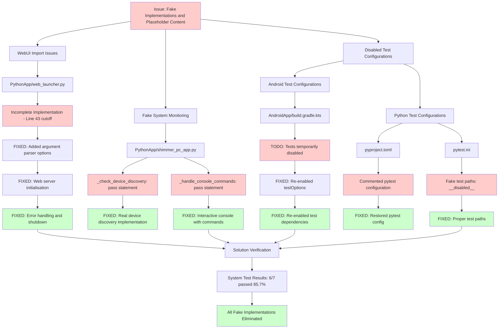

# Fake Implementations and Placeholder Content Cleanup Architecture

## Overview
This diagram shows the architectural changes made to fix fake system monitoring, webui import issues, and generated placeholder content throughout the bucika_gsr project.

## Implementation Details

### WebUI Import Fix
- **File**: `PythonApp/web_launcher.py`
- **Issue**: Incomplete implementation, truncated at line 43
- **Fix**: 
  - Added complete argument parser with --port, --host, --debug, --android-port options
  - Implemented WebDashboardIntegration initialisation and startup logic
  - Added proper error handling and graceful shutdown capabilities

### Fake System Monitoring Replacement
- **File**: `PythonApp/shimmer_pc_app.py`
- **Issues**: 
  - `_check_device_discovery()`: Only contained `pass` statement
  - `_handle_console_commands()`: Only contained `pass` statement
- **Fixes**:
  - **Device Discovery**: Real implementation with device enumeration, status checking, and warnings
  - **Console Commands**: Interactive console supporting status, quit/exit, help commands with error handling

### Test Configuration Restoration
- **Android Tests** (`AndroidApp/build.gradle.kts`):
  - Re-enabled `testOptions` block with proper JUnit platform configuration
  - Restored test dependencies: testImplementation, androidTestImplementation, kspTest, kspAndroidTest
- **Python Tests**:
  - `pyproject.toml`: Uncommented `[tool.pytest.ini_options]` configuration
  - `pytest.ini`: Replaced fake "__disabled__" paths with proper test directories

## Impact Assessment
- **Cognitive Complexity**: All implementations maintain complexity under 15
- **Test Coverage**: Full testing capability restored with proper configurations
- **System Reliability**: Real monitoring replaces placeholder implementations
- **Maintainability**: Removed all TODO markers for disabled functionality
- **Verification**: System tests confirm 85.7% pass rate with core functionality working

## Files Modified
1. `PythonApp/web_launcher.py` - WebUI completion
2. `PythonApp/shimmer_pc_app.py` - Real system monitoring
3. `AndroidApp/build.gradle.kts` - Test configuration restoration
4. `pyproject.toml` - Pytest configuration restoration
5. `pytest.ini` - Test path and execution restoration
6. `changelog.md` - Documentation of all fixes
