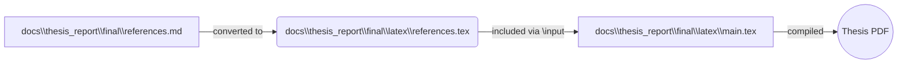

# References Integration Diagram

%% This diagram illustrates how the Markdown references were converted and integrated into the LaTeX build.
%% No runtime architecture changes.

```mermaid
flowchart LR
    A[docs\\thesis_report\\final\\references.md] -- converted to --> B(docs\\thesis_report\\final\\latex\\references.tex)
    B -- included via \input --> C[docs\\thesis_report\\final\\latex\\main.tex]
    C -- compiled --> D((Thesis PDF))
```
