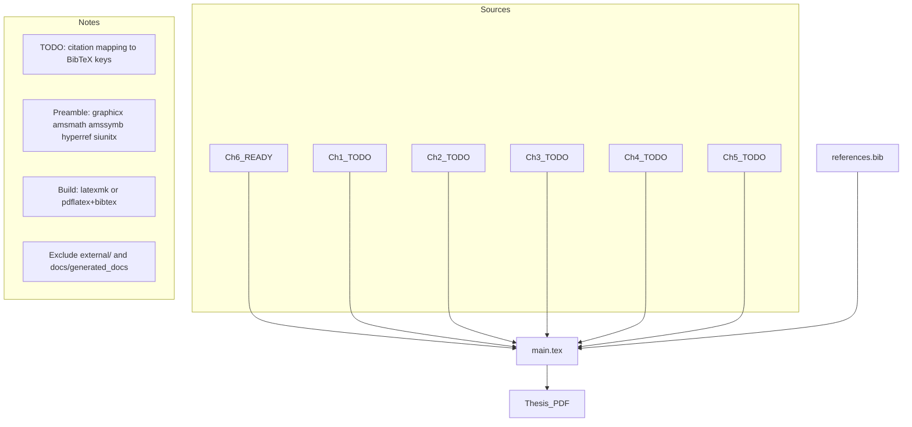

# Mermaid Diagram: Thesis LaTeX Build Architecture

```mermaid
flowchart TD
  subgraph Sources
    CH1[Ch1_TODO]
    CH2[Ch2_TODO]
    CH3[Ch3_TODO]
    CH4[Ch4_TODO]
    CH5[Ch5_TODO]
    CH6[Ch6_READY]
  end

  MAIN[main.tex]
  BIB[references.bib]
  PDF[Thesis_PDF]

  CH6 --> MAIN
  CH1 --> MAIN
  CH2 --> MAIN
  CH3 --> MAIN
  CH4 --> MAIN
  CH5 --> MAIN
  BIB --> MAIN
  MAIN --> PDF

  subgraph Notes
    N1[TODO: citation mapping to BibTeX keys]
    N2[Preamble: graphicx amsmath amssymb hyperref siunitx]
    N3[Build: latexmk or pdflatex+bibtex]
    N4[Exclude external/ and docs/generated_docs]
  end
```
