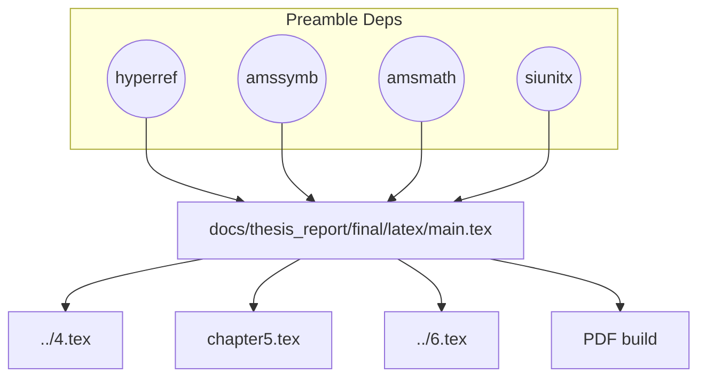

# Thesis Main LaTeX Includes

```mermaid
flowchart TD
    M[docs/thesis_report/final/latex/main.tex] --> C4[../4.tex]
    M --> C5[chapter5.tex]
    M --> C6[../6.tex]

    subgraph Preamble Deps
        P1((hyperref))
        P2((amssymb))
        P3((amsmath))
        P4((siunitx))
    end

    P1 --> M
    P2 --> M
    P3 --> M
    P4 --> M

    M --> B[PDF build]

    classDef warn fill:#fff7e6,stroke:#cc8400,stroke-width:1px;
```
