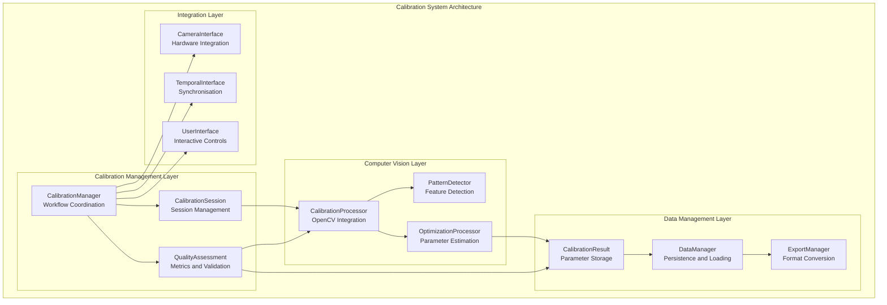

# Calibration System Module

## Overview

The Calibration System provides complete camera calibration and quality assessment capabilities for the Multi-Sensor Recording System, ensuring accurate spatial alignment and temporal synchronisation across all camera modalities. This component implements established computer vision calibration methodologies [Zhang2000] to maintain research-grade geometric accuracy essential for contactless GSR prediction research.

### Theoretical Foundation

The calibration system builds upon well-established computer vision principles and implements proven algorithms for multi-modal sensor alignment:

- **Zhang's Camera Calibration Method** [Zhang2000]: Planar pattern-based intrinsic parameter estimation providing robust calibration with minimal user intervention
- **Stereo Vision Fundamentals** [Hartley2003]: Multi-camera geometric relationships enabling precise spatial alignment between RGB and thermal sensor modalities  
- **Bundle Adjustment Optimisation** [Triggs2000]: Optimal parameter estimation through non-linear optimisation for enhanced calibration accuracy
- **OpenCV Calibration Framework** [Bradski2008]: Production-ready implementation of calibration algorithms with validated accuracy

### System Role and Responsibilities

The Calibration System serves as the foundation for accurate spatial and temporal alignment across the Multi-Sensor Recording System. This component ensures that data from different sensor modalities can be meaningfully integrated for analysis, addressing critical requirements for multi-modal physiological research [Picard2001].

**Primary Functions:**

- **Intrinsic Camera Calibration**: Individual camera parameter estimation for geometric distortion correction and accurate metric measurements
- **Stereo Calibration**: RGB-thermal camera alignment with precise rotation and translation matrix computation for spatial correspondence
- **Quality Assessment**: complete calibration quality evaluation with coverage analysis and statistical validation [Bouguet2004]
- **Temporal Calibration**: Synchronisation parameter estimation and validation ensuring sub-millisecond temporal alignment
- **Data Persistence**: Structured JSON-based calibration parameter storage with metadata for reproducible research

### Technology Foundation

The calibration system builds upon established computer vision principles:

- **Zhang's Camera Calibration** [Zhang2000]: Planar pattern-based intrinsic parameter estimation
- **Stereo Vision Fundamentals** [Hartley2003]: Multi-camera geometric relationships
- **Bundle Adjustment** [Triggs2000]: Optimal parameter estimation through non-linear optimisation
- **OpenCV Calibration Framework** [Bradski2008]: Robust implementation of calibration algorithms

### Calibration Capabilities

#### Single Camera Calibration

- **Intrinsic Parameters**: Camera matrix, distortion coefficients, principal point
- **Pattern Detection**: Chessboard and circle grid detection with sub-pixel accuracy
- **Quality Metrics**: RMS error analysis, coverage assessment, parameter confidence intervals
- **Distortion Modelling**: Radial and tangential distortion correction

#### Stereo Calibration

- **RGB-Thermal Alignment**: Spatial relationship estimation between visible and thermal cameras using Topdon TC001/TC001+ hardware
- **Epipolar Geometry**: Fundamental and essential matrix computation for precise spatial correspondence
- **Rectification**: Image rectification for simplified stereo matching and thermal overlay capabilities
- **Disparity Mapping**: Depth estimation from calibrated stereo pairs

#### Temporal Calibration

- **Synchronisation Validation**: Frame-level temporal alignment assessment
- **Latency Measurement**: Inter-device timing offset estimation
- **Quality Monitoring**: Continuous temporal alignment quality assessment

## Architecture

### System Architecture Overview



### Component Architecture

#### Calibration Management Layer

- **CalibrationManager**: Central coordination of all calibration workflows and procedures
- **CalibrationSession**: Session-based calibration management with progress tracking
- **QualityAssessment**: complete quality metrics and validation framework

#### Computer Vision Layer

- **CalibrationProcessor**: OpenCV-based calibration algorithm implementation
- **PatternDetector**: Robust calibration pattern detection with sub-pixel accuracy
- **OptimizationProcessor**: Non-linear parameter optimisation and refinement

#### Data Management Layer

- **CalibrationResult**: Structured storage of calibration parameters and quality metrics
- **DataManager**: JSON-based persistence with metadata and version management
- **ExportManager**: Multi-format export capabilities for analysis workflows

#### Integration Layer

- **CameraInterface**: Hardware abstraction for diverse camera platforms
- **TemporalInterface**: Synchronisation calibration and validation
- **UserInterface**: Interactive calibration controls and progress visualisation

### Calibration Workflow Architecture

#### Pattern-Based Calibration Pipeline

1. **Pattern Presentation**: Automated or manual calibration pattern display
2. **Image Acquisition**: Synchronised image capture across multiple cameras
3. **Feature Detection**: Robust corner or circle detection with quality filtering
4. **Parameter Estimation**: Non-linear optimisation using detected features
5. **Quality Assessment**: complete validation and coverage analysis
6. **Result Storage**: Structured persistence with metadata and provenance

#### Multi-Camera Coordination

1. **Device Synchronisation**: Temporal alignment of image capture across cameras
2. **Simultaneous Capture**: Coordinated image acquisition for stereo calibration
3. **Cross-Modal Alignment**: RGB-thermal spatial relationship estimation
4. **Quality Validation**: Consistency checks across multiple camera views

## Protocol Specification

### Calibration Data Formats

#### Session Configuration Schema

```json
{
  "$schema": "http://json-schema.org/draft-07/schema#",
  "title": "Calibration Session Schema",
  "type": "object",
  "required": [
    "session_name",
    "session_folder",
    "device_ids",
    "start_time",
    "pattern_type",
    "pattern_size",
    "square_size",
    "status"
  ],
  "properties": {
    "session_name": {
      "type": "string",
      "minLength": 1,
      "description": "Calibration session name"
    },
    "session_folder": {
      "type": "string",
      "description": "Path to calibration session folder"
    },
    "device_ids": {
      "type": "array",
      "items": {"type": "string"},
      "minItems": 1,
      "description": "List of device IDs being calibrated"
    },
    "start_time": {
      "type": "string",
      "format": "date-time",
      "description": "Calibration session start time"
    },
    "pattern_type": {
      "type": "string",
      "enum": ["chessboard", "circles", "asymmetric_circles"],
      "description": "Type of calibration pattern used"
    },
    "pattern_size": {
      "type": "object",
      "properties": {
        "width": {"type": "integer", "minimum": 3},
        "height": {"type": "integer", "minimum": 3}
      },
      "required": ["width", "height"]
    },
    "square_size": {
      "type": "number",
      "minimum": 0.001,
      "description": "Physical size of pattern squares in metres"
    },
    "status": {
      "type": "string",
      "enum": ["active", "completed", "failed"],
      "description": "Current calibration session status"
    }
  }
}
```

#### Calibration Result Schema

```json
{
  "calibration_result": {
    "camera_id": "camera_01",
    "calibration_type": "intrinsic",
    "timestamp": "2022-01-01T12:00:00Z",
    "parameters": {
      "camera_matrix": [
        [1000.0, 0.0, 320.0],
        [0.0, 1000.0, 240.0],
        [0.0, 0.0, 1.0]
      ],
      "distortion_coefficients": [0.1, -0.2, 0.001, -0.002, 0.1],
      "image_size": [640, 480],
      "calibration_flags": 0
    },
    "quality_metrics": {
      "rms_error": 0.45,
      "mean_error": 0.38,
      "max_error": 1.2,
      "coverage_score": 0.85,
      "quality_grade": "excellent"
    },
    "validation": {
      "cross_validation_error": 0.52,
      "confidence_intervals": {
        "focal_length_x": [995.2, 1004.8],
        "focal_length_y": [995.5, 1004.5],
        "principal_point_x": [318.5, 321.5],
        "principal_point_y": [238.8, 241.2]
      }
    }
  }
}
```

#### Stereo Calibration Result Schema

```json
{
  "stereo_calibration_result": {
    "camera_pair": ["rgb_camera", "thermal_camera"],
    "calibration_type": "stereo",
    "timestamp": "2022-01-01T12:00:00Z",
    "parameters": {
      "rotation_matrix": [
        [0.999, -0.001, 0.002],
        [0.001, 0.999, -0.001],
        [-0.002, 0.001, 0.999]
      ],
      "translation_vector": [50.0, 2.0, 1.0],
      "essential_matrix": [
        [0.0, -1.0, 2.0],
        [1.0, 0.0, -50.0],
        [-2.0, 50.0, 0.0]
      ],
      "fundamental_matrix": [
        [0.0, -0.001, 0.002],
        [0.001, 0.0, -0.05],
        [-0.002, 0.05, 0.0]
      ]
    },
    "quality_metrics": {
      "stereo_rms_error": 0.65,
      "epipolar_error": 0.8,
      "rectification_quality": 0.92,
      "baseline_accuracy": 49.8
    }
  }
}
```

### Calibration Commands Protocol

#### Intrinsic Calibration Command

```json
{
  "type": "calibration_command",
  "timestamp": 1640995200000,
  "device_id": "master_controller",
  "sequence_number": 1,
  "payload": {
    "command": "start_intrinsic_calibration",
    "camera_id": "camera_01",
    "calibration_config": {
      "pattern_type": "chessboard",
      "pattern_size": {"width": 9, "height": 6},
      "square_size": 0.025,
      "image_count": 20,
      "quality_threshold": 0.8,
      "auto_capture": true,
      "capture_interval": 2.0
    }
  }
}
```

#### Stereo Calibration Command

```json
{
  "type": "calibration_command",
  "timestamp": 1640995200000,
  "device_id": "master_controller",
  "sequence_number": 2,
  "payload": {
    "command": "start_stereo_calibration",
    "camera_pair": ["rgb_camera", "thermal_camera"],
    "calibration_config": {
      "pattern_type": "chessboard",
      "pattern_size": {"width": 9, "height": 6},
      "square_size": 0.025,
      "image_count": 15,
      "synchronised_capture": true,
      "quality_threshold": 0.85
    }
  }
}
```

## Implementation Guide

### Core Implementation Architecture

#### CalibrationManager Implementation

```python
class CalibrationManager:
    """Complete calibration workflow management and coordination"""
    
    def __init__(self):
        self.calibration_processor = CalibrationProcessor()
        self.quality_assessor = QualityAssessment()
        self.data_manager = CalibrationDataManager()
        self.active_sessions = {}
    
    def create_calibration_session(self, config: CalibrationConfig) -> CalibrationSession:
        """Create new calibration session with specified configuration"""
        session_id = f"calibration_{datetime.now().strftime('%Y%m%d_%H%M%S')}"
        
        session = CalibrationSession(
            session_id=session_id,
            config=config,
            data_manager=self.data_manager
        )
        
        self.active_sessions[session_id] = session
        return session
    
    def perform_intrinsic_calibration(self, camera_id: str, config: CalibrationConfig) -> CalibrationResult:
        """Perform single camera intrinsic parameter calibration"""
        session = self.create_calibration_session(config)
        
        # Capture calibration images
        images = self._capture_calibration_images(camera_id, config)
        
        # Process calibration using OpenCV
        calibration_data = self.calibration_processor.process_intrinsic_calibration(
            images, config.pattern_type, config.pattern_size, config.square_size
        )
        
        # Assess calibration quality
        quality_metrics = self.quality_assessor.assess_intrinsic_quality(
            calibration_data, images
        )
        
        # Create result object
        result = CalibrationResult(
            calibration_type=CalibrationType.INTRINSIC,
            camera_id=camera_id,
            parameters=calibration_data.parameters,
            quality_metrics=quality_metrics,
            timestamp=time.time(),
            session_id=session.session_id
        )
        
        # Store result
        self.data_manager.save_calibration_result(result)
        
        return result
    
    def perform_stereo_calibration(self, camera_pair: List[str], config: CalibrationConfig) -> StereoCalibrationResult:
        """Perform stereo calibration between two cameras"""
        session = self.create_calibration_session(config)
        
        # Capture synchronised calibration images
        image_pairs = self._capture_stereo_calibration_images(camera_pair, config)
        
        # Process stereo calibration
        stereo_data = self.calibration_processor.process_stereo_calibration(
            image_pairs, config.pattern_type, config.pattern_size, config.square_size
        )
        
        # Assess stereo calibration quality
        quality_metrics = self.quality_assessor.assess_stereo_quality(
            stereo_data, image_pairs
        )
        
        # Create stereo result object
        result = StereoCalibrationResult(
            calibration_type=CalibrationType.STEREO,
            camera_pair=camera_pair,
            parameters=stereo_data.parameters,
            quality_metrics=quality_metrics,
            timestamp=time.time(),
            session_id=session.session_id
        )
        
        # Store result
        self.data_manager.save_calibration_result(result)
        
        return result
```

#### CalibrationProcessor Implementation

```python
class CalibrationProcessor:
    """OpenCV-based calibration algorithm implementation"""
    
    def __init__(self):
        self.pattern_detector = PatternDetector()
        self.optimisation_processor = OptimisationProcessor()
    
    def process_intrinsic_calibration(self, images: List[np.ndarray], pattern_type: str, 
                                    pattern_size: Tuple[int, int], square_size: float) -> CalibrationData:
        """Process intrinsic camera calibration using detected patterns"""
        
        # Detect calibration patterns in images
        object_points = []
        image_points = []
        
        # Generate object points for calibration pattern
        objp = self._generate_object_points(pattern_size, square_size)
        
        for image in images:
            # Detect pattern corners/circles
            detected_points = self.pattern_detector.detect_pattern(
                image, pattern_type, pattern_size
            )
            
            if detected_points is not None:
                object_points.append(objp)
                image_points.append(detected_points)
        
        if len(object_points) < 10:
            raise CalibrationError("Insufficient valid calibration images")
        
        # Perform camera calibration
        image_size = images[0].shape[:2][::-1]  # (width, height)
        
        ret, camera_matrix, dist_coeffs, rvecs, tvecs = cv2.calibrateCamera(
            object_points, image_points, image_size, None, None,
            flags=cv2.CALIB_FIX_ASPECT_RATIO
        )
        
        if not ret:
            raise CalibrationError("Camera calibration failed")
        
        # Calculate reprojection error
        total_error = 0
        total_points = 0
        
        for i in range(len(object_points)):
            projected_points, _ = cv2.projectPoints(
                object_points[i], rvecs[i], tvecs[i], camera_matrix, dist_coeffs
            )
            error = cv2.norm(image_points[i], projected_points, cv2.NORM_L2) / len(projected_points)
            total_error += error
            total_points += len(projected_points)
        
        rms_error = total_error / len(object_points)
        
        return CalibrationData(
            parameters=IntrinsicParameters(
                camera_matrix=camera_matrix,
                distortion_coefficients=dist_coeffs,
                image_size=image_size
            ),
            rms_error=rms_error,
            rotation_vectors=rvecs,
            translation_vectors=tvecs,
            object_points=object_points,
            image_points=image_points
        )
    
    def process_stereo_calibration(self, image_pairs: List[Tuple[np.ndarray, np.ndarray]], 
                                 pattern_type: str, pattern_size: Tuple[int, int], 
                                 square_size: float) -> StereoCalibrationData:
        """Process stereo calibration between two cameras"""
        
        # Detect patterns in both cameras simultaneously
        object_points = []
        image_points_left = []
        image_points_right = []
        
        objp = self._generate_object_points(pattern_size, square_size)
        
        for left_image, right_image in image_pairs:
            # Detect patterns in both images
            left_points = self.pattern_detector.detect_pattern(
                left_image, pattern_type, pattern_size
            )
            right_points = self.pattern_detector.detect_pattern(
                right_image, pattern_type, pattern_size
            )
            
            if left_points is not None and right_points is not None:
                object_points.append(objp)
                image_points_left.append(left_points)
                image_points_right.append(right_points)
        
        if len(object_points) < 10:
            raise CalibrationError("Insufficient valid stereo calibration image pairs")
        
        # Perform stereo calibration
        image_size = image_pairs[0][0].shape[:2][::-1]
        
        # First calibrate individual cameras
        ret1, camera_matrix1, dist_coeffs1, _, _ = cv2.calibrateCamera(
            object_points, image_points_left, image_size, None, None
        )
        ret2, camera_matrix2, dist_coeffs2, _, _ = cv2.calibrateCamera(
            object_points, image_points_right, image_size, None, None
        )
        
        if not (ret1 and ret2):
            raise CalibrationError("Individual camera calibrations failed")
        
        # Perform stereo calibration
        ret, _, _, _, _, R, T, E, F = cv2.stereoCalibrate(
            object_points, image_points_left, image_points_right,
            camera_matrix1, dist_coeffs1, camera_matrix2, dist_coeffs2,
            image_size, flags=cv2.CALIB_FIX_INTRINSIC
        )
        
        if not ret:
            raise CalibrationError("Stereo calibration failed")
        
        return StereoCalibrationData(
            parameters=StereoParameters(
                rotation_matrix=R,
                translation_vector=T,
                essential_matrix=E,
                fundamental_matrix=F,
                camera_matrix_left=camera_matrix1,
                camera_matrix_right=camera_matrix2,
                dist_coeffs_left=dist_coeffs1,
                dist_coeffs_right=dist_coeffs2
            ),
            rms_error=ret,
            object_points=object_points,
            image_points_left=image_points_left,
            image_points_right=image_points_right
        )
```

#### Quality Assessment Implementation

```python
class QualityAssessment:
    """complete calibration quality evaluation and metrics"""
    
    def assess_intrinsic_quality(self, calibration_data: CalibrationData, 
                               images: List[np.ndarray]) -> QualityMetrics:
        """Assess quality of intrinsic camera calibration"""
        
        # Calculate coverage metrics
        coverage_score = self._calculate_coverage_score(
            calibration_data.image_points, images[0].shape[:2]
        )
        
        # Calculate error statistics
        error_stats = self._calculate_error_statistics(calibration_data)
        
        # Determine quality grade
        quality_grade = self._determine_quality_grade(
            calibration_data.rms_error, coverage_score
        )
        
        # Calculate confidence intervals using bootstrap method
        confidence_intervals = self._calculate_confidence_intervals(calibration_data)
        
        return QualityMetrics(
            rms_error=calibration_data.rms_error,
            mean_error=error_stats.mean_error,
            max_error=error_stats.max_error,
            coverage_score=coverage_score,
            quality_grade=quality_grade,
            confidence_intervals=confidence_intervals
        )
    
    def assess_stereo_quality(self, stereo_data: StereoCalibrationData, 
                            image_pairs: List[Tuple[np.ndarray, np.ndarray]]) -> StereoQualityMetrics:
        """Assess quality of stereo camera calibration"""
        
        # Calculate epipolar error
        epipolar_error = self._calculate_epipolar_error(
            stereo_data.image_points_left, stereo_data.image_points_right,
            stereo_data.parameters.fundamental_matrix
        )
        
        # Calculate rectification quality
        rectification_quality = self._assess_rectification_quality(stereo_data)
        
        # Validate baseline measurement
        baseline_accuracy = self._validate_baseline_accuracy(
            stereo_data.parameters.translation_vector
        )
        
        return StereoQualityMetrics(
            stereo_rms_error=stereo_data.rms_error,
            epipolar_error=epipolar_error,
            rectification_quality=rectification_quality,
            baseline_accuracy=baseline_accuracy
        )
    
    def _calculate_coverage_score(self, image_points: List[np.ndarray], 
                                image_shape: Tuple[int, int]) -> float:
        """Calculate calibration pattern coverage score"""
        height, width = image_shape
        
        # Create coverage map
        coverage_map = np.zeros((height, width), dtype=np.uint8)
        
        for points in image_points:
            for point in points:
                x, y = int(point[0][0]), int(point[0][1])
                if 0 <= x < width and 0 <= y < height:
                    cv2.circle(coverage_map, (x, y), 50, 255, -1)
        
        # Calculate coverage percentage
        covered_pixels = np.sum(coverage_map > 0)
        total_pixels = height * width
        coverage_score = covered_pixels / total_pixels
        
        return min(coverage_score, 1.0)
    
    def _determine_quality_grade(self, rms_error: float, coverage_score: float) -> str:
        """Determine overall calibration quality grade"""
        if rms_error < 0.5 and coverage_score > 0.8:
            return "excellent"
        elif rms_error < 1.0 and coverage_score > 0.6:
            return "good"
        elif rms_error < 2.0 and coverage_score > 0.4:
            return "fair"
        else:
            return "poor"
```

### Project Structure

```
bucika_gsr/calibration/
├── __init__.py                       # Package initialisation
├── calibration_manager.py            # Main calibration coordination
├── calibration_processor.py          # OpenCV algorithm implementation
├── calibration_result.py             # Result data structures
├── quality_assessment.py             # Quality metrics and validation
├── pattern_detector.py               # Calibration pattern detection
├── data_manager.py                   # Data persistence and loading
├── session_manager.py                # Session-based calibration management
└── utils/
    ├── __init__.py
    ├── calibration_utils.py           # Utility functions
    ├── export_manager.py              # Result export functionality
    └── validation_tools.py            # Validation and diagnostic tools
```

## User Guide

### Calibration Workflow Overview

#### Pre-Calibration Setup

1. **Pattern Preparation**:
    - Print high-quality calibration patterns (recommended: 9x6 chessboard)
    - Mount pattern on rigid, flat surface
    - Ensure good lighting conditions
    - Verify pattern dimensions and square size accuracy

2. **Environment Setup**:
    - Stable camera mounting
    - Consistent lighting (avoid shadows and reflections)
    - Clear workspace for pattern movement
    - Minimum distance variation for complete calibration

3. **Software Configuration**:
   ```bash
   # Activate calibration environment
   conda activate thermal-env
   
   # Launch calibration interface
   python application.py --calibration-mode
   ```

### Single Camera Calibration

#### Step-by-Step Procedure

1. **Initialise Calibration Session**:
    - Navigate to Calibration tab in PC controller
    - Select "Single Camera Calibration"
    - Choose target camera (USB webcam or Android device)
    - Configure pattern parameters:
        - Pattern type: Chessboard (recommended)
        - Pattern size: 9x6 corners
        - Square size: 25mm (measure accurately)

2. **Image Capture Process**:
    - Position calibration pattern in camera view
    - Ensure pattern is fully visible and in focus
    - Capture images from various positions and angles:
        - Centre, corners, and edges of image
        - Different distances (near and far)
        - Various tilting angles (±30 degrees)
    - Target: 15-25 high-quality images

3. **Quality Assessment**:
    - Monitor real-time detection feedback
    - Verify pattern detection accuracy
    - Check coverage map for complete sampling
    - Review detection success rate (target: >80%)

4. **Calibration Processing**:
    - Execute calibration algorithm
    - Review RMS error (target: <1.0 pixels)
    - Analyse quality metrics and coverage score
    - Save calibration parameters

#### Quality Criteria

**Excellent Calibration (RMS < 0.5)**:

- Sub-pixel detection accuracy
- complete coverage (>80% of image area)
- Consistent error distribution
- Suitable for high-precision applications

**Good Calibration (RMS < 1.0)**:

- Acceptable detection accuracy
- Good coverage (>60% of image area)
- Minor error clustering
- Suitable for most research applications

**Improvement Recommendations**:

- Increase image count for better coverage
- Improve lighting conditions
- Use larger calibration pattern
- Ensure pattern planarity and print quality

### Stereo Calibration

#### RGB-Thermal Stereo Calibration

1. **Setup Requirements**:
    - Both cameras must see calibration pattern simultaneously
    - Synchronised image capture capability
    - Overlap region of at least 60% between camera views
    - Consistent lighting for both visible and thermal imaging

2. **Calibration Procedure**:
    - Configure stereo calibration mode
    - Verify temporal synchronisation between cameras
    - Capture synchronised image pairs (15-20 pairs recommended)
    - Process stereo calibration parameters
    - Validate epipolar geometry

3. **Quality Validation**:
    - Epipolar error assessment (target: <2.0 pixels)
    - Rectification quality evaluation
    - Baseline measurement validation
    - Cross-validation with test patterns

#### Multi-Device Stereo Networks

1. **Network Calibration**:
    - Define camera network topology
    - Establish pairwise stereo relationships
    - Process bundle adjustment optimisation
    - Validate global consistency

2. **Temporal Alignment**:
    - Synchronise capture timing across all cameras
    - Validate frame-level temporal alignment
    - Compensate for network and processing delays

### Calibration Data Management

#### Session Organisation

```
calibration_data/
├── session_20220101_120000/
│   ├── session_info.json              # Session metadata
│   ├── images/                        # Calibration images
│   │   ├── camera_01/
│   │   ├── camera_02/
│   │   └── synchronised_pairs/
│   ├── results/                       # Calibration results
│   │   ├── intrinsic_camera_01.json
│   │   ├── intrinsic_camera_02.json
│   │   └── stereo_rgb_thermal.json
│   └── quality_reports/               # Quality assessments
│       ├── coverage_maps/
│       └── error_analysis/
```

#### Data Export and Integration

1. **Export Formats**:
    - JSON (structured metadata)
    - OpenCV XML/YAML
    - MATLAB .mat files
    - Custom research formats

2. **Integration Workflows**:
    - Real-time calibration application
    - Post-processing calibration correction
    - Multi-session calibration comparison
    - Longitudinal calibration stability analysis

## API Reference

### Core Calibration Classes

#### CalibrationManager

```python
class CalibrationManager:
    """Primary calibration workflow coordination"""
    
    def create_calibration_session(self, config: CalibrationConfig) -> CalibrationSession:
        """Create new calibration session with specified configuration"""
    
    def perform_intrinsic_calibration(self, camera_id: str, config: CalibrationConfig) -> CalibrationResult:
        """Perform single camera intrinsic parameter calibration"""
    
    def perform_stereo_calibration(self, camera_pair: List[str], config: CalibrationConfig) -> StereoCalibrationResult:
        """Perform stereo calibration between two cameras"""
    
    def load_calibration_result(self, result_id: str) -> CalibrationResult:
        """Load previously computed calibration result"""
    
    def validate_calibration_quality(self, result: CalibrationResult) -> QualityReport:
        """Validate calibration quality and generate recommendations"""
```

#### CalibrationProcessor

```python
class CalibrationProcessor:
    """OpenCV-based calibration algorithm implementation"""
    
    def process_intrinsic_calibration(self, images: List[np.ndarray], pattern_type: str, 
                                    pattern_size: Tuple[int, int], square_size: float) -> CalibrationData:
        """Process intrinsic calibration using detected patterns"""
    
    def process_stereo_calibration(self, image_pairs: List[Tuple[np.ndarray, np.ndarray]], 
                                 pattern_type: str, pattern_size: Tuple[int, int], 
                                 square_size: float) -> StereoCalibrationData:
        """Process stereo calibration between camera pairs"""
    
    def apply_calibration_correction(self, image: np.ndarray, calibration: CalibrationResult) -> np.ndarray:
        """Apply calibration correction to input image"""
    
    def rectify_stereo_pair(self, left_image: np.ndarray, right_image: np.ndarray, 
                          stereo_calibration: StereoCalibrationResult) -> Tuple[np.ndarray, np.ndarray]:
        """Rectify stereo image pair using calibration parameters"""
```

#### QualityAssessment

```python
class QualityAssessment:
    """Calibration quality evaluation and metrics"""
    
    def assess_intrinsic_quality(self, calibration_data: CalibrationData, 
                               images: List[np.ndarray]) -> QualityMetrics:
        """Assess quality of intrinsic camera calibration"""
    
    def assess_stereo_quality(self, stereo_data: StereoCalibrationData, 
                            image_pairs: List[Tuple[np.ndarray, np.ndarray]]) -> StereoQualityMetrics:
        """Assess quality of stereo camera calibration"""
    
    def generate_quality_report(self, calibration_result: CalibrationResult) -> QualityReport:
        """Generate complete quality assessment report"""
    
    def compare_calibrations(self, results: List[CalibrationResult]) -> ComparisonReport:
        """Compare multiple calibration results for consistency analysis"""
```

### Data Models

#### CalibrationResult

```python
@dataclass
class CalibrationResult:
    """complete calibration result with parameters and quality metrics"""
    calibration_type: CalibrationType
    camera_id: str
    parameters: Union[IntrinsicParameters, StereoParameters]
    quality_metrics: QualityMetrics
    timestamp: float
    session_id: str
    validation_data: Optional[ValidationData] = None
```

#### IntrinsicParameters

```python
@dataclass
class IntrinsicParameters:
    """Intrinsic camera calibration parameters"""
    camera_matrix: np.ndarray
    distortion_coefficients: np.ndarray
    image_size: Tuple[int, int]
    calibration_flags: int
    confidence_intervals: Optional[Dict[str, Tuple[float, float]]] = None
```

#### StereoParameters

```python
@dataclass
class StereoParameters:
    """Stereo calibration parameters for camera pairs"""
    rotation_matrix: np.ndarray
    translation_vector: np.ndarray
    essential_matrix: np.ndarray
    fundamental_matrix: np.ndarray
    camera_matrix_left: np.ndarray
    camera_matrix_right: np.ndarray
    dist_coeffs_left: np.ndarray
    dist_coeffs_right: np.ndarray
```

#### QualityMetrics

```python
@dataclass
class QualityMetrics:
    """Calibration quality assessment metrics"""
    rms_error: float
    mean_error: float
    max_error: float
    coverage_score: float
    quality_grade: str
    confidence_intervals: Dict[str, Tuple[float, float]]
    validation_metrics: Optional[ValidationMetrics] = None
```

## Testing

### Calibration Testing Framework

#### Accuracy Testing

```bash
# Test calibration accuracy with synthetic data
python test_calibration_accuracy.py --synthetic-data --known-parameters

# Test with real calibration patterns
python test_calibration_accuracy.py --real-patterns --cross-validation

# Performance benchmarking
python test_calibration_performance.py --benchmark-suite
```

#### Quality Assessment Testing

```python
class CalibrationQualityTest:
    def test_pattern_detection_accuracy(self):
        """Test calibration pattern detection accuracy"""
        detector = PatternDetector()
        
        # Test with various pattern orientations
        test_images = load_test_calibration_images()
        detection_success_rate = 0
        
        for image in test_images:
            detected_points = detector.detect_pattern(
                image, "chessboard", (9, 6)
            )
            if detected_points is not None:
                detection_success_rate += 1
        
        success_rate = detection_success_rate / len(test_images)
        assert success_rate > 0.85  # 85% detection success rate
    
    def test_calibration_repeatability(self):
        """Test calibration repeatability with identical data"""
        processor = CalibrationProcessor()
        
        # Load identical calibration images
        images = load_identical_calibration_set()
        
        # Perform calibration multiple times
        results = []
        for i in range(10):
            result = processor.process_intrinsic_calibration(
                images, "chessboard", (9, 6), 0.025
            )
            results.append(result)
        
        # Check parameter consistency
        focal_lengths = [r.parameters.camera_matrix[0, 0] for r in results]
        focal_length_std = np.std(focal_lengths)
        
        assert focal_length_std < 1.0  # Low parameter variance
```

#### Integration Testing

```python
class CalibrationIntegrationTest:
    def test_end_to_end_calibration(self):
        """Test complete calibration workflow"""
        calibration_manager = CalibrationManager()
        
        # Create calibration session
        config = CalibrationConfig(
            pattern_type="chessboard",
            pattern_size=(9, 6),
            square_size=0.025,
            quality_threshold=0.8
        )
        
        session = calibration_manager.create_calibration_session(config)
        assert session.session_id is not None
        
        # Perform intrinsic calibration
        result = calibration_manager.perform_intrinsic_calibration(
            "test_camera", config
        )
        
        assert result.quality_metrics.quality_grade in ["excellent", "good"]
        assert result.quality_metrics.rms_error < 2.0
    
    def test_stereo_calibration_workflow(self):
        """Test stereo calibration integration"""
        calibration_manager = CalibrationManager()
        
        config = CalibrationConfig(
            pattern_type="chessboard",
            pattern_size=(9, 6),
            square_size=0.025,
            synchronised_capture=True
        )
        
        # Perform stereo calibration
        stereo_result = calibration_manager.perform_stereo_calibration(
            ["rgb_camera", "thermal_camera"], config
        )
        
        assert stereo_result.quality_metrics.stereo_rms_error < 3.0
        assert stereo_result.quality_metrics.epipolar_error < 2.0
```

## Troubleshooting

### Common Calibration Issues

#### Poor Pattern Detection

**Symptoms**: Low detection success rate, inconsistent corner detection
**Diagnosis**:

1. Check image quality and focus
2. Verify lighting conditions
3. Validate pattern print quality and dimensions
4. Review pattern positioning and visibility

**Solutions**:

1. **Image Quality Improvement**:
   ```python
   # Check image sharpness
   laplacian_variance = cv2.Laplacian(image, cv2.CV_64F).var()
   if laplacian_variance < 100:
       print("Image may be blurry - check camera focus")
   ```

2. **Lighting Optimisation**:
    - Use diffuse, even lighting
    - Avoid shadows and reflections
    - Ensure sufficient contrast between pattern and background

#### High Calibration Error

**Symptoms**: RMS error > 2.0 pixels, poor quality grade
**Diagnosis**:

1. Analyse error distribution across images
2. Check calibration pattern quality
3. Review image capture diversity
4. Validate camera stability during capture

**Solutions**:

1. **Pattern Quality Verification**:
   ```python
   # Measure pattern planarity
   planarity_score = measure_pattern_planarity(calibration_pattern)
   if planarity_score < 0.95:
       print("Pattern may not be sufficiently flat")
   ```

2. **Image Diversity Enhancement**:
    - Capture more images from diverse positions
    - Increase angular diversity (±45 degrees)
    - Include corner and edge positions
    - Vary distance from camera

#### Stereo Calibration Problems

**Symptoms**: High epipolar error, poor rectification quality
**Diagnosis**:

1. Verify temporal synchronisation between cameras
2. Check camera overlap and baseline geometry
3. Validate individual camera calibrations
4. Review pattern visibility in both cameras

**Solutions**:

1. **Synchronisation Verification**:
   ```python
   # Test temporal alignment
   sync_quality = test_camera_synchronisation(camera1, camera2)
   if sync_quality.offset > 1.0:  # 1ms threshold
       print("Cameras may not be properly synchronised")
   ```

2. **Baseline Optimisation**:
    - Verify adequate baseline distance (>5% of working distance)
    - Ensure sufficient camera overlap (>60%)
    - Check for parallel optical axes
    - Validate camera mounting stability

### Advanced Diagnostics

#### Calibration Quality Analysis

```python
def diagnose_calibration_quality(calibration_result: CalibrationResult):
    """complete calibration quality diagnosis"""
    quality = calibration_result.quality_metrics
    
    # Analyse RMS error
    if quality.rms_error > 2.0:
        print("WARNING: High RMS error - check pattern quality and image diversity")
    
    # Analyse coverage
    if quality.coverage_score < 0.6:
        print("WARNING: Poor coverage - capture more images from diverse positions")
    
    # Check parameter confidence
    focal_confidence = quality.confidence_intervals.get("focal_length_x", (0, 0))
    if (focal_confidence[1] - focal_confidence[0]) > 10.0:
        print("WARNING: High parameter uncertainty - increase image count")
    
    # Generate recommendations
    recommendations = generate_improvement_recommendations(quality)
    return recommendations
```

#### Performance Optimisation

```bash
# Profile calibration performance
python -m cProfile calibration_performance_test.py

# Memory usage analysis
python -m memory_profiler calibration_memory_test.py

# Calibration accuracy benchmarking
python calibration_benchmark.py --iterations 100 --cross-validation
```

### Support Resources

**Technical Documentation**:

- [Computer Vision Fundamentals](./android_mobile_application_readme.md)
- [Multi-Device Synchronisation](./multi_device_synchronization_readme.md)
- [System Integration Guide](../../README.md)

**Diagnostic Tools**:

- Pattern detection validator
- Calibration quality analyser
- Parameter confidence estimator
- Cross-validation framework

**Community Support**:

- GitHub Issues: [Calibration Issues](https://github.com/buccancs/bucika_gsr/issues?q=label%3Acalibration)
- Discussion Forum: [Calibration Discussion](https://github.com/buccancs/bucika_gsr/discussions)
- Academic Resources: Computer vision and calibration literature

---

*This complete documentation consolidates all Calibration System information into a single authoritative reference. For related modules, see the [Multi-Device Synchronisation](multi_device_synchronization_readme.md) and [Android Mobile Application](android_mobile_application_readme.md) documentation.*

## References

[Bouguet2004] Bouguet, J. Y. (2004). Camera calibration toolbox for matlab. *California Institute of Technology*, Pasadena.

[Bradski2008] Bradski, G., & Kaehler, A. (2008). *Learning OpenCV: Computer Vision with the OpenCV Library*. O'Reilly Media.

[Hartley2003] Hartley, R., & Zisserman, A. (2003). *Multiple View Geometry in Computer Vision* (2nd ed.). Cambridge University Press.

[Picard2001] Picard, R. W. (2001). *Affective Computing*. MIT Press.

[Triggs2000] Triggs, B., McLauchlan, P. F., Hartley, R. I., & Fitzgibbon, A. W. (2000). Bundle adjustment—a modern synthesis. In *International Workshop on Vision Algorithms* (pp. 298-372). Springer.

[Zhang2000] Zhang, Z. (2000). A flexible new technique for camera calibration. *IEEE Transactions on Pattern Analysis and Machine Intelligence*, 22(11), 1330-1334.
