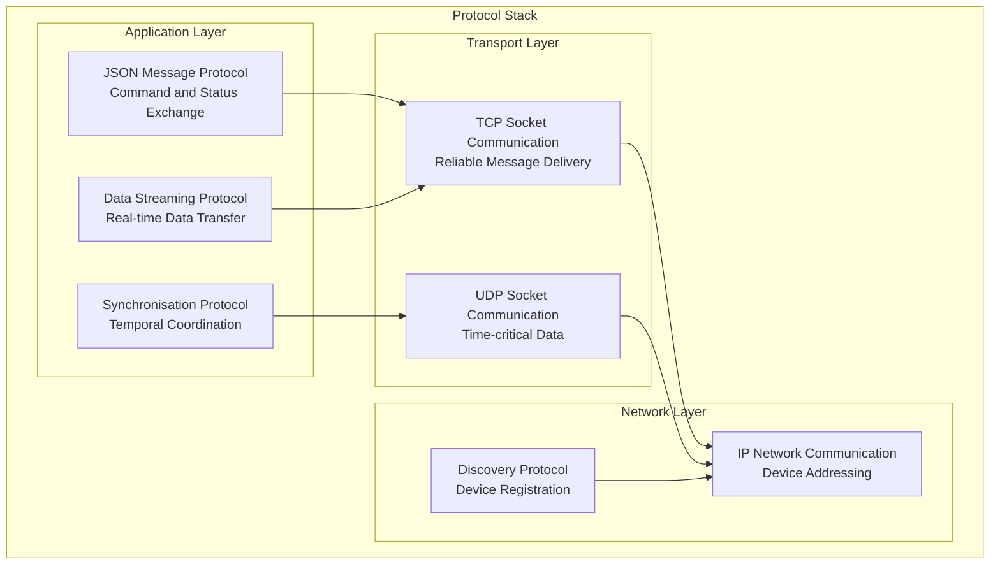
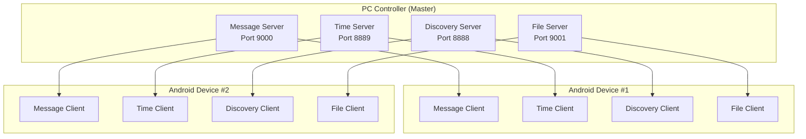

# Networking Protocol Module

## Overview

The Networking Protocol System defines the communication framework that enables coordinated operation across all devices in the Multi-Sensor Recording System for contactless GSR prediction research. This component implements a standardised message exchange protocol providing reliable communication, temporal synchronisation, and data streaming capabilities between PC master controllers and distributed mobile sensor nodes.

### Theoretical Foundation and Design Rationale

The protocol design addresses fundamental challenges in distributed sensor networks [Akyildiz2002], particularly the coordination of heterogeneous devices with varying computational capabilities and network characteristics. The implementation follows established distributed systems principles [Lamport1978] while incorporating specific requirements for research-grade data collection including temporal precision, fault tolerance, and offline operation capability.

### System Role and Responsibilities

The Networking Protocol System provides the communication backbone for the distributed Multi-Sensor Recording System, implementing the JSON socket protocol specification that maintains consistency with the established PC master-controller, offline-first local recording architecture.

**Primary Functions:**

- **Reliable Message Exchange**: JSON-based command and status communication with guaranteed delivery semantics
- **Device Discovery and Registration**: Automatic detection and registration of network devices using standardised protocols
- **Session Coordination**: Distributed session management with temporal synchronisation across heterogeneous sensors
- **Quality Monitoring and Adaptation**: Network performance assessment and adaptive quality control mechanisms
- **Security Framework**: Secure communication protocols with authentication and data integrity validation

### Protocol Stack Overview



## Architecture

### Network Communication Architecture

#### Hierarchical Communication Model



#### Communication Channels

| Channel         | Protocol | Port | Purpose                         | Message Type       |
|-----------------|----------|------|---------------------------------|--------------------|
| Command Channel | TCP      | 9000 | Device control and coordination | JSON Commands      |
| Time Sync       | UDP      | 8889 | Clock synchronisation           | NTP Protocol       |
| Discovery       | UDP      | 8888 | Device registration             | Broadcast Messages |
| File Transfer   | TCP      | 9001 | Data exchange                   | Binary/JSON Data   |
| Status Updates  | TCP      | 9000 | Real-time status reporting      | JSON Status        |

## Protocol Specification

### JSON Message Protocol

#### Standard Message Format

```json
{
  "message_id": "msg_12345",
  "message_type": "command|response|status|data|error",
  "timestamp": 1640995200000,
  "source_device": "pc_controller",
  "target_device": "android_device_01",
  "session_id": "session_20220101_120000",
  "sequence_number": 12345,
  "priority": "high|normal|low",
  "payload": {
    // Message-specific content
  },
  "metadata": {
    "protocol_version": "1.0",
    "encryption": false,
    "compression": false,
    "checksum": "sha256_hash"
  }
}
```

#### Device Registration Protocol

```json
{
  "message_type": "device_registration",
  "timestamp": 1640995200000,
  "source_device": "android_device_01",
  "target_device": "pc_controller",
  "payload": {
    "device_info": {
      "device_id": "android_device_01",
      "device_type": "Samsung_S22",
      "os_version": "Android_13",
      "app_version": "1.0.0",
      "capabilities": [
        "camera_recording",
        "thermal_imaging",
        "shimmer_integration"
      ],
      "network_info": {
        "ip_address": "192.168.1.101",
        "mac_address": "AA:BB:CC:DD:EE:FF",
        "wifi_ssid": "research_network"
      }
    }
  }
}
```

#### Session Control Protocol

```json
{
  "message_type": "session_control",
  "timestamp": 1640995200000,
  "source_device": "pc_controller",
  "target_device": "all_devices",
  "payload": {
    "command": "create_session",
    "session_config": {
      "session_id": "session_20220101_120000",
      "duration": 300,
      "devices": ["android_device_01", "android_device_02"],
      "recording_modes": ["camera", "thermal", "shimmer"],
      "sync_requirements": {
        "precision": "millisecond",
        "quality_threshold": 0.9
      }
    }
  }
}
```

## Implementation Guide

### Network Manager Implementation

```python
class NetworkManager:
    """Central network communication coordinator"""

    def __init__(self, config: NetworkConfig):
        self.config = config
        self.message_server = MessageServer(config.message_port)
        self.time_server = TimeServer(config.time_port)
        self.discovery_server = DiscoveryServer(config.discovery_port)
        self.connected_devices = {}
        self.message_handlers = {}

    def start_services(self) -> bool:
        """Start all network services"""
        try:
            self.message_server.start(self._handle_message)
            self.time_server.start()
            self.discovery_server.start(self._handle_device_discovery)
            logger.info("All network services started successfully")
            return True
        except Exception as e:
            logger.error(f"Failed to start network services: {e}")
            return False

    def register_message_handler(self, message_type: str, handler: Callable):
        """Register handler for specific message type"""
        self.message_handlers[message_type] = handler

    def send_message(self, target_device: str, message: NetworkMessage) -> bool:
        """Send message to specific device"""
        if target_device not in self.connected_devices:
            logger.error(f"Device {target_device} not connected")
            return False

        try:
            device_connection = self.connected_devices[target_device]
            serialized_message = message.serialise()
            device_connection.send(serialized_message)
            return True
        except Exception as e:
            logger.error(f"Failed to send message to {target_device}: {e}")
            return False

    def broadcast_message(self, message: NetworkMessage) -> Dict[str, bool]:
        """Broadcast message to all connected devices"""
        results = {}
        for device_id in self.connected_devices:
            results[device_id] = self.send_message(device_id, message)
        return results
```

### Message Protocol Implementation

```python
class NetworkMessage:
    """Standardised network message with serialisation"""
    
    def __init__(self, message_type: str, source_device: str, 
                 target_device: str, payload: Dict):
        self.message_id = f"msg_{int(time.time() * 1000)}"
        self.message_type = message_type
        self.timestamp = int(time.time() * 1000)
        self.source_device = source_device
        self.target_device = target_device
        self.session_id = None
        self.sequence_number = self._generate_sequence()
        self.priority = "normal"
        self.payload = payload
        self.metadata = {
            "protocol_version": "1.0",
            "encryption": False,
            "compression": False
        }
    
    def serialise(self) -> bytes:
        """Serialise message to JSON bytes"""
        message_dict = {
            "message_id": self.message_id,
            "message_type": self.message_type,
            "timestamp": self.timestamp,
            "source_device": self.source_device,
            "target_device": self.target_device,
            "session_id": self.session_id,
            "sequence_number": self.sequence_number,
            "priority": self.priority,
            "payload": self.payload,
            "metadata": self.metadata
        }
        
        json_string = json.dumps(message_dict, separators=(',', ':'))
        self.metadata["checksum"] = hashlib.sha256(json_string.encode()).hexdigest()
        
        # Update message with checksum
        message_dict["metadata"] = self.metadata
        return json.dumps(message_dict).encode('utf-8')
    
    @classmethod
    def deserialise(cls, data: bytes) -> 'NetworkMessage':
        """Deserialise JSON bytes to message object"""
        try:
            message_dict = json.loads(data.decode('utf-8'))
            
            # Validate checksum
            checksum = message_dict["metadata"].pop("checksum", None)
            if checksum:
                expected_checksum = hashlib.sha256(
                    json.dumps(message_dict, separators=(',', ':')).encode()
                ).hexdigest()
                if checksum != expected_checksum:
                    raise MessageValidationError("Checksum validation failed")
            
            # Create message object
            message = cls(
                message_type=message_dict["message_type"],
                source_device=message_dict["source_device"],
                target_device=message_dict["target_device"],
                payload=message_dict["payload"]
            )
            
            # Set additional fields
            message.message_id = message_dict["message_id"]
            message.timestamp = message_dict["timestamp"]
            message.session_id = message_dict.get("session_id")
            message.sequence_number = message_dict["sequence_number"]
            message.priority = message_dict["priority"]
            message.metadata = message_dict["metadata"]
            
            return message
            
        except Exception as e:
            raise MessageDeserializationError(f"Failed to deserialise message: {e}")
```

### Quality Monitoring Implementation

```python
class NetworkQualityMonitor:
    """Monitor and assess network communication quality"""
    
    def __init__(self):
        self.latency_measurements = {}
        self.packet_loss_rates = {}
        self.throughput_measurements = {}
        self.quality_thresholds = QualityThresholds()
    
    def measure_latency(self, target_device: str) -> float:
        """Measure round-trip latency to target device"""
        start_time = time.time_ns()
        
        # Send ping message
        ping_message = NetworkMessage(
            message_type="ping",
            source_device="pc_controller",
            target_device=target_device,
            payload={"ping_id": start_time}
        )
        
        # Wait for pong response
        response = self._wait_for_response(ping_message, timeout=5.0)
        
        if response:
            end_time = time.time_ns()
            latency = (end_time - start_time) / 1_000_000  # Convert to milliseconds
            self._update_latency_history(target_device, latency)
            return latency
        else:
            return float('inf')  # Timeout
    
    def assess_network_quality(self, device_id: str) -> NetworkQuality:
        """Assess overall network quality for device"""
        latency_history = self.latency_measurements.get(device_id, [])
        packet_loss_rate = self.packet_loss_rates.get(device_id, 0.0)
        throughput = self.throughput_measurements.get(device_id, 0.0)
        
        if not latency_history:
            return NetworkQuality.UNKNOWN
        
        avg_latency = np.mean(latency_history)
        latency_jitter = np.std(latency_history)
        
        # Assess quality based on metrics
        quality_score = self._calculate_quality_score(
            avg_latency, latency_jitter, packet_loss_rate, throughput
        )
        
        if quality_score >= 0.9:
            return NetworkQuality.EXCELLENT
        elif quality_score >= 0.7:
            return NetworkQuality.GOOD
        elif quality_score >= 0.5:
            return NetworkQuality.FAIR
        else:
            return NetworkQuality.POOR
```

## User Guide

### Network Configuration

#### Initial Setup

1. **Network Requirements**:
    - All devices on same WiFi network
    - Network supports multicast/broadcast
    - Firewall configured for required ports
    - Sufficient bandwidth for data streaming

2. **PC Controller Configuration**:
   ```python
   # Configure network settings
   network_config = NetworkConfig(
       message_port=9000,
       time_port=8889,
       discovery_port=8888,
       file_port=9001,
       interface="0.0.0.0"  # Listen on all interfaces
   )
   ```

3. **Android Device Configuration**:
    - Connect to research WiFi network
    - Configure PC controller IP address
    - Test network connectivity
    - Verify port accessibility

#### Device Discovery Process

1. **Automatic Discovery**:
    - PC controller broadcasts discovery messages
    - Android devices respond with device information
    - Automatic device registration and capability detection

2. **Manual Configuration**:
    - Direct IP address entry
    - Manual device registration
    - Custom port configuration

### Network Diagnostics

#### Connection Testing

```bash
# Test network connectivity
python network_diagnostics.py --test-connectivity

# Measure network latency
python network_diagnostics.py --test-latency --target 192.168.1.101

# Assess network quality
python network_diagnostics.py --test-quality --duration 60
```

#### Performance Monitoring

1. **Real-time Monitoring**:
    - Network quality dashboard
    - Latency and throughput graphs
    - Packet loss detection
    - Connection stability tracking

2. **Quality Metrics**:
    - Round-trip latency (target: <10ms)
    - Packet loss rate (target: <0.1%)
    - Throughput (target: >10 Mbps)
    - Connection stability (target: >99% uptime)

## API Reference

### Core Classes

#### NetworkManager

```python
class NetworkManager:
    def start_services(self) -> bool:
        """Start all network services"""
    
    def register_message_handler(self, message_type: str, handler: Callable):
        """Register handler for specific message type"""
    
    def send_message(self, target_device: str, message: NetworkMessage) -> bool:
        """Send message to specific device"""
    
    def broadcast_message(self, message: NetworkMessage) -> Dict[str, bool]:
        """Broadcast message to all connected devices"""
```

#### NetworkMessage

```python
class NetworkMessage:
    def serialise(self) -> bytes:
        """Serialise message to JSON bytes"""
    
    @classmethod
    def deserialise(cls, data: bytes) -> 'NetworkMessage':
        """Deserialise JSON bytes to message object"""
```

#### NetworkQualityMonitor

```python
class NetworkQualityMonitor:
    def measure_latency(self, target_device: str) -> float:
        """Measure round-trip latency to target device"""
    
    def assess_network_quality(self, device_id: str) -> NetworkQuality:
        """Assess overall network quality for device"""
```

## Testing

### Network Protocol Testing

```python
class NetworkProtocolTest:
    def test_message_serialization(self):
        """Test message serialisation/deserialization"""
        original_message = NetworkMessage(
            message_type="test",
            source_device="test_source",
            target_device="test_target",
            payload={"test_data": "test_value"}
        )

        serialized = original_message.serialise()
        deserialized = NetworkMessage.deserialise(serialized)

        assert original_message.message_type == deserialized.message_type
        assert original_message.payload == deserialized.payload

    def test_network_quality_assessment(self):
        """Test network quality monitoring"""
        monitor = NetworkQualityMonitor()

        # Simulate good network conditions
        for _ in range(100):
            monitor._update_latency_history("test_device", 5.0)  # 5ms latency

        quality = monitor.assess_network_quality("test_device")
        assert quality == NetworkQuality.EXCELLENT
```

## Troubleshooting

### Common Network Issues

#### Connection Problems

**Symptoms**: Cannot connect devices, discovery fails
**Solutions**:

1. Check network connectivity
2. Verify firewall settings
3. Test port accessibility
4. Restart network services

#### Performance Issues

**Symptoms**: High latency, packet loss
**Solutions**:

1. Check network congestion
2. Optimise WiFi settings
3. Use wired connections when possible
4. Adjust quality thresholds

---

*For related modules, see [Multi-Device Synchronisation](multi_device_synchronization_readme.md) and [Session Management](session_management_readme.md) documentation.*

## References

[Akyildiz2002] Akyildiz, I. F., Su, W., Sankarasubramaniam, Y., & Cayirci, E. (2002). Wireless sensor networks: a survey. *Computer Networks*, 38(4), 393-422.

[Lamport1978] Lamport, L. (1978). Time, clocks, and the ordering of events in a distributed system. *Communications of the ACM*, 21(7), 558-565.

[Tanenbaum2006] Tanenbaum, A. S., & van Steen, M. (2006). *Distributed Systems: Principles and Paradigms* (2nd ed.). Prentice Hall.
