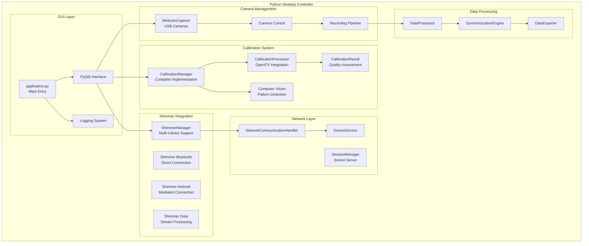

# Python Desktop Controller Module

## Overview

The Python Desktop Controller Application serves as the central command and control hub for the Multi-Sensor Recording System, implementing a distributed master-controller architecture for contactless GSR prediction research. This component orchestrates device coordination, real-time data aggregation, multi-modal monitoring, and post-session analysis across heterogeneous sensor platforms including Android smartphones, USB webcams, thermal cameras, and physiological sensors.

### Research Context and Theoretical Foundation

The controller implementation addresses fundamental challenges in distributed physiological sensing systems [Picard2001], particularly the coordination of heterogeneous sensors for psychophysiological research [Cacioppo2007]. The system architecture follows established principles of distributed systems design [Tanenbaum2006] while maintaining the offline-first recording capability essential for research-grade data collection reliability.

## Table of Contents

- [Overview](#overview)
- [Architecture](#architecture)
- [Protocol Specification](#protocol-specification)
- [Implementation Guide](#implementation-guide)
- [User Guide](#user-guide)
- [API Reference](#api-reference)
- [Testing](#testing)
- [Troubleshooting](#troubleshooting)

## Overview

### System Role and Responsibilities

The Python Desktop Controller encompasses complete orchestration capabilities designed for complex multi-modal research environments. Operating as the master coordinator in the established distributed star-mesh topology, it provides centralised control while maintaining the system's offline-first recording capability.

**Primary Functions:**

- **Multi-Device Coordination**: Managing heterogeneous devices including USB cameras, Android smartphones, thermal sensors, and physiological monitoring equipment through standardised protocols
- **Real-Time System Monitoring**: Advanced monitoring capabilities providing continuous assessment of device status, data quality, synchronisation precision, and system performance metrics
- **Experimental Protocol Management**: Sophisticated session management enabling complex experimental protocols with automated device configuration and temporal coordination
- **Data Integration and Analysis**: complete data collection coordination with post-session analysis capabilities supporting research workflows

**Architectural Decision Rationale**: The centralised control approach balances the need for coordinated multi-device operation with distributed resilience, following established patterns in scientific computing systems [Hey2009].

### Technology Stack

**Core Technologies:**

- **Language**: Python 3.8+ with modern scientific computing libraries
- **GUI Framework**: PyQt5 5.15.7 for cross-platform desktop interface
- **Computer Vision**: OpenCV 4.8.0.74 for camera operations and calibration algorithms
- **Numerical Computing**: NumPy 1.24.3 for high-performance data processing
- **Networking**: WebSockets and TCP sockets for device communication
- **Image Processing**: Pillow for image manipulation and format conversion

### Key Features

- **Multi-Device Coordination**: Simultaneous control of multiple Android smartphones and USB webcams
- **Real-time Monitoring**: Live status monitoring with device health indicators and preview streaming
- **Recording Session Management**: Centralised start/stop control with automatic session metadata generation
- **USB Webcam Integration**: DirectShow/V4L2 camera capture for stationary high-quality video recording
- **Camera Calibration System**: OpenCV-based intrinsic and extrinsic camera parameter estimation
- **Stimulus Presentation**: Integrated experimental stimulus controller for research applications
- **Data Synchronisation**: Temporal alignment of multi-modal data streams with microsecond precision
- **Export and Analysis Tools**: Automated data processing and export for analysis workflows

## Architecture

### System Architecture Overview



### Component Architecture

#### GUI Layer Components

- **application.py**: Main application entry point with PyQt5 initialisation
- **PyQt5 Interface**: Modern tabbed interface organising functionality by research workflow phases
- **Logging System**: complete logging and diagnostic framework

#### Camera Management Components

- **WebcamCapture**: USB camera detection, configuration, and control
- **Camera Control**: Low-level camera operations and parameter management
- **Recording Pipeline**: Video capture and encoding management

#### Calibration System Components

- **CalibrationManager**: Complete calibration workflow coordination
- **CalibrationProcessor**: OpenCV-based calibration algorithms
- **CalibrationResult**: Quality assessment and validation
- **Computer Vision**: Pattern detection and image processing

#### Shimmer Integration Components

- **ShimmerManager**: Multi-library support with fallback mechanisms
- **Shimmer Bluetooth**: Direct pyshimmer device connections
- **Shimmer Android**: Mediated connections through Android devices
- **Shimmer Data**: Stream processing and data management

#### Network Layer Components

- **SessionManager**: Socket server for Android device communication
- **NetworkCommunicationHandler**: Protocol implementation and message handling
- **DeviceService**: Device discovery and status management

#### Data Processing Components

- **DataProcessor**: Multi-modal data processing and validation
- **SynchronizationEngine**: Temporal alignment and coordination
- **DataExporter**: Session export and format conversion

### Navigation Architecture

The Python application features a clean tabbed interface that organises functionality according to research workflow
phases:

#### Tabbed Interface Structure

- **Recording Tab**: Centralised recording controls with real-time preview and session management
- **Devices Tab**: complete device connection management with individual and global coordination
- **Calibration Tab**: Streamlined calibration workflows with progress tracking and quality assessment
- **Files Tab**: Data management functions, export capabilities, and integrated system logging

#### Component-Based Architecture

- **ModernButton**: Standardised button styling with hover effects and semantic colour coding
- **StatusIndicator**: Consistent status communication across device types and operational states
- **ProgressIndicator**: Unified progress visualisation for operations and procedures
- **ConnectionManager**: Device connections with standardised controls and status reporting

## Protocol Specification

### Network Communication Protocol

#### JSON Socket Protocol

The primary communication method between the Python Desktop Controller and Android devices uses JSON messages over TCP
sockets.

**Connection Parameters:**

| Parameter | Value | Description |
|-----------|-------|-------------|
| Protocol | TCP | Reliable connection-oriented protocol |
| Port | 9000 | Default server port (configurable) |
| Message Format | JSON | Human-readable structured data |
| Encoding | UTF-8 | Unicode text encoding |
| Max Message Size | 10MB | Maximum single message size |
| Connection Timeout | 30 seconds | Initial connection timeout |
| Keep-Alive | 60 seconds | Heartbeat interval |

#### Message Structure

All communication messages follow a standardised JSON format:

```json
{
  "type": "command|response|status|data|error",
  "timestamp": 1640995200000,
  "session_id": "session_20220101_120000",
  "device_id": "pc_controller",
  "sequence_number": 12345,
  "payload": {
    // Message-specific data
  }
}
```

**Field Descriptions:**

| Field | Type | Required | Description |
|-------|------|----------|-------------|
| `type` | String | Yes | Message type classification |
| `timestamp` | Long | Yes | Unix timestamp in milliseconds |
| `session_id` | String | No | Current recording session identifier |
| `device_id` | String | Yes | Unique device identifier |
| `sequence_number` | Integer | Yes | Message sequence for ordering |
| `payload` | Object | Yes | Message-specific data content |

### Device Communication Commands

#### Session Control Commands

**Initialise Session:**

```json
{
  "type": "command",
  "timestamp": 1640995200000,
  "device_id": "pc_controller",
  "sequence_number": 1,
  "payload": {
    "command": "initialize_session",
    "session_config": {
      "session_id": "session_20220101_120000",
      "devices": ["android_01", "android_02"],
      "recording_modes": ["camera", "thermal", "shimmer"],
      "synchronisation_precision": "microsecond",
      "duration": 300
    }
  }
}
```

**Start Recording:**

```json
{
  "type": "command",
  "timestamp": 1640995200000,
  "device_id": "pc_controller",
  "sequence_number": 2,
  "payload": {
    "command": "start_recording",
    "session_id": "session_20220101_120000",
    "sync_timestamp": 1640995210000,
    "parameters": {
      "video_resolution": "4K",
      "fps": 30,
      "thermal_fps": 25,
      "shimmer_sampling_rate": 512
    }
  }
}
```

#### Status Monitoring Messages

**Device Status Request:**

```json
{
  "type": "command",
  "timestamp": 1640995200000,
  "device_id": "pc_controller",
  "sequence_number": 3,
  "payload": {
    "command": "get_device_status",
    "requested_metrics": ["battery", "storage", "sensors", "network"]
  }
}
```

**Device Status Response:**

```json
{
  "type": "status",
  "timestamp": 1640995200500,
  "session_id": "session_20220101_120000",
  "device_id": "android_device_01",
  "sequence_number": 1001,
  "payload": {
    "status": "recording",
    "battery_level": 85,
    "storage_available": 2048,
    "network_quality": "excellent",
    "sensors": {
      "camera": {"status": "active", "fps": 30, "quality": "4K"},
      "thermal": {"status": "active", "fps": 25, "temperature": 36.5},
      "shimmer": {"status": "connected", "signal_quality": "good", "sampling_rate": 512}
    }
  }
}
```

### File System Data Formats

#### Session Metadata Format

Session information is stored in JSON format with complete metadata:

```json
{
  "session_info": {
    "session_id": "session_20220101_120000",
    "start_timestamp": 1640995200000,
    "end_timestamp": 1640995500000,
    "duration": 300,
    "status": "completed"
  },
  "devices": [
    {
      "device_id": "android_device_01",
      "device_type": "Samsung S22",
      "sensors": ["camera", "thermal", "shimmer"],
      "data_files": [
        "video/camera_4k.mp4",
        "thermal/thermal_frames.bin",
        "physiological/shimmer_gsr.csv"
      ]
    }
  ],
  "calibration_data": {
    "camera_matrix": [[1000, 0, 320], [0, 1000, 240], [0, 0, 1]],
    "distortion_coefficients": [0.1, -0.2, 0.001, -0.002, 0.1],
    "calibration_quality": "excellent"
  },
  "synchronisation": {
    "master_clock": "pc_controller",
    "precision": "microsecond",
    "sync_quality": "high"
  }
}
```

## Implementation Guide

### Project Structure

```
bucika_gsr/
├── __init__.py                       # Package initialisation
├── application.py                    # Main application entry point
├── main.py                          # Alternative entry point
├── calibration/                     # Camera calibration system
│   ├── __init__.py
│   ├── calibration.py               # Core calibration algorithms
│   ├── calibration_manager.py       # Calibration workflow management
│   ├── calibration_processor.py     # OpenCV processing integration
│   └── calibration_result.py        # Quality assessment and results
├── gui/                            # User interface components
│   ├── __init__.py
│   ├── main_window.py               # Main application window
│   ├── recording_tab.py             # Recording controls interface
│   ├── devices_tab.py               # Device management interface
│   ├── calibration_tab.py           # Calibration interface
│   └── files_tab.py                 # Data management interface
├── network/                        # Network communication
│   ├── __init__.py
│   ├── session_manager.py           # Session coordination
│   ├── device_service.py            # Device communication
│   └── protocol_handler.py         # Message protocol implementation
├── session/                        # Session management
│   ├── __init__.py
│   ├── session_info.py              # Session metadata
│   └── data_processor.py           # Data processing and export
├── utils/                          # Utility modules
│   ├── __init__.py
│   ├── logging_config.py            # Logging configuration
│   └── common_components.py         # Reusable UI components
├── webcam/                         # USB camera integration
│   ├── __init__.py
│   └── webcam_manager.py            # Camera control and capture
└── web_ui/                         # Web interface (optional)
    ├── __init__.py
    └── web_launcher.py              # Web UI server
```

### Environment Setup

#### Python Environment Configuration

The Python environment uses Conda for dependency management:

```bash
# Activate the conda environment
conda activate gsr-env

# Install dependencies
conda env update -f environment.yml

# Verify installation
conda list
```

#### Key Dependencies

```yaml
# environment.yml
dependencies:
  - python>=3.9,<3.13
  - pyqt=5.15.*
  - opencv
  - pillow
  - numpy>=1.26.0,<2.0.0
  - scipy
  - matplotlib
  - pandas
  - requests
  - websockets
  - pytest
  - pytest-cov
  - flake8
  - black
  - pip
```

### Build and Execution

#### Running the Application

```bash
# Standard execution
python application.py

# Alternative entry point
python main.py

# Gradle integration
../gradlew :PythonApp:runDesktopApp

# Web UI mode
python web_launcher.py
```

#### Development Mode

```bash
# Development with debugging
python application.py --debug --verbose

# Calibration testing
python test_calibration_implementation.py

# Shimmer integration testing
python test_shimmer_implementation.py
```

### Integration Components

#### Webcam Capture Implementation

```python
class WebcamCapture:
    def __init__(self, camera_index: int = 0, preview_fps: int = 30):
        self.camera_index = camera_index
        self.preview_fps = preview_fps
        self.cap = None
        self.video_writer = None
        self.is_recording = False
        self.is_previewing = False
    
    def initialize_camera(self) -> bool:
        """Initialise camera connection"""
        try:
            self.cap = cv2.VideoCapture(self.camera_index)
            if not self.cap.isOpened():
                return False
            
            # Configure camera settings
            self.cap.set(cv2.CAP_PROP_FRAME_WIDTH, self.recording_resolution[0])
            self.cap.set(cv2.CAP_PROP_FRAME_HEIGHT, self.recording_resolution[1])
            self.cap.set(cv2.CAP_PROP_FPS, self.recording_fps)
            return True
        except Exception as e:
            logger.error(f"Failed to initialise camera: {e}")
            return False
    
    def start_recording(self, session_id: str) -> bool:
        """Start recording from camera"""
        if self.is_recording:
            return False
        
        if not self.cap or not self.cap.isOpened():
            if not self.initialize_camera():
                return False
        
        # Configure recording
        timestamp = datetime.now().strftime("%Y%m%d_%H%M%S")
        filename = f"webcam_{session_id}_{timestamp}.mp4"
        output_path = os.path.join(self.output_directory, filename)
        
        fourcc = cv2.VideoWriter_fourcc(*'mp4v')
        self.video_writer = cv2.VideoWriter(
            output_path, fourcc, self.recording_fps, self.recording_resolution
        )
        
        self.is_recording = True
        self.current_session_id = session_id
        self.recording_start_time = time.time()
        
        return True
```

#### Calibration Manager Implementation

```python
class CalibrationManager:
    def __init__(self):
        self.calibration_processor = CalibrationProcessor()
        self.results = {}
    
    def perform_camera_calibration(self, camera_id: int) -> CalibrationResult:
        """Perform intrinsic camera calibration"""
        images = self._capture_calibration_images(camera_id)
        
        # Process calibration
        result = self.calibration_processor.process_calibration(images)
        
        # Assess quality
        quality = self._assess_calibration_quality(result)
        
        # Store results
        self.results[camera_id] = CalibrationResult(
            camera_matrix=result.camera_matrix,
            distortion_coefficients=result.distortion_coeffs,
            quality_score=quality.overall_score,
            coverage_map=quality.coverage_map
        )
        
        return self.results[camera_id]
    
    def perform_stereo_calibration(self, rgb_camera_id: int, thermal_camera_id: int) -> StereoCalibrationResult:
        """Perform stereo calibration between RGB and thermal cameras"""
        rgb_images = self._capture_calibration_images(rgb_camera_id)
        thermal_images = self._capture_thermal_calibration_images(thermal_camera_id)
        
        # Process stereo calibration
        result = self.calibration_processor.process_stereo_calibration(
            rgb_images, thermal_images
        )
        
        return StereoCalibrationResult(
            rotation_matrix=result.R,
            translation_vector=result.T,
            fundamental_matrix=result.F,
            essential_matrix=result.E
        )
```

#### Session Manager Implementation

```python
class SessionManager:
    def __init__(self):
        self.active_sessions = {}
        self.device_connections = {}
        self.socket_server = None
    
    def start_server(self, port: int = 9000) -> bool:
        """Start socket server for Android device communication"""
        try:
            self.socket_server = SocketServer(port)
            self.socket_server.message_handler = self._handle_device_message
            self.socket_server.start()
            return True
        except Exception as e:
            logger.error(f"Failed to start server: {e}")
            return False
    
    def create_session(self, session_config: SessionConfig) -> SessionInfo:
        """Create new recording session"""
        session_id = f"session_{datetime.now().strftime('%Y%m%d_%H%M%S')}"
        
        session_info = SessionInfo(
            session_id=session_id,
            devices=session_config.devices,
            recording_modes=session_config.recording_modes,
            parameters=session_config.parameters
        )
        
        self.active_sessions[session_id] = session_info
        return session_info
    
    def start_recording(self, session_id: str) -> bool:
        """Start recording session across all devices"""
        if session_id not in self.active_sessions:
            return False
        
        session = self.active_sessions[session_id]
        
        # Send start commands to all connected devices
        for device_id in session.devices:
            if device_id in self.device_connections:
                command = {
                    "type": "command",
                    "payload": {
                        "command": "start_recording",
                        "session_id": session_id,
                        "parameters": session.parameters
                    }
                }
                self.device_connections[device_id].send_message(command)
        
        session.status = "recording"
        session.start_timestamp = time.time()
        
        return True
```

## User Guide

### Quick Start Guide

#### Initial Setup

1. **Environment Preparation**:
   ```bash
   # Activate Python environment
   conda activate gsr-env
   
   # Verify installation
   python application.py --version
   ```

2. **Hardware Configuration**:
    - Connect USB webcams to PC
    - Ensure Android devices are on same WiFi network
    - Verify Shimmer sensors are charged and available

3. **Application Launch**:
   ```bash
   # Standard launch
   python application.py
   
   # Or via Gradle
   ../gradlew :PythonApp:runDesktopApp
   ```

### Main Interface Navigation

The application provides a tabbed interface with four main sections:

#### Recording Tab

- **Session Controls**: Start/stop recording sessions
- **Real-time Preview**: Live video feeds from connected cameras
- **Status Monitoring**: Device health and recording progress
- **Quick Actions**: Emergency stop and session management

#### Devices Tab

- **Device Discovery**: Automatic detection of available devices
- **Connection Management**: Individual device connection controls
- **Status Dashboard**: complete device status overview
- **Network Configuration**: IP addresses and connection settings

#### Calibration Tab

- **Camera Calibration**: Intrinsic parameter calibration
- **Stereo Calibration**: RGB-thermal alignment
- **Quality Assessment**: Coverage analysis and recommendations
- **Calibration History**: Previous calibration results and comparison

#### Files Tab

- **Session Browser**: Navigate recorded sessions
- **Data Export**: Export tools for various formats
- **Logging Viewer**: System logs and diagnostics
- **Storage Management**: Disk space and file organisation

### Recording Session Workflow

#### 1. Pre-Recording Setup

**Device Connection:**

1. Navigate to Devices tab
2. Click "Scan for Devices" to detect available equipment
3. Connect each device individually using connection controls
4. Verify all devices show "Connected" status

**Session Configuration:**

1. Switch to Recording tab
2. Click "New Session" to create recording session
3. Configure recording parameters:
    - Session duration
    - Video resolution and frame rate
    - Thermal camera settings
    - Shimmer sampling rate
4. Add participant information and session notes

#### 2. Recording Execution

**Start Recording:**

1. Click "Start Recording" button
2. Monitor real-time status indicators
3. Observe preview feeds for quality assessment
4. Watch for any error notifications or warnings

**During Recording:**

- Monitor device status indicators
- Check storage space and battery levels
- Observe synchronisation quality metrics
- Use emergency stop if necessary

**Stop Recording:**

1. Click "Stop Recording" or wait for automatic completion
2. Wait for data finalisation across all devices
3. Verify session completion status
4. Review session summary and data quality report

#### 3. Post-Recording Procedures

**Data Verification:**

1. Navigate to Files tab
2. Select completed session from browser
3. Review session metadata and file inventory
4. Check data integrity and completeness

**Data Export:**

1. Select export format (CSV, JSON, custom)
2. Choose data components to include
3. Configure export settings and destination
4. Execute export and verify results

### Calibration Procedures

#### Camera Calibration

**Intrinsic Calibration:**

1. Navigate to Calibration tab
2. Select "Camera Calibration" mode
3. Choose camera to calibrate
4. Position calibration board (chessboard pattern)
5. Capture images from multiple angles and distances
6. Review calibration quality metrics
7. Save calibration parameters

**Quality Assessment:**

- **Coverage Map**: Visual representation of calibration board positions
- **RMS Error**: Reprojection error in pixels
- **Quality Score**: Overall calibration quality (Excellent/Good/Fair/Poor)
- **Recommendations**: Suggestions for improvement

#### Stereo Calibration

**RGB-Thermal Alignment:**

1. Select "Stereo Calibration" mode
2. Configure both RGB and thermal cameras
3. Capture synchronised calibration images
4. Process stereo calibration parameters
5. Validate alignment accuracy
6. Save stereo parameters for session use

### System Synchronisation

#### Clock Synchronisation

**Network Time Sync:**

1. Navigate to Calibration tab
2. Select "System Synchronisation"
3. Verify network connectivity to all devices
4. Execute synchronisation procedure
5. Monitor synchronisation accuracy
6. Validate temporal alignment across devices

**Synchronisation Quality Metrics:**

- **Network Latency**: Round-trip time measurements
- **Clock Drift**: Time drift between devices
- **Precision**: Achieved synchronisation accuracy
- **Stability**: Consistency of synchronisation over time

## API Reference

### Core Classes

#### Application Entry Point

```python
class Application(QApplication):
    """Main application class with PyQt5 integration"""
    
    def __init__(self):
        super().__init__(sys.argv)
        self.main_window = None
        self.session_manager = None
        self.device_manager = None
    
    def initialise(self) -> bool:
        """Initialise application components"""
        
    def run(self) -> int:
        """Execute main application loop"""
```

#### Session Management

```python
class SessionManager:
    """Central session coordination and device management"""
    
    def create_session(self, config: SessionConfig) -> SessionInfo:
        """Create new recording session with specified configuration"""
    
    def start_recording(self, session_id: str) -> bool:
        """Initiate recording across all connected devices"""
    
    def stop_recording(self, session_id: str) -> bool:
        """Stop recording and finalise session data"""
    
    def get_session_status(self, session_id: str) -> SessionStatus:
        """Get current status of specified session"""
```

#### Device Management

```python
class DeviceManager:
    """Device discovery, connection, and status management"""
    
    def discover_devices(self) -> List[DeviceInfo]:
        """Scan for available devices on network and USB"""
    
    def connect_device(self, device_id: str) -> ConnectionResult:
        """Establish connection to specified device"""
    
    def get_device_status(self, device_id: str) -> DeviceStatus:
        """Get current status and health metrics for device"""
    
    def send_command(self, device_id: str, command: Command) -> Response:
        """Send command to specified device and get response"""
```

#### Calibration System

```python
class CalibrationManager:
    """Camera calibration and quality assessment"""
    
    def calibrate_camera(self, camera_id: str) -> CalibrationResult:
        """Perform intrinsic camera calibration"""
    
    def calibrate_stereo(self, camera1_id: str, camera2_id: str) -> StereoResult:
        """Perform stereo calibration between two cameras"""
    
    def assess_quality(self, calibration: CalibrationResult) -> QualityAssessment:
        """Evaluate calibration quality and provide recommendations"""
    
    def save_calibration(self, result: CalibrationResult, path: str) -> bool:
        """Save calibration parameters to file"""
```

#### Data Processing

```python
class DataProcessor:
    """Multi-modal data processing and synchronisation"""
    
    def process_session(self, session_id: str) -> ProcessingResult:
        """Process all data from completed session"""
    
    def synchronise_streams(self, streams: List[DataStream]) -> SyncResult:
        """Temporally align multiple data streams"""
    
    def export_data(self, session_id: str, format: ExportFormat) -> bool:
        """Export session data in specified format"""
    
    def validate_integrity(self, session_id: str) -> IntegrityReport:
        """Validate data integrity and completeness"""
```

### Data Models

#### Session Information

```python
@dataclass
class SessionInfo:
    """complete session metadata and configuration"""
    session_id: str
    start_timestamp: float
    end_timestamp: Optional[float]
    devices: List[str]
    recording_modes: List[RecordingMode]
    parameters: SessionParameters
    status: SessionStatus
    data_files: List[str]
```

#### Device Status

```python
@dataclass
class DeviceStatus:
    """Real-time device status and health metrics"""
    device_id: str
    device_type: DeviceType
    connection_status: ConnectionStatus
    battery_level: Optional[int]
    storage_available: Optional[int]
    network_quality: NetworkQuality
    sensors: Dict[str, SensorStatus]
    last_update: float
```

#### Calibration Result

```python
@dataclass
class CalibrationResult:
    """Camera calibration parameters and quality metrics"""
    camera_matrix: np.ndarray
    distortion_coefficients: np.ndarray
    rotation_vectors: List[np.ndarray]
    translation_vectors: List[np.ndarray]
    rms_error: float
    quality_score: QualityScore
    coverage_map: np.ndarray
    timestamp: float
```

### Network Protocol

#### Message Protocol

```python
class ProtocolHandler:
    """JSON message protocol implementation"""
    
    def encode_message(self, message: Message) -> bytes:
        """Encode message object to JSON bytes"""
    
    def decode_message(self, data: bytes) -> Message:
        """Decode JSON bytes to message object"""
    
    def validate_message(self, message: Message) -> ValidationResult:
        """Validate message structure and content"""
    
    def handle_message(self, message: Message) -> Response:
        """Process incoming message and generate response"""
```

## Testing

### Testing Framework

The Python Desktop Controller includes thorough testing covering system functionality, integration scenarios, and
performance validation.

#### Test Categories

**Unit Testing:**

```bash
# Run Python unit tests
../gradlew :PythonApp:runPythonTests

# Run with coverage analysis
../gradlew :PythonApp:runPythonTestsWithCoverage
```

**Integration Testing:**

```bash
# Test calibration implementation
python test_calibration_implementation.py

# Test Shimmer integration
python test_shimmer_implementation.py

# Test complete system integration
python test_integration_logging.py
```

**Performance Testing:**

```bash
# Test system performance under load
python test_enhanced_stress_testing.py

# Test network resilience
python test_network_resilience.py

# Test data integrity validation
python test_data_integrity_validation.py
```

#### complete Test Suite

**Recording Session Testing:**

```bash
# Quick validation test
python run_quick_recording_session_test.py

# complete test with multiple scenarios
python run_recording_session_test.py --duration 120 --devices 4 --verbose

# Stress testing with high load
python run_recording_session_test.py --stress-test --devices 8 --duration 300
```

**Test Configuration Options:**

- `--duration SECONDS`: Set recording simulation duration
- `--devices COUNT`: Number of Android devices to simulate
- `--verbose`: Enable detailed progress information
- `--stress-test`: High-load testing scenarios
- `--performance-bench`: Detailed performance metrics
- `--network-issues`: Network resilience testing

### Test Implementation

#### Calibration Testing

```python
class CalibrationTest:
    def test_intrinsic_calibration(self):
        """Test single camera intrinsic calibration"""
        calibration_manager = CalibrationManager()
        result = calibration_manager.calibrate_camera("test_camera")
        
        assert result.rms_error < 1.0
        assert result.quality_score >= QualityScore.GOOD
        assert result.camera_matrix.shape == (3, 3)
    
    def test_stereo_calibration(self):
        """Test stereo calibration between cameras"""
        calibration_manager = CalibrationManager()
        result = calibration_manager.calibrate_stereo("rgb_camera", "thermal_camera")
        
        assert result.rotation_matrix.shape == (3, 3)
        assert result.translation_vector.shape == (3, 1)
        assert result.reprojection_error < 2.0
```

#### Session Management Testing

```python
class SessionTest:
    def test_session_lifecycle(self):
        """Test complete session creation and execution"""
        session_manager = SessionManager()
        
        # Create session
        config = SessionConfig(
            devices=["android_01", "android_02"],
            recording_modes=[RecordingMode.CAMERA, RecordingMode.THERMAL],
            duration=30
        )
        session = session_manager.create_session(config)
        
        # Start recording
        success = session_manager.start_recording(session.session_id)
        assert success
        
        # Verify status
        status = session_manager.get_session_status(session.session_id)
        assert status.status == SessionStatus.RECORDING
        
        # Stop recording
        success = session_manager.stop_recording(session.session_id)
        assert success
```

## Troubleshooting

### Common Issues and Solutions

#### Application Startup Issues

**Problem**: Application fails to start
**Solutions**:

1. Verify Python environment activation: `conda activate gsr-env`
2. Check dependency installation: `conda list`
3. Validate PyQt5 installation: `python -c "import PyQt5; print('PyQt5 available')"`
4. Run with debug mode: `python application.py --debug`

**Problem**: GUI components not displaying correctly
**Solutions**:

1. Update PyQt5 to latest version: `conda update pyqt5`
2. Check display scaling settings
3. Verify graphics drivers are up to date
4. Try alternative display backend: `export QT_QPA_PLATFORM=xcb`

#### Device Connection Issues

**Problem**: Cannot detect USB cameras
**Solutions**:

1. Verify camera connections and power
2. Check USB port functionality with other devices
3. Restart application with administrator privileges
4. Update camera drivers
5. Test with camera diagnostic tool: `python -c "import cv2; print(cv2.getBuildInformation())"`

**Problem**: Android devices not connecting
**Solutions**:

1. Verify network connectivity (same WiFi network)
2. Check Android app is running and network configured
3. Test network connectivity: `ping [android_device_ip]`
4. Verify firewall settings allow communication on configured port
5. Restart network stack on both devices

#### Calibration Issues

**Problem**: Calibration fails or produces poor results
**Solutions**:

1. Ensure calibration board is clearly visible and well-lit
2. Capture images from diverse angles and distances
3. Use appropriate calibration board size (recommend 9x6 chessboard)
4. Avoid motion blur during capture
5. Check camera focus and stability

**Problem**: Stereo calibration alignment poor
**Solutions**:

1. Ensure both cameras can see calibration board simultaneously
2. Verify temporal synchronisation between cameras
3. Use larger calibration board for better feature detection
4. Increase number of calibration image pairs
5. Check relative camera positioning and overlap

#### Performance Issues

**Problem**: High CPU or memory usage
**Solutions**:

1. Reduce number of concurrent devices
2. Lower video resolution or frame rate
3. Close unnecessary applications
4. Monitor resource usage: `python -c "import psutil; print(psutil.virtual_memory())"`
5. Enable performance optimisations in application settings

**Problem**: Network latency or connection drops
**Solutions**:

1. Use wired network connection if possible
2. Reduce network traffic from other applications
3. Check WiFi signal strength and interference
4. Configure Quality of Service (QoS) settings
5. Use dedicated network for research equipment

#### Data Issues

**Problem**: Data corruption or missing files
**Solutions**:

1. Verify sufficient storage space on all devices
2. Check file system integrity
3. Use data validation tools: `python tools/validate_data_schemas.py --session [session_id]`
4. Review session logs for error messages
5. Implement automatic backup procedures

**Problem**: Synchronisation issues between data streams
**Solutions**:

1. Verify system clock synchronisation
2. Check network stability during recording
3. Review synchronisation quality metrics
4. Use higher precision synchronisation settings
5. Post-process temporal alignment if necessary

### Advanced Diagnostics

#### Debug Logging

Enable complete logging for troubleshooting:

```python
# Enable debug logging
import logging
logging.basicConfig(level=logging.DEBUG)

# Application-specific debug mode
python application.py --debug --log-level DEBUG
```

#### Network Diagnostics

```bash
# Test network connectivity
python -c "
import socket
sock = socket.socket(socket.AF_INET, socket.SOCK_STREAM)
result = sock.connect_ex(('android_device_ip', 9000))
print('Connected' if result == 0 else 'Connection failed')
sock.close()
"
```

#### Performance Monitoring

```python
# Monitor system resources
import psutil
import time

def monitor_resources():
    while True:
        cpu = psutil.cpu_percent()
        memory = psutil.virtual_memory().percent
        print(f"CPU: {cpu}%, Memory: {memory}%")
        time.sleep(1)
```

### Support Resources

**Technical Documentation**:

- [System Architecture](./multi_device_synchronization_readme.md)
- [Android Integration](./android_mobile_application_readme.md)
- [Network Protocol](./networking_protocol_readme.md)

**Community Support**:

- GitHub Issues: [Repository Issues](https://github.com/buccancs/bucika_gsr/issues)
- Discussion Forums: [GitHub Discussions](https://github.com/buccancs/bucika_gsr/discussions)
- Research Community: Academic research forums and conferences

**Development Resources**:

- [Testing Framework](testing_framework_readme.md)
- [Calibration System](calibration_system_readme.md)  
- [Session Management](session_management_readme.md)

---

*This complete documentation consolidates all Python Desktop Controller information from multiple sources into a single authoritative reference. For related modules, see the [Android Mobile Application](android_mobile_application_readme.md) and [Multi-Device Synchronisation](multi_device_synchronization_readme.md) documentation.*

## References

[Cacioppo2007] Cacioppo, J. T., Tassinary, L. G., & Berntson, G. G. (Eds.). (2007). *Handbook of Psychophysiology* (3rd ed.). Cambridge University Press.

[Hey2009] Hey, T., Tansley, S., & Tolle, K. (Eds.). (2009). *The Fourth Paradigm: Data-Intensive Scientific Discovery*. Microsoft Research.

[Picard2001] Picard, R. W. (2001). *Affective Computing*. MIT Press.

[Tanenbaum2006] Tanenbaum, A. S., & van Steen, M. (2006). *Distributed Systems: Principles and Paradigms* (2nd ed.). Prentice Hall.
