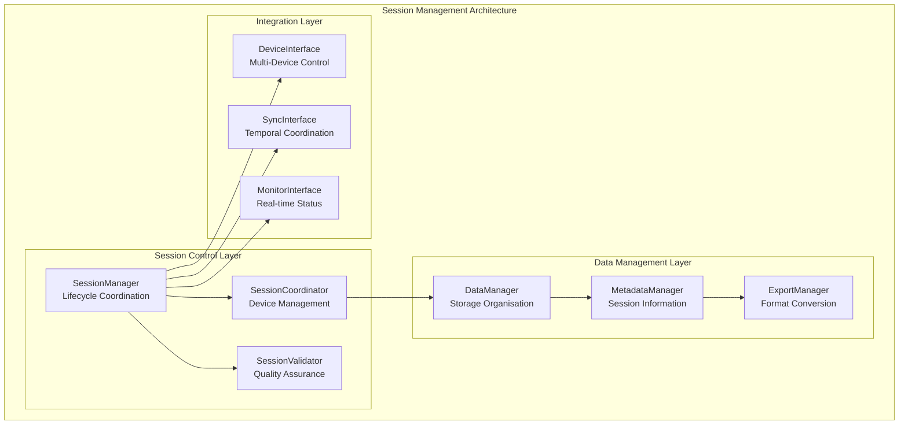
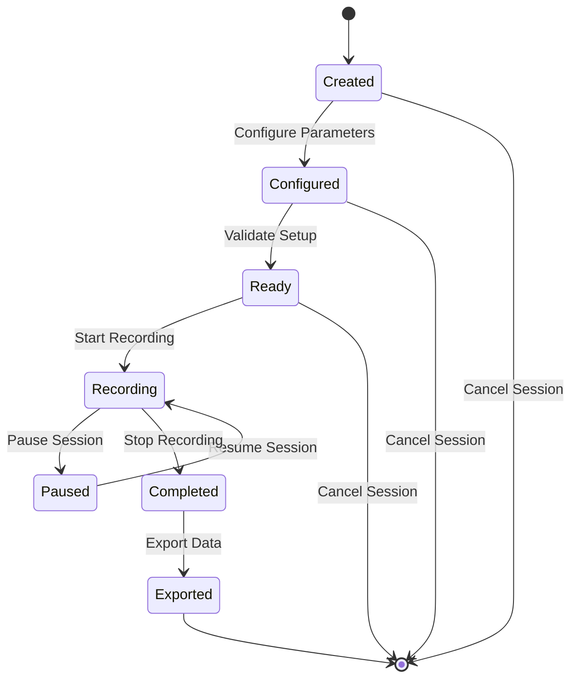

# Session Management Module

## Overview

The Session Management System provides complete coordination of recording sessions across all devices and sensors in the Multi-Sensor Recording System for contactless GSR prediction research. This component ensures consistent data organisation, temporal alignment, and quality assurance throughout the complete data collection lifecycle, implementing established principles of research data management [Wilkinson2016] within the distributed PC master-controller architecture.

### Research Context and Theoretical Foundation

Modern multi-modal physiological research requires systematic session management that maintains data integrity, temporal consistency, and experimental reproducibility [Cacioppo2007]. The session management approach addresses fundamental challenges in coordinating heterogeneous sensor platforms while ensuring compliance with research data management best practices [Wilson2014].

### System Role and Responsibilities

The Session Management System serves as the central coordinator for all recording activities within the established offline-first local recording architecture, managing the complete lifecycle from session initialisation through data finalisation and export.

**Primary Functions:**

- **Session Lifecycle Management**: Coordinated creation, execution, and finalisation of recording sessions with atomic state transitions
- **Multi-Device Coordination**: Synchronised control across all connected devices ensuring temporal coherence and data consistency
- **Data Organisation**: Structured storage and complete metadata management following research data standards [DataCite2019]
- **Quality Assurance**: Real-time monitoring and validation with automated quality control mechanisms
- **Export Management**: Multi-format data export and analysis preparation supporting diverse research workflows

### Session Architecture



## Architecture

### Session Lifecycle States



### Data Organisation Structure

```
sessions/
├── session_20220101_120000/
│   ├── metadata/
│   │   ├── session_info.json
│   │   ├── device_configuration.json
│   │   ├── quality_report.json
│   │   └── synchronization_data.json
│   ├── devices/
│   │   ├── android_device_01/
│   │   │   ├── video/
│   │   │   ├── thermal/
│   │   │   └── physiological/
│   │   ├── android_device_02/
│   │   └── pc_controller/
│   │       ├── webcam_01/
│   │       └── webcam_02/
│   ├── synchronised/
│   │   ├── aligned_video.mp4
│   │   ├── aligned_thermal.bin
│   │   └── aligned_gsr.csv
│   └── exports/
│       ├── analysis_ready/
│       ├── raw_data/
│       └── reports/
```

## Protocol Specification

### Session Configuration Schema

```json
{
  "session_config": {
    "session_id": "session_20220101_120000",
    "session_name": "Experiment_A_Participant_01",
    "created_timestamp": 1640995200000,
    "duration": 300,
    "devices": [
      {
        "device_id": "android_device_01",
        "device_type": "Samsung_S22",
        "recording_modes": ["camera", "thermal", "shimmer"],
        "configuration": {
          "video_resolution": "4K",
          "fps": 30,
          "thermal_fps": 25,
          "shimmer_sampling_rate": 512
        }
      }
    ],
    "synchronisation": {
      "precision_requirement": "millisecond",
      "quality_threshold": 0.9,
      "master_clock": "pc_controller"
    },
    "data_management": {
      "storage_location": "/recordings/session_20220101_120000",
      "compression_enabled": true,
      "backup_enabled": true,
      "export_formats": ["json", "csv", "matlab"]
    }
  }
}
```

### Session Status Protocol

```json
{
  "session_status": {
    "session_id": "session_20220101_120000",
    "current_state": "recording",
    "start_timestamp": 1640995200000,
    "elapsed_time": 150,
    "remaining_time": 150,
    "devices_status": [
      {
        "device_id": "android_device_01",
        "status": "recording",
        "data_collected": {
          "video_frames": 4500,
          "thermal_frames": 3750,
          "gsr_samples": 76800
        },
        "quality_metrics": {
          "overall_quality": 0.94,
          "sync_quality": 0.96,
          "signal_quality": 0.92
        }
      }
    ],
    "storage_info": {
      "total_size": 2048000000,
      "available_space": 8192000000,
      "compression_ratio": 0.75
    }
  }
}
```

## Implementation Guide

### SessionManager Implementation

```python
class SessionManager:
    """Central coordinator for recording session management"""
    
    def __init__(self):
        self.active_sessions = {}
        self.session_history = {}
        self.device_manager = DeviceManager()
        self.data_manager = DataManager()
        self.export_manager = ExportManager()
    
    def create_session(self, config: SessionConfig) -> SessionInfo:
        """Create new recording session with specified configuration"""
        session_id = f"session_{datetime.now().strftime('%Y%m%d_%H%M%S')}"
        
        # Validate configuration
        validation_result = self._validate_session_config(config)
        if not validation_result.valid:
            raise SessionConfigError(f"Invalid configuration: {validation_result.errors}")
        
        # Create session directory structure
        session_path = self.data_manager.create_session_storage(session_id)
        
        # Initialise session info
        session_info = SessionInfo(
            session_id=session_id,
            config=config,
            state=SessionState.CREATED,
            created_timestamp=time.time(),
            storage_path=session_path
        )
        
        self.active_sessions[session_id] = session_info
        return session_info
    
    def start_recording(self, session_id: str) -> bool:
        """Start coordinated recording across all devices"""
        if session_id not in self.active_sessions:
            logger.error(f"Session {session_id} not found")
            return False
        
        session = self.active_sessions[session_id]
        
        try:
            # Validate session readiness
            readiness_check = self._validate_session_readiness(session)
            if not readiness_check.ready:
                logger.error(f"Session not ready: {readiness_check.issues}")
                return False
            
            # Synchronise all devices
            sync_result = self._synchronize_devices(session)
            if not sync_result.success:
                logger.error(f"Device synchronisation failed: {sync_result.error}")
                return False
            
            # Start recording on all devices
            start_timestamp = time.time_ns() + 5_000_000_000  # 5 second countdown
            recording_results = []
            
            for device_config in session.config.devices:
                result = self.device_manager.start_device_recording(
                    device_config.device_id,
                    start_timestamp,
                    device_config.configuration
                )
                recording_results.append(result)
            
            # Verify all devices started successfully
            if all(result.success for result in recording_results):
                session.state = SessionState.RECORDING
                session.start_timestamp = start_timestamp
                session.recording_results = recording_results
                
                # Start monitoring
                self._start_session_monitoring(session)
                
                logger.info(f"Recording started for session {session_id}")
                return True
            else:
                logger.error("Not all devices started successfully")
                self._cleanup_failed_start(session, recording_results)
                return False
                
        except Exception as e:
            logger.error(f"Failed to start recording for session {session_id}: {e}")
            return False
    
    def stop_recording(self, session_id: str) -> bool:
        """Stop recording and finalise session data"""
        if session_id not in self.active_sessions:
            logger.error(f"Session {session_id} not found")
            return False
        
        session = self.active_sessions[session_id]
        
        try:
            # Send stop commands to all devices
            stop_results = []
            for device_config in session.config.devices:
                result = self.device_manager.stop_device_recording(device_config.device_id)
                stop_results.append(result)
            
            # Wait for data finalisation
            finalization_results = self._wait_for_data_finalization(session, timeout=60)
            
            # Update session state
            session.state = SessionState.COMPLETED
            session.end_timestamp = time.time()
            session.stop_results = stop_results
            
            # Generate session summary
            session_summary = self._generate_session_summary(session)
            session.summary = session_summary
            
            # Save session metadata
            self.data_manager.save_session_metadata(session)
            
            logger.info(f"Recording stopped for session {session_id}")
            return True
            
        except Exception as e:
            logger.error(f"Failed to stop recording for session {session_id}: {e}")
            return False
```

### Data Management Implementation

```python
class DataManager:
    """complete data storage and organisation management"""
    
    def __init__(self, base_storage_path: str):
        self.base_storage_path = Path(base_storage_path)
        self.compression_enabled = True
        self.backup_enabled = True
    
    def create_session_storage(self, session_id: str) -> Path:
        """Create structured storage directory for session"""
        session_path = self.base_storage_path / session_id
        
        # Create directory structure
        directories = [
            session_path / "metadata",
            session_path / "devices",
            session_path / "synchronised",
            session_path / "exports" / "analysis_ready",
            session_path / "exports" / "raw_data",
            session_path / "exports" / "reports"
        ]
        
        for directory in directories:
            directory.mkdir(parents=True, exist_ok=True)
        
        return session_path
    
    def organize_device_data(self, session_id: str, device_id: str, 
                           data_files: List[Path]) -> Dict[str, Path]:
        """Organise data files from device into structured storage"""
        session_path = self.base_storage_path / session_id
        device_path = session_path / "devices" / device_id
        
        organized_files = {}
        
        for data_file in data_files:
            # Determine data type from file extension and name
            if data_file.suffix in ['.mp4', '.avi', '.mov']:
                target_dir = device_path / "video"
            elif 'thermal' in data_file.name.lower():
                target_dir = device_path / "thermal"
            elif data_file.suffix in ['.csv', '.json'] and 'gsr' in data_file.name.lower():
                target_dir = device_path / "physiological"
            else:
                target_dir = device_path / "other"
            
            target_dir.mkdir(parents=True, exist_ok=True)
            
            # Copy file to organised location
            target_file = target_dir / data_file.name
            shutil.copy2(data_file, target_file)
            
            organized_files[data_file.stem] = target_file
        
        return organized_files
    
    def save_session_metadata(self, session_info: SessionInfo):
        """Save complete session metadata"""
        metadata_path = session_info.storage_path / "metadata"
        
        # Save main session info
        session_info_path = metadata_path / "session_info.json"
        with open(session_info_path, 'w') as f:
            json.dump(session_info.to_dict(), f, indent=2)
        
        # Save device configurations
        device_config_path = metadata_path / "device_configuration.json"
        device_configs = {
            device.device_id: device.to_dict() 
            for device in session_info.config.devices
        }
        with open(device_config_path, 'w') as f:
            json.dump(device_configs, f, indent=2)
        
        # Save quality report if available
        if hasattr(session_info, 'quality_report'):
            quality_report_path = metadata_path / "quality_report.json"
            with open(quality_report_path, 'w') as f:
                json.dump(session_info.quality_report.to_dict(), f, indent=2)
```

## User Guide

### Session Creation and Configuration

#### Basic Session Setup

1. **Session Parameters**:
    - Session name and description
    - Duration and recording schedule
    - Participant information
    - Experimental conditions

2. **Device Configuration**:
    - Select recording devices
    - Configure recording parameters
    - Verify device connectivity
    - Test synchronisation

3. **Quality Settings**:
    - Set quality thresholds
    - Configure artifact detection
    - Enable real-time monitoring
    - Define stopping criteria

#### Advanced Configuration

1. **Synchronisation Settings**:
    - Precision requirements
    - Master clock selection
    - Compensation algorithms
    - Quality monitoring

2. **Data Management**:
    - Storage location
    - Compression settings
    - Backup configuration
    - Export formats

### Recording Session Execution

#### Pre-Recording Checklist

- [ ] All devices connected and configured
- [ ] Synchronisation validated
- [ ] Storage space available
- [ ] Quality thresholds met
- [ ] Participant prepared

#### During Recording

1. **Real-time Monitoring**:
    - Device status indicators
    - Data quality metrics
    - Storage utilisation
    - Synchronisation quality

2. **Quality Management**:
    - Address quality warnings
    - Monitor artifact levels
    - Check synchronisation drift
    - Validate data integrity

#### Post-Recording

1. **Data Validation**:
    - Verify data completeness
    - Check synchronisation accuracy
    - Validate file integrity
    - Review quality metrics

2. **Export and Analysis**:
    - Generate analysis-ready exports
    - Create quality reports
    - Archive raw data
    - Prepare for analysis

## API Reference

### Core Classes

#### SessionManager

```python
class SessionManager:
    def create_session(self, config: SessionConfig) -> SessionInfo:
        """Create new recording session"""
    
    def start_recording(self, session_id: str) -> bool:
        """Start coordinated recording"""
    
    def stop_recording(self, session_id: str) -> bool:
        """Stop recording and finalise data"""
    
    def get_session_status(self, session_id: str) -> SessionStatus:
        """Get current session status"""
```

#### DataManager

```python
class DataManager:
    def create_session_storage(self, session_id: str) -> Path:
        """Create structured storage directory"""
    
    def organize_device_data(self, session_id: str, device_id: str, 
                           data_files: List[Path]) -> Dict[str, Path]:
        """Organise data files into structured storage"""
    
    def save_session_metadata(self, session_info: SessionInfo):
        """Save complete session metadata"""
```

### Data Models

#### SessionInfo

```python
@dataclass
class SessionInfo:
    session_id: str
    config: SessionConfig
    state: SessionState
    created_timestamp: float
    storage_path: Path
    start_timestamp: Optional[float] = None
    end_timestamp: Optional[float] = None
    summary: Optional[SessionSummary] = None
```

#### SessionConfig

```python
@dataclass
class SessionConfig:
    session_name: str
    duration: int
    devices: List[DeviceConfig]
    synchronisation: SyncConfig
    data_management: DataConfig
    quality_settings: QualityConfig
```

## Testing

### Session Management Testing

```python
class SessionManagementTest:
    def test_session_lifecycle(self):
        """Test complete session lifecycle"""
        session_manager = SessionManager()
        
        # Create session
        config = SessionConfig(
            session_name="test_session",
            duration=30,
            devices=[test_device_config]
        )
        session = session_manager.create_session(config)
        assert session.session_id is not None
        
        # Start recording
        success = session_manager.start_recording(session.session_id)
        assert success
        
        # Stop recording
        success = session_manager.stop_recording(session.session_id)
        assert success
        
        # Verify final state
        final_status = session_manager.get_session_status(session.session_id)
        assert final_status.state == SessionState.COMPLETED
```

## Troubleshooting

### Common Session Issues

#### Session Creation Failures

- Verify device connectivity
- Check storage availability
- Validate configuration parameters

#### Recording Start Problems

- Check device synchronisation
- Verify quality thresholds
- Test network connectivity

#### Data Organisation Issues

- Check storage permissions
- Verify disk space
- Validate file formats

---

*For related modules, see [Multi-Device Synchronisation](multi_device_synchronization_readme.md) and [Networking Protocol](networking_protocol_readme.md) documentation.*

## References

[Cacioppo2007] Cacioppo, J. T., Tassinary, L. G., & Berntson, G. G. (Eds.). (2007). *Handbook of Psychophysiology* (3rd ed.). Cambridge University Press.

[DataCite2019] DataCite Metadata Working Group. (2019). *DataCite Metadata Schema Documentation for the Publication and Citation of Research Data* (Version 4.3). DataCite e.V.

[Wilkinson2016] Wilkinson, M. D., Dumontier, M., Aalbersberg, I. J., Appleton, G., Axton, M., Baak, A., ... & Mons, B. (2016). The FAIR Guiding Principles for scientific data management and stewardship. *Scientific Data*, 3(1), 1-9.

[Wilson2014] Wilson, G., Aruliah, D. A., Brown, C. T., Hong, N. P. C., Davis, M., Guy, R. T., ... & Wilson, P. (2014). Best practices for scientific computing. *PLOS Biology*, 12(1), e1001745.
