# Shimmer Integration Module

## Overview

The Shimmer Integration System provides complete physiological data collection capabilities through Shimmer3 GSR+ sensors, enabling high-precision galvanic skin response monitoring with seamless integration into the Multi-Sensor Recording System's multi-modal data collection framework for contactless GSR prediction research.

### Research Context and Theoretical Foundation

The Shimmer Integration System serves as the physiological data backbone, providing research-grade galvanic skin response (GSR) measurements that maintain precise temporal alignment with concurrent visual, thermal, and environmental sensor data streams. This component addresses fundamental requirements for psychophysiological research [Boucsein2012] where accurate physiological measurement serves as ground truth for developing contactless GSR prediction models.

The system builds upon established psychophysiology and physiological computing principles:

- **Psychophysiology Foundations** [Boucsein2012]: GSR as a reliable indicator of sympathetic nervous system activity and emotional arousal
- **Affective Computing Theory** [Picard1997]: Automated emotion recognition through physiological measurements as foundation for human-computer interaction
- **Signal Processing Methodologies** [Benedek2010]: Advanced artifact detection and signal quality enhancement techniques for research-grade data
- **Wireless Sensor Networks** [Burns2010]: Shimmer platform development, validation, and research applications in physiological monitoring

### System Role and Responsibilities

Within the established PC master-controller, offline-first recording architecture, the Shimmer Integration System provides:

**Primary Functions:**

- **High-Precision GSR Monitoring**: Research-grade physiological signal acquisition with configurable sampling rates supporting diverse research protocols
- **Dual Integration Architecture**: Support for both direct PC Bluetooth connections and Android-mediated communication ensuring flexible deployment scenarios
- **Real-Time Signal Processing**: Advanced artifact detection, quality assessment, and adaptive filtering maintaining research data quality standards
- **Multi-Modal Synchronisation**: Precise temporal coordination with visual and thermal sensor modalities through the JSON socket protocol
- **Research-Grade Calibration**: complete calibration protocols ensuring measurement accuracy and inter-device consistency

### Research Foundation

The system builds upon established psychophysiology and physiological computing principles:

- **Psychophysiology Foundations** [Boucsein2012]: GSR as reliable indicator of sympathetic nervous system activity
- **Affective Computing** [Picard1997]: Automated emotion recognition through physiological measurements
- **Signal Processing** [Benedek2010]: Artifact detection and signal quality enhancement techniques
- **Wireless Sensor Networks** [Burns2010]: Shimmer platform development and validation

### Physiological Monitoring Capabilities

#### GSR Signal Acquisition

- **Sampling Rates**: 256Hz, 512Hz, 1024Hz configurable rates for different research requirements
- **Signal Quality**: Research-grade precision with 16-bit ADC resolution
- **Dynamic Range**: Wide range accommodation for diverse physiological responses
- **Artifact Detection**: Real-time motion and electrical artifact identification

#### Multi-Modal Integration

- **Temporal Synchronisation**: Sub-millisecond alignment with visual and thermal data
- **Data Fusion**: Coordinated analysis across multiple physiological and behavioural measures
- **Session Management**: Integrated recording sessions with complete metadata
- **Quality Assurance**: Continuous signal quality monitoring and validation

#### Research Applications

- **Emotion Recognition**: Automated affective state assessment through GSR analysis
- **Stress Monitoring**: Sympathetic nervous system activity measurement
- **Cognitive Load Assessment**: Mental workload evaluation through physiological responses
- **Human-Computer Interaction**: Usability evaluation and interface assessment

## Architecture

### System Architecture Overview

```mermaid
graph TB
    subgraph "Shimmer Integration Architecture"
        subgraph "Physiological Sensor Layer"
            S1[Shimmer3 GSR+ Device #1<br/>Wireless Sensor Platform]
            S2[Shimmer3 GSR+ Device #2<br/>Wireless Sensor Platform]
            CAL[Calibration and Configuration<br/>Parameter Management]
        end
        
        subgraph "Communication Layer"
            BT[Bluetooth Manager<br/>Direct PC Connection]
            ARM[Android Relay Manager<br/>Mobile-Mediated Connection]
            CF[Connection Failover<br/>Redundancy Management]
        end
        
        subgraph "Signal Processing Layer"
            SP[Signal Processor<br/>Real-Time Processing]
            AD[Artifact Detector<br/>Quality Assessment]
            AF[Adaptive Filter<br/>Signal Enhancement]
        end
        
        subgraph "Data Management Layer"
            DM[Data Manager<br/>Collection and Storage]
            SM[Session Manager<br/>Recording Coordination]
            EM[Export Manager<br/>Format Conversion]
        end
        
        subgraph "Integration Layer"
            SYNC[Synchronisation Manager<br/>Temporal Alignment]
            MM[Multi-Modal Coordinator<br/>Cross-Sensor Integration]
            QM[Quality Monitor<br/>Performance Assessment]
        end
    end
    
    S1 --> BT
    S1 --> ARM
    S2 --> BT
    S2 --> ARM
    
    BT --> CF
    ARM --> CF
    CF --> SP
    
    SP --> AD
    SP --> AF
    AD --> DM
    AF --> DM
    
    DM --> SM
    SM --> EM
    
    SP --> SYNC
    SYNC --> MM
    MM --> QM
    
    CAL --> S1
    CAL --> S2
```



### Dual Integration Architecture

#### Direct PC Bluetooth Connection

- **Implementation**: `PythonApp/src/shimmer_manager.py`
- **Advantages**: Low latency, direct control, minimal interference
- **Use Cases**: Laboratory environments, controlled settings
- **Communication**: Direct Bluetooth serial protocol with pyshimmer library

#### Android-Mediated Connection

- **Implementation**: `AndroidApp/src/main/java/com/multisensor/recording/ShimmerService.kt`
- **Advantages**: Mobile deployment, unified device management
- **Use Cases**: Field research, mobile experiments
- **Communication**: Bluetooth to Android, then socket relay to PC

#### Failover and Redundancy

- **Automatic Detection**: Dynamic connection quality assessment
- **Seamless Switching**: Transparent failover between connection modes
- **Quality Maintenance**: Consistent data quality across connection types
- **Recovery Mechanisms**: Automatic reconnection and session restoration

### Signal Processing Architecture

#### Real-Time Processing Pipeline

1. **Raw Signal Acquisition**: Direct ADC data from Shimmer sensors
2. **Artifact Detection**: Motion and electrical interference identification
3. **Quality Assessment**: Real-time signal quality scoring
4. **Adaptive Filtering**: Dynamic filter adjustment based on signal characteristics
5. **Temporal Alignment**: Synchronisation with master clock system
6. **Data Storage**: Structured storage with metadata and quality metrics

#### Advanced Processing Features

- **Tonic/Phasic Decomposition**: Separation of baseline and response components
- **Event Detection**: Automated identification of physiological responses
- **Statistical Analysis**: Real-time descriptive statistics and trend analysis
- **Quality Scoring**: complete signal quality assessment and reporting

## Protocol Specification

### Shimmer Communication Protocol

#### Bluetooth Serial Communication

**Connection Parameters:**

| Parameter | Value | Description |
|-----------|-------|-------------|
| Protocol | Bluetooth SPP | Serial Port Profile |
| Baud Rate | 115200 | Data transmission rate |
| Data Bits | 8 | Data frame size |
| Stop Bits | 1 | Frame termination |
| Parity | None | Error checking |
| Flow Control | RTS/CTS | Hardware flow control |

#### Command Structure

```python
# Shimmer command format
class ShimmerCommand:
    def __init__(self, command_type: str, parameters: Dict):
        self.command_type = command_type
        self.parameters = parameters
        self.timestamp = time.time()
    
    def serialise(self) -> bytes:
        """Serialise command for transmission"""
        pass
```

### GSR Data Format

#### Raw Data Packet Structure

```json
{
  "packet_type": "gsr_data",
  "timestamp": 1640995200000,
  "device_id": "shimmer_001",
  "sequence_number": 12345,
  "sampling_rate": 512,
  "data": {
    "gsr_raw": 2048,
    "gsr_resistance": 125000,
    "gsr_conductance": 8.0,
    "timestamp_local": 1640995200012,
    "quality_score": 0.95,
    "artifacts_detected": []
  },
  "metadata": {
    "electrode_configuration": "standard",
    "calibration_applied": true,
    "signal_quality": "effective"
  }
}
```

#### Processed Data Format

```json
{
  "processed_gsr_data": {
    "device_id": "shimmer_001",
    "session_id": "session_20220101_120000",
    "start_timestamp": 1640995200000,
    "sampling_rate": 512,
    "duration": 300,
    "signal_components": {
      "tonic": {
        "baseline_level": 8.5,
        "trend_slope": 0.001,
        "stability_score": 0.92
      },
      "phasic": {
        "peak_count": 12,
        "average_amplitude": 0.8,
        "response_frequency": 0.04
      }
    },
    "quality_metrics": {
      "overall_quality": 0.94,
      "artifact_percentage": 2.1,
      "signal_to_noise_ratio": 28.5,
      "electrode_contact_quality": "effective"
    },
    "physiological_indices": {
      "arousal_level": "moderate",
      "stress_indicators": "low",
      "emotional_valence": "neutral"
    }
  }
}
```

### Configuration Commands

#### Sensor Configuration

```json
{
  "command": "configure_sensor",
  "timestamp": 1640995200000,
  "device_id": "shimmer_001",
  "configuration": {
    "sampling_rate": 512,
    "gsr_range": "auto",
    "electrode_type": "disposable",
    "calibration_mode": "auto",
    "artifact_detection": true,
    "quality_monitoring": true,
    "data_streaming": {
      "mode": "continuous",
      "buffer_size": 1024,
      "transmission_interval": 100
    }
  }
}
```

#### Recording Session Commands

```json
{
  "command": "start_recording",
  "timestamp": 1640995200000,
  "session_id": "session_20220101_120000",
  "devices": ["shimmer_001", "shimmer_002"],
  "recording_parameters": {
    "duration": 300,
    "sync_with_master": true,
    "quality_threshold": 0.8,
    "artifact_handling": "filter",
    "real_time_processing": true
  }
}
```

## Implementation Guide

### Core Component Implementation

#### ShimmerManager Implementation

```python
class ShimmerManager:
    """Central coordination for Shimmer device management and data collection"""

    def __init__(self):
        self.devices = {}
        self.connection_managers = {}
        self.signal_processor = SignalProcessor()
        self.quality_monitor = QualityMonitor()
        self.data_manager = DataManager()

    def discover_devices(self) -> List[ShimmerDeviceInfo]:
        """Discover available Shimmer devices via Bluetooth"""
        discovered_devices = []

        try:
            # Scan for Bluetooth devices
            bluetooth_devices = bluetooth.discover_devices(lookup_names=True)

            for device_address, device_name in bluetooth_devices:
                if "Shimmer" in device_name:
                    device_info = ShimmerDeviceInfo(
                        device_id=device_address,
                        device_name=device_name,
                        connection_type="bluetooth"
                    )
                    discovered_devices.append(device_info)

        except Exception as e:
            logger.error(f"Device discovery failed: {e}")

        return discovered_devices

    def connect_device(self, device_id: str, connection_type: str = "auto") -> bool:
        """Establish connection to Shimmer device"""
        if device_id in self.devices:
            logger.warning(f"Device {device_id} already connected")
            return True

        try:
            if connection_type == "auto":
                # Try direct Bluetooth first, fallback to Android relay
                connection_manager = self._create_connection_manager(device_id)
            else:
                connection_manager = self._create_specific_connection(device_id, connection_type)

            if connection_manager.connect():
                self.connection_managers[device_id] = connection_manager

                # Initialise device configuration
                device = ShimmerDevice(device_id, connection_manager)
                self.devices[device_id] = device

                # Configure default settings
                self._configure_device_defaults(device)

                logger.info(f"Successfully connected to device {device_id}")
                return True
            else:
                logger.error(f"Failed to connect to device {device_id}")
                return False

        except Exception as e:
            logger.error(f"Connection error for device {device_id}: {e}")
            return False

    def start_data_streaming(self, device_id: str, session_config: SessionConfig) -> bool:
        """Start real-time data streaming from Shimmer device"""
        if device_id not in self.devices:
            logger.error(f"Device {device_id} not connected")
            return False

        device = self.devices[device_id]

        try:
            # Configure streaming parameters
            streaming_config = StreamingConfig(
                sampling_rate=session_config.sampling_rate,
                buffer_size=session_config.buffer_size,
                quality_threshold=session_config.quality_threshold
            )

            # Start streaming with callback for real-time processing
            device.start_streaming(
                config=streaming_config,
                data_callback=self._process_streaming_data,
                quality_callback=self._monitor_signal_quality
            )

            logger.info(f"Started data streaming for device {device_id}")
            return True

        except Exception as e:
            logger.error(f"Failed to start streaming for device {device_id}: {e}")
            return False

    def _process_streaming_data(self, device_id: str, raw_data: bytes):
        """Process real-time streaming data from Shimmer device"""
        try:
            # Parse raw data packet
            parsed_data = self.signal_processor.parse_raw_data(raw_data)

            # Apply real-time signal processing
            processed_data = self.signal_processor.process_gsr_sample(
                parsed_data, device_id
            )

            # Assess signal quality
            quality_score = self.quality_monitor.assess_sample_quality(
                processed_data
            )

            # Store processed data
            self.data_manager.store_sample(
                device_id, processed_data, quality_score
            )

            # Trigger real-time callbacks for external systems
            self._notify_data_listeners(device_id, processed_data)

        except Exception as e:
            logger.error(f"Data processing error for device {device_id}: {e}")
```

#### Signal Processing Implementation

```python
class SignalProcessor:
    """Advanced GSR signal processing with artifact detection and quality assessment"""
    
    def __init__(self):
        self.filters = {}
        self.artifact_detectors = {}
        self.quality_assessors = {}
        self.calibration_data = {}
    
    def process_gsr_sample(self, raw_sample: RawGSRSample, device_id: str) -> ProcessedGSRSample:
        """Process individual GSR sample with filtering and quality assessment"""
        
        # Apply calibration if available
        calibrated_sample = self._apply_calibration(raw_sample, device_id)
        
        # Convert raw ADC values to physiological units
        gsr_resistance = self._convert_to_resistance(calibrated_sample.raw_value)
        gsr_conductance = 1.0 / gsr_resistance if gsr_resistance > 0 else 0.0
        
        # Apply adaptive filtering
        filtered_value = self._apply_adaptive_filter(gsr_conductance, device_id)
        
        # Detect artifacts
        artifacts = self._detect_artifacts(filtered_value, device_id)
        
        # Assess sample quality
        quality_score = self._assess_sample_quality(filtered_value, artifacts)
        
        return ProcessedGSRSample(
            timestamp=calibrated_sample.timestamp,
            device_id=device_id,
            raw_value=calibrated_sample.raw_value,
            resistance=gsr_resistance,
            conductance=filtered_value,
            artifacts=artifacts,
            quality_score=quality_score
        )
    
    def _apply_adaptive_filter(self, value: float, device_id: str) -> float:
        """Apply adaptive filtering based on signal characteristics"""
        if device_id not in self.filters:
            self.filters[device_id] = AdaptiveFilter(
                cutoff_frequency=0.5,  # 0.5 Hz low-pass
                order=4,
                adaptation_rate=0.01
            )
        
        filter_instance = self.filters[device_id]
        filtered_value = filter_instance.filter(value)
        
        # Adapt filter parameters based on signal characteristics
        filter_instance.adapt_parameters(value)
        
        return filtered_value
    
    def _detect_artifacts(self, value: float, device_id: str) -> List[ArtifactType]:
        """Detect various types of artifacts in GSR signal"""
        artifacts = []
        
        if device_id not in self.artifact_detectors:
            self.artifact_detectors[device_id] = ArtifactDetector()
        
        detector = self.artifact_detectors[device_id]
        
        # Motion artifact detection
        if detector.detect_motion_artifact(value):
            artifacts.append(ArtifactType.MOTION)
        
        # Electrical interference detection
        if detector.detect_electrical_artifact(value):
            artifacts.append(ArtifactType.ELECTRICAL)
        
        # Electrode displacement detection
        if detector.detect_electrode_artifact(value):
            artifacts.append(ArtifactType.ELECTRODE)
        
        # Saturation detection
        if detector.detect_saturation(value):
            artifacts.append(ArtifactType.SATURATION)
        
        return artifacts
    
    def decompose_signal(self, signal_data: List[float], sampling_rate: float) -> SignalComponents:
        """Decompose GSR signal into tonic and phasic components"""
        # Apply Butterworth filter for tonic component extraction
        sos = scipy.signal.butter(4, 0.05, btype='low', fs=sampling_rate, output='sos')
        tonic_component = scipy.signal.sosfilt(sos, signal_data)
        
        # Calculate phasic component
        phasic_component = np.array(signal_data) - tonic_component
        
        # Analyse components
        tonic_stats = self._analyse_tonic_component(tonic_component)
        phasic_stats = self._analyse_phasic_component(phasic_component, sampling_rate)
        
        return SignalComponents(
            tonic=tonic_stats,
            phasic=phasic_stats
        )
```

#### Quality Assessment Implementation

```python
class QualityMonitor:
    """complete signal quality assessment and monitoring"""
    
    def __init__(self):
        self.quality_history = {}
        self.quality_thresholds = QualityThresholds()
        
    def assess_sample_quality(self, sample: ProcessedGSRSample) -> float:
        """Assess quality of individual GSR sample"""
        quality_factors = []
        
        # Signal amplitude assessment
        amplitude_quality = self._assess_signal_amplitude(sample.conductance)
        quality_factors.append(amplitude_quality)
        
        # Artifact presence assessment
        artifact_quality = self._assess_artifact_impact(sample.artifacts)
        quality_factors.append(artifact_quality)
        
        # Signal stability assessment
        stability_quality = self._assess_signal_stability(sample.device_id, sample.conductance)
        quality_factors.append(stability_quality)
        
        # Electrode contact quality
        contact_quality = self._assess_electrode_contact(sample.resistance)
        quality_factors.append(contact_quality)
        
        # Calculate weighted average
        weights = [0.3, 0.3, 0.2, 0.2]  # Configurable weights
        overall_quality = np.average(quality_factors, weights=weights)
        
        # Store quality history
        self._update_quality_history(sample.device_id, overall_quality)
        
        return overall_quality
    
    def assess_session_quality(self, session_data: List[ProcessedGSRSample]) -> SessionQualityReport:
        """Assess overall quality of recording session"""
        quality_scores = [sample.quality_score for sample in session_data]
        artifacts_detected = [len(sample.artifacts) for sample in session_data]
        
        report = SessionQualityReport(
            overall_quality=np.mean(quality_scores),
            quality_variance=np.var(quality_scores),
            artifact_percentage=np.mean([1 if a > 0 else 0 for a in artifacts_detected]),
            signal_to_noise_ratio=self._calculate_snr(session_data),
            electrode_contact_rating=self._assess_electrode_contact_session(session_data),
            recommendations=self._generate_quality_recommendations(session_data)
        )
        
        return report
    
    def _assess_signal_amplitude(self, conductance: float) -> float:
        """Assess signal amplitude quality"""
        # Typical GSR conductance range: 2-20 µS
        if 2.0 <= conductance <= 20.0:
            return 1.0  # Excellent
        elif 1.0 <= conductance <= 25.0:
            return 0.8  # Good
        elif 0.5 <= conductance <= 30.0:
            return 0.6  # Fair
        else:
            return 0.3  # Poor
    
    def _assess_artifact_impact(self, artifacts: List[ArtifactType]) -> float:
        """Assess impact of detected artifacts on signal quality"""
        if not artifacts:
            return 1.0
        
        artifact_penalties = {
            ArtifactType.MOTION: 0.3,
            ArtifactType.ELECTRICAL: 0.2,
            ArtifactType.ELECTRODE: 0.4,
            ArtifactType.SATURATION: 0.5
        }
        
        total_penalty = sum(artifact_penalties.get(artifact, 0.1) for artifact in artifacts)
        quality = max(0.0, 1.0 - total_penalty)
        
        return quality
```

### Project Structure

```
bucika_gsr/
├── shimmer_manager.py                # Primary Shimmer coordination
├── signal_processor.py              # Real-time signal processing
├── quality_monitor.py               # Signal quality assessment
├── device_discovery.py              # Bluetooth device discovery
├── connection_manager.py            # Connection management
├── calibration_manager.py           # Device calibration
├── data_manager.py                  # Data storage and export
└── utils/
    ├── shimmer_protocol.py           # Protocol implementation
    ├── artifact_detection.py         # Artifact detection algorithms
    ├── adaptive_filters.py           # Signal filtering
    └── physiological_analysis.py     # Advanced signal analysis
```

## User Guide

### Initial Setup and Configuration

#### Shimmer Device Preparation

1. **Hardware Setup**:
    - Charge Shimmer3 GSR+ devices fully before use
    - Attach GSR electrodes following manufacturer guidelines
    - Verify device functionality using Shimmer software
    - Record device MAC addresses for identification

2. **Electrode Placement**:
    - Clean skin surface with alcohol wipe
    - Attach electrodes to index and middle finger (recommended)
    - Alternative: palm placement for long-term recording
    - Ensure good electrical contact without excessive pressure

3. **Environmental Considerations**:
    - Minimis\1 electromagnetic interference sources
    - Maintain stable temperature conditions
    - Avoid excessive humidity or moisture
    - Position devices away from WiFi routers and other wireless equipment

#### Software Configuration

1. **Python Environment Setup**:
   ```bash
   # Activate environment
   conda activate thermal-env
   
   # Verify Shimmer dependencies
   python -c "import bluetooth; print('Bluetooth support available')"
   python -c "import pyshimmer; print('PyShimmer library available')"
   ```

2. **Bluetooth Configuration**:
    - Enable Bluetooth on PC controller
    - Pair Shimmer devices using standard Bluetooth pairing
    - Verify COM port assignment (Windows) or device path (Linux)
    - Test basic connectivity with Shimmer software

### Device Connection and Management

#### Direct PC Connection

1. **Device Discovery**:
   ```python
   # Launch PC controller application
   python application.py
   
   # Navigate to Devices tab
   # Click "Scan for Shimmer Devices"
   # Select discovered devices from list
   ```

2. **Connection Establishment**:
    - Select device from discovered list
    - Click "Connect" button
    - Monitor connection status indicators
    - Verify data streaming capability

3. **Configuration Settings**:
    - **Sampling Rate**: 512Hz (recommended for research)
    - **GSR Range**: Auto-range for optimal sensitivity
    - **Calibration**: Enable automatic calibration
    - **Quality Monitoring**: Enable real-time quality assessment

#### Android-Mediated Connection

1. **Android App Setup**:
    - Launch Multi-Sensor Recording app on Android device
    - Navigate to "Shimmer Configuration" section
    - Enable Bluetooth and grant necessary permissions
    - Scan for nearby Shimmer devices

2. **Device Pairing**:
    - Select Shimmer device from scan results
    - Complete Bluetooth pairing process
    - Verify connection in Android app
    - Test data relay to PC controller

3. **Network Relay Configuration**:
    - Ensure Android device connected to same WiFi as PC
    - Verify PC controller IP address and port
    - Test socket communication between Android and PC
    - Monitor data relay quality and latency

### Recording Session Workflow

#### Pre-Recording Preparation

1. **Signal Quality Check**:
    - Connect all Shimmer devices
    - Monitor real-time signal display
    - Verify electrode contact quality
    - Check for artifact presence

2. **Baseline Recording**:
    - Record 2-3 minutes of baseline activity
    - Ensure participant relaxation
    - Monitor signal stability
    - Document baseline conditions

3. **Synchronisation Validation**:
    - Verify temporal alignment with other sensors
    - Check master clock synchronisation
    - Test coordinated recording start/stop
    - Validate data timestamp consistency

#### Recording Execution

1. **Session Initiation**:
    - Create new recording session in PC controller
    - Configure session parameters:
        - Duration and recording modes
        - Quality thresholds and artifact handling
        - Real-time processing options
    - Add participant information and session notes

2. **Data Monitoring**:
    - Monitor real-time GSR signal display
    - Watch quality indicators and artifact detection
    - Check electrode contact status
    - Observe signal-to-noise ratio metrics

3. **Quality Management**:
    - Address quality warnings immediately
    - Re-attach electrodes if contact quality degrades
    - Document any intervention or environmental changes
    - Monitor for systematic artifacts or drift

#### Post-Recording Procedures

1. **Data Validation**:
    - Review session quality report
    - Check for data gaps or corruption
    - Validate temporal synchronisation
    - Verify data export completeness

2. **Quality Assessment**:
    - Analyse overall session quality metrics
    - Review artifact detection and filtering results
    - Assess electrode contact stability
    - Generate quality assurance report

### Signal Analysis and Interpretation

#### Real-Time Analysis Features

1. **Live Signal Display**:
    - Real-time GSR conductance visualisation
    - Quality score indicators
    - Artifact detection markers
    - Statistical summary display

2. **Physiological Indices**:
    - Tonic (baseline) level monitoring
    - Phasic response detection
    - Arousal level estimation
    - Stress indicator assessment

#### Post-Session Analysis

1. **Signal Decomposition**:
    - Separate tonic and phasic components
    - Identify physiological responses
    - Calculate response metrics (amplitude, latency, duration)
    - Generate event-related analysis

2. **Quality Reporting**:
    - complete session quality assessment
    - Artifact impact analysis
    - Signal-to-noise ratio calculation
    - Electrode performance evaluation

## API Reference

### Core Shimmer Classes

#### ShimmerManager

```python
class ShimmerManager:
    """Central coordination for Shimmer device management"""

    def discover_devices(self) -> List[ShimmerDeviceInfo]:
        """Discover available Shimmer devices via Bluetooth"""

    def connect_device(self, device_id: str, connection_type: str = "auto") -> bool:
        """Establish connection to Shimmer device"""

    def configure_device(self, device_id: str, config: ShimmerConfig) -> bool:
        """Configure Shimmer device parameters"""

    def start_data_streaming(self, device_id: str, session_config: SessionConfig) -> bool:
        """Start real-time data streaming from device"""

    def stop_data_streaming(self, device_id: str) -> bool:
        """Stop data streaming and finalise data"""

    def get_device_status(self, device_id: str) -> DeviceStatus:
        """Get current device status and health metrics"""
```

#### SignalProcessor

```python
class SignalProcessor:
    """Advanced GSR signal processing and analysis"""
    
    def process_gsr_sample(self, raw_sample: RawGSRSample, device_id: str) -> ProcessedGSRSample:
        """Process individual GSR sample with filtering and quality assessment"""
    
    def decompose_signal(self, signal_data: List[float], sampling_rate: float) -> SignalComponents:
        """Decompose GSR signal into tonic and phasic components"""
    
    def detect_responses(self, signal_data: List[float], sampling_rate: float) -> List[GSRResponse]:
        """Detect physiological responses in GSR signal"""
    
    def calculate_physiological_indices(self, signal_data: List[float]) -> PhysiologicalIndices:
        """Calculate physiological indices from GSR signal"""
```

#### QualityMonitor

```python
class QualityMonitor:
    """Signal quality assessment and monitoring"""
    
    def assess_sample_quality(self, sample: ProcessedGSRSample) -> float:
        """Assess quality of individual GSR sample"""
    
    def assess_session_quality(self, session_data: List[ProcessedGSRSample]) -> SessionQualityReport:
        """Assess overall quality of recording session"""
    
    def generate_quality_report(self, session_id: str) -> QualityReport:
        """Generate complete quality assessment report"""
    
    def get_quality_recommendations(self, quality_issues: List[QualityIssue]) -> List[Recommendation]:
        """Generate recommendations for quality improvement"""
```

### Data Models

#### ProcessedGSRSample

```python
@dataclass
class ProcessedGSRSample:
    """Processed GSR sample with quality metrics"""
    timestamp: float
    device_id: str
    raw_value: int
    resistance: float
    conductance: float
    artifacts: List[ArtifactType]
    quality_score: float
    physiological_indices: Optional[PhysiologicalIndices] = None
```

#### SessionQualityReport

```python
@dataclass
class SessionQualityReport:
    """complete session quality assessment"""
    session_id: str
    overall_quality: float
    quality_variance: float
    artifact_percentage: float
    signal_to_noise_ratio: float
    electrode_contact_rating: str
    recommendations: List[str]
    detailed_metrics: Dict[str, float]
```

#### ShimmerConfig

```python
@dataclass
class ShimmerConfig:
    """Shimmer device configuration parameters"""
    sampling_rate: int
    gsr_range: str
    calibration_enabled: bool
    artifact_detection: bool
    quality_monitoring: bool
    streaming_config: StreamingConfig
```

## Testing

### Shimmer Integration Testing

#### Device Communication Testing

```bash
# Test Shimmer device discovery
python test_shimmer_discovery.py --scan-duration 30

# Test connection reliability
python test_shimmer_connection.py --device-count 2 --duration 300

# Test data streaming performance
python test_shimmer_streaming.py --sampling-rate 512 --duration 600
```

#### Signal Processing Validation

```python
class SignalProcessingTest:
    def test_artifact_detection(self):
        """Test artifact detection accuracy"""
        signal_processor = SignalProcessor()
        
        # Load test signals with known artifacts
        test_signals = load_artifact_test_signals()
        
        detection_accuracy = []
        for signal, known_artifacts in test_signals:
            detected_artifacts = signal_processor._detect_artifacts(signal, "test_device")
            accuracy = calculate_detection_accuracy(detected_artifacts, known_artifacts)
            detection_accuracy.append(accuracy)
        
        average_accuracy = np.mean(detection_accuracy)
        assert average_accuracy > 0.85  # 85% detection accuracy
    
    def test_signal_decomposition(self):
        """Test tonic/phasic signal decomposition"""
        signal_processor = SignalProcessor()
        
        # Generate synthetic GSR signal with known components
        synthetic_signal = generate_synthetic_gsr_signal(
            duration=60, sampling_rate=512, tonic_level=8.0, phasic_responses=5
        )
        
        components = signal_processor.decompose_signal(synthetic_signal, 512)
        
        # Validate decomposition accuracy
        assert abs(components.tonic.baseline_level - 8.0) < 0.5
        assert components.phasic.peak_count >= 4  # Allow for detection variation
```

#### Quality Assessment Testing

```python
class QualityAssessmentTest:
    def test_quality_scoring_consistency(self):
        """Test quality scoring consistency across devices"""
        quality_monitor = QualityMonitor()
        
        # Create identical test samples for different devices
        test_sample = ProcessedGSRSample(
            timestamp=time.time(),
            device_id="test_device",
            raw_value=2048,
            resistance=125000,
            conductance=8.0,
            artifacts=[],
            quality_score=0.0  # To be calculated
        )
        
        # Test consistency across multiple assessments
        quality_scores = []
        for i in range(100):
            score = quality_monitor.assess_sample_quality(test_sample)
            quality_scores.append(score)
        
        quality_variance = np.var(quality_scores)
        assert quality_variance < 0.001  # Low variance in quality assessment
    
    def test_session_quality_analysis(self):
        """Test session-level quality analysis"""
        quality_monitor = QualityMonitor()
        
        # Generate session data with known quality characteristics
        session_data = generate_test_session_data(
            duration=300, quality_profile="mixed"
        )
        
        quality_report = quality_monitor.assess_session_quality(session_data)
        
        assert 0.0 <= quality_report.overall_quality <= 1.0
        assert len(quality_report.recommendations) > 0
        assert quality_report.signal_to_noise_ratio > 0
```

## Troubleshooting

### Common Connection Issues

#### Bluetooth Connection Problems

**Symptoms**: Cannot discover or connect to Shimmer devices
**Diagnosis**:

1. Check Bluetooth adapter functionality
2. Verify device pairing status
3. Check COM port assignment (Windows)
4. Test with official Shimmer software

**Solutions**:

1. **Bluetooth Reset**:
   ```bash
   # Windows: Reset Bluetooth stack
   net stop bthserv
   net start bthserv
   
   # Linux: Restart Bluetooth service
   sudo systemctl restart bluetooth
   ```

2. **Device Re-pairing**:
    - Remove existing device pairing
    - Clear Bluetooth cache
    - Re-pair devices using fresh pairing process
    - Verify PIN/passkey if required

#### Data Streaming Issues

**Symptoms**: Intermittent data loss, connection drops
**Diagnosis**:

1. Monitor Bluetooth signal strength
2. Check for interference sources
3. Verify power levels on Shimmer devices
4. Test connection stability over time

**Solutions**:

1. **Environment Optimisation**:
    - Move away from WiFi routers and other 2.4GHz devices
    - Reduce distance between Shimmer and PC/Android device
    - Ensure line-of-sight communication when possible

2. **Power Management**:
    - Disable USB selective suspend (Windows)
    - Disable power saving on Bluetooth adapter
    - Ensure adequate battery levels on Shimmer devices

### Signal Quality Issues

#### Poor Electrode Contact

**Symptoms**: High resistance values, unstable signal, poor quality scores
**Diagnosis**:

1. Check electrode attachment and contact pressure
2. Verify skin preparation (cleaning, dryness)
3. Monitor contact resistance values
4. Check for electrode degradation

**Solutions**:

1. **Electrode Optimisation**:
    - Clean skin with alcohol wipe and allow to dry
    - Apply electrodes with moderate pressure
    - Use conductive gel if appropriate
    - Replace electrodes if degraded

2. **Alternative Placement**:
    - Try different finger positions
    - Consider palm placement for long sessions
    - Test alternative electrode types
    - Document placement for consistency

#### Artifact Contamination

**Symptoms**: High artifact detection, poor signal quality, unreliable measurements
**Diagnosis**:

1. Identify artifact types (motion, electrical, electrode)
2. Check environmental conditions
3. Monitor participant movement
4. Review electrode stability

**Solutions**:

1. **Motion Artifact Reduction**:
    - Minimis\1 participant movement during recording
    - Secure electrode cables to prevent tugging
    - Use wrist restraints if appropriate
    - Consider alternative electrode placement

2. **Electrical Interference Mitigation**:
    - Turn off nearby electronic devices
    - Use battery power when possible
    - Check for ground loops
    - Consider shielded cables

### Advanced Diagnostics

#### Signal Analysis Diagnostics

```python
def diagnose_signal_quality(session_data: List[ProcessedGSRSample]):
    """complete signal quality diagnosis"""
    
    # Calculate signal statistics
    conductance_values = [sample.conductance for sample in session_data]
    quality_scores = [sample.quality_score for sample in session_data]
    
    # Analyse signal characteristics
    signal_mean = np.mean(conductance_values)
    signal_std = np.std(conductance_values)
    quality_mean = np.mean(quality_scores)
    
    # Generate diagnostic report
    diagnostics = {
        "signal_statistics": {
            "mean_conductance": signal_mean,
            "conductance_variability": signal_std,
            "average_quality": quality_mean
        },
        "quality_issues": [],
        "recommendations": []
    }
    
    # Check for common issues
    if signal_mean < 2.0:
        diagnostics["quality_issues"].append("Low conductance - check electrode contact")
        diagnostics["recommendations"].append("Improve electrode contact or use conductive gel")
    
    if signal_std > 5.0:
        diagnostics["quality_issues"].append("High signal variability - possible artifacts")
        diagnostics["recommendations"].append("Minimis\1 movement and electrical interference")
    
    if quality_mean < 0.7:
        diagnostics["quality_issues"].append("Low overall quality")
        diagnostics["recommendations"].append("Review electrode placement and environment")
    
    return diagnostics
```

#### Performance Monitoring

```bash
# Monitor system performance during Shimmer operation
python shimmer_performance_monitor.py --duration 300 --log-level DEBUG

# Test Bluetooth bandwidth utilisation
python bluetooth_bandwidth_test.py --device-count 2 --sampling-rate 512

# Validate temporal synchronisation accuracy
python sync_validation_test.py --shimmer-devices 2 --reference-clock pc_master
```

### Support Resources

**Technical Documentation**:

- [Multi-Device Synchronisation](./multi_device_synchronization_readme.md)
- [Android Integration](./android_mobile_application_readme.md)
- [Signal Processing Fundamentals](./session_management_readme.md)

**Diagnostic Tools**:

- Shimmer device discovery utility
- Signal quality analyser
- Bluetooth connection tester
- Performance monitoring suite

**Community Support**:

- GitHub Issues: [Shimmer Issues](https://github.com/buccancs/bucika_gsr/issues?q=label%3Ashimmer)
- Discussion Forum: [Physiological Monitoring](https://github.com/buccancs/bucika_gsr/discussions)
- Research Community: Psychophysiology and wearable sensing forums

---

*This complete documentation consolidates all Shimmer Integration information into a single authoritative reference. For related modules, see the [Multi-Device Synchronisation](multi_device_synchronization_readme.md) and [Android Mobile Application](android_mobile_application_readme.md) documentation.*

## References

[Beck2002] Beck, K. (2002). *Test Driven Development: By Example*. Addison-Wesley Professional.

[Benedek2010] Benedek, M., & Kaernbach, C. (2010). A continuous measure of phasic electrodermal activity. *Journal of Neuroscience Methods*, 190(1), 80-91.

[Boucsein2012] Boucsein, W. (2012). *Electrodermal Activity* (2nd ed.). Springer Science & Business Media.

[Burns2010] Burns, A., Greene, B. R., McGrath, M. J., O'Shea, T. J., Kuris, B., Ayer, S. M., ... & Cionca, V. (2010). SHIMMER™–A wireless sensor platform for noninvasive biomedical research. *IEEE Sensors Journal*, 10(9), 1527-1534.

[Picard1997] Picard, R. W. (1997). *Affective Computing*. MIT Press.
