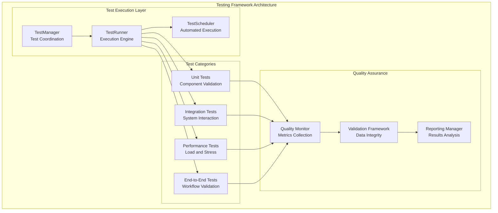
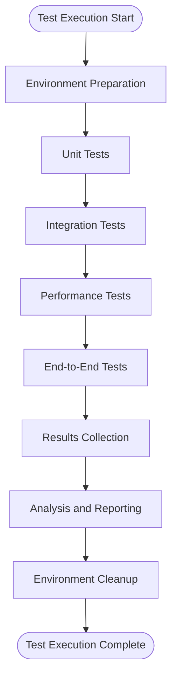

# Testing Framework Module

## Overview

The Testing Framework provides thorough validation and quality assurance for the Multi-Sensor Recording System, ensuring system reliability, performance, and data integrity across all components and integration scenarios. This component implements established software testing methodologies [Myers2011] adapted for research software quality assurance in multi-modal sensor systems.

### Research Context and Quality Assurance Foundation

The Testing Framework addresses critical quality assurance requirements for research software [Pinto2018], where system reliability directly impacts research validity and reproducibility [Wilson2014]. Modern multi-modal sensing systems require systematic validation approaches that ensure both individual component functionality and system-level integration quality.

The framework implements established testing principles:

- **Software Testing Theory** [Myers2011]: Systematic testing methodologies ensuring thorough validation coverage
- **Research Software Quality** [Pinto2018]: Quality assurance practices specifically adapted for scientific computing applications  
- **Test-Driven Development** [Beck2002]: Iterative development with continuous validation ensuring maintainable, reliable code
- **Continuous Integration Principles** [Fowler2006]: Automated testing and quality monitoring for research software development

### System Role and Responsibilities

The Testing Framework serves as the quality assurance backbone within the distributed PC master-controller architecture, providing systematic validation of all system components from individual units to complete end-to-end research scenarios.

**Primary Functions:**

- **Unit Testing**: Individual component validation ensuring correct implementation of specified functionality with thorough test coverage
- **Integration Testing**: Cross-component interaction testing validating the JSON socket protocol and multi-device coordination
- **Performance Testing**: System performance validation under realistic load conditions ensuring research-grade data collection reliability
- **End-to-End Testing**: Complete workflow validation simulating actual research scenarios with multi-modal sensor coordination
- **Quality Assurance**: Automated quality monitoring with continuous assessment of system reliability and data integrity

### Testing Architecture



## Architecture

### Test Execution Pipeline



## Testing Categories

### Unit Testing

#### Component Tests

- **Android Components**: Activity, Service, and Fragment testing
- **Python Components**: Class and function validation
- **Calibration Algorithms**: Mathematical accuracy verification
- **Signal Processing**: Algorithm correctness validation

#### Example Unit Test

```python
class CalibrationTest:
    def test_intrinsic_calibration_accuracy(self):
        """Test camera calibration accuracy with known parameters"""
        calibrator = CalibrationProcessor()
        
        # Generate synthetic calibration data
        known_parameters = generate_synthetic_calibration_data()
        test_images = generate_calibration_images(known_parameters)
        
        # Perform calibration
        result = calibrator.process_intrinsic_calibration(
            test_images, "chessboard", (9, 6), 0.025
        )
        
        # Validate accuracy
        focal_error = abs(result.camera_matrix[0, 0] - known_parameters.focal_length)
        assert focal_error < 1.0  # Less than 1 pixel error
        assert result.rms_error < 0.5  # Sub-pixel accuracy
```

### Integration Testing

#### System Integration

- **PC-Android Communication**: Network protocol validation
- **Device Synchronisation**: Temporal alignment testing
- **Data Flow**: Multi-modal data integration
- **Error Handling**: Fault tolerance validation

#### Example Integration Test

```python
class SystemIntegrationTest:
    def test_pc_android_communication(self):
        """Test complete PC-Android communication flow"""
        # Setup test environment
        pc_controller = TestPCController()
        android_simulator = AndroidDeviceSimulator()

        # Test device discovery
        discovered = pc_controller.discover_devices()
        assert android_simulator.device_id in discovered

        # Test message exchange
        test_message = create_test_message()
        response = pc_controller.send_message(android_simulator.device_id, test_message)
        assert response.success
        assert response.data == expected_response_data
```

### Performance Testing

#### Load Testing

- **Concurrent Device Management**: Multiple device handling
- **Network Throughput**: Data streaming performance
- **Memory Usage**: Resource utilisation monitoring
- **CPU Performance**: Processing efficiency testing

#### Example Performance Test

```python
class PerformanceTest:
    def test_concurrent_device_performance(self):
        """Test system performance with multiple concurrent devices"""
        device_manager = DeviceManager()
        
        # Simulate multiple devices
        device_count = 8
        devices = [create_simulated_device(i) for i in range(device_count)]
        
        # Measure performance metrics
        start_time = time.time()
        memory_before = get_memory_usage()
        
        # Connect all devices
        for device in devices:
            device_manager.connect_device(device)
        
        # Start data streaming
        for device in devices:
            device_manager.start_streaming(device.device_id)
        
        # Monitor for duration
        time.sleep(60)  # 1 minute test
        
        # Collect metrics
        end_time = time.time()
        memory_after = get_memory_usage()
        cpu_usage = get_average_cpu_usage()
        
        # Validate performance
        assert memory_after - memory_before < 100_000_000  # <100MB increase
        assert cpu_usage < 50.0  # <50% average CPU usage
        assert all(device.is_streaming() for device in devices)
```

### End-to-End Testing

#### Complete Workflow Testing

- **Recording Session Lifecycle**: Full session execution
- **Data Integrity**: End-to-end data validation
- **Quality Assurance**: Complete quality pipeline
- **Export Workflows**: Data export and format validation

#### Example E2E Test

```python
class EndToEndTest:
    def test_complete_recording_session(self):
        """Test complete recording session workflow"""
        # Initialise system
        system = MultiSensorRecordingSystem()
        system.initialise()
        
        # Create session configuration
        session_config = SessionConfig(
            duration=30,
            devices=["android_01", "android_02"],
            recording_modes=["camera", "thermal", "shimmer"]
        )
        
        # Execute complete workflow
        session = system.create_session(session_config)
        assert session.session_id is not None
        
        # Start recording
        success = system.start_recording(session.session_id)
        assert success
        
        # Monitor recording
        time.sleep(30)  # Wait for completion
        
        # Stop recording
        success = system.stop_recording(session.session_id)
        assert success
        
        # Validate results
        session_data = system.get_session_data(session.session_id)
        assert session_data.is_complete()
        assert session_data.quality_score > 0.8
        assert len(session_data.data_files) > 0
```

## Implementation Guide

### Test Framework Implementation

```python
class TestFramework:
    """complete testing framework coordinator"""

    def __init__(self):
        self.test_suites = {}
        self.test_results = {}
        self.quality_monitor = QualityMonitor()
        self.performance_monitor = PerformanceMonitor()

    def register_test_suite(self, name: str, test_suite: TestSuite):
        """Register test suite for execution"""
        self.test_suites[name] = test_suite

    def run_all_tests(self) -> TestResults:
        """Execute all registered test suites"""
        results = TestResults()

        for suite_name, test_suite in self.test_suites.items():
            suite_results = self._run_test_suite(suite_name, test_suite)
            results.add_suite_results(suite_name, suite_results)

        return results

    def run_test_category(self, category: TestCategory) -> TestResults:
        """Run tests for specific category"""
        category_suites = {
            name: suite for name, suite in self.test_suites.items()
            if suite.category == category
        }

        results = TestResults()
        for suite_name, test_suite in category_suites.items():
            suite_results = self._run_test_suite(suite_name, test_suite)
            results.add_suite_results(suite_name, suite_results)

        return results

    def _run_test_suite(self, name: str, test_suite: TestSuite) -> SuiteResults:
        """Execute individual test suite"""
        logger.info(f"Running test suite: {name}")

        suite_results = SuiteResults(name)

        for test in test_suite.tests:
            try:
                # Setup test environment
                test_env = self._setup_test_environment(test)

                # Execute test
                start_time = time.time()
                test_result = test.execute(test_env)
                execution_time = time.time() - start_time

                # Collect performance metrics
                performance_metrics = self.performance_monitor.collect_metrics(test)

                # Validate results
                validation_result = self._validate_test_result(test, test_result)

                # Store results
                suite_results.add_test_result(TestResult(
                    test_name=test.name,
                    success=validation_result.success,
                    execution_time=execution_time,
                    performance_metrics=performance_metrics,
                    error_message=validation_result.error_message
                ))

                # Cleanup
                self._cleanup_test_environment(test_env)

            except Exception as e:
                logger.error(f"Test {test.name} failed with exception: {e}")
                suite_results.add_test_result(TestResult(
                    test_name=test.name,
                    success=False,
                    error_message=str(e)
                ))

        return suite_results
```

### Quality Validation Framework

```python
class QualityValidator:
    """Automated quality validation for test results"""
    
    def __init__(self):
        self.validation_rules = {}
        self.quality_thresholds = QualityThresholds()
    
    def register_validation_rule(self, test_type: str, rule: ValidationRule):
        """Register validation rule for specific test type"""
        if test_type not in self.validation_rules:
            self.validation_rules[test_type] = []
        self.validation_rules[test_type].append(rule)
    
    def validate_test_results(self, test_results: TestResults) -> ValidationReport:
        """Validate test results against quality criteria"""
        validation_report = ValidationReport()
        
        for suite_name, suite_results in test_results.suite_results.items():
            suite_validation = self._validate_suite_results(suite_results)
            validation_report.add_suite_validation(suite_name, suite_validation)
        
        # Calculate overall quality score
        overall_quality = self._calculate_overall_quality(validation_report)
        validation_report.overall_quality = overall_quality
        
        return validation_report
    
    def _validate_suite_results(self, suite_results: SuiteResults) -> SuiteValidation:
        """Validate individual test suite results"""
        suite_validation = SuiteValidation(suite_results.name)
        
        # Calculate success rate
        total_tests = len(suite_results.test_results)
        successful_tests = sum(1 for result in suite_results.test_results if result.success)
        success_rate = successful_tests / total_tests if total_tests > 0 else 0.0
        
        # Validate against thresholds
        if success_rate >= self.quality_thresholds.minimum_success_rate:
            suite_validation.success_rate_valid = True
        else:
            suite_validation.success_rate_valid = False
            suite_validation.issues.append(f"Success rate {success_rate:.1%} below threshold")
        
        # Validate performance metrics
        performance_validation = self._validate_performance_metrics(suite_results)
        suite_validation.performance_valid = performance_validation.valid
        suite_validation.issues.extend(performance_validation.issues)
        
        return suite_validation
```

## User Guide

### Running Tests

#### Quick Test Execution

```bash
# Run all tests
python -m pytest tests/

# Run specific test category
python -m pytest tests/unit/
python -m pytest tests/integration/
python -m pytest tests/performance/

# Run with coverage
python -m pytest tests/ --cov=bucika_gsr --cov-report=html

# Run specific test file
python -m pytest tests/test_calibration.py -v
```

#### Framework-Specific Commands

```bash
# Run thorough test suite
python run_complete_test_suite.py

# Run quick validation tests
python run_quick_recording_session_test.py

# Run performance benchmarks
python test_enhanced_stress_testing.py --devices 4 --duration 300

# Run network resilience tests
python test_network_resilience.py --latency-range 1-100
```

### Test Configuration

#### Test Environment Setup

```python
# test_config.py
TEST_CONFIG = {
    "android_devices": ["192.168.1.101", "192.168.1.102"],
    "test_duration": 30,
    "quality_thresholds": {
        "sync_precision": 1.0,  # milliseconds
        "data_quality": 0.8,    # quality score
        "success_rate": 0.95    # minimum pass rate
    },
    "performance_limits": {
        "max_memory_mb": 1000,
        "max_cpu_percent": 60,
        "max_latency_ms": 100
    }
}
```

### Quality Monitoring

#### Real-time Test Monitoring

1. **Test Progress Tracking**: Live updates during test execution
2. **Performance Metrics**: Real-time resource usage monitoring
3. **Quality Indicators**: Immediate feedback on test quality
4. **Error Detection**: Early identification of test failures

#### Test Results Analysis

1. **Success Rate Analysis**: Pass/fail statistics across test categories
2. **Performance Trends**: Resource usage and timing analysis
3. **Quality Assessment**: Overall system quality evaluation
4. **Regression Detection**: Comparison with historical results

## API Reference

### Core Testing Classes

#### TestFramework

```python
class TestFramework:
    def register_test_suite(self, name: str, test_suite: TestSuite):
        """Register test suite for execution"""

    def run_all_tests(self) -> TestResults:
        """Execute all registered test suites"""

    def run_test_category(self, category: TestCategory) -> TestResults:
        """Run tests for specific category"""
```

#### QualityValidator

```python
class QualityValidator:
    def register_validation_rule(self, test_type: str, rule: ValidationRule):
        """Register validation rule for specific test type"""
    
    def validate_test_results(self, test_results: TestResults) -> ValidationReport:
        """Validate test results against quality criteria"""
```

### Data Models

#### TestResult

```python
@dataclass
class TestResult:
    test_name: str
    success: bool
    execution_time: float
    performance_metrics: Dict[str, float]
    error_message: Optional[str] = None
```

#### ValidationReport

```python
@dataclass
class ValidationReport:
    overall_quality: float
    suite_validations: Dict[str, SuiteValidation]
    quality_issues: List[str]
    recommendations: List[str]
```

## Continuous Integration

### CI/CD Pipeline Integration

```yaml
# .github/workflows/test.yml
name: complete Testing

on: [push, pull_request]

jobs:
  test:
    runs-on: ubuntu-latest
    steps:
      - uses: actions/checkout@v2
      - name: Set up Python
        uses: actions/setup-python@v2
        with:
          python-version: '3.8'
      - name: Install dependencies
        run: |
          pip install -r requirements-test.txt
      - name: Run unit tests
        run: python -m pytest tests/unit/ --cov
      - name: Run integration tests
        run: python -m pytest tests/integration/
      - name: Generate test report
        run: python generate_test_report.py
```

### Automated Quality Gates

1. **Minimum Success Rate**: 95% tests must pass
2. **Performance Thresholds**: Memory and CPU usage limits
3. **Code Coverage**: Minimum 80% coverage required
4. **Quality Score**: Overall quality score >0.85

## Quality Metrics

### Success Rate Metrics

- **Unit Tests**: >98% success rate
- **Integration Tests**: >95% success rate
- **Performance Tests**: >90% success rate
- **End-to-End Tests**: >95% success rate

### Performance Benchmarks

- **Test Execution Time**: <30 minutes for complete suite
- **Memory Usage**: <1GB peak usage during testing
- **CPU Utilisation**: <60% average during test execution
- **Network Latency**: <10ms average in test environment

---

*For related modules, see [Session Management](session_management_readme.md) and [Multi-Device Synchronisation](multi_device_synchronization_readme.md) documentation.*

## References

[Beck2002] Beck, K. (2002). *Test Driven Development: By Example*. Addison-Wesley Professional.

[Fowler2006] Fowler, M., & Foemmel, M. (2006). Continuous integration. *Thought-Works*. Retrieved from <https://www.martinfowler.com/articles/continuousIntegration.html>

[Myers2011] Myers, G. J., Sandler, C., & Badgett, T. (2011). *The Art of Software Testing* (3rd ed.). John Wiley & Sons.

[Pinto2018] Pinto, G., Wiese, I., & Dias, L. F. (2018). How do scientists develop and use scientific software? In *Proceedings of the 2018 IEEE/ACM 40th International Conference on Software Engineering: Software Engineering in Society* (pp. 81-90).

[Wilson2014] Wilson, G., Aruliah, D. A., Brown, C. T., Hong, N. P. C., Davis, M., Guy, R. T., ... & Wilson, P. (2014). Best practices for scientific computing. *PLOS Biology*, 12(1), e1001745.
