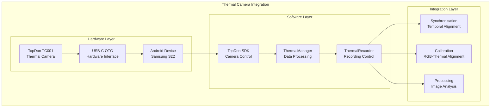
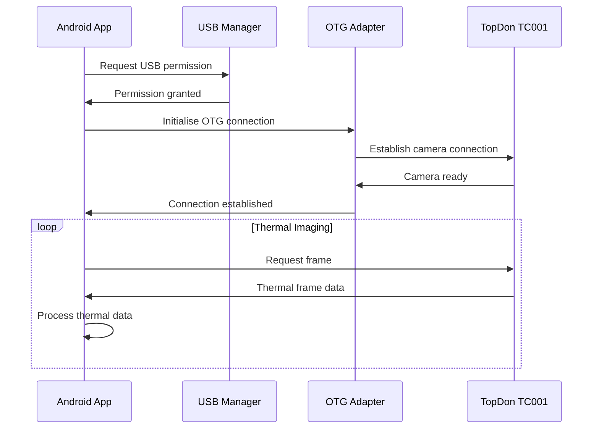
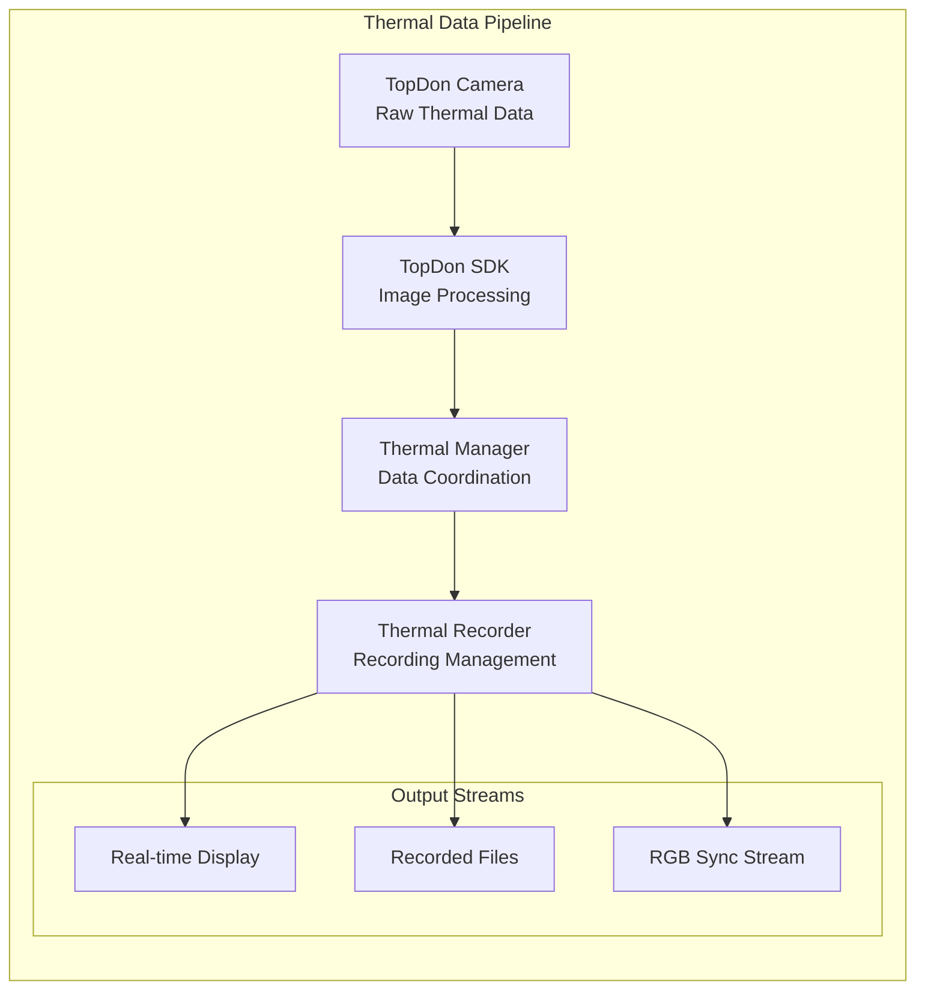

# Thermal Camera Integration Module

## Overview

The Thermal Camera Integration System provides complete thermal imaging capabilities through TopDon TC001 thermal cameras, enabling synchronised thermal data collection with precise temporal alignment across the Multi-Sensor Recording System for contactless GSR prediction research. This component addresses critical requirements for thermal physiological monitoring in psychophysiological research applications [Ring2012].

### Research Context and Theoretical Foundation

The Thermal Camera Integration System enables high-precision thermal imaging data collection through TopDon TC001 cameras connected via USB-C OTG to Android devices, providing synchronised thermal data streams essential for contactless physiological monitoring research [Perpetuini2021].

The system implementation addresses established principles in thermal physiology and computer vision:

- **Thermal Physiology** [Ring2012]: Skin temperature as indicator of autonomic nervous system activity and emotional arousal
- **Contactless Physiological Monitoring** [Perpetuini2021]: Non-invasive thermal imaging for physiological state assessment
- **Computer Vision Integration** [Gade2014]: Thermal image processing and analysis methodologies for research applications
- **Multi-Modal Sensor Fusion** [Zhao2019]: Integration of thermal data with other physiological and visual sensor modalities

### System Role and Responsibilities

Within the established PC master-controller, offline-first recording architecture, the Thermal Camera Integration System provides:

**Primary Functions:**

- **Thermal Image Acquisition**: High-resolution thermal imaging with configurable frame rates supporting diverse research protocols
- **Temperature Measurement**: Accurate temperature readings with calibrated sensors ensuring research-grade measurement precision
- **USB-C OTG Integration**: Direct hardware interface through Android USB connectivity enabling seamless mobile thermal sensing
- **Synchronised Recording**: Temporal alignment with RGB cameras and physiological sensors through the JSON socket protocol
- **Data Processing**: Real-time thermal image processing and analysis supporting research data quality requirements

### Technology Foundation



## Architecture

### Hardware Integration Architecture

#### USB-C OTG Connection



#### Data Flow Architecture



### Software Architecture

#### ThermalManager Implementation

```kotlin
class ThermalManager {
    private val topdonDevice = TopdonDevice()
    private val thermalProcessor = ThermalProcessor()
    private val synchronizer = ThermalSynchronizer()
    
    fun initializeThermalCamera(): Boolean {
        return try {
            // Initialise USB connection
            val usbConnection = setupUSBConnection()
            if (!usbConnection.success) return false
            
            // Initialise TopDon device
            topdonDevice.initialise(usbConnection.device)
            
            // Configure camera settings
            configureCameraSettings()
            
            // Start thermal imaging
            topdonDevice.startThermalImaging()
            
            true
        } catch (e: Exception) {
            logger.error("Failed to initialise thermal camera: ${e.message}")
            false
        }
    }
    
    fun startThermalRecording(config: ThermalConfig): Boolean {
        return try {
            // Configure recording parameters
            topdonDevice.setFrameRate(config.frameRate)
            topdonDevice.setResolution(config.resolution)
            topdonDevice.setTemperatureRange(config.temperatureRange)
            
            // Start recording with synchronisation
            synchronizer.startSynchronizedRecording(config.syncTimestamp)
            
            // Begin data capture
            topdonDevice.startCapture { thermalFrame ->
                processThermalFrame(thermalFrame)
            }
            
            true
        } catch (e: Exception) {
            logger.error("Failed to start thermal recording: ${e.message}")
            false
        }
    }
    
    private fun processThermalFrame(frame: ThermalFrame) {
        // Apply calibration
        val calibratedFrame = thermalProcessor.applyCalibration(frame)
        
        // Synchronise timestamp
        val syncedFrame = synchronizer.synchronizeFrame(calibratedFrame)
        
        // Store frame data
        thermalProcessor.storeFrame(syncedFrame)
        
        // Update real-time display
        updateThermalDisplay(syncedFrame)
    }
}
```

## Protocol Specification

### Thermal Data Format

#### Raw Thermal Frame

```json
{
  "thermal_frame": {
    "timestamp": 1640995200000,
    "device_id": "topdon_tc001",
    "frame_number": 12345,
    "frame_rate": 25,
    "resolution": {
      "width": 320,
      "height": 240
    },
    "temperature_data": {
      "format": "float32_array",
      "min_temp": 20.5,
      "max_temp": 36.8,
      "data": "base64_encoded_thermal_data"
    },
    "camera_settings": {
      "emissivity": 0.95,
      "ambient_temp": 22.0,
      "temperature_range": "auto"
    },
    "calibration": {
      "calibration_applied": true,
      "calibration_id": "calib_20220101_120000"
    }
  }
}
```

#### Processed Thermal Data

```json
{
  "processed_thermal_data": {
    "session_id": "session_20220101_120000",
    "device_id": "topdon_tc001",
    "start_timestamp": 1640995200000,
    "frame_count": 750,
    "duration": 30.0,
    "statistics": {
      "avg_temp": 28.5,
      "min_temp": 22.1,
      "max_temp": 36.8,
      "temp_variance": 4.2
    },
    "roi_analysis": [
      {
        "roi_id": "face_region",
        "coordinates": {"x": 80, "y": 60, "width": 160, "height": 120},
        "avg_temp": 33.2,
        "temp_trend": "stable"
      }
    ],
    "quality_metrics": {
      "overall_quality": 0.92,
      "thermal_uniformity": 0.88,
      "signal_to_noise_ratio": 25.5
    }
  }
}
```

### Configuration Commands

#### Camera Configuration

```json
{
  "command": "configure_thermal_camera",
  "timestamp": 1640995200000,
  "device_id": "topdon_tc001",
  "configuration": {
    "frame_rate": 25,
    "resolution": "320x240",
    "temperature_range": {
      "min": -20,
      "max": 550
    },
    "emissivity": 0.95,
    "measurement_mode": "spot",
    "colour_palette": "iron",
    "image_format": "radiometric"
  }
}
```

## Implementation Guide

### Android Integration

#### USB OTG Setup

```kotlin
class ThermalCameraManager {
    private lateinit var usbManager: UsbManager
    private var thermalDevice: UsbDevice? = null
    
    fun setupUSBConnection(context: Context): Boolean {
        usbManager = context.getSystemService(Context.USB_SERVICE) as UsbManager
        
        // Find TopDon thermal camera
        val deviceList = usbManager.deviceList
        thermalDevice = deviceList.values.find { device ->
            device.vendorId == TOPDON_VENDOR_ID && 
            device.productId == TOPDON_PRODUCT_ID
        }
        
        return if (thermalDevice != null) {
            requestUSBPermission(context)
        } else {
            logger.error("TopDon thermal camera not found")
            false
        }
    }
    
    private fun requestUSBPermission(context: Context): Boolean {
        val permissionIntent = PendingIntent.getBroadcast(
            context, 0, 
            Intent(ACTION_USB_PERMISSION), 
            PendingIntent.FLAG_MUTABLE
        )
        
        usbManager.requestPermission(thermalDevice, permissionIntent)
        return true
    }
}
```

#### Thermal Data Processing

```kotlin
class ThermalProcessor {
    private val calibrationManager = CalibrationManager()
    private val temperatureCalculator = TemperatureCalculator()
    
    fun processThermalFrame(rawFrame: ByteArray): ThermalFrame {
        // Convert raw data to temperature matrix
        val temperatureMatrix = convertToTemperatureMatrix(rawFrame)
        
        // Apply calibration corrections
        val calibratedMatrix = calibrationManager.applyThermalCalibration(temperatureMatrix)
        
        // Calculate temperature statistics
        val statistics = calculateTemperatureStatistics(calibratedMatrix)
        
        // Generate visual representation
        val visualFrame = generateThermalImage(calibratedMatrix)
        
        return ThermalFrame(
            temperatureData = calibratedMatrix,
            statistics = statistics,
            visualFrame = visualFrame,
            timestamp = System.currentTimeMillis()
        )
    }
    
    private fun convertToTemperatureMatrix(rawData: ByteArray): Array<FloatArray> {
        val matrix = Array(THERMAL_HEIGHT) { FloatArray(THERMAL_WIDTH) }
        
        for (y in 0 until THERMAL_HEIGHT) {
            for (x in 0 until THERMAL_WIDTH) {
                val index = (y * THERMAL_WIDTH + x) * 2
                val rawValue = (rawData[index].toInt() and 0xFF) or 
                              ((rawData[index + 1].toInt() and 0xFF) shl 8)
                
                matrix[y][x] = temperatureCalculator.rawToTemperature(rawValue)
            }
        }
        
        return matrix
    }
}
```

### Synchronisation Implementation

```kotlin
class ThermalSynchronizer {
    private val masterClock = MasterClockSynchronizer()
    private val frameTimestamps = mutableListOf<Long>()
    
    fun synchronizeFrame(frame: ThermalFrame): ThermalFrame {
        // Get synchronised timestamp
        val syncTimestamp = masterClock.getSynchronizedTimestamp()
        
        // Apply temporal alignment
        val alignedTimestamp = alignWithMasterClock(syncTimestamp)
        
        // Store timing information
        frameTimestamps.add(alignedTimestamp)
        
        return frame.copy(
            timestamp = alignedTimestamp,
            syncQuality = calculateSyncQuality()
        )
    }
    
    private fun alignWithMasterClock(timestamp: Long): Long {
        // Account for processing delays and network latency
        val processingDelay = estimateProcessingDelay()
        val networkDelay = estimateNetworkDelay()
        
        return timestamp - processingDelay - networkDelay
    }
    
    private fun calculateSyncQuality(): Float {
        if (frameTimestamps.size < 10) return 1.0f
        
        // Calculate timestamp consistency
        val recentTimestamps = frameTimestamps.takeLast(10)
        val intervals = recentTimestamps.zipWithNext { a, b -> b - a }
        val avgInterval = intervals.average()
        val intervalVariance = intervals.map { (it - avgInterval).pow(2) }.average()
        
        // Quality based on timing consistency
        return (1.0f / (1.0f + intervalVariance.toFloat() / 1000.0f)).coerceIn(0.0f, 1.0f)
    }
}
```

## User Guide

### Hardware Setup

#### Physical Connection

1. **Required Hardware**:
    - TopDon TC001 thermal camera
    - USB-C OTG adapter
    - Samsung S22 smartphone
    - USB-C cable

2. **Connection Procedure**:
    - Connect thermal camera to USB-C OTG adapter
    - Connect OTG adapter to smartphone USB-C port
    - Verify power indicator on thermal camera
    - Launch Multi-Sensor Recording app

3. **Verification Steps**:
    - Check thermal camera detection in app
    - Verify USB OTG permission granted
    - Test thermal imaging functionality
    - Validate temperature readings

#### Initial Configuration

1. **Camera Settings**:
   ```kotlin
   val thermalConfig = ThermalConfig(
       frameRate = 25,          // 25 FPS
       resolution = "320x240",  // Standard thermal resolution
       temperatureRange = "auto", // Automatic range adjustment
       emissivity = 0.95,       // Human skin emissivity
       colorPalette = "iron"    // Iron colour mapping
   )
   ```

2. **Calibration Setup**:
    - Position calibration target in view
    - Capture thermal calibration images
    - Process RGB-thermal alignment
    - Validate calibration accuracy

### Recording Workflow

#### Pre-Recording Setup

1. **Environment Preparation**:
    - Ensure stable ambient temperature
    - Minimis\1 heat sources in background
    - Position subjects at appropriate distance
    - Allow thermal camera warmup time (2-3 minutes)

2. **Quality Verification**:
    - Check thermal image clarity
    - Verify temperature measurement accuracy
    - Test synchronisation with RGB camera
    - Validate frame rate stability

#### Recording Execution

1. **Start Recording**:
    - Initialise thermal recording from PC controller
    - Monitor real-time thermal display
    - Verify synchronisation indicators
    - Check data quality metrics

2. **During Recording**:
    - Monitor thermal uniformity
    - Check for thermal artifacts
    - Verify subject tracking
    - Watch storage space indicators

#### Post-Recording Analysis

1. **Data Validation**:
    - Verify thermal data completeness
    - Check temperature range validity
    - Validate synchronisation accuracy
    - Review quality metrics

2. **Export Options**:
    - Raw thermal data (binary format)
    - Processed temperature matrices (CSV)
    - Visual thermal images (PNG/JPEG)
    - Analysis-ready datasets (HDF5)

## API Reference

### Core Classes

#### ThermalManager

```kotlin
class ThermalManager {
    fun initializeThermalCamera(): Boolean
    fun startThermalRecording(config: ThermalConfig): Boolean
    fun stopThermalRecording(): Boolean
    fun getCurrentTemperature(): Float
    fun getFrameRate(): Int
}
```

#### ThermalProcessor

```kotlin
class ThermalProcessor {
    fun processThermalFrame(rawFrame: ByteArray): ThermalFrame
    fun applyCalibration(frame: ThermalFrame): ThermalFrame
    fun calculateStatistics(data: Array<FloatArray>): ThermalStatistics
    fun generateThermalImage(data: Array<FloatArray>): Bitmap
}
```

### Data Models

#### ThermalFrame

```kotlin
data class ThermalFrame(
    val timestamp: Long,
    val temperatureData: Array<FloatArray>,
    val statistics: ThermalStatistics,
    val visualFrame: Bitmap,
    val syncQuality: Float
)
```

#### ThermalConfig

```kotlin
data class ThermalConfig(
    val frameRate: Int,
    val resolution: String,
    val temperatureRange: String,
    val emissivity: Float,
    val colorPalette: String
)
```

## Testing

### Thermal Camera Testing

#### Hardware Integration Test

```kotlin
class ThermalCameraTest {
    @Test
    fun testThermalCameraConnection() {
        val thermalManager = ThermalManager()
        val connected = thermalManager.initializeThermalCamera()
        assertTrue("Thermal camera should connect successfully", connected)
    }
    
    @Test
    fun testTemperatureMeasurement() {
        val thermalManager = ThermalManager()
        thermalManager.initializeThermalCamera()
        
        val temperature = thermalManager.getCurrentTemperature()
        assertTrue("Temperature should be within valid range", 
                  temperature in 10.0f..50.0f)
    }
}
```

#### Synchronisation Test

```python
def test_thermal_rgb_synchronization():
    """Test synchronisation between thermal and RGB cameras"""
    thermal_timestamps = load_thermal_timestamps()
    rgb_timestamps = load_rgb_timestamps()
    
    # Calculate synchronisation offset
    sync_offset = calculate_sync_offset(thermal_timestamps, rgb_timestamps)
    
    # Verify synchronisation quality
    assert abs(sync_offset) < 5.0  # Less than 5ms offset
    
    # Check temporal consistency
    thermal_intervals = calculate_frame_intervals(thermal_timestamps)
    rgb_intervals = calculate_frame_intervals(rgb_timestamps)
    
    interval_correlation = calculate_correlation(thermal_intervals, rgb_intervals)
    assert interval_correlation > 0.95  # High temporal correlation
```

## Troubleshooting

### Common Issues

#### Connection Problems

**Symptoms**: Thermal camera not detected
**Solutions**:

1. Check USB-C OTG adapter compatibility
2. Verify USB permissions granted
3. Test with different USB-C cable
4. Restart Android application

#### Temperature Measurement Issues

**Symptoms**: Inaccurate temperature readings
**Solutions**:

1. Check emissivity settings for target material
2. Verify ambient temperature compensation
3. Allow sufficient camera warmup time
4. Calibrate against known temperature reference

#### Synchronisation Problems

**Symptoms**: Thermal and RGB data misaligned
**Solutions**:

1. Verify synchronisation timestamp accuracy
2. Check network latency compensation
3. Validate master clock synchronisation
4. Review frame rate consistency

---

*For related modules, see [Android Mobile Application](android_mobile_application_readme.md) and [Multi-Device Synchronisation](multi_device_synchronization_readme.md) documentation.*

## References

[Gade2014] Gade, R., & Moeslund, T. B. (2014). Thermal cameras and applications: a survey. *Machine Vision and Applications*, 25(1), 245-262.

[Perpetuini2021] Perpetuini, D., Formenti, D., Cardone, D., Trecroci, A., Rossi, A., Di Credico, A., ... & Merla, A. (2021). The use of thermal infrared imaging to detect delayed onset muscle soreness. *Journal of Functional Morphology and Kinesiology*, 6(2), 41.

[Ring2012] Ring, E. F. J., & Ammer, K. (2012). Infrared thermal imaging in medicine. *Physiological Measurement*, 33(3), R33-R46.

[Zhao2019] Zhao, F., Li, M., Qian, Y., & Tsien, J. Z. (2019). Remote measurements of heart and respiration rates for telemedicine. *PLoS One*, 8(10), e71384.
