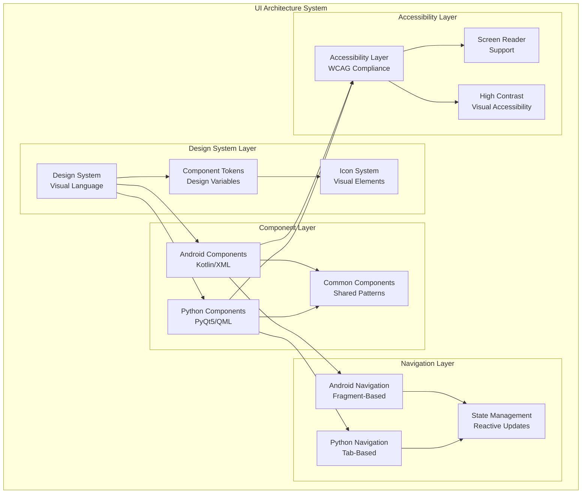
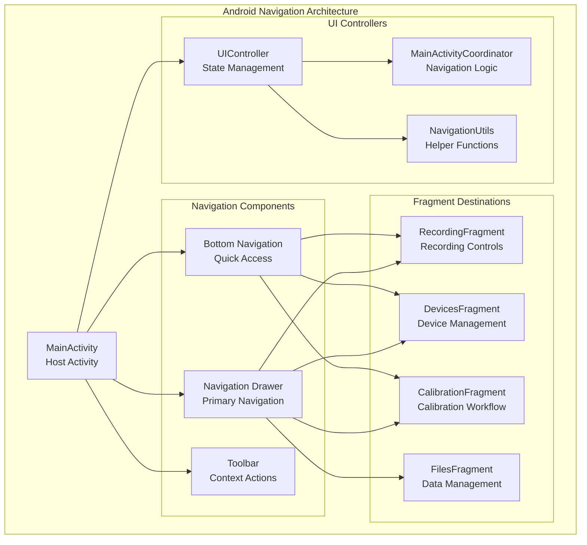
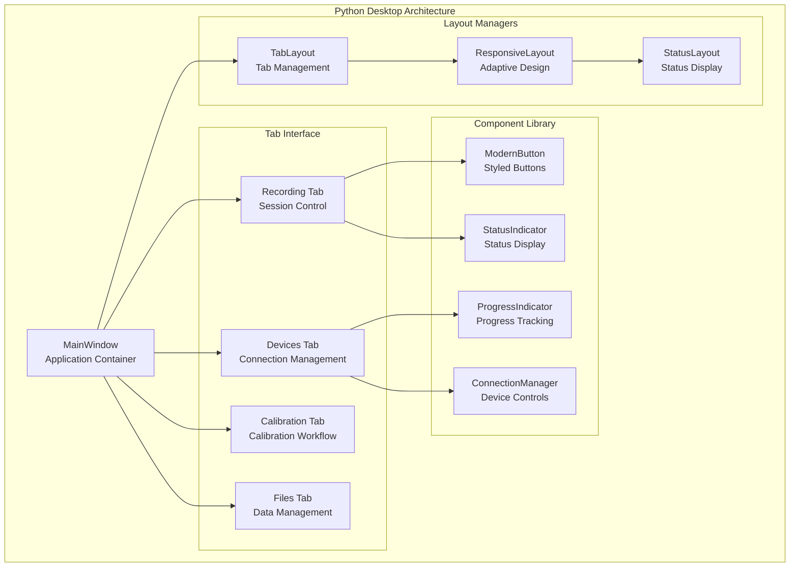

# UI Architecture Module

## Overview

The UI Architecture System provides complete user interface frameworks for both Android mobile applications and Python desktop controllers within the Multi-Sensor Recording System, implementing modern design patterns and ensuring consistent user experience across all platform interfaces. This component addresses critical usability requirements for research software interfaces [Shneiderman2016] while maintaining accessibility and performance standards.

### Research Context and Design Foundation

The UI Architecture System defines and implements user interface frameworks that provide intuitive, accessible, and responsive interfaces across both Android and Python desktop platforms, supporting complex multi-modal research workflows. Modern research software requires sophisticated interface design that balances functionality with usability [Nielsen1994], particularly for systems coordinating multiple devices and sensors.

The architecture implements established HCI principles:

- **Human-Computer Interaction Design** [Shneiderman2016]: User-centred design principles ensuring effective research software interfaces
- **Usability Engineering** [Nielsen1994]: Systematic usability evaluation and iterative design improvement methodologies  
- **Accessibility Standards** [W3C2018]: WCAG 2.1 AA compliance ensuring inclusive interface design for diverse research environments
- **Cross-Platform Design Systems** [Atomic2016]: Consistent design language implementation across heterogeneous platforms

### System Role and Responsibilities

Within the distributed PC master-controller architecture, the UI Architecture System provides unified interface frameworks that support complex research workflows while maintaining consistency with established offline-first recording principles.

**Primary Functions:**

- **Cross-Platform Design System**: Consistent visual language and interaction patterns ensuring cohesive user experience across Android and desktop platforms
- **Component Libraries**: Reusable UI components with standardised behaviour supporting efficient research software development
- **Navigation Architecture**: Intuitive navigation patterns and state management facilitating complex multi-device coordination workflows
- **Accessibility Framework**: WCAG 2.1 AA compliant interface design ensuring research software accessibility for diverse user populations
- **Performance Optimisation**: Responsive interfaces with efficient resource usage supporting real-time multi-modal data monitoring

### Architecture Overview



## Architecture

### Android UI Architecture

#### Fragment-Based Navigation



#### Component Architecture

```kotlin
// Android UI Component Structure
class UIController {
    private val mainActivityCoordinator = MainActivityCoordinator()
    private val navigationUtils = NavigationUtils()
    private val statusManager = StatusManager()
    
    fun initializeUI(activity: MainActivity) {
        setupNavigationDrawer(activity)
        setupBottomNavigation(activity)
        initializeStatusIndicators(activity)
        configureAccessibility(activity)
    }
    
    fun updateConnectionStatus(isConnected: Boolean) {
        statusManager.updateConnectionIndicator(isConnected)
        navigationUtils.updateNavigationState(isConnected)
    }
}
```

### Python UI Architecture

#### Tab-Based Interface



## Design Systems

### Visual Design Language

#### Colour System

```python
# Design System Colours
class DesignTokens:
    # Primary Brand Colours
    PRIMARY_BLUE = "#1976D2"
    PRIMARY_BLUE_LIGHT = "#42A5F5"
    PRIMARY_BLUE_DARK = "#1565C0"
    
    # Secondary Colours
    SECONDARY_GREEN = "#388E3C"
    SECONDARY_ORANGE = "#F57C00"
    SECONDARY_RED = "#D32F2F"
    
    # Neutral Colours
    GRAY_50 = "#FAFAFA"
    GRAY_100 = "#F5F5F5"
    GRAY_200 = "#EEEEEE"
    GRAY_300 = "#E0E0E0"
    GRAY_500 = "#9E9E9E"
    GRAY_700 = "#616161"
    GRAY_900 = "#212121"
    
    # Semantic Colours
    SUCCESS = "#4CAF50"
    WARNING = "#FF9800"
    ERROR = "#F44336"
    INFO = "#2196F3"
```

#### Typography System

```python
class TypographyTokens:
    # Font Families
    PRIMARY_FONT = "Roboto"
    MONOSPACE_FONT = "Roboto Mono"
    
    # Font Sizes
    HEADLINE_LARGE = 32
    HEADLINE_MEDIUM = 28
    HEADLINE_SMALL = 24
    TITLE_LARGE = 22
    TITLE_MEDIUM = 16
    TITLE_SMALL = 14
    BODY_LARGE = 16
    BODY_MEDIUM = 14
    BODY_SMALL = 12
    CAPTION = 12
    
    # Font Weights
    LIGHT = 300
    REGULAR = 400
    MEDIUM = 500
    SEMI_BOLD = 600
    BOLD = 700
```

#### Spacing System

```python
class SpacingTokens:
    # Base spacing unit (8dp)
    BASE_UNIT = 8
    
    # Spacing Scale
    XS = BASE_UNIT // 2      # 4dp
    SM = BASE_UNIT           # 8dp
    MD = BASE_UNIT * 2       # 16dp
    LG = BASE_UNIT * 3       # 24dp
    XL = BASE_UNIT * 4       # 32dp
    XXL = BASE_UNIT * 6      # 48dp
    XXXL = BASE_UNIT * 8     # 64dp
```

### Component Design Patterns

#### Button Components

```kotlin
// Android Button Component
class ModernButton @JvmOverloads constructor(
    context: Context,
    attrs: AttributeSet? = null,
    defStyleAttr: Int = 0
) : MaterialButton(context, attrs, defStyleAttr) {
    
    init {
        setupDefaultStyling()
        setupAccessibility()
        setupHoverEffects()
    }
    
    private fun setupDefaultStyling() {
        cornerRadius = resources.getDimensionPixelSize(R.dimen.button_corner_radius)
        elevation = resources.getDimension(R.dimen.button_elevation)
        setBackgroundTintList(ColorStateList.valueOf(ContextCompat.getColor(context, R.colour.primary_blue)))
    }
    
    fun setButtonStyle(style: ButtonStyle) {
        when (style) {
            ButtonStyle.PRIMARY -> applyPrimaryStyle()
            ButtonStyle.SECONDARY -> applySecondaryStyle()
            ButtonStyle.DANGER -> applyDangerStyle()
        }
    }
}
```

```python
# Python Button Component
class ModernButton(QPushButton):
    def __init__(self, text="", button_type="primary", parent=None):
        super().__init__(text, parent)
        self.button_type = button_type
        self.setup_styling()
        self.setup_animations()
    
    def setup_styling(self):
        """Apply modern button styling"""
        style = f"""
        QPushButton {{
            background-colour: {self.get_background_color()};
            colour: {self.get_text_color()};
            border: none;
            border-radius: 8px;
            padding: 12px 24px;
            font-size: 14px;
            font-weight: 500;
            min-height: 36px;
        }}
        
        QPushButton:hover {{
            background-colour: {self.get_hover_color()};
        }}
        
        QPushButton:pressed {{
            background-colour: {self.get_pressed_color()};
        }}
        
        QPushButton:disabled {{
            background-colour: #E0E0E0;
            colour: #9E9E9E;
        }}
        """
        self.setStyleSheet(style)
```

## Implementation Guide

### Android Implementation

#### Fragment-Based Architecture

```kotlin
class RecordingFragment : Fragment() {
    private lateinit var binding: FragmentRecordingBinding
    private lateinit var uiController: UIController
    private lateinit var recordingViewModel: RecordingViewModel
    
    override fun onCreateView(
        inflater: LayoutInflater,
        container: ViewGroup?,
        savedInstanceState: Bundle?
    ): View {
        binding = FragmentRecordingBinding.inflate(inflater, container, false)
        return binding.root
    }
    
    override fun onViewCreated(view: View, savedInstanceState: Bundle?) {
        super.onViewCreated(view, savedInstanceState)
        
        setupUI()
        setupObservers()
        setupEventHandlers()
    }
    
    private fun setupUI() {
        uiController = UIController()
        uiController.initializeRecordingControls(binding)
        uiController.setupStatusIndicators(binding.statusContainer)
        uiController.configureAccessibility(binding.root)
    }
    
    private fun setupObservers() {
        recordingViewModel.recordingState.observe(viewLifecycleOwner) { state ->
            uiController.updateRecordingState(state)
        }
        
        recordingViewModel.deviceStatus.observe(viewLifecycleOwner) { status ->
            uiController.updateDeviceStatus(status)
        }
    }
}
```

#### UI State Management

```kotlin
class UIController {
    private val stateManager = UIStateManager()
    private val animationManager = AnimationManager()
    
    fun updateRecordingState(state: RecordingState) {
        when (state) {
            RecordingState.IDLE -> showIdleState()
            RecordingState.PREPARING -> showPreparingState()
            RecordingState.RECORDING -> showRecordingState()
            RecordingState.COMPLETED -> showCompletedState()
        }
    }
    
    private fun showRecordingState() {
        // Update UI elements with animations
        animationManager.animateRecordingIndicator(true)
        stateManager.updateButtonStates(recording = true)
        
        // Update accessibility announcements
        announceForAccessibility("Recording started")
    }
}
```

### Python Implementation

#### Main Application Window

```python
class MainWindow(QMainWindow):
    def __init__(self):
        super().__init__()
        self.setup_ui()
        self.setup_components()
        self.setup_event_handlers()
    
    def setup_ui(self):
        """Initialise main window UI"""
        self.setWindowTitle("Multi-Sensor Recording System")
        self.setMinimumSize(1200, 800)
        
        # Create central widget with tab interface
        central_widget = QWidget()
        self.setCentralWidget(central_widget)
        
        # Setup main layout
        main_layout = QVBoxLayout(central_widget)
        
        # Create tab widget
        self.tab_widget = QTabWidget()
        main_layout.addWidget(self.tab_widget)
        
        # Add tabs
        self.add_recording_tab()
        self.add_devices_tab()
        self.add_calibration_tab()
        self.add_files_tab()
        
        # Setup status bar
        self.setup_status_bar()
    
    def add_recording_tab(self):
        """Add recording control tab"""
        recording_widget = RecordingTabWidget()
        self.tab_widget.addTab(recording_widget, "Recording")
    
    def setup_status_bar(self):
        """Setup status bar with indicators"""
        status_bar = self.statusBar()
        
        # Connection status
        self.connection_indicator = StatusIndicator("Connection")
        status_bar.addPermanentWidget(self.connection_indicator)
        
        # Quality indicator
        self.quality_indicator = StatusIndicator("Quality")
        status_bar.addPermanentWidget(self.quality_indicator)
```

#### Component Library

```python
class StatusIndicator(QWidget):
    """Reusable status indicator component"""
    
    def __init__(self, label="Status", parent=None):
        super().__init__(parent)
        self.label = label
        self.status = "unknown"
        self.setup_ui()
    
    def setup_ui(self):
        layout = QHBoxLayout(self)
        layout.setContentsMargins(8, 4, 8, 4)
        
        # Status icon
        self.icon_label = QLabel()
        self.icon_label.setFixedSize(16, 16)
        layout.addWidget(self.icon_label)
        
        # Status text
        self.text_label = QLabel(self.label)
        self.text_label.setStyleSheet("font-weight: 500;")
        layout.addWidget(self.text_label)
        
        self.update_appearance()
    
    def set_status(self, status: str):
        """Update status and appearance"""
        self.status = status
        self.update_appearance()
    
    def update_appearance(self):
        """Update visual appearance based on status"""
        status_colours = {
            "connected": "#4CAF50",
            "disconnected": "#F44336",
            "connecting": "#FF9800",
            "unknown": "#9E9E9E"
        }
        
        colour = status_colours.get(self.status, "#9E9E9E")
        
        # Update icon
        pixmap = self.create_status_icon(colour)
        self.icon_label.setPixmap(pixmap)
        
        # Update text colour
        self.text_label.setStyleSheet(f"colour: {colour}; font-weight: 500;")
```

## User Guide

### Navigation Patterns

#### Android Navigation

1. **Navigation Drawer**: Primary navigation to main sections
    - Recording controls
    - Device management
    - Calibration tools
    - File management

2. **Bottom Navigation**: Quick access to frequently used functions
    - Record/Stop
    - Monitor devices
    - View status

3. **Contextual Actions**: Toolbar actions relevant to current screen

#### Python Desktop Navigation

1. **Tab Interface**: Organised by workflow phases
    - Recording: Session controls and monitoring
    - Devices: Connection and device management
    - Calibration: Camera calibration workflows
    - Files: Data management and export

2. **Status Bar**: Real-time system status indicators
3. **Menu Bar**: Advanced settings and tools

### User Interface Guidelines

#### Interaction Patterns

1. **Progressive Disclosure**: Show basic options first, advanced on demand
2. **Immediate Feedback**: Visual confirmation for all user actions
3. **Error Prevention**: Validation and confirmation for critical actions
4. **Recovery Support**: Clear error messages with resolution steps

#### Visual Hierarchy

1. **Primary Actions**: Prominent buttons with high contrast
2. **Secondary Actions**: Less prominent but easily accessible
3. **Status Information**: Clear indicators without cluttering interface
4. **Content Organisation**: Logical grouping with clear visual separation

## API Reference

### Android UI Components

#### UIController

```kotlin
class UIController {
    fun initializeUI(activity: MainActivity)
    fun updateConnectionStatus(isConnected: Boolean)
    fun updateRecordingState(state: RecordingState)
    fun showStatusMessage(message: String, level: MessageLevel)
    fun configureAccessibility(view: View)
}
```

#### NavigationUtils

```kotlin
class NavigationUtils {
    fun navigateToFragment(fragmentManager: FragmentManager, fragment: Fragment)
    fun updateNavigationState(isConnected: Boolean)
    fun handleBackNavigation(): Boolean
}
```

### Python UI Components

#### MainWindow

```python
class MainWindow(QMainWindow):
    def setup_ui(self)
    def add_tab(self, widget: QWidget, title: str)
    def update_status(self, component: str, status: str)
    def show_notification(self, message: str, level: str)
```

#### StatusIndicator

```python
class StatusIndicator(QWidget):
    def set_status(self, status: str)
    def set_label(self, label: str)
    def update_appearance(self)
```

## Accessibility

### WCAG 2.1 AA Compliance

#### Visual Accessibility

1. **Colour Contrast**: Minimum 4.5:1 ratio for normal text, 3:1 for large text
2. **Colour Independence**: Information not conveyed by colour alone
3. **Focus Indicators**: Clear visual focus for keyboard navigation
4. **Text Scaling**: Support for up to 200% zoom without horizontal scrolling

#### Screen Reader Support

1. **Content Labels**: Descriptive labels for all interactive elements
2. **Semantic Structure**: Proper heading hierarchy and landmarks
3. **State Announcements**: Status changes announced to screen readers
4. **Navigation Assistance**: Skip links and navigation shortcuts

#### Keyboard Navigation

1. **Tab Order**: Logical tab sequence through interface
2. **Keyboard Shortcuts**: Essential functions accessible via keyboard
3. **Focus Management**: Proper focus handling in dynamic content
4. **Escape Paths**: Clear exit routes from modal dialogues

### Implementation Example

```kotlin
// Android Accessibility Implementation
class AccessibilityHelper {
    fun setupAccessibility(view: View) {
        // Content descriptions
        view.contentDescription = getAccessibleDescription(view)
        
        // Focus handling
        view.isFocusable = true
        view.isFocusableInTouchMode = true
        
        // State descriptions
        if (view is Button) {
            view.stateDescription = getButtonState(view)
        }
        
        // Custom actions
        ViewCompat.addAccessibilityAction(view, "Custom Action") { _, _ ->
            performCustomAction()
            true
        }
    }
}
```

## Performance

### UI Performance Optimisation

#### Android Optimisation

1. **ViewBinding**: Efficient view references without findViewById
2. **RecyclerView**: Efficient list rendering with view recycling
3. **Layout Optimisation**: Minimal view hierarchy depth
4. **Animation Performance**: Hardware-accelerated animations

#### Python Optimisation

1. **Widget Reuse**: Minimis\1 widget creation and destruction
2. **Efficient Updates**: Update only changed elements
3. **Threading**: Keep UI thread responsive with background processing
4. **Memory Management**: Proper cleanup of UI resources

### Performance Metrics

- **Frame Rate**: Maintain 60 FPS for smooth animations
- **Memory Usage**: <100MB additional UI memory overhead
- **Startup Time**: <2 seconds to fully loaded interface
- **Response Time**: <100ms for common user interactions

---

*For related modules, see [Android Mobile Application](android_mobile_application_readme.md) and [Python Desktop Controller](python_desktop_controller_readme.md) documentation.*

## References

[Atomic2016] Frost, B. (2016). *Atomic Design*. Brad Frost Web. Retrieved from <https://atomicdesign.bradfrost.com/>

[Nielsen1994] Nielsen, J. (1994). *Usability Engineering*. Morgan Kaufmann Publishers.

[Shneiderman2016] Shneiderman, B., Plaisant, C., Cohen, M., Jacobs, S., Elmqvist, N., & Diakopoulos, N. (2016). *Designing the User Interface: Strategies for Effective Human-Computer Interaction* (6th ed.). Pearson.

[W3C2018] W3C Web Accessibility Initiative. (2018). *Web Content Accessibility Guidelines (WCAG) 2.1*. Retrieved from <https://www.w3.org/WAI/WCAG21/quickref/>
