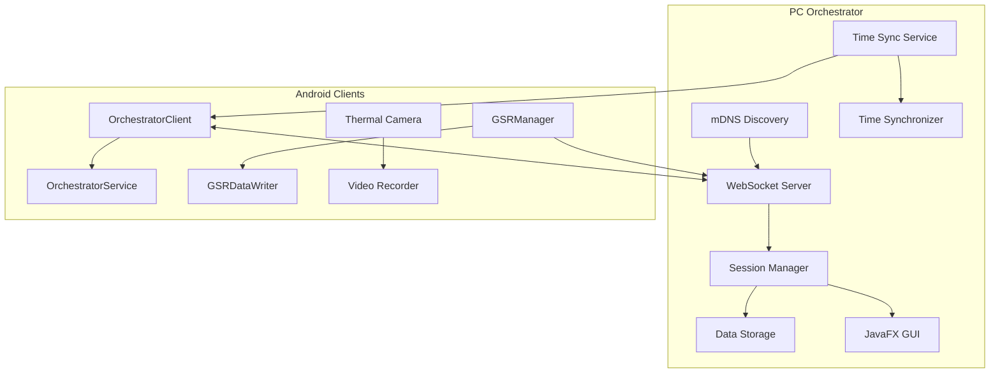
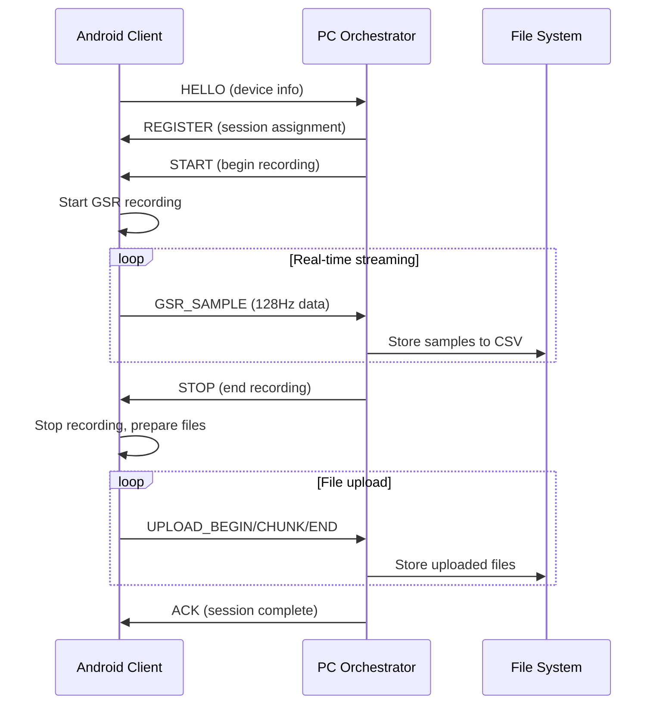

# Developer Guide - Bucika GSR Platform

## Overview

This comprehensive guide helps developers set up, understand, and contribute to the Bucika GSR multi-modal physiological data collection platform. The system integrates PC orchestration with Android clients for synchronized data collection.

## Table of Contents

1. [Quick Start](#quick-start)
2. [Development Environment Setup](#development-environment-setup)
3. [Architecture Deep Dive](#architecture-deep-dive)
4. [Building and Running](#building-and-running)
5. [Testing Strategy](#testing-strategy)
6. [Contributing Guidelines](#contributing-guidelines)
7. [Troubleshooting](#troubleshooting)
8. [Advanced Topics](#advanced-topics)

---

## Quick Start

### Prerequisites

- **Java Development Kit**: JDK 17 or higher
- **Android Studio**: Arctic Fox (2020.3.1) or later
- **Gradle**: 8.10+ (included with project)
- **Git**: For version control
- **Hardware**: 
  - Shimmer3 GSR+ sensor (for GSR testing)
  - Topdon TC001 thermal camera (for thermal imaging)
  - Android device with USB OTG support

### 5-Minute Setup

```bash
# Clone the repository
git clone https://github.com/buccancs/new-bucika-gsr.git
cd new-bucika-gsr

# Build the entire project
./gradlew build

# Run PC orchestrator (GUI mode)
./gradlew :pc:run

# In another terminal, run console demo
./gradlew :pc:runDemo

# Build Android APK
./gradlew :android:app:assembleDevDebug
```

### Verify Installation

1. **PC Orchestrator**: Should start on `http://localhost:8080`
2. **mDNS Service**: Check for `_bucika-gsr._tcp` service
3. **Android Build**: APK created in `android/app/build/outputs/apk/`

---

## Development Environment Setup

### IDE Configuration

#### IntelliJ IDEA / Android Studio

```kotlin
// Recommended settings in .idea/misc.xml
<component name="ProjectRootManager" version="2" languageLevel="JDK_17" project-jdk-name="17" project-jdk-type="JavaSDK">
  <output url="file://$PROJECT_DIR$/build/classes" />
</component>
```

#### VS Code Extensions

- Kotlin Language Support
- Java Extension Pack
- Android iOS Emulator
- GitLens

### Project Structure

```
new-bucika-gsr/
├── android/                    # Android application modules
│   ├── app/                   # Main Android application
│   ├── libapp/                # Application library
│   ├── libcom/                # Communication library
│   └── ...                    # Additional Android modules
├── pc/                        # PC orchestrator application
│   ├── src/main/kotlin/       # PC orchestrator source
│   └── build.gradle.kts       # PC build configuration
├── docs/                      # Comprehensive documentation
├── shared-spec/               # Shared specifications
├── gradle/                    # Gradle wrapper and configs
└── build.gradle               # Root build configuration
```

### Environment Variables

Create `.env` file in project root:

```bash
# Development settings
BUCIKA_DEBUG=true
ORCHESTRATOR_PORT=8080
MDNS_SERVICE_NAME=_bucika-gsr._tcp
TIME_SYNC_PORT=9123

# Android settings
ANDROID_HOME=/path/to/android-sdk
JAVA_HOME=/path/to/jdk-17

# Logging
LOG_LEVEL=DEBUG
LOG_FILE=./logs/bucika.log
```

### Git Configuration

```bash
# Configure git hooks
./setup-dev.sh

# Set up commit message template
git config commit.template .gitmessage
```

---

## Architecture Deep Dive

### System Overview



### Key Components

#### PC Orchestrator Components

1. **WebSocketServer**: Handles client connections and message routing
2. **SessionManager**: Manages recording sessions and device coordination
3. **TimeManager**: Provides high-precision time synchronization
4. **DataManager**: Stores and manages collected data files
5. **DiscoveryService**: Broadcasts mDNS service for auto-discovery

#### Android Components

1. **OrchestratorClient**: WebSocket client for PC communication
2. **OrchestratorService**: Foreground service for persistent connection
3. **GSRManager**: Shimmer sensor management and data processing
4. **GSRDataWriter**: Local data storage and file management
5. **ThermalCameraManager**: TC001 thermal camera integration

### Data Flow



---

## Building and Running

### Build System Overview

The project uses a modular Gradle build system with:
- **Unified dependency management** via `shared.gradle` and `depend.gradle`  
- **Standardized configurations** across all modules
- **Product flavor consistency** for different deployment targets
- **Build validation** and optimization scripts

For detailed build configuration, see [GRADLE_SETUP.md](../GRADLE_SETUP.md).

### Quick Build Commands

```bash
# Build entire project
./gradlew build

# Build specific variants
./gradlew :android:app:assembleDevDebug     # Debug build
./gradlew :android:app:assembleDevRelease   # Release build

# Run validation
./gradlew validateBuild

# Clean build
./gradlew clean build
```

### Running the System

#### PC Orchestrator
```bash
./gradlew :pc:run                          # GUI mode
./gradlew :pc:runDemo                      # Console demo
```

#### Android Application
```bash
./gradlew :android:app:installDevDebug     # Install debug APK
```

For hardware-specific setup, see [HARDWARE_INTEGRATION.md](HARDWARE_INTEGRATION.md).

---

## Testing Strategy

### Comprehensive Testing Framework

The BucikaGSR platform includes three comprehensive testing suites:

#### 1. Android Testing Framework
- **89 comprehensive UI tests** covering all major user flows
- **Manager pattern integration** validation 
- **Performance and accessibility** testing
- **Test Coverage**: MainActivity, GSR Activities, Thermal Camera UI, Recording functionality

#### 2. PC Orchestrator Testing (Python)
- **70 tests total** with **69 passing (98.6% success rate)**
- **Protocol validation**, WebSocket communication, performance monitoring
- **Integration tests** for end-to-end workflows
- **Error recovery** and fault tolerance validation

#### 3. Android Unit Testing (Java/Kotlin)
- **Component-level testing** for GSR, Thermal, BLE modules
- **Manager pattern testing** for state management
- **Data processing** validation

### Running Tests

#### Android Tests
```bash
# Run all Android unit tests
./gradlew test

# Run Android UI tests
./gradlew connectedAndroidTest

# Run specific test suite
./gradlew :android:app:testDevDebugUnitTest

# Run with coverage
./gradlew testDevDebugUnitTest jacocoTestReport
```

#### PC Orchestrator Tests (Python)
```bash
# Run all PC orchestrator tests
python -m pytest tests/ -v

# Run specific test categories
python -m pytest tests/test_protocol.py -v
python -m pytest tests/test_websocket_server.py -v
python -m pytest tests/test_integration.py -v

# Run with coverage
python -m pytest tests/ --cov=src
```

#### UI Testing Framework
```bash
# Run comprehensive UI test suite
./scripts/run-ui-tests.sh comprehensive

# Run specific UI test categories
./scripts/run-ui-tests.sh thermal
./scripts/run-ui-tests.sh gsr
./scripts/run-ui-tests.sh recording
```

### Test Configuration

#### Android Test Dependencies
```gradle
dependencies {
    // Unit testing
    testImplementation 'junit:junit:4.13.2'
    testImplementation 'org.mockito:mockito-core:4.11.0'
    testImplementation 'org.robolectric:robolectric:4.10.3'
    
    // Android UI testing
    androidTestImplementation 'androidx.test.ext:junit:1.1.5'
    androidTestImplementation 'androidx.test.espresso:espresso-core:3.5.1'
    androidTestImplementation 'androidx.test.uiautomator:uiautomator:2.2.0'
}
```

#### Test Environment Setup
Create `test-config.properties` in project root:
```properties
# Test device configuration
test.shimmer.address=00:11:22:33:44:55
test.shimmer.name=TestShimmer3-GSR+
test.sampling.rate=128
test.data.directory=/data/data/com.topdon.tc001/files/test_data

# Performance thresholds
test.sync.accuracy.ms=10
test.frame.rate.min=25
test.coverage.threshold=80
```

### Component-Specific Testing

#### GSR Module Testing
- **GSRManager**: Connection, data processing, error handling
- **Shimmer Integration**: Device pairing, data streaming
- **Data Validation**: Signal quality, sampling rate accuracy

#### Thermal Camera Testing  
- **TC001 Integration**: USB connection, frame capture
- **Thermal Processing**: Temperature calculation, frame rate
- **OpenCV Integration**: Image processing accuracy

#### PC Orchestrator Testing
- **Session Management**: Multi-client coordination
- **Time Synchronization**: Precision validation (±10ms accuracy)
- **Data Storage**: File integrity, metadata accuracy
- **WebSocket Communication**: Message handling, broadcast functionality

#### UI Integration Testing
```kotlin
// Example: Manager pattern integration testing
@Test
fun testManagerIntegration() {
    // Verify ThermalCameraManager integration
    onView(withId(R.id.btn_connect_camera))
        .perform(click())
    
    // UI State Manager should update
    onView(withId(R.id.tv_camera_status))
        .check(matches(isDisplayed()))
    
    // Configuration Manager should be accessible
    onView(withId(R.id.btn_thermal_settings))
        .check(matches(isDisplayed()))
}
```

### Automated Testing & CI/CD

Tests run automatically on:
- Pull request creation
- Merge to main branch
- Nightly builds

#### GitHub Actions Integration
```yaml
- name: Run Android Tests
  run: ./gradlew test connectedAndroidTest

- name: Run PC Tests  
  run: python -m pytest tests/ -v --cov=src

- name: Upload Test Results
  uses: actions/upload-artifact@v3
  with:
    name: test-results
    path: |
      app/build/reports/tests/
      coverage-reports/
```

### Performance Testing

#### Benchmark Validation
- **UI Response Time**: <2000ms for navigation
- **Data Processing**: 128Hz GSR processing with <10ms latency
- **Memory Usage**: No leaks during extended sessions
- **Network Performance**: WebSocket message handling under load

#### Load Testing
```bash
# Test multiple simulated clients
python scripts/load_test.py --clients 50 --duration 300

# Memory usage validation
python scripts/memory_test.py --sessions 100
```

### Test Quality Gates

#### Coverage Requirements
- **Android Unit Tests**: >85% line coverage
- **PC Orchestrator Tests**: >90% line coverage (currently 98.6%)
- **Integration Tests**: All critical workflows covered
- **UI Tests**: All user interaction paths validated

#### Test Execution Standards
- All tests must pass before merging
- No test warnings or deprecation notices  
- Performance tests must meet baseline thresholds
- Integration tests must pass with real device conditions
        
        // 2. Connect Android client
        val client = connectMockClient()
        
        // 3. Run complete session
        val session = orchestrator.createSession("test")
        session.addDevice(client)
        session.start()
        
        // 4. Verify data collection
        assertThat(session.getCollectedData()).isNotEmpty()
    }
}
```

#### Performance Testing
```kotlin
@Test
fun testHighFrequencyDataStreaming() {
    val testDuration = 60_000L // 1 minute
    val expectedSamples = 60 * 128 // 128 Hz
    
    // Run high-frequency data generation
    val actualSamples = runStreamingTest(testDuration)
    
    assertThat(actualSamples).isCloseTo(expectedSamples, within(5.0))
}
```

### Test Data Generation

```kotlin
object TestDataGenerator {
    
    fun generateGSRData(samples: Int): List<ProcessedGSRData> {
        return (1..samples).map { i ->
            ProcessedGSRData(
                timestamp = System.currentTimeMillis() + i * 8, // 128 Hz
                rawGSR = 2.0 + Random.nextDouble() * 0.5,
                filteredGSR = 2.0 + Random.nextDouble() * 0.3,
                rawTemperature = 32.0 + Random.nextDouble() * 2.0,
                filteredTemperature = 32.0 + Random.nextDouble() * 1.0,
                signalQuality = 85.0 + Random.nextDouble() * 15.0,
                sampleIndex = i.toLong()
            )
        }
    }
}
```

---

## Contributing Guidelines

### Code Style

#### Kotlin Style Guide
```kotlin
// Class naming: PascalCase
class SessionManager

// Function naming: camelCase  
fun createSession(name: String): Session

// Constants: SCREAMING_SNAKE_CASE
companion object {
    private const val DEFAULT_TIMEOUT = 5000L
}

// Properties: camelCase
private val webSocketServer: WebSocketServer
```

#### Code Formatting
```bash
# Apply formatting
./gradlew spotlessApply

# Check formatting
./gradlew spotlessCheck
```

### Commit Message Format

```
type(scope): description

[optional body]

[optional footer]
```

**Types**: feat, fix, docs, style, refactor, test, chore

**Examples**:
```
feat(orchestrator): add real-time GSR data streaming

- Implement WebSocket-based data transmission
- Add batching for 128Hz GSR samples  
- Include quality metrics in data packets

Fixes #123
```

### Pull Request Process

1. **Branch Naming**: `feature/description`, `fix/issue-number`, `docs/topic`
2. **Testing**: All tests must pass
3. **Documentation**: Update relevant documentation
4. **Review**: At least one approval required
5. **Merge**: Squash and merge preferred

### Code Review Checklist

- [ ] Code follows style guidelines
- [ ] Tests added for new functionality
- [ ] Documentation updated
- [ ] No breaking changes (or properly documented)
- [ ] Performance impact considered
- [ ] Security implications reviewed

---

## Troubleshooting

### Common Issues

#### PC Orchestrator

**Issue**: WebSocket server won't start
```bash
# Check port availability
netstat -tulpn | grep :8080

# Kill competing processes
sudo kill -9 $(lsof -ti:8080)
```

**Issue**: mDNS discovery not working
```bash
# Check mDNS service
avahi-browse -rt _bucika-gsr._tcp

# Test manual connection
wscat -c ws://localhost:8080
```

#### Android Development

**Issue**: Build fails with dependency conflicts
```bash
# Clear Gradle caches
./gradlew --stop
rm -rf ~/.gradle/caches/
./gradlew build
```

**Issue**: GSR sensor connection problems
```kotlin
// Enable Bluetooth debugging
adb shell settings put global bluetooth_hci_log 1
adb bugreport
```

### Detailed Troubleshooting

#### Build and Configuration Issues

**Gradle Build Failures**
```bash
# Clean and rebuild
./gradlew clean build

# Check for dependency conflicts
./gradlew dependencies --configuration implementation

# Fix Gradle daemon issues
./gradlew --stop
rm -rf ~/.gradle/caches/
./gradlew build
```

**Android Studio Setup Issues**
- Ensure JDK 17 is configured in File → Project Structure
- Verify Android SDK path in SDK Manager
- Check Kotlin plugin version compatibility
- Clear Android Studio caches: File → Invalidate Caches and Restart

#### Hardware-Specific Issues

**GSR (Shimmer3) Issues**

*Bluetooth Connection Issues*
```kotlin
// Check Bluetooth adapter status
val bluetoothAdapter = BluetoothAdapter.getDefaultAdapter()
if (bluetoothAdapter == null) {
    XLog.e("Bluetooth", "Device does not support Bluetooth")
    return false
}

if (!bluetoothAdapter.isEnabled) {
    XLog.w("Bluetooth", "Bluetooth is disabled")
    // Request user to enable Bluetooth
}
```

*Solutions*:
- Verify Bluetooth permissions in AndroidManifest.xml
- Check device pairing status in Android settings
- Ensure Shimmer device is powered on and in range
- Reset Bluetooth stack: Settings → Apps → Bluetooth → Storage → Clear Data

*Data Quality Issues*:
- **Low signal quality**: Check electrode placement and skin contact
- **Missing samples**: Verify sampling rate configuration (128Hz)
- **High noise**: Check for electromagnetic interference
- **Signal saturation**: Adjust GSR range settings

**Thermal Camera (TC001) Issues**

*USB Connection Issues*
```xml
<!-- Ensure USB permissions in AndroidManifest.xml -->
<uses-permission android:name="android.permission.USB_PERMISSION" />
<uses-feature android:name="android.hardware.usb.host" />
```

*Solutions*:
- Grant USB permission when prompted
- Check USB OTG cable connectivity
- Verify TC001 firmware version compatibility
- Try different USB ports if available

*Performance Issues*:
- **Low frame rate**: Check USB 3.0 connection
- **Processing lag**: Optimize OpenCV operations
- **Memory issues**: Monitor thermal frame buffer usage
- **Overheating**: Allow thermal camera cooldown periods

#### PC Orchestrator Issues

**Network and Discovery Issues**

*mDNS Service Not Found*
```bash
# Check mDNS service broadcasting
avahi-browse -a | grep bucika-gsr

# Manual service registration
./gradlew :pc:run --args="--mdns-debug"

# Test network connectivity
ping [android-device-ip]
```

*WebSocket Connection Issues*:
- Check firewall settings on port 8080
- Verify network connectivity between devices  
- Monitor connection logs for timeout issues
- Test manual connection: `wscat -c ws://[pc-ip]:8080`

**Session Management Issues**

*Device Registration Failures*:
- Verify device ID uniqueness
- Check session capacity limits
- Monitor device heartbeat signals
- Validate JSON message format

*Data Synchronization Issues*:
- Validate NTP/time sync accuracy
- Check timestamp alignment across devices
- Monitor network latency and jitter
- Verify time zone consistency

#### Performance Troubleshooting

**Memory Issues**
```kotlin
// Monitor memory usage
val runtime = Runtime.getRuntime()
val usedMemory = (runtime.totalMemory() - runtime.freeMemory()) / 1024 / 1024
XLog.d("Memory", "Used memory: ${usedMemory}MB")
```

*Solutions*:
- Implement proper object lifecycle management
- Use memory profiling tools
- Clear caches periodically
- Monitor for memory leaks in long-running sessions

**Network Performance**
```bash
# Monitor network statistics
netstat -i
iftop -i wlan0

# Test bandwidth
iperf3 -s (on PC)
iperf3 -c [pc-ip] (on Android)
```

*Solutions*:
- Use 5GHz WiFi when possible
- Reduce concurrent network usage
- Implement adaptive bitrate streaming
- Monitor packet loss and retransmissions

### Debug Configuration

#### Logging Configuration
```kotlin
// logback.xml for detailed logging
<configuration>
    <appender name="CONSOLE" class="ch.qos.logback.core.ConsoleAppender">
        <encoder>
            <pattern>%d{HH:mm:ss.SSS} [%thread] %-5level %logger{36} - %msg%n</pattern>
        </encoder>
    </appender>
    
    <logger name="com.bucika" level="DEBUG"/>
    <root level="INFO">
        <appender-ref ref="CONSOLE"/>
    </root>
</configuration>
```

#### Remote Debugging
```bash
# PC orchestrator remote debugging
./gradlew :pc:run -Dorg.gradle.debug=true --debug-jvm

# Android remote debugging
adb forward tcp:5005 tcp:5005
```

---

## Advanced Topics

### Performance Optimization

#### Memory Management
```kotlin
// Use object pools for frequent allocations
class GSRDataPool {
    private val pool = ConcurrentLinkedQueue<ProcessedGSRData>()
    
    fun acquire(): ProcessedGSRData = pool.poll() ?: ProcessedGSRData()
    fun release(data: ProcessedGSRData) = pool.offer(data.reset())
}
```

#### Network Optimization
```kotlin
// Batch GSR samples for efficiency
class GSRBatcher(private val batchSize: Int = 16) {
    private val buffer = mutableListOf<GSRSample>()
    
    fun addSample(sample: GSRSample) {
        buffer.add(sample)
        if (buffer.size >= batchSize) {
            flushBuffer()
        }
    }
}
```

### Custom Extensions

#### Adding New Message Types
```kotlin
// Define new message type
@Serializable
data class CustomMessage(
    val customField: String,
    val customData: Map<String, Any>
) : MessagePayload

// Register with message handler
messageHandler.registerType("CUSTOM_MESSAGE", CustomMessage::class)
```

#### Custom Data Processors
```kotlin
interface DataProcessor<T> {
    suspend fun process(input: T): ProcessedData
}

class CustomGSRProcessor : DataProcessor<RawGSRData> {
    override suspend fun process(input: RawGSRData): ProcessedGSRData {
        // Custom processing logic
    }
}
```

### Security Considerations

#### Authentication
```kotlin
// Add authentication to WebSocket connections
class AuthenticatedWebSocketHandler : WebSocketHandler {
    override fun authenticate(headers: Map<String, String>): Boolean {
        val token = headers["Authorization"]
        return validateToken(token)
    }
}
```

#### Data Encryption
```kotlin
// Encrypt sensitive data before storage
class EncryptedDataWriter(private val encryptionKey: SecretKey) {
    fun writeEncryptedData(data: ByteArray): File {
        val encryptedData = encrypt(data, encryptionKey)
        return writeToFile(encryptedData)
    }
}
```

---

## Resources

### Documentation Links
- [API Reference](./PC_ORCHESTRATOR_API.md)
- [GSR Integration Guide](./GSR_DEVELOPMENT_SETUP.md)
- [Performance Optimization](./PERFORMANCE_OPTIMIZATION_GUIDE.md)

### External Resources
- [Shimmer3 GSR+ Documentation](https://www.shimmersensing.com/)
- [WebSocket Protocol RFC 6455](https://tools.ietf.org/html/rfc6455)
- [Kotlin Coroutines Guide](https://kotlinlang.org/docs/coroutines-guide.html)

### Community
- **Issues**: [GitHub Issues](https://github.com/buccancs/new-bucika-gsr/issues)
- **Discussions**: [GitHub Discussions](https://github.com/buccancs/new-bucika-gsr/discussions)
- **Releases**: [GitHub Releases](https://github.com/buccancs/new-bucika-gsr/releases)

---

## Development Roadmap

### new-bucika-gsr — Implementation Backlog (v1)

**Scope**
PC orchestrator controlling multiple Android clients. One Android is the **GSR leader** (Bluetooth to Shimmer). Default **Local** mode (store‑and‑forward); optional **Bridged** mode (live GSR to PC). Tight clock sync, robust ingest, session metadata, calibration.

**Priority legend**: P0 = Must for first working release; P1 = Nice‑to‑have for thesis completeness; P2 = Later.

**Traceability**: FR‑L0, FR1–FR11; NFR‑Perf/Time/Rel/Int/Sec/Use/Scale/Maint as per chapter.

---

### Milestones (execution order)

1. **M0 Foundations (P0)** → 2. **M1 Protocol & Time** → 3. **M2 Android Recording + GSR (Local)**
2. **M3 Session Manager + PC UI** → 5. **M4 Ingest/Offload** → 6. **M5 Reliability + Tests**
3. **M6 Security + Calibration (P1)** → 8. **M7 Observability + Docs**

---

### M0 Foundations (P0)

**Expected deliverables**:
- **Base Android app** (thermal imaging + UI)
- **GSR sensor integration** (Shimmer via Bluetooth)
- **Basic PC orchestrator** (WebSocket server)
- **Core protocol messages** (connection, status)

#### M0.1 Android Base App [FR-L0, FR1, FR2]

- [ ] **Android project setup** with thermal imaging library
- [ ] **Basic UI framework** for session control
- [ ] **Bluetooth permissions** and basic scanning
- [ ] **Shimmer SDK integration** (BLE connection to GSR sensor)
- [ ] **Basic GSR data collection** (connect, start, stream samples locally)
- [ ] **Local storage** for GSR data (Room database or file)

*Acceptance*: Android app can connect to Shimmer, collect GSR samples, store locally.

#### M0.2 PC Orchestrator Core [FR3, FR4]

- [ ] **PC WebSocket server** (Node.js/Python, TBD)
- [ ] **Basic message routing** to connected Android clients
- [ ] **Connection management** (client registration, heartbeat)
- [ ] **Session lifecycle** (create, start, stop, cleanup)

*Acceptance*: PC can accept Android connections, send basic commands.

#### M0.3 Android-PC Protocol [FR5]

- [ ] **WebSocket client** in Android (OkHttp or similar)
- [ ] **Message serialization** (JSON, protobuf TBD)
- [ ] **Connection state management** (reconnect, error handling)
- [ ] **Basic commands** (CONNECT, STATUS, SESSION_START, SESSION_STOP)

*Acceptance*: Android connects to PC, responds to basic session commands.

---

### M1 Protocol & Time (P0)

**Goal**: Robust time synchronization and extended protocol.

#### M1.1 Time Synchronization [NFR-Time]

- [ ] **NTP-style sync** between PC and all Android clients
- [ ] **Clock offset calculation** and compensation
- [ ] **Timestamp alignment** for GSR samples
- [ ] **Sync validation** and re-sync triggers

*Acceptance*: All devices maintain <10ms clock synchronization.

#### M1.2 Extended Protocol Messages [FR5]

- [ ] **GSR_START/GSR_STOP** commands
- [ ] **GSR_DATA** streaming message format
- [ ] **ERROR** and **ACK** response handling
- [ ] **DEVICE_INFO** and capability exchange

*Acceptance*: PC can control GSR recording across multiple Android devices.

---

### M2 Android Recording + GSR (Local Mode) [P0]

**Goal**: Complete local GSR recording with thermal imaging.

#### M2.1 GSR Data Collection [FR1, FR2, NFR-Perf]

- [ ] **High-frequency GSR sampling** (configurable rate, e.g., 512Hz)
- [ ] **Buffered data collection** with overflow protection
- [ ] **Metadata capture** (session ID, device ID, timestamps)
- [ ] **Data validation** and quality checks

*Acceptance*: Clean GSR data collection at target sampling rates.

#### M2.2 Thermal Integration [FR1]

- [ ] **Thermal camera control** (if available on device)
- [ ] **Synchronized thermal+GSR** capture
- [ ] **Thermal metadata** (frame rate, resolution, calibration)
- [ ] **Combined data storage** with consistent timestamps

*Acceptance*: Synchronized thermal and GSR data collection.

#### M2.3 Local Storage & Management [FR6, NFR-Rel]

- [ ] **Efficient local storage** (SQLite, file-based, or hybrid)
- [ ] **Data integrity** checks and validation
- [ ] **Storage space management** and cleanup policies
- [ ] **Session metadata** storage

*Acceptance*: Reliable local data persistence with integrity guarantees.

---

### M3 Session Manager + PC UI [P0]

**Goal**: Complete session orchestration from PC.

#### M3.1 Multi-Device Session Management [FR3, FR4]

- [ ] **Device discovery** and registration
- [ ] **Session planning** (assign roles, parameters)
- [ ] **Coordinated session start/stop** across all devices
- [ ] **Real-time status monitoring** during sessions

*Acceptance*: PC can orchestrate synchronized sessions across multiple Android clients.

#### M3.2 PC User Interface [FR4, NFR-Use]

- [ ] **Device management dashboard** (connect, configure, monitor)
- [ ] **Session control interface** (create, start, stop, parameters)
- [ ] **Real-time monitoring** (connection status, data rates, errors)
- [ ] **Session history** and basic analytics

*Acceptance*: Intuitive PC interface for session management.

---

### M4 Ingest/Offload [P0]

**Goal**: Data transfer from Android to PC.

#### M4.1 Data Export/Offload [FR7, FR8]

- [ ] **Data serialization** (efficient format for transfer)
- [ ] **Selective data offload** (by session, time range, device)
- [ ] **Transfer progress** tracking and resume capability
- [ ] **Data validation** after transfer

*Acceptance*: Reliable data transfer from Android to PC.

#### M4.2 PC Data Ingest & Storage [FR8, FR9]

- [ ] **PC data repository** (file system, database TBD)
- [ ] **Data deduplication** and conflict resolution
- [ ] **Metadata indexing** for efficient queries
- [ ] **Export capabilities** (CSV, JSON, research formats)

*Acceptance*: PC can store and manage collected data from multiple sessions.

---

### M5 Reliability + Tests [P0]

**Goal**: Production-ready reliability and quality.

#### M5.1 Error Handling & Recovery [NFR-Rel]

- [ ] **Connection failure recovery** (auto-reconnect, failover)
- [ ] **Data loss prevention** (local buffering, retry mechanisms)
- [ ] **Graceful degradation** (continue recording if PC disconnects)
- [ ] **Error reporting** and diagnostics

*Acceptance*: System continues operating through common failure scenarios.

#### M5.2 Testing & Validation [NFR-Rel, NFR-Perf]

- [ ] **Unit tests** for core components
- [ ] **Integration tests** for PC-Android communication
- [ ] **Performance tests** (data rates, memory usage, battery)
- [ ] **Multi-device stress testing**

*Acceptance*: Comprehensive test coverage with performance validation.

---

### M6 Security + Calibration [P1]

**Goal**: Enhanced security and sensor calibration.

#### M6.1 Security Hardening [NFR-Sec]

- [ ] **Encrypted communication** (TLS for WebSocket)
- [ ] **Device authentication** and authorization
- [ ] **Data encryption** at rest (Android local storage)
- [ ] **Access control** and audit logging

*Acceptance*: Secure communication and data protection.

#### M6.2 GSR Calibration & Quality [FR10, FR11]

- [ ] **Sensor calibration** procedures and storage
- [ ] **Data quality metrics** and real-time assessment
- [ ] **Artifact detection** and filtering
- [ ] **Calibration validation** and drift detection

*Acceptance*: High-quality, calibrated GSR data collection.

---

### M7 Observability + Docs [P1]

**Goal**: Production monitoring and complete documentation.

#### M7.1 Monitoring & Observability [NFR-Maint]

- [ ] **System health monitoring** (device status, performance metrics)
- [ ] **Data quality dashboards** and alerting
- [ ] **Log aggregation** and analysis tools
- [ ] **Performance profiling** and optimization

*Acceptance*: Complete system observability and monitoring.

#### M7.2 Documentation & Deployment [NFR-Use, NFR-Maint]

- [ ] **User documentation** (setup, operation, troubleshooting)
- [ ] **Developer documentation** (API, architecture, extension points)
- [ ] **Deployment guides** (installation, configuration, updates)
- [ ] **Training materials** for researchers/operators

*Acceptance*: Complete documentation for users and developers.

---

## Technical Decisions & Risks

### Architecture Decisions

- **Android-first approach**: Android devices handle GSR collection, PC orchestrates
- **Local-first storage**: Data persisted locally before offload (reliability)
- **WebSocket protocol**: Real-time bidirectional communication
- **Time synchronization**: NTP-style approach for sample alignment

### Key Technical Risks

1. **Bluetooth reliability**: Shimmer connection stability under load
2. **Time synchronization accuracy**: Maintaining <10ms sync across devices
3. **Data throughput**: High-frequency GSR streaming + thermal data
4. **Battery optimization**: Long recording sessions on Android
5. **Multi-device coordination**: Race conditions, state consistency

### Mitigation Strategies

- **Extensive testing** with actual Shimmer devices
- **Buffered data collection** with local persistence
- **Graceful degradation** for connection failures
- **Performance profiling** and battery optimization
- **State machine design** for robust coordination

---

## Version History

All notable changes to the Bucika GSR project are documented in this section.

The format is based on [Keep a Changelog](https://keepachangelog.com/en/1.0.0/),
and this project adheres to [Semantic Versioning](https://semver.org/spec/v2.0.0.html).

### Development Workflow

```mermaid
gitgraph
    commit id: "Initial Setup"
    branch develop
    checkout develop
    commit id: "Feature Development"
    branch feature/gsr-integration
    checkout feature/gsr-integration
    commit id: "Add GSR sensor"
    commit id: "Update changelog"
    checkout develop
    merge feature/gsr-integration
    commit id: "Integration Complete"
    checkout main
    merge develop
    commit id: "Release v1.0.0"
```

### [Unreleased]

#### Added
- Initial project structure with Android thermal imaging app
- GSR sensor integration framework with Shimmer device support
- PC orchestrator WebSocket server foundation
- Basic protocol definition for Android-PC communication
- Time synchronization framework for multi-device coordination

#### In Progress
- Multi-device session management
- Data collection and local storage optimization
- Real-time monitoring and control interface
- Comprehensive testing and quality assurance

#### Planned
- Enhanced security with encrypted communication
- Advanced GSR calibration and quality metrics
- Production deployment and monitoring tools
- Complete user and developer documentation

### Architecture Evolution

The project architecture has evolved through several phases:

1. **Phase 1: Foundation** - Basic Android app with thermal imaging
2. **Phase 2: GSR Integration** - Shimmer device connectivity and data collection
3. **Phase 3: PC Orchestration** - WebSocket server and multi-device coordination
4. **Phase 4: Production Ready** - Security, monitoring, and comprehensive testing

### Technical Milestones

- **M0: Foundations** - Basic GSR collection and PC connectivity
- **M1: Protocol & Time** - Robust synchronization and extended protocol
- **M2: Recording (Local)** - Complete local data collection capabilities
- **M3: Session Manager** - Multi-device orchestration from PC
- **M4: Ingest/Offload** - Data transfer and PC storage
- **M5: Reliability** - Production-ready error handling and testing
- **M6: Security** - Encrypted communication and calibration
- **M7: Observability** - Monitoring, documentation, and deployment

---

## Build and Setup Integration

### BucikaGSR Build and Setup Guide

This section provides comprehensive build, setup, and configuration information for the BucikaGSR Android application.

#### Overview

The BucikaGSR project is a standalone thermal imaging application with GSR (Galvanic Skin Response) sensor integration. It combines thermal imaging capabilities with physiological monitoring.

#### Build System

The project uses a comprehensive Gradle build system with:

- **Unified dependency management** across all modules
- **Standardized build configurations** for Java 17 and modern Android development  
- **Product flavor consistency** across all modules
- **Build validation and optimization** scripts
- **Shared app setup** for easier maintenance

#### Project Structure

The simplified project structure after consolidation:

```
android/
├── app/                    # Main Android application
├── libapp/                # Application logic + BLE functionality
├── libir/                 # Infrared and thermal imaging
└── libui/                 # User interface components
```

#### Dependencies

All dependencies are managed through the unified build system with shared configurations for:

- **Android SDK**: Target SDK 34, Min SDK 26
- **Java**: Java 17 with Kotlin support
- **Libraries**: Thermal imaging, BLE communication, UI components
- **Testing**: JUnit, Espresso, and custom test frameworks

#### Build Commands

```bash
# Clean build
./gradlew clean

# Debug build
./gradlew assembleDebug

# Release build  
./gradlew assembleRelease

# Run tests
./gradlew test

# Install debug APK
./gradlew installDebug
```

#### Configuration

The build system supports multiple product flavors:
- **dev**: Development build with debugging enabled
- **staging**: Pre-production testing environment
- **prod**: Production release configuration

#### Validation

The project includes automated validation scripts:
- **Build validation**: Ensures all modules compile successfully
- **Dependency validation**: Checks for conflicts and missing dependencies
- **Code quality**: Integrated linting and static analysis

For detailed setup instructions, refer to the main project documentation.

*Last Updated: December 25, 2024*  
*Version: 2.0.0*