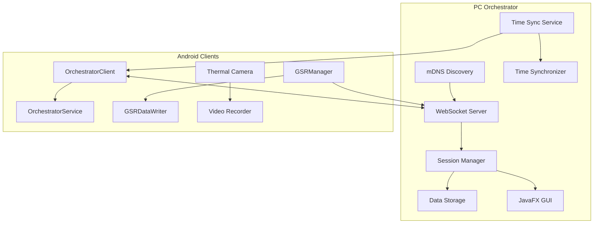
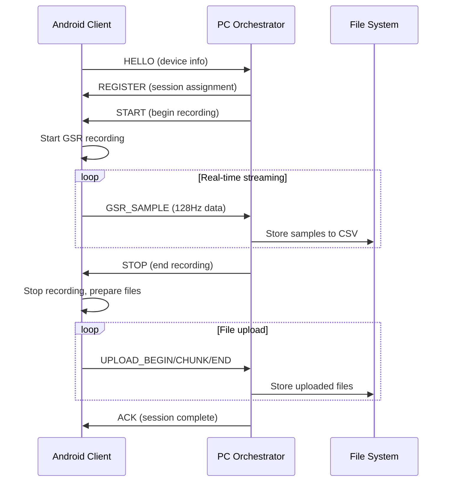

# Developer Guide - Bucika GSR Platform

## Overview

This comprehensive guide helps developers set up, understand, and contribute to the Bucika GSR multi-modal physiological data collection platform. The system integrates PC orchestration with Android clients for synchronized data collection.

## Table of Contents

1. [Quick Start](#quick-start)
2. [Development Environment Setup](#development-environment-setup)
3. [Architecture Deep Dive](#architecture-deep-dive)
4. [Building and Running](#building-and-running)
5. [Testing Strategy](#testing-strategy)
6. [Contributing Guidelines](#contributing-guidelines)
7. [Troubleshooting](#troubleshooting)
8. [Advanced Topics](#advanced-topics)

---

## Quick Start

### Prerequisites

- **Java Development Kit**: JDK 17 or higher
- **Android Studio**: Latest stable version (for Android development)
- **Gradle**: 8.10+ (included with project)
- **Git**: For version control
- **Hardware**: Shimmer3 GSR+ sensor (optional for testing)

### 5-Minute Setup

```bash
# Clone the repository
git clone https://github.com/buccancs/new-bucika-gsr.git
cd new-bucika-gsr

# Build the entire project
./gradlew build

# Run PC orchestrator (GUI mode)
./gradlew :pc:run

# In another terminal, run console demo
./gradlew :pc:runDemo

# Build Android APK
./gradlew :android:app:assembleDevDebug
```

### Verify Installation

1. **PC Orchestrator**: Should start on `http://localhost:8080`
2. **mDNS Service**: Check for `_bucika-gsr._tcp` service
3. **Android Build**: APK created in `android/app/build/outputs/apk/`

---

## Development Environment Setup

### IDE Configuration

#### IntelliJ IDEA / Android Studio

```kotlin
// Recommended settings in .idea/misc.xml
<component name="ProjectRootManager" version="2" languageLevel="JDK_17" project-jdk-name="17" project-jdk-type="JavaSDK">
  <output url="file://$PROJECT_DIR$/build/classes" />
</component>
```

#### VS Code Extensions

- Kotlin Language Support
- Java Extension Pack
- Android iOS Emulator
- GitLens

### Project Structure

```
new-bucika-gsr/
├── android/                    # Android application modules
│   ├── app/                   # Main Android application
│   ├── libapp/                # Application library
│   ├── libcom/                # Communication library
│   └── ...                    # Additional Android modules
├── pc/                        # PC orchestrator application
│   ├── src/main/kotlin/       # PC orchestrator source
│   └── build.gradle.kts       # PC build configuration
├── docs/                      # Comprehensive documentation
├── shared-spec/               # Shared specifications
├── gradle/                    # Gradle wrapper and configs
└── build.gradle               # Root build configuration
```

### Environment Variables

Create `.env` file in project root:

```bash
# Development settings
BUCIKA_DEBUG=true
ORCHESTRATOR_PORT=8080
MDNS_SERVICE_NAME=_bucika-gsr._tcp
TIME_SYNC_PORT=9123

# Android settings
ANDROID_HOME=/path/to/android-sdk
JAVA_HOME=/path/to/jdk-17

# Logging
LOG_LEVEL=DEBUG
LOG_FILE=./logs/bucika.log
```

### Git Configuration

```bash
# Configure git hooks
./setup-dev.sh

# Set up commit message template
git config commit.template .gitmessage
```

---

## Architecture Deep Dive

### System Overview



### Key Components

#### PC Orchestrator Components

1. **WebSocketServer**: Handles client connections and message routing
2. **SessionManager**: Manages recording sessions and device coordination
3. **TimeManager**: Provides high-precision time synchronization
4. **DataManager**: Stores and manages collected data files
5. **DiscoveryService**: Broadcasts mDNS service for auto-discovery

#### Android Components

1. **OrchestratorClient**: WebSocket client for PC communication
2. **OrchestratorService**: Foreground service for persistent connection
3. **GSRManager**: Shimmer sensor management and data processing
4. **GSRDataWriter**: Local data storage and file management
5. **ThermalCameraManager**: TC001 thermal camera integration

### Data Flow



---

## Building and Running

### Build Commands

```bash
# Build everything
./gradlew build

# Clean build
./gradlew clean build

# Build specific modules
./gradlew :pc:build
./gradlew :android:app:assembleDevDebug

# Run tests
./gradlew test
./gradlew :android:app:testDevDebugUnitTest

# Generate documentation
./gradlew dokkaHtml
```

### Running PC Orchestrator

#### GUI Mode (Development)
```bash
./gradlew :pc:run

# With custom port
./gradlew :pc:run --args="--port=8081"
```

#### Console Mode (Testing/CI)
```bash
./gradlew :pc:runDemo

# With configuration
./gradlew :pc:runDemo --args="--config=./config/test.json"
```

#### JAR Distribution
```bash
# Build distribution
./gradlew :pc:distZip

# Run standalone JAR
java -jar pc/build/libs/pc-1.0.0.jar
```

### Running Android Application

#### Debug Build
```bash
# Build and install debug APK
./gradlew :android:app:installDevDebug

# Run instrumented tests
./gradlew :android:app:connectedDevDebugAndroidTest
```

#### Release Build
```bash
# Build signed release APK
./gradlew :android:app:assembleDevRelease

# Bundle for Play Store
./gradlew :android:app:bundleDevRelease
```

### Docker Support

```dockerfile
# Dockerfile.pc for PC orchestrator
FROM openjdk:17-jdk-slim

COPY pc/build/libs/pc-1.0.0.jar app.jar
EXPOSE 8080 9123

ENTRYPOINT ["java", "-jar", "/app.jar"]
```

```bash
# Build and run with Docker
docker build -f Dockerfile.pc -t bucika-orchestrator .
docker run -p 8080:8080 -p 9123:9123/udp bucika-orchestrator
```

---

## Testing Strategy

### Unit Testing

#### PC Orchestrator Tests
```kotlin
// Example test structure
class SessionManagerTest {
    
    @Test
    fun `should create new session with valid parameters`() {
        val sessionManager = SessionManager()
        val session = sessionManager.createSession("test-session")
        
        assertThat(session.id).isNotEmpty()
        assertThat(session.state).isEqualTo(SessionState.NEW)
    }
    
    @Test
    fun `should handle device registration`() {
        // Test device registration flow
    }
}
```

#### Android Unit Tests
```kotlin
class GSRManagerTest {
    
    @Test
    fun testGSRDataProcessing() {
        val gsrManager = GSRManager.getInstance(context)
        val testData = createMockGSRData()
        
        gsrManager.processGSRData(testData)
        
        // Verify processing results
        verify(dataListener).onProcessedGSRDataReceived(any())
    }
}
```

### Integration Testing

#### End-to-End Scenarios
```kotlin
class OrchestratorIntegrationTest {
    
    @Test
    fun testCompleteSessionFlow() {
        // 1. Start PC orchestrator
        val orchestrator = startOrchestrator()
        
        // 2. Connect Android client
        val client = connectMockClient()
        
        // 3. Run complete session
        val session = orchestrator.createSession("test")
        session.addDevice(client)
        session.start()
        
        // 4. Verify data collection
        assertThat(session.getCollectedData()).isNotEmpty()
    }
}
```

#### Performance Testing
```kotlin
@Test
fun testHighFrequencyDataStreaming() {
    val testDuration = 60_000L // 1 minute
    val expectedSamples = 60 * 128 // 128 Hz
    
    // Run high-frequency data generation
    val actualSamples = runStreamingTest(testDuration)
    
    assertThat(actualSamples).isCloseTo(expectedSamples, within(5.0))
}
```

### Test Data Generation

```kotlin
object TestDataGenerator {
    
    fun generateGSRData(samples: Int): List<ProcessedGSRData> {
        return (1..samples).map { i ->
            ProcessedGSRData(
                timestamp = System.currentTimeMillis() + i * 8, // 128 Hz
                rawGSR = 2.0 + Random.nextDouble() * 0.5,
                filteredGSR = 2.0 + Random.nextDouble() * 0.3,
                rawTemperature = 32.0 + Random.nextDouble() * 2.0,
                filteredTemperature = 32.0 + Random.nextDouble() * 1.0,
                signalQuality = 85.0 + Random.nextDouble() * 15.0,
                sampleIndex = i.toLong()
            )
        }
    }
}
```

---

## Contributing Guidelines

### Code Style

#### Kotlin Style Guide
```kotlin
// Class naming: PascalCase
class SessionManager

// Function naming: camelCase  
fun createSession(name: String): Session

// Constants: SCREAMING_SNAKE_CASE
companion object {
    private const val DEFAULT_TIMEOUT = 5000L
}

// Properties: camelCase
private val webSocketServer: WebSocketServer
```

#### Code Formatting
```bash
# Apply formatting
./gradlew spotlessApply

# Check formatting
./gradlew spotlessCheck
```

### Commit Message Format

```
type(scope): description

[optional body]

[optional footer]
```

**Types**: feat, fix, docs, style, refactor, test, chore

**Examples**:
```
feat(orchestrator): add real-time GSR data streaming

- Implement WebSocket-based data transmission
- Add batching for 128Hz GSR samples  
- Include quality metrics in data packets

Fixes #123
```

### Pull Request Process

1. **Branch Naming**: `feature/description`, `fix/issue-number`, `docs/topic`
2. **Testing**: All tests must pass
3. **Documentation**: Update relevant documentation
4. **Review**: At least one approval required
5. **Merge**: Squash and merge preferred

### Code Review Checklist

- [ ] Code follows style guidelines
- [ ] Tests added for new functionality
- [ ] Documentation updated
- [ ] No breaking changes (or properly documented)
- [ ] Performance impact considered
- [ ] Security implications reviewed

---

## Troubleshooting

### Common Issues

#### PC Orchestrator

**Issue**: WebSocket server won't start
```bash
# Check port availability
netstat -tulpn | grep :8080

# Kill competing processes
sudo kill -9 $(lsof -ti:8080)
```

**Issue**: mDNS discovery not working
```bash
# Check mDNS service
avahi-browse -rt _bucika-gsr._tcp

# Test manual connection
wscat -c ws://localhost:8080
```

#### Android Development

**Issue**: Build fails with dependency conflicts
```bash
# Clear Gradle caches
./gradlew --stop
rm -rf ~/.gradle/caches/
./gradlew build
```

**Issue**: GSR sensor connection problems
```kotlin
// Enable Bluetooth debugging
adb shell settings put global bluetooth_hci_log 1
adb bugreport
```

### Debug Configuration

#### Logging Configuration
```kotlin
// logback.xml for detailed logging
<configuration>
    <appender name="CONSOLE" class="ch.qos.logback.core.ConsoleAppender">
        <encoder>
            <pattern>%d{HH:mm:ss.SSS} [%thread] %-5level %logger{36} - %msg%n</pattern>
        </encoder>
    </appender>
    
    <logger name="com.bucika" level="DEBUG"/>
    <root level="INFO">
        <appender-ref ref="CONSOLE"/>
    </root>
</configuration>
```

#### Remote Debugging
```bash
# PC orchestrator remote debugging
./gradlew :pc:run -Dorg.gradle.debug=true --debug-jvm

# Android remote debugging
adb forward tcp:5005 tcp:5005
```

---

## Advanced Topics

### Performance Optimization

#### Memory Management
```kotlin
// Use object pools for frequent allocations
class GSRDataPool {
    private val pool = ConcurrentLinkedQueue<ProcessedGSRData>()
    
    fun acquire(): ProcessedGSRData = pool.poll() ?: ProcessedGSRData()
    fun release(data: ProcessedGSRData) = pool.offer(data.reset())
}
```

#### Network Optimization
```kotlin
// Batch GSR samples for efficiency
class GSRBatcher(private val batchSize: Int = 16) {
    private val buffer = mutableListOf<GSRSample>()
    
    fun addSample(sample: GSRSample) {
        buffer.add(sample)
        if (buffer.size >= batchSize) {
            flushBuffer()
        }
    }
}
```

### Custom Extensions

#### Adding New Message Types
```kotlin
// Define new message type
@Serializable
data class CustomMessage(
    val customField: String,
    val customData: Map<String, Any>
) : MessagePayload

// Register with message handler
messageHandler.registerType("CUSTOM_MESSAGE", CustomMessage::class)
```

#### Custom Data Processors
```kotlin
interface DataProcessor<T> {
    suspend fun process(input: T): ProcessedData
}

class CustomGSRProcessor : DataProcessor<RawGSRData> {
    override suspend fun process(input: RawGSRData): ProcessedGSRData {
        // Custom processing logic
    }
}
```

### Security Considerations

#### Authentication
```kotlin
// Add authentication to WebSocket connections
class AuthenticatedWebSocketHandler : WebSocketHandler {
    override fun authenticate(headers: Map<String, String>): Boolean {
        val token = headers["Authorization"]
        return validateToken(token)
    }
}
```

#### Data Encryption
```kotlin
// Encrypt sensitive data before storage
class EncryptedDataWriter(private val encryptionKey: SecretKey) {
    fun writeEncryptedData(data: ByteArray): File {
        val encryptedData = encrypt(data, encryptionKey)
        return writeToFile(encryptedData)
    }
}
```

---

## Resources

### Documentation Links
- [API Reference](./PC_ORCHESTRATOR_API.md)
- [GSR Integration Guide](./GSR_DEVELOPMENT_SETUP.md)
- [Performance Optimization](./PERFORMANCE_OPTIMIZATION_GUIDE.md)

### External Resources
- [Shimmer3 GSR+ Documentation](https://www.shimmersensing.com/)
- [WebSocket Protocol RFC 6455](https://tools.ietf.org/html/rfc6455)
- [Kotlin Coroutines Guide](https://kotlinlang.org/docs/coroutines-guide.html)

### Community
- **Issues**: [GitHub Issues](https://github.com/buccancs/new-bucika-gsr/issues)
- **Discussions**: [GitHub Discussions](https://github.com/buccancs/new-bucika-gsr/discussions)
- **Releases**: [GitHub Releases](https://github.com/buccancs/new-bucika-gsr/releases)

---

*Last Updated: December 25, 2024*  
*Version: 2.0.0*