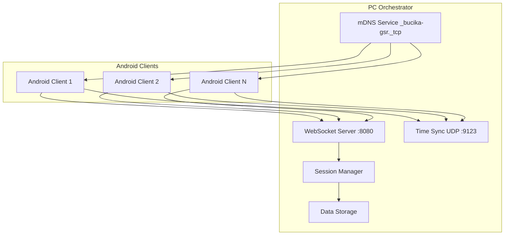
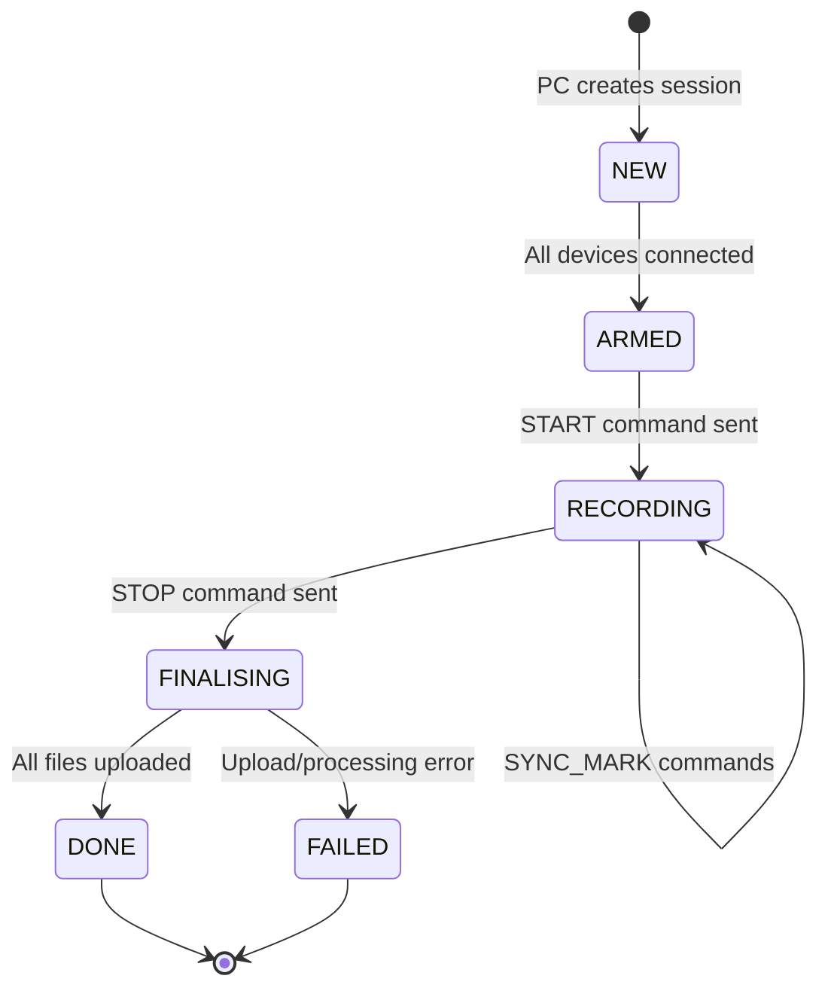

# PC Orchestrator API Documentation

## Overview

The PC Orchestrator provides a comprehensive WebSocket-based communication protocol for coordinating multiple Android GSR clients in synchronized physiological data collection sessions. This document details the complete API specification, message formats, and integration patterns.

## Table of Contents

1. [Architecture Overview](#architecture-overview)
2. [Communication Protocol](#communication-protocol)
3. [Message Format Specification](#message-format-specification)
4. [Message Types](#message-types)
5. [Session Lifecycle](#session-lifecycle)
6. [Data Streaming Protocol](#data-streaming-protocol)
7. [File Upload Protocol](#file-upload-protocol)
8. [Discovery and Time Sync](#discovery-and-time-sync)
9. [Error Handling](#error-handling)
10. [Integration Examples](#integration-examples)

---

## Architecture Overview

### System Components



### Core Services

- **WebSocket Server** (Port 8080): JSON-over-WebSocket communication
- **mDNS Service**: Automatic device discovery (`_bucika-gsr._tcp`)
- **Time Synchronization** (Port 9123): UDP-based SNTP-like service
- **Session Management**: Centralized lifecycle control
- **Data Storage**: Automatic CSV file generation and file management

---

## Communication Protocol

### Transport Layer

- **Protocol**: WebSocket (RFC 6455)
- **Port**: 8080 (configurable)
- **Format**: JSON message envelopes
- **Encoding**: UTF-8
- **Compression**: Optional WebSocket compression

### Connection Flow

1. **Discovery**: Android client discovers PC orchestrator via mDNS
2. **Connection**: WebSocket connection established to `ws://[host]:8080`
3. **Registration**: Client sends HELLO message with device information
4. **Acknowledgment**: PC responds with REGISTER confirmation
5. **Session Control**: PC can initiate START/STOP/SYNC operations
6. **Data Streaming**: Real-time GSR data transmission during sessions
7. **File Upload**: Post-session file transfer with integrity verification

---

## Message Format Specification

### Base Message Envelope

All messages follow this JSON structure:

```json
{
  "id": "string",           // Unique message ID (UUID v4)
  "type": "string",         // Message type identifier
  "ts": number,             // Timestamp (nanoseconds since epoch)
  "sessionId": "string",    // Current session ID (optional)
  "deviceId": "string",     // Device identifier (required after registration)
  "payload": object         // Message-specific payload
}
```

### Message Type Categories

- **Connection**: HELLO, REGISTER, PING, PONG
- **Session Control**: START, STOP, SYNC_MARK
- **Data Transfer**: GSR_SAMPLE, UPLOAD_BEGIN, UPLOAD_CHUNK, UPLOAD_END
- **Response/Error**: ACK, ERROR

---

## Message Types

### Connection Messages

#### HELLO (Android → PC)
Initial connection and device registration.

```json
{
  "type": "HELLO",
  "payload": {
    "deviceName": "Samsung SM-G991B",
    "deviceId": "android_abc123def456",
    "appVersion": "1.0.0",
    "capabilities": {
      "gsr": true,
      "thermal": true,
      "video": true
    },
    "gsrConfig": {
      "samplingRate": 128,
      "sensorType": "shimmer3_gsr_plus",
      "bluetoothAddress": "00:06:66:12:34:56"
    }
  }
}
```

#### REGISTER (PC → Android)
Registration confirmation and session assignment.

```json
{
  "type": "REGISTER",
  "payload": {
    "registered": true,
    "assignedDeviceId": "device_001",
    "serverInfo": {
      "version": "1.0.0",
      "timeSync": {
        "enabled": true,
        "port": 9123
      },
      "features": ["real_time_streaming", "file_upload", "session_control"]
    }
  }
}
```

#### PING/PONG (Bidirectional)
Liveness detection and connection health monitoring.

```json
{
  "type": "PING",
  "payload": {
    "timestamp": 1640995200123456789
  }
}
```

```json
{
  "type": "PONG", 
  "payload": {
    "timestamp": 1640995200123456789,
    "latency_ns": 1234567
  }
}
```

### Session Control Messages

#### START (PC → Android)
Begin recording session.

```json
{
  "type": "START",
  "sessionId": "session_20241225_143022",
  "payload": {
    "sessionName": "Stress Test Protocol A",
    "duration": 600000,          // milliseconds (optional)
    "syncMark": true,            // Include sync markers
    "dataStreaming": true,       // Enable real-time streaming
    "recordingConfig": {
      "gsr": true,
      "thermal": true,
      "video": true
    }
  }
}
```

#### STOP (PC → Android)
End recording session.

```json
{
  "type": "STOP",
  "sessionId": "session_20241225_143022",
  "payload": {
    "reason": "normal_completion",
    "uploadFiles": true          // Request file upload
  }
}
```

#### SYNC_MARK (PC → Android)
Insert synchronization marker.

```json
{
  "type": "SYNC_MARK",
  "sessionId": "session_20241225_143022", 
  "payload": {
    "markerId": "sync_001",
    "timestamp": 1640995200123456789,
    "label": "Stimulus presentation",
    "metadata": {
      "stimulus_id": "visual_001",
      "condition": "high_stress"
    }
  }
}
```

### Data Streaming Messages

#### GSR_SAMPLE (Android → PC)
Real-time GSR data transmission.

```json
{
  "type": "GSR_SAMPLE",
  "sessionId": "session_20241225_143022",
  "payload": {
    "samples": [
      {
        "t_mono_ns": 1234567890123456789,    // Monotonic timestamp
        "t_utc_ns": 1234567890123456789,     // UTC timestamp
        "seq": 12845,                        // Sequence number
        "gsr_raw_uS": 2.347,                // Raw GSR (microsiemens)
        "gsr_filt_uS": 2.351,               // Filtered GSR
        "temp_C": 32.4,                     // Temperature (Celsius)
        "flag_spike": false,                 // Artifact detection
        "flag_sat": false,                   // Saturation flag
        "flag_dropout": false                // Dropout detection
      }
      // Additional samples...
    ]
  }
}
```

### File Upload Messages

#### UPLOAD_BEGIN (Android → PC)
Initiate file upload session.

```json
{
  "type": "UPLOAD_BEGIN",
  "sessionId": "session_20241225_143022",
  "payload": {
    "fileName": "gsr_session_20241225_143022.csv",
    "fileSize": 2048576,                    // bytes
    "checksum": "a1b2c3d4e5f6...",         // MD5 hash
    "chunkSize": 8192,                      // bytes per chunk
    "fileType": "gsr_data",                 // gsr_data, thermal, video
    "metadata": {
      "recordingStart": 1640995200000,
      "recordingEnd": 1640995800000,
      "sampleCount": 76800
    }
  }
}
```

#### UPLOAD_CHUNK (Android → PC)
File data transmission.

```json
{
  "type": "UPLOAD_CHUNK",
  "sessionId": "session_20241225_143022",
  "payload": {
    "fileName": "gsr_session_20241225_143022.csv",
    "chunkIndex": 0,                        // 0-based chunk number
    "totalChunks": 250,
    "data": "base64encodeddata==",          // Base64 encoded chunk
    "checksum": "chunk_md5_hash"            // MD5 of this chunk
  }
}
```

#### UPLOAD_END (Android → PC)
Complete file upload.

```json
{
  "type": "UPLOAD_END", 
  "sessionId": "session_20241225_143022",
  "payload": {
    "fileName": "gsr_session_20241225_143022.csv",
    "finalChecksum": "a1b2c3d4e5f6...",    // Final file MD5
    "success": true
  }
}
```

### Response Messages

#### ACK (Bidirectional)
Message acknowledgment.

```json
{
  "type": "ACK",
  "payload": {
    "messageId": "original_message_id",
    "success": true,
    "data": {}                              // Optional response data
  }
}
```

#### ERROR (Bidirectional)
Error reporting.

```json
{
  "type": "ERROR",
  "payload": {
    "code": "INVALID_SESSION",
    "message": "Session not found or expired",
    "messageId": "original_message_id",     // Reference to failed message
    "details": {
      "sessionId": "session_xyz",
      "timestamp": 1640995200123456789
    }
  }
}
```

---

## Session Lifecycle

### State Machine



### Typical Session Flow

1. **Session Creation**: PC orchestrator creates new session
2. **Device Registration**: Android clients connect and register
3. **Armed State**: All required devices connected and ready
4. **Recording Start**: PC sends START command to all devices
5. **Data Streaming**: Real-time GSR data flows from devices to PC
6. **Synchronization**: PC can send SYNC_MARK commands as needed
7. **Recording Stop**: PC sends STOP command
8. **File Upload**: Devices upload recorded files to PC
9. **Session Complete**: All data received and stored

---

## Data Streaming Protocol

### Real-time GSR Streaming

- **Frequency**: 128 Hz (configurable)
- **Batching**: Multiple samples per message (recommended: 8-16 samples)
- **Buffering**: Client-side buffering for network resilience
- **Quality Control**: Built-in artifact detection and quality flags

### Sample Format Specification

Each GSR sample contains:
- **Timestamps**: Both monotonic and UTC for precise synchronization
- **Sequence Number**: For detecting dropped packets
- **Raw/Filtered Values**: Both unprocessed and filtered GSR readings
- **Temperature**: Simultaneous skin temperature measurement
- **Quality Flags**: Real-time artifact and quality assessment

### Performance Characteristics

- **Throughput**: ~16 KB/s per device at 128 Hz
- **Latency**: < 50ms end-to-end in optimal conditions
- **Buffer Size**: Recommended 2-4 second client buffer
- **Quality Control**: Real-time validation and integrity checking

---

## File Upload Protocol

### Chunked Transfer

Files are uploaded in chunks to handle large files reliably:

1. **Begin Upload**: UPLOAD_BEGIN with file metadata
2. **Chunk Transfer**: Sequential UPLOAD_CHUNK messages
3. **Integrity Check**: MD5 verification per chunk and overall
4. **Completion**: UPLOAD_END with final validation
5. **Acknowledgment**: PC confirms successful receipt

### File Types

- **GSR Data**: `.csv` files with timestamped samples
- **Thermal Data**: `.csv` files with thermal imaging data  
- **Video Files**: `.mp4` or `.mov` video recordings
- **Metadata**: `.json` files with session information

### Error Recovery

- **Chunk Retry**: Failed chunks can be retransmitted
- **Resume Support**: Partial uploads can be resumed
- **Integrity Validation**: MD5 checksums ensure data integrity
- **Timeout Handling**: Configurable timeouts for reliability

---

## Discovery and Time Sync

### mDNS Service Discovery

**Service Type**: `_bucika-gsr._tcp`
**Port**: 8080
**TXT Records**:
```
version=1.0.0
features=streaming,upload,sync
max_clients=10
session_active=false
```

### Time Synchronization

**Protocol**: UDP-based SNTP-like service
**Port**: 9123
**Precision**: Nanosecond resolution
**Update Frequency**: 1 Hz

#### Time Sync Request/Response

```
Request:  [8 bytes] client_timestamp_ns
Response: [24 bytes] client_ts + server_ts + server_response_ts
```

---

## Error Handling

### Error Categories

1. **Connection Errors**: Network failures, disconnections
2. **Protocol Errors**: Invalid message format, unknown types
3. **Session Errors**: Invalid session state, unauthorized actions
4. **Data Errors**: Corruption, missing samples, upload failures
5. **System Errors**: Storage full, processing failures

### Error Codes

| Code | Category | Description | Recovery Action |
|------|----------|-------------|-----------------|
| `CONN_LOST` | Connection | WebSocket connection lost | Automatic reconnection |
| `INVALID_MESSAGE` | Protocol | Malformed JSON message | Log and ignore |
| `SESSION_NOT_FOUND` | Session | Unknown session ID | Request current session |
| `UPLOAD_FAILED` | Data | File upload error | Retry upload |
| `STORAGE_FULL` | System | PC storage exhausted | Clean old files |

### Recovery Mechanisms

- **Automatic Reconnection**: Exponential backoff reconnection
- **Message Retry**: Failed messages can be retransmitted
- **State Recovery**: Session state preserved across connections
- **Graceful Degradation**: System continues with partial functionality

---

## Integration Examples

### Android Client Integration

```kotlin
class OrchestratorClient {
    
    suspend fun connectAndRegister(serverUrl: String) {
        // Connect to WebSocket
        webSocket.connect(serverUrl)
        
        // Send HELLO message
        val hello = Message(
            type = "HELLO",
            payload = HelloPayload(
                deviceName = Build.MODEL,
                deviceId = generateDeviceId(),
                capabilities = DeviceCapabilities(gsr = true)
            )
        )
        webSocket.send(hello.toJson())
        
        // Wait for REGISTER response
        val response = webSocket.receive()
        handleRegisterResponse(response)
    }
    
    fun startGSRStreaming(sessionId: String) {
        gsrManager.setDataListener { gsrData ->
            val message = Message(
                type = "GSR_SAMPLE",
                sessionId = sessionId,
                payload = GSRSamplePayload(samples = gsrData)
            )
            webSocket.send(message.toJson())
        }
        gsrManager.startRecording()
    }
}
```

### PC Orchestrator Usage

```kotlin
// Start PC orchestrator
val orchestrator = PCOrchestrator()
orchestrator.start()

// Create new session
val session = orchestrator.createSession("Stress Test")

// Wait for devices to connect
session.waitForDevices(requiredCount = 3)

// Start recording
session.startRecording()

// Insert sync marker
session.insertSyncMarker("stimulus_presentation", metadata)

// Stop and finalize
session.stopRecording()
session.waitForCompletion()
```

### Configuration Example

```json
{
  "orchestrator": {
    "websocket": {
      "port": 8080,
      "maxConnections": 10
    },
    "discovery": {
      "serviceName": "_bucika-gsr._tcp",
      "broadcastInterval": 5000
    },
    "timeSync": {
      "port": 9123,
      "precision": "nanosecond"
    },
    "storage": {
      "dataPath": "./data/sessions",
      "autoCleanup": true,
      "retentionDays": 30
    }
  }
}
```

---

## Version History

- **v1.0.0**: Initial API specification with core functionality
- **v1.1.0**: Added file upload protocol and chunked transfer
- **v1.2.0**: Enhanced error handling and recovery mechanisms
- **v2.0.0**: Current version with full feature set

---

*Generated: December 25, 2024*  
*Last Updated: December 25, 2024*