# Performance Optimization Guide

## Overview

This guide provides comprehensive performance optimization strategies, benchmarking frameworks, and monitoring tools for the BucikaGSR thermal imaging and GSR sensor integration system. The optimizations ensure zero frame drops, minimal latency, and efficient resource utilization.

## Table of Contents

1. [Performance Architecture](#performance-architecture)
2. [Benchmarking Framework](#benchmarking-framework)
3. [Performance Monitoring](#performance-monitoring)
4. [Optimization Strategies](#optimization-strategies)
5. [Memory Management](#memory-management)
6. [Thread Optimization](#thread-optimization)
7. [I/O Performance](#io-performance)
8. [Real-time Processing](#real-time-processing)
9. [Performance Testing](#performance-testing)
10. [CI/CD Integration](#cicd-integration)

---

## Performance Architecture

### High-Level Performance Design

```mermaid
graph TB
    subgraph "Performance Layer Architecture"
        A[Application Layer<br/>UI, Activities] --> B[Manager Layer<br/>ThermalCameraManager, GSRManager]
        B --> C[Optimization Layer<br/>CapturePerformanceOptimizer]
        C --> D[Hardware Layer<br/>Thermal Camera, GSR Sensors]
    end
    
    subgraph "Performance Monitoring"
        E[Real-time Metrics] --> F[Performance Dashboard]
        F --> G[Optimization Engine]
        G --> H[Automatic Tuning]
    end
    
    subgraph "Data Flow Optimization"
        I[Lock-free Buffers] --> J[Priority Threads]
        J --> K[Zero-copy Processing]
        K --> L[Efficient I/O]
    end
```



### Core Performance Principles

1. **Zero Frame Drops**: No thermal frames or GSR samples should be dropped
2. **Minimal Latency**: End-to-end latency < 50ms for critical operations
3. **Resource Efficiency**: Memory usage < 100MB, CPU usage < 80%
4. **Scalable Architecture**: Performance scales with device capabilities
5. **Graceful Degradation**: Performance degrades gracefully under stress

## Benchmarking Framework

### Performance Test Suite

The `PerformanceTestSuite` provides comprehensive benchmarking across all critical components:

```kotlin
@RunWith(Suite::class)
@Suite.SuiteClasses(
    DataProcessingBenchmark::class,
    UIRenderingBenchmark::class,
    MemoryUsageBenchmark::class,
    BluetoothBenchmark::class
)
class PerformanceTestSuite
```

### Key Performance Benchmarks

#### 1. Data Processing Performance

```kotlin
@Test
fun testGSRDataProcessingPerformance() {
    val sampleData = generateSampleGSRData(1000)
    
    val processingTime = measureTimeMillis {
        repeat(100) {
            processGSRData(sampleData)
        }
    }
    
    // Should process 100 iterations of 1000 data points in under 2 seconds
    assert(processingTime < 2000) {
        "GSR data processing too slow: ${processingTime}ms"
    }
}
```

**Performance Targets:**
- GSR Processing: 100 iterations of 1000 samples in < 2 seconds
- Thermal Processing: 10 thermal images (320x240) in < 1 second
- Processing Rate: >500 samples/second sustained

#### 2. UI Rendering Performance

```kotlin
@Test
fun testGraphRenderingPerformance() {
    val renderTime = measureTimeMillis {
        repeat(60) { // Simulate 60fps for 1 second
            simulateGraphRendering()
            Thread.sleep(16) // 16ms per frame for 60fps
        }
    }
    
    // Should complete 60 frames in approximately 1 second
    assert(renderTime < 1200) {
        "Graph rendering too slow: ${renderTime}ms"
    }
}
```

**Performance Targets:**
- Graph Rendering: 60 frames in < 1.2 seconds
- Thermal Image Rendering: 30 frames in < 1.2 seconds  
- UI Responsiveness: <16ms per frame for 60fps

#### 3. Memory Usage Benchmarks

```kotlin
@Test
fun testMemoryAllocationPerformance() {
    val initialMemory = Runtime.getRuntime().totalMemory() - Runtime.getRuntime().freeMemory()
    
    // Memory-intensive operations
    val dataArrays = mutableListOf<FloatArray>()
    val allocationTime = measureTimeMillis {
        repeat(100) {
            dataArrays.add(FloatArray(10000) { it.toFloat() })
        }
    }
    
    val finalMemory = Runtime.getRuntime().totalMemory() - Runtime.getRuntime().freeMemory()
    val memoryUsed = (finalMemory - initialMemory) / 1024 / 1024 // MB
    
    assert(allocationTime < 1000) { "Memory allocation too slow" }
    assert(memoryUsed < 50) { "Excessive memory usage: ${memoryUsed}MB" }
}
```

**Performance Targets:**
- Memory Allocation: < 1 second for 100MB of arrays
- Memory Usage: < 50MB growth for temporary operations
- Memory Leaks: < 10MB growth after GC

### Benchmark Execution

```bash
# Run all performance benchmarks
./gradlew connectedAndroidTest -P android.testInstrumentationRunnerArguments.class=com.topdon.tc001.benchmark.PerformanceTestSuite

# Run specific benchmark category
./gradlew connectedAndroidTest -P android.testInstrumentationRunnerArguments.class=com.topdon.tc001.benchmark.PerformanceTestSuite.DataProcessingBenchmark

# Generate performance report
./gradlew generatePerformanceReport
```

## Performance Monitoring

### CapturePerformanceOptimizer

The `CapturePerformanceOptimizer` provides real-time performance monitoring and optimization:

```kotlin
class CapturePerformanceOptimizer(private val context: Context) {
    
    fun getPerformanceMetrics(): CapturePerformanceMetrics {
        return CapturePerformanceMetrics(
            isOptimizationActive = isOptimizationActive.get(),
            totalFramesProcessed = totalFramesProcessed.get(),
            frameDropCount = frameDropCounter.get(),
            averageProcessingTimeMs = calculateAverageProcessingTime(),
            memoryPressureLevel = memoryPressureLevel.get(),
            bufferUsage = getBufferUsageMetrics()
        )
    }
    
    private fun monitorSystemPerformance() {
        // Memory monitoring
        val runtime = Runtime.getRuntime()
        val usedMemory = runtime.totalMemory() - runtime.freeMemory()
        val memoryUsageMB = usedMemory / (1024 * 1024)
        
        // Buffer usage monitoring
        val videoBufferUsage = videoFrameBuffer.size() * 100 / FRAME_BUFFER_SIZE
        val dngBufferUsage = dngFrameBuffer.size() * 100 / (FRAME_BUFFER_SIZE / 2)
        val gsrBufferUsage = gsrSampleBuffer.size() * 100 / (FRAME_BUFFER_SIZE * 4)
        
        if (memoryUsageMB > MEMORY_PRESSURE_THRESHOLD_MB) {
            triggerMemoryOptimization()
        }
        
        if (videoBufferUsage > 80 || dngBufferUsage > 80 || gsrBufferUsage > 80) {
            triggerEmergencyBufferCleanup()
        }
    }
}
```

### Real-time Performance Dashboard

```kotlin
data class CapturePerformanceMetrics(
    val isOptimizationActive: Boolean,
    val totalFramesProcessed: Long,
    val frameDropCount: Int,
    val averageProcessingTimeMs: Double,
    val memoryPressureLevel: Int, // 0=normal, 1=moderate, 2=high
    val videoBufferUsage: Int,
    val dngBufferUsage: Int,
    val gsrBufferUsage: Int,
    val maxVideoBufferSize: Int,
    val maxDngBufferSize: Int,
    val maxGsrBufferSize: Int
) {
    val frameDropRate: Double
        get() = if (totalFramesProcessed > 0) {
            (frameDropCount.toDouble() / totalFramesProcessed) * 100.0
        } else 0.0
    
    val overallBufferUsage: Double
        get() = (videoBufferUsage + dngBufferUsage + gsrBufferUsage) / 3.0
}
```

### Performance Logging

```kotlin
// Performance monitoring with structured logging
private fun logPerformanceStatus(metrics: CapturePerformanceMetrics) {
    XLog.i(TAG, "Performance Status: " +
        "Frames=${metrics.totalFramesProcessed}, " +
        "Drops=${metrics.frameDropCount} (${metrics.frameDropRate}%), " +
        "AvgTime=${metrics.averageProcessingTimeMs}ms, " +
        "Memory=${getMemoryUsage()}MB, " +
        "BufferUsage=${metrics.overallBufferUsage}%"
    )
}
```

## Optimization Strategies

### 1. Zero-Copy Data Processing

```kotlin
// Lock-free ring buffer for zero-copy operations
class LockFreeRingBuffer<T>(private val capacity: Int) {
    private val buffer = Array<Any?>(capacity) { null }
    private val head = AtomicInteger(0)
    private val tail = AtomicInteger(0)
    private val size = AtomicInteger(0)
    
    fun offer(item: T): Boolean {
        if (size.get() >= capacity) return false
        
        val currentTail = tail.getAndIncrement() % capacity
        buffer[currentTail] = item
        size.incrementAndGet()
        return true
    }
    
    @Suppress("UNCHECKED_CAST")
    fun poll(): T? {
        if (size.get() == 0) return null
        
        val currentHead = head.getAndIncrement() % capacity
        val item = buffer[currentHead] as T?
        buffer[currentHead] = null
        size.decrementAndGet()
        return item
    }
}
```

### 2. Priority-Based Thread Pools

```kotlin
// Ultra-high priority thread pool for critical operations
private fun createOptimizedThreadPools() {
    videoProcessingExecutor = ThreadPoolExecutor(
        1, 1, 0L, TimeUnit.MILLISECONDS,
        LinkedBlockingQueue(),
        CustomThreadFactory("VideoProcessor", Thread.MAX_PRIORITY)
    )
    
    gsrProcessingExecutor = Executors.newSingleThreadScheduledExecutor(
        CustomThreadFactory("GSRProcessor", Thread.MAX_PRIORITY)
    )
    
    backgroundExecutor = Executors.newScheduledThreadPool(
        2,
        CustomThreadFactory("Background", Thread.NORM_PRIORITY - 1)
    )
}
```

### 3. Adaptive Buffer Management

```kotlin
// Dynamic buffer sizing based on system resources
private fun configureOptimalBufferSizes() {
    val runtime = Runtime.getRuntime()
    val availableMemory = runtime.maxMemory() - (runtime.totalMemory() - runtime.freeMemory())
    
    when {
        availableMemory < 200 * 1024 * 1024 -> {
            // High memory pressure - reduce buffer sizes
            memoryPressureLevel.set(2)
            adjustBufferSizes(0.5f)
        }
        availableMemory < 400 * 1024 * 1024 -> {
            // Moderate pressure
            memoryPressureLevel.set(1)
            adjustBufferSizes(0.75f)
        }
        else -> {
            // Normal operation
            memoryPressureLevel.set(0)
            adjustBufferSizes(1.0f)
        }
    }
}
```

## Memory Management

### 1. Object Pooling

```kotlin
class ThermalFramePool(initialSize: Int = 10) {
    private val pool = ConcurrentLinkedQueue<ThermalFrameData>()
    
    init {
        repeat(initialSize) {
            pool.offer(createNewFrame())
        }
    }
    
    fun acquire(): ThermalFrameData {
        return pool.poll() ?: createNewFrame()
    }
    
    fun release(frame: ThermalFrameData) {
        frame.reset() // Clear data
        if (pool.size < MAX_POOL_SIZE) {
            pool.offer(frame)
        }
    }
    
    private fun createNewFrame(): ThermalFrameData {
        return ThermalFrameData(
            timestamp = 0,
            frameIndex = 0,
            temperatureData = FloatArray(320 * 240),
            imageData = ByteArray(320 * 240),
            metadata = ThermalFrameMetadata()
        )
    }
}
```

### 2. Memory Pressure Monitoring

```kotlin
// Automatic memory cleanup when pressure is high
private fun handleMemoryPressure(level: Int) {
    when (level) {
        0 -> {
            // Normal operation - no action needed
        }
        1 -> {
            // Moderate pressure - reduce buffer sizes
            videoFrameBuffer.clearOldest(FRAME_BUFFER_SIZE / 4)
            System.gc() // Suggest GC
        }
        2 -> {
            // High pressure - aggressive cleanup
            videoFrameBuffer.clearOldest(FRAME_BUFFER_SIZE / 2)
            dngFrameBuffer.clearOldest((FRAME_BUFFER_SIZE / 2) / 2)
            System.gc()
            
            // Reduce processing quality temporarily
            enableLowMemoryMode()
        }
    }
}
```

### 3. Leak Detection

```kotlin
class MemoryLeakDetector {
    private val initialMemory = AtomicLong(0)
    private val checkpoints = mutableListOf<MemoryCheckpoint>()
    
    fun startMonitoring() {
        initialMemory.set(getCurrentMemoryUsage())
        schedulePeriodicCheck()
    }
    
    private fun schedulePeriodicCheck() {
        backgroundExecutor?.scheduleAtFixedRate({
            checkForLeaks()
        }, 30, 30, TimeUnit.SECONDS)
    }
    
    private fun checkForLeaks() {
        val currentMemory = getCurrentMemoryUsage()
        val growthRate = (currentMemory - initialMemory.get()) / 1024 / 1024 // MB
        
        if (growthRate > MEMORY_GROWTH_THRESHOLD_MB) {
            XLog.w(TAG, "Potential memory leak detected: ${growthRate}MB growth")
            // Trigger detailed memory analysis
            analyzeMemoryUsage()
        }
    }
}
```

## Thread Optimization

### 1. Thread Priority Management

```kotlin
class CustomThreadFactory(
    private val namePrefix: String,
    private val priority: Int
) : ThreadFactory {
    private val threadNumber = AtomicInteger(1)
    
    override fun newThread(r: Runnable): Thread {
        val thread = Thread(r, "$namePrefix-${threadNumber.getAndIncrement()}")
        thread.isDaemon = false
        thread.priority = priority
        
        // Set CPU affinity for critical threads if possible
        if (priority == Thread.MAX_PRIORITY) {
            try {
                setCpuAffinity(thread)
            } catch (e: Exception) {
                XLog.w(TAG, "Could not set CPU affinity: ${e.message}")
            }
        }
        
        return thread
    }
}
```

### 2. Lock-Free Algorithms

```kotlin
// Lock-free counter for high-frequency operations
class LockFreeCounter {
    private val count = AtomicLong(0)
    
    fun increment(): Long = count.incrementAndGet()
    
    fun decrement(): Long = count.decrementAndGet()
    
    fun get(): Long = count.get()
    
    fun addAndGet(delta: Long): Long = count.addAndGet(delta)
}

// Lock-free timestamp generator
class LockFreeTimestampGenerator {
    private val lastTimestamp = AtomicLong(0)
    
    fun nextTimestamp(): Long {
        var current = System.nanoTime()
        var last: Long
        
        do {
            last = lastTimestamp.get()
            if (current <= last) {
                current = last + 1
            }
        } while (!lastTimestamp.compareAndSet(last, current))
        
        return current
    }
}
```

### 3. Coroutine Optimization

```kotlin
// Optimized coroutine dispatcher for different workloads
object OptimizedDispatchers {
    
    // For CPU-intensive work with priority
    val HighPriorityCPU = Executors.newFixedThreadPool(
        Runtime.getRuntime().availableProcessors(),
        CustomThreadFactory("HighPriorityCPU", Thread.MAX_PRIORITY)
    ).asCoroutineDispatcher()
    
    // For I/O operations with larger thread pool
    val OptimizedIO = Executors.newFixedThreadPool(
        (Runtime.getRuntime().availableProcessors() * 2).coerceAtLeast(4),
        CustomThreadFactory("OptimizedIO", Thread.NORM_PRIORITY)
    ).asCoroutineDispatcher()
    
    // For background processing
    val Background = Executors.newFixedThreadPool(
        2,
        CustomThreadFactory("Background", Thread.NORM_PRIORITY - 1)
    ).asCoroutineDispatcher()
}

// Usage example
suspend fun processGSRDataAsync(data: GSRSampleData) {
    withContext(OptimizedDispatchers.HighPriorityCPU) {
        // CPU-intensive GSR processing
        performComplexGSRAnalysis(data)
    }
    
    withContext(OptimizedDispatchers.OptimizedIO) {
        // Save processed data
        saveToDatabase(data)
    }
}
```

## I/O Performance

### 1. Buffered I/O Operations

```kotlin
class HighPerformanceDataWriter(
    private val file: File,
    private val bufferSize: Int = 64 * 1024 // 64KB buffer
) {
    private val buffer = ByteArray(bufferSize)
    private var bufferPosition = 0
    private val outputStream = FileOutputStream(file).buffered(bufferSize)
    
    suspend fun writeGSRSample(sample: GSRSampleData) = withContext(Dispatchers.IO) {
        val bytes = sample.toByteArray()
        
        if (bufferPosition + bytes.size > bufferSize) {
            flush()
        }
        
        System.arraycopy(bytes, 0, buffer, bufferPosition, bytes.size)
        bufferPosition += bytes.size
    }
    
    suspend fun flush() = withContext(Dispatchers.IO) {
        if (bufferPosition > 0) {
            outputStream.write(buffer, 0, bufferPosition)
            outputStream.flush()
            bufferPosition = 0
        }
    }
}
```

### 2. Memory-Mapped Files

```kotlin
class MemoryMappedDataBuffer(
    private val file: File,
    private val size: Long = 100 * 1024 * 1024 // 100MB
) {
    private val randomAccessFile = RandomAccessFile(file, "rw")
    private val channel = randomAccessFile.channel
    private val buffer = channel.map(FileChannel.MapMode.READ_WRITE, 0, size)
    
    fun writeData(data: ByteArray, offset: Int = 0) {
        if (buffer.remaining() >= data.size) {
            buffer.put(data, offset, data.size)
        } else {
            throw IllegalStateException("Buffer full")
        }
    }
    
    fun readData(length: Int): ByteArray {
        val data = ByteArray(length)
        buffer.get(data)
        return data
    }
    
    fun flush() {
        buffer.force()
    }
    
    fun close() {
        channel.close()
        randomAccessFile.close()
    }
}
```

## Real-time Processing

### 1. Frame Processing Pipeline

```kotlin
class ThermalFrameProcessor {
    private val processingPipeline = ArrayBlockingQueue<ThermalFrameData>(PIPELINE_SIZE)
    private val processedFrames = ArrayBlockingQueue<ProcessedThermalFrame>(PIPELINE_SIZE)
    
    init {
        // Start processing threads
        repeat(PROCESSING_THREAD_COUNT) {
            thread(name = "FrameProcessor-$it") {
                processFrames()
            }
        }
    }
    
    fun submitFrame(frame: ThermalFrameData): Boolean {
        return processingPipeline.offer(frame)
    }
    
    fun getProcessedFrame(): ProcessedThermalFrame? {
        return processedFrames.poll()
    }
    
    private fun processFrames() {
        while (!Thread.currentThread().isInterrupted) {
            try {
                val frame = processingPipeline.take()
                val processed = processFrame(frame)
                processedFrames.offer(processed)
            } catch (e: InterruptedException) {
                Thread.currentThread().interrupt()
                break
            }
        }
    }
    
    private fun processFrame(frame: ThermalFrameData): ProcessedThermalFrame {
        val startTime = System.nanoTime()
        
        // Temperature calibration
        val calibratedTemperatures = applyCalibration(frame.temperatureData)
        
        // Color mapping
        val colorMappedImage = mapTemperaturesToColors(calibratedTemperatures)
        
        // Generate overlay
        val overlay = generateTemperatureOverlay(calibratedTemperatures)
        
        val processingTime = (System.nanoTime() - startTime) / 1_000_000.0 // ms
        
        return ProcessedThermalFrame(
            originalFrame = frame,
            calibratedTemperatures = calibratedTemperatures,
            colorMappedImage = colorMappedImage,
            overlay = overlay,
            processingTimeMs = processingTime
        )
    }
}
```

### 2. Real-time Data Streaming

```kotlin
class RealTimeDataStreamer<T>(
    private val processor: (T) -> Unit,
    private val bufferSize: Int = 1000
) {
    private val dataBuffer = ArrayBlockingQueue<T>(bufferSize)
    private val streamingThread = thread(name = "DataStreamer") {
        streamData()
    }
    
    fun submit(data: T): Boolean {
        return if (dataBuffer.remainingCapacity() > 0) {
            dataBuffer.offer(data)
        } else {
            // Drop oldest data to maintain real-time processing
            dataBuffer.poll()
            dataBuffer.offer(data)
        }
    }
    
    private fun streamData() {
        while (!Thread.currentThread().isInterrupted) {
            try {
                val data = dataBuffer.take()
                val startTime = System.nanoTime()
                
                processor(data)
                
                val processingTime = (System.nanoTime() - startTime) / 1_000_000.0
                if (processingTime > MAX_PROCESSING_TIME_MS) {
                    XLog.w(TAG, "Processing time exceeded threshold: ${processingTime}ms")
                }
                
            } catch (e: InterruptedException) {
                Thread.currentThread().interrupt()
                break
            } catch (e: Exception) {
                XLog.e(TAG, "Error processing data: ${e.message}", e)
            }
        }
    }
    
    fun stop() {
        streamingThread.interrupt()
    }
}
```

## Performance Testing

### Automated Performance Tests

```bash
#!/bin/bash
# performance_test.sh - Automated performance test suite

set -e

echo "Starting BucikaGSR Performance Test Suite..."

# Build the app with performance profiling enabled
./gradlew assembleDebug -Pandroid.enableProfiler=true

# Run performance benchmarks
echo "Running performance benchmarks..."
./gradlew connectedAndroidTest -P android.testInstrumentationRunnerArguments.class=com.topdon.tc001.benchmark.PerformanceTestSuite

# Generate performance report
echo "Generating performance report..."
./gradlew generatePerformanceReport

# Check performance metrics against thresholds
echo "Validating performance metrics..."
python3 scripts/validate_performance.py performance_results.json

echo "Performance testing completed successfully!"
```

### Performance Validation Script

```python
#!/usr/bin/env python3
# validate_performance.py - Performance metrics validation

import json
import sys

PERFORMANCE_THRESHOLDS = {
    'gsr_processing_time_ms': 2000,
    'thermal_processing_time_ms': 1000,
    'memory_usage_mb': 100,
    'frame_drop_rate_percent': 1.0,
    'ui_render_time_ms': 1200,
    'memory_leak_mb': 10
}

def validate_performance(results_file):
    with open(results_file, 'r') as f:
        results = json.load(f)
    
    failures = []
    
    for metric, threshold in PERFORMANCE_THRESHOLDS.items():
        if metric in results:
            actual_value = results[metric]
            if actual_value > threshold:
                failures.append(f"{metric}: {actual_value} > {threshold}")
            else:
                print(f"✅ {metric}: {actual_value} <= {threshold}")
        else:
            failures.append(f"Missing metric: {metric}")
    
    if failures:
        print("❌ Performance validation failed:")
        for failure in failures:
            print(f"  - {failure}")
        sys.exit(1)
    else:
        print("✅ All performance metrics passed validation!")

if __name__ == '__main__':
    if len(sys.argv) != 2:
        print("Usage: python3 validate_performance.py <results_file.json>")
        sys.exit(1)
    
    validate_performance(sys.argv[1])
```

## CI/CD Integration

### GitHub Actions Workflow

```yaml
# .github/workflows/performance.yml
name: Performance Testing

on:
  push:
    branches: [ main, develop ]
  pull_request:
    branches: [ main ]

jobs:
  performance-test:
    runs-on: ubuntu-latest
    
    steps:
    - uses: actions/checkout@v4
    
    - name: Set up JDK 11
      uses: actions/setup-java@v3
      with:
        java-version: '11'
        distribution: 'temurin'
    
    - name: Cache Gradle packages
      uses: actions/cache@v3
      with:
        path: |
          ~/.gradle/caches
          ~/.gradle/wrapper
        key: ${{ runner.os }}-gradle-${{ hashFiles('**/*.gradle*', '**/gradle-wrapper.properties') }}
        restore-keys: |
          ${{ runner.os }}-gradle-
    
    - name: Grant execute permission for gradlew
      run: chmod +x gradlew
    
    - name: Build debug APK
      run: ./gradlew assembleDebug -Pandroid.enableProfiler=true
    
    - name: Run performance tests
      run: |
        ./scripts/performance_test.sh
      continue-on-error: true
    
    - name: Upload performance report
      uses: actions/upload-artifact@v3
      with:
        name: performance-report
        path: performance_results.json
    
    - name: Comment performance results
      if: github.event_name == 'pull_request'
      uses: actions/github-script@v6
      with:
        script: |
          const fs = require('fs');
          const results = JSON.parse(fs.readFileSync('performance_results.json', 'utf8'));
          
          let comment = '## Performance Test Results\n\n';
          comment += '| Metric | Value | Threshold | Status |\n';
          comment += '|--------|--------|-----------|--------|\n';
          
          const thresholds = {
            'gsr_processing_time_ms': 2000,
            'thermal_processing_time_ms': 1000,
            'memory_usage_mb': 100,
            'frame_drop_rate_percent': 1.0
          };
          
          for (const [metric, threshold] of Object.entries(thresholds)) {
            const value = results[metric] || 'N/A';
            const status = value <= threshold ? '✅ Pass' : '❌ Fail';
            comment += `| ${metric} | ${value} | ${threshold} | ${status} |\n`;
          }
          
          github.rest.issues.createComment({
            issue_number: context.issue.number,
            owner: context.repo.owner,
            repo: context.repo.repo,
            body: comment
          });
```

### Quality Gates Integration

```gradle
// build.gradle - Quality gates for performance
task validatePerformance {
    dependsOn connectedAndroidTest
    
    doLast {
        def results = file('performance_results.json')
        if (results.exists()) {
            def json = new groovy.json.JsonSlurper().parseText(results.text)
            
            def failures = []
            
            if (json.gsr_processing_time_ms > 2000) {
                failures.add("GSR processing too slow: ${json.gsr_processing_time_ms}ms")
            }
            
            if (json.memory_usage_mb > 100) {
                failures.add("Memory usage too high: ${json.memory_usage_mb}MB")
            }
            
            if (json.frame_drop_rate_percent > 1.0) {
                failures.add("Frame drop rate too high: ${json.frame_drop_rate_percent}%")
            }
            
            if (!failures.empty) {
                throw new GradleException("Performance validation failed:\n${failures.join('\n')}")
            }
            
            println "✅ Performance validation passed!"
        }
    }
}

// Run performance validation before release builds
tasks.matching { it.name.contains('Release') }.all { task ->
    task.dependsOn validatePerformance
}
```

## Best Practices Summary

### 1. Measurement and Monitoring
- **Always measure first**: Establish baselines before optimizing
- **Continuous monitoring**: Real-time performance metrics in production
- **Automated validation**: Performance tests in CI/CD pipeline

### 2. Optimization Priorities
1. **Identify bottlenecks**: Profile to find actual performance issues
2. **Fix high-impact issues**: Focus on operations that affect user experience
3. **Optimize incrementally**: Small, measurable improvements
4. **Validate improvements**: Measure impact of each optimization

### 3. Resource Management
- **Memory efficiency**: Use object pooling and avoid allocations in hot paths
- **Thread optimization**: Appropriate thread priorities and lock-free algorithms
- **I/O performance**: Buffered operations and async processing

### 4. Real-time Considerations
- **Zero frame drops**: Ensure continuous data flow
- **Latency optimization**: Minimize end-to-end processing time
- **Graceful degradation**: Maintain functionality under load

---

*Generated: 2025-01-23*  
*Version: 1.0*  
*Part of BucikaGSR Quality Improvement Initiative*