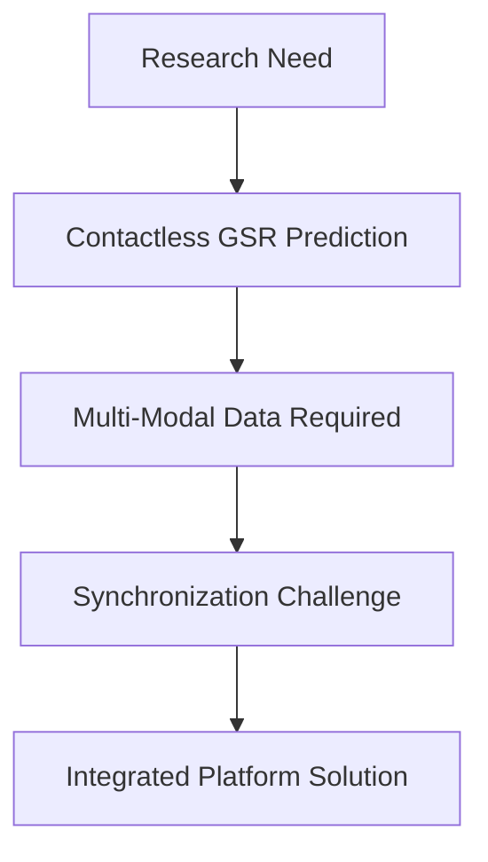
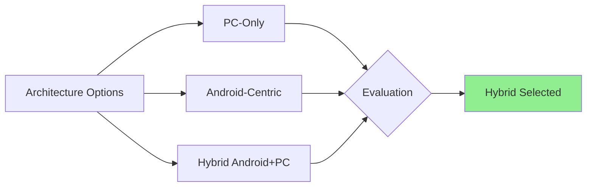
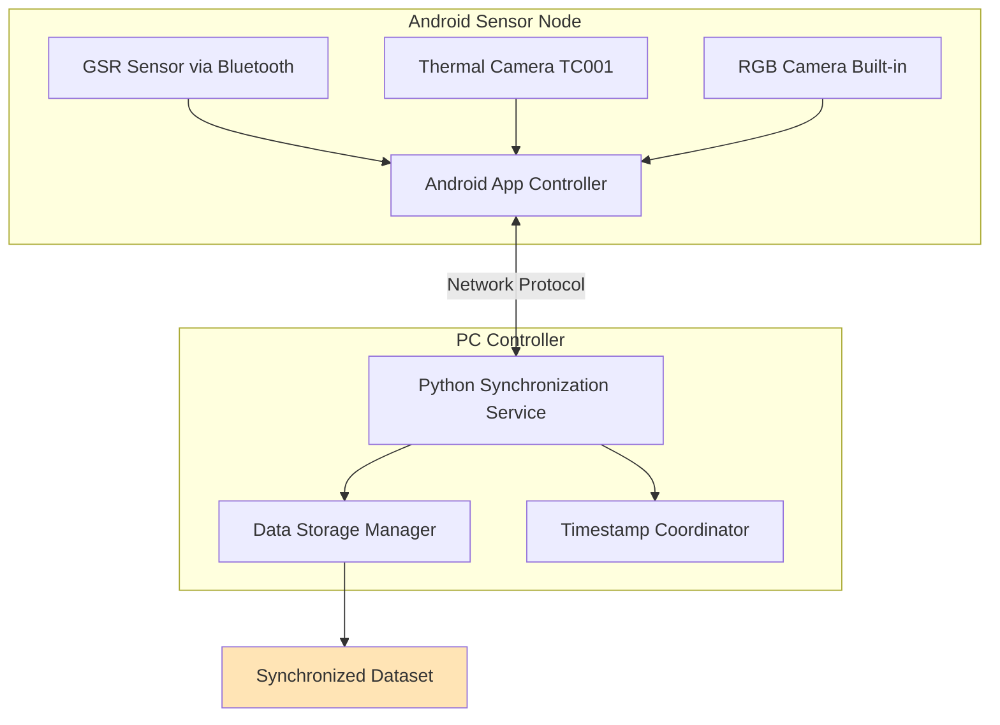
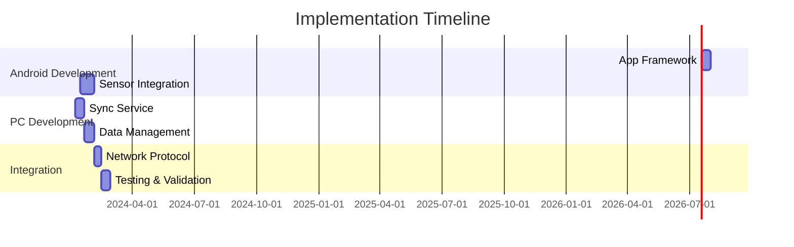
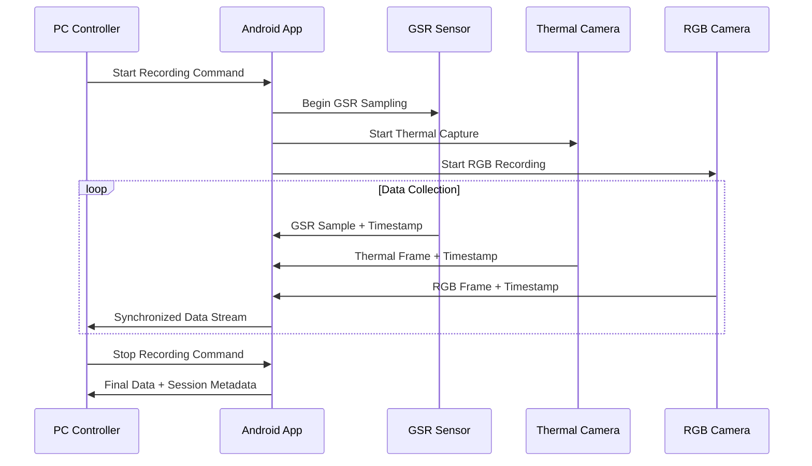

# ADR-0001: Initial Multi-Modal GSR Data Collection Architecture

**Status**: Accepted  
**Date**: 2024-08-22  
**Deciders**: Development Team  
**Tags**: architecture, sensors, android, synchronization

## Context and Problem Statement

The Bucika GSR project requires a multi-modal physiological data collection platform that can synchronize GSR (Galvanic Skin Response) sensors with thermal and RGB camera data for research purposes. The system needs to collect ground-truth data for future machine learning models that predict GSR from contactless sensors.

## Decision Drivers

- Need for precise time synchronization across multiple sensor modalities
- Research-grade data quality requirements
- Portability and ease of use in various environments
- Modularity for future sensor additions
- Real-time data streaming capabilities
- Cost-effective solution using existing hardware

## Considered Options

- **Option 1**: PC-only solution with USB-connected sensors
- **Option 2**: Android-centric solution with smartphone as primary controller
- **Option 3**: Hybrid architecture with Android sensor node + PC controller

## Decision Outcome

**Chosen option**: "Hybrid architecture with Android sensor node + PC controller"

### Rationale

The hybrid approach provides the best balance of:
- **Portability**: Android smartphone enables mobile data collection
- **Processing Power**: PC handles complex synchronization and data management
- **Sensor Integration**: Android supports Bluetooth (GSR) and camera access
- **Expandability**: Modular design allows future sensor additions

### System Architecture

### Consequences

**Positive**:
- Achieves millisecond-level synchronization across all sensors
- Leverages smartphone portability for field research
- Provides robust PC-based data management
- Enables real-time monitoring and quality control

**Negative**:
- Requires network connectivity between devices
- More complex setup than single-device solutions
- Potential network latency affects synchronization

**Neutral**:
- Requires both Android and Python development skills
- Standard hardware components reduce costs

## Implementation

## Technical Components

### Hardware Stack
- **GSR Sensor**: Shimmer3 GSR+ (research-grade, 128Hz sampling)
- **Thermal Camera**: Topdon TC001 (Android-compatible)
- **RGB Camera**: Smartphone built-in (high resolution)
- **Platform**: Android smartphone + PC workstation

### Software Stack
- **Android**: Java/Kotlin app with sensor APIs
- **PC**: Python synchronization service
- **Communication**: JSON over TCP/UDP with optional TLS
- **Storage**: Multi-modal data with synchronized timestamps

### Data Flow

## Links

- [System Requirements](../requirements.md)
- [Sensor Specifications](../hardware-specs.md)
- [Implementation Guide](../../GRADLE_SETUP.md)

---

*This ADR establishes the foundational architecture for the Bucika GSR multi-modal data collection platform.*