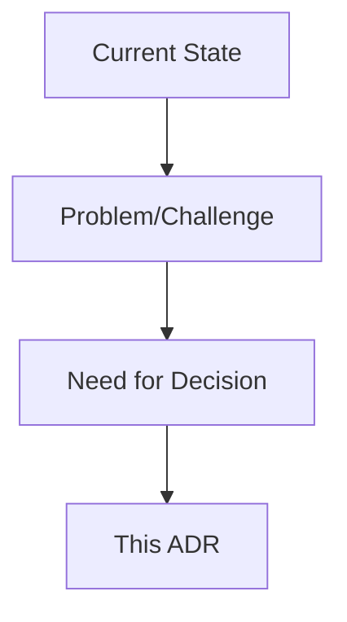
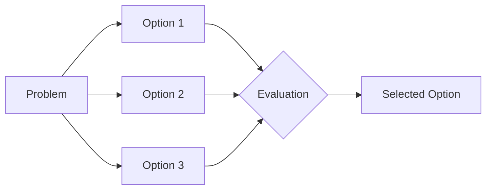
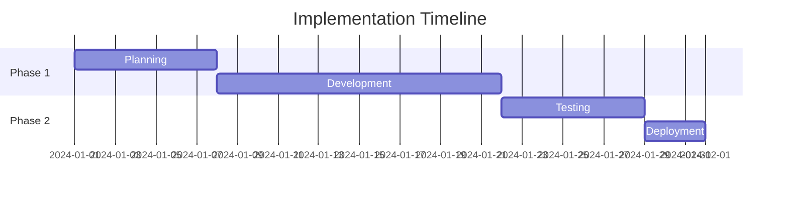

# ADR Template

Use this template for all Architecture Decision Records (ADRs).

## ADR-XXXX: [Decision Title]

**Status**: [Proposed | Accepted | Deprecated | Superseded]  
**Date**: YYYY-MM-DD  
**Deciders**: [Names of decision makers]  
**Tags**: [relevant tags]

## Context and Problem Statement

Describe the context and problem statement that led to this decision.

## Decision Drivers

- [Driver 1]
- [Driver 2]
- [Driver 3]

## Considered Options

- **Option 1**: [Description]
- **Option 2**: [Description]  
- **Option 3**: [Description]

## Decision Outcome

**Chosen option**: "[Option X]"

### Rationale

Explain why this option was selected.

### Consequences

**Positive**:
- [Positive consequence 1]
- [Positive consequence 2]

**Negative**:
- [Negative consequence 1]
- [Negative consequence 2]

**Neutral**:
- [Neutral consequence 1]

## Implementation

## Links

- [Related ADR]
- [Documentation]
- [Issues/Tickets]

---

*This ADR follows the format from [MADR](https://adr.github.io/madr/)*