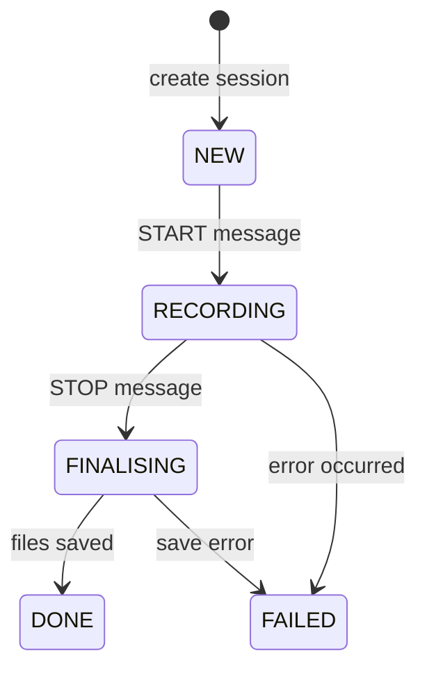

# Bucika GSR PC Orchestrator - API Documentation

## Table of Contents

1. [WebSocket API](#websocket-api)
2. [Message Protocol](#message-protocol)
3. [Session Management](#session-management)
4. [Time Synchronization](#time-synchronization)
5. [Service Discovery](#service-discovery)
6. [File Upload System](#file-upload-system)
7. [Data Formats](#data-formats)

## WebSocket API

The PC orchestrator provides a WebSocket server on port **8080** that implements the BucikaGSR protocol for real-time communication with Android devices.

### Connection Establishment

```javascript
// Connect to WebSocket server
const ws = new WebSocket('ws://[PC_IP_ADDRESS]:8080');
```

### Message Format

All messages follow the standard envelope format:

```json
{
  "id": "unique-message-id",
  "type": "MESSAGE_TYPE",
  "ts": 1234567890123456789,
  "deviceId": "device-identifier",
  "sessionId": "session-identifier",
  "payload": { /* type-specific payload */ }
}
```

## Message Protocol

### Client → Server Messages

#### 1. HELLO - Initial Connection
**Purpose**: Establish connection and announce device capabilities

```json
{
  "id": "hello-001",
  "type": "HELLO", 
  "ts": 1234567890123456789,
  "deviceId": "android-device-001",
  "payload": {
    "deviceName": "Samsung Galaxy S21",
    "capabilities": ["GSR", "THERMAL", "VIDEO"],
    "batteryLevel": 85,
    "version": "2.1.0"
  }
}
```

**Response**: Server sends `REGISTER` response

#### 2. START - Begin Recording Session
**Purpose**: Start a new recording session

```json
{
  "id": "start-001",
  "type": "START",
  "ts": 1234567890123456789,
  "deviceId": "android-device-001",
  "payload": {
    "sessionName": "Stress Test Experiment",
    "participantId": "P001",
    "metadata": {
      "experiment": "stress_response",
      "condition": "high_stress",
      "researcher": "Dr. Smith"
    }
  }
}
```

**Response**: Server sends `ACK` with session details

#### 3. STOP - End Recording Session
**Purpose**: Stop the current recording session

```json
{
  "id": "stop-001",
  "type": "STOP",
  "ts": 1234567890123456789,
  "deviceId": "android-device-001",
  "sessionId": "session-123",
  "payload": {}
}
```

#### 4. SYNC_MARK - Synchronization Marker
**Purpose**: Record synchronization points during recording

```json
{
  "id": "sync-001",
  "type": "SYNC_MARK",
  "ts": 1234567890123456789,
  "deviceId": "android-device-001", 
  "sessionId": "session-123",
  "payload": {
    "markId": "STIM_START",
    "description": "Stimulus presentation started"
  }
}
```

#### 5. GSR_SAMPLE - Physiological Data
**Purpose**: Stream real-time GSR data during recording

```json
{
  "id": "gsr-001",
  "type": "GSR_SAMPLE",
  "ts": 1234567890123456789,
  "deviceId": "android-device-001",
  "sessionId": "session-123",
  "payload": {
    "samples": [
      {
        "t_mono_ns": 1234567890123456789,
        "t_utc_ns": 1234567890123456789,
        "seq": 12845,
        "gsr_raw_uS": 2.347,
        "gsr_filt_uS": 2.351,
        "temp_C": 32.4,
        "flag_spike": false,
        "flag_sat": false,
        "flag_dropout": false
      }
    ]
  }
}
```

#### 6. File Upload Messages

**UPLOAD_BEGIN**
```json
{
  "id": "upload-begin-001",
  "type": "UPLOAD_BEGIN",
  "ts": 1234567890123456789,
  "deviceId": "android-device-001",
  "sessionId": "session-123",
  "payload": {
    "filename": "gsr_recording_20241225_143022.csv",
    "fileSize": 1048576,
    "mimeType": "text/csv",
    "md5Hash": "d41d8cd98f00b204e9800998ecf8427e",
    "chunkSize": 8192
  }
}
```

**UPLOAD_CHUNK**
```json
{
  "id": "upload-chunk-001",
  "type": "UPLOAD_CHUNK", 
  "ts": 1234567890123456789,
  "deviceId": "android-device-001",
  "sessionId": "session-123",
  "payload": {
    "filename": "gsr_recording_20241225_143022.csv",
    "chunkIndex": 0,
    "chunkData": "base64-encoded-chunk-data",
    "isLast": false
  }
}
```

**UPLOAD_END**
```json
{
  "id": "upload-end-001",
  "type": "UPLOAD_END",
  "ts": 1234567890123456789,
  "deviceId": "android-device-001",
  "sessionId": "session-123",
  "payload": {
    "filename": "gsr_recording_20241225_143022.csv",
    "totalChunks": 128,
    "success": true,
    "message": "File uploaded successfully"
  }
}
```

### Server → Client Messages

#### ACK - Acknowledgment
```json
{
  "id": "ack-001",
  "type": "ACK",
  "ts": 1234567890123456789,
  "deviceId": "android-device-001",
  "payload": {
    "messageId": "start-001",
    "status": "SESSION_STARTED"
  }
}
```

#### REGISTER - Registration Response
```json
{
  "id": "register-001",
  "type": "REGISTER",
  "ts": 1234567890123456789,
  "deviceId": "android-device-001",
  "payload": {
    "accepted": true,
    "reason": "Device registered successfully",
    "syncPort": 9123
  }
}
```

#### ERROR - Error Response
```json
{
  "id": "error-001",
  "type": "ERROR",
  "ts": 1234567890123456789,
  "deviceId": "android-device-001",
  "payload": {
    "code": "SESSION_NOT_FOUND",
    "message": "No active session found for device"
  }
}
```

## Session Management

### Session Lifecycle



### Session States

- **NEW**: Session created but not started
- **RECORDING**: Active recording session
- **FINALISING**: Session stopped, saving data
- **DONE**: Session completed successfully
- **FAILED**: Session failed due to error

### Session Data Storage

Each session creates a directory structure:

```
sessions/
└── {session_id}/
    ├── gsr_data_{timestamp}.csv      # Real-time GSR data
    ├── sync_marks.csv                # Synchronization markers
    ├── session_metadata.json         # Session information
    └── uploads/                      # Uploaded files
        ├── video_recording.mp4
        ├── thermal_data.txt
        └── additional_gsr.csv
```

## Time Synchronization

### UDP Time Sync Service

The orchestrator provides a high-precision time synchronization service on **UDP port 9123**.

#### Request Format
```
{
  "type": "TIME_SYNC_REQUEST",
  "client_send_time": 1234567890123456789
}
```

#### Response Format
```
{
  "type": "TIME_SYNC_RESPONSE",
  "client_send_time": 1234567890123456789,
  "server_receive_time": 1234567890223456789,
  "server_send_time": 1234567890323456789
}
```

#### Precision Features
- Nanosecond timestamp precision
- Network latency compensation
- Clock drift detection and correction
- Adaptive synchronization quality monitoring

## Service Discovery

### mDNS Broadcast

The orchestrator automatically broadcasts its availability using mDNS:

- **Service Type**: `_bucika-gsr._tcp`
- **Port**: 8080
- **Properties**:
  - `version`: Orchestrator version
  - `capabilities`: Supported features
  - `status`: Service status

### Discovery from Android

Android devices can discover the orchestrator using:

```java
// Discover BucikaGSR services
NsdServiceInfo serviceInfo = new NsdServiceInfo();
serviceInfo.setServiceType("_bucika-gsr._tcp.");
serviceInfo.setServiceName("BucikaGSR");

nsdManager.discoverServices(
    "_bucika-gsr._tcp.", 
    NsdManager.PROTOCOL_DNS_SD, 
    discoveryListener
);
```

## File Upload System

### Chunked Upload Protocol

Large files are uploaded using a chunked protocol:

1. **BEGIN**: Client announces file upload
2. **CHUNKS**: File sent in chunks with sequence tracking
3. **END**: Upload completion with integrity verification

### Integrity Verification

- **MD5 checksums**: Each file verified after upload
- **Chunk validation**: Individual chunk verification
- **Error recovery**: Automatic retry on corruption
- **Progress tracking**: Real-time upload progress

## Data Formats

### GSR CSV Format

Real-time GSR data is stored in CSV format:

```csv
Timestamp_ns,DateTime_UTC,Sequence,GSR_Raw_uS,GSR_Filtered_uS,Temperature_C,Flag_Spike,Flag_Saturation,Flag_Dropout
1234567890123456789,2024-12-25 14:30:22.123,1,2.347,2.351,32.4,false,false,false
1234567890131456789,2024-12-25 14:30:22.131,2,2.352,2.356,32.4,false,false,false
```

### Sync Marks CSV Format

Synchronization markers are stored separately:

```csv
Mark_ID,Timestamp_ns,DateTime_UTC,Description,Session_ID
BASELINE_START,1234567890123456789,2024-12-25 14:30:22.123,"Baseline period started",session-123
STIM_START,1234567890223456789,2024-12-25 14:30:22.223,"Stimulus presentation",session-123
STIM_END,1234567890323456789,2024-12-25 14:30:22.323,"Stimulus ended",session-123
```

### Session Metadata Format

Session information is stored as JSON:

```json
{
  "session_id": "session-123",
  "session_name": "Stress Response Study",
  "device_id": "android-device-001",
  "participant_id": "P001",
  "state": "DONE",
  "created_at": "2024-12-25T14:30:22.123456",
  "started_at": "2024-12-25T14:30:23.456789",
  "ended_at": "2024-12-25T14:35:45.789012",
  "metadata": {
    "experiment": "stress_response",
    "condition": "high_stress",
    "researcher": "Dr. Smith"
  },
  "gsr_samples_count": 38400,
  "uploaded_files": [
    "video_recording.mp4",
    "thermal_data.txt"
  ],
  "sync_marks": [
    {
      "mark_id": "BASELINE_START",
      "timestamp": "2024-12-25T14:30:22.123456",
      "timestamp_ns": 1234567890123456789,
      "description": "Baseline period started",
      "session_id": "session-123"
    }
  ]
}
```

## Error Handling

### Common Error Codes

- `INVALID_MESSAGE`: Malformed message format
- `SESSION_NOT_FOUND`: No active session for device
- `DEVICE_NOT_REGISTERED`: Device not registered
- `UPLOAD_FAILED`: File upload error
- `SYNC_ERROR`: Time synchronization failure
- `STORAGE_ERROR`: Data storage failure

### Error Recovery

- **Automatic Retry**: Failed operations retry with exponential backoff
- **Graceful Degradation**: System continues operating during non-critical errors
- **State Recovery**: Sessions can be recovered from storage after restart
- **Connection Recovery**: WebSocket connections automatically reconnect

## Performance Specifications

### Throughput
- **GSR Sampling**: Up to 128Hz per device
- **Concurrent Devices**: Up to 10 simultaneous connections
- **File Uploads**: Parallel chunked uploads with integrity checking
- **Message Processing**: Sub-millisecond message handling

### Resource Usage
- **Memory**: ~50MB base footprint, scales with active sessions
- **CPU**: Minimal usage during idle, <5% during active recording
- **Storage**: Efficient CSV storage, ~1MB per hour of GSR data
- **Network**: Adaptive bandwidth usage based on data rate

### Compatibility
- **Python**: 3.8+ required
- **Operating Systems**: Windows, macOS, Linux
- **Network**: IPv4/IPv6, WiFi/Ethernet
- **Android**: API level 21+ (Android 5.0+)